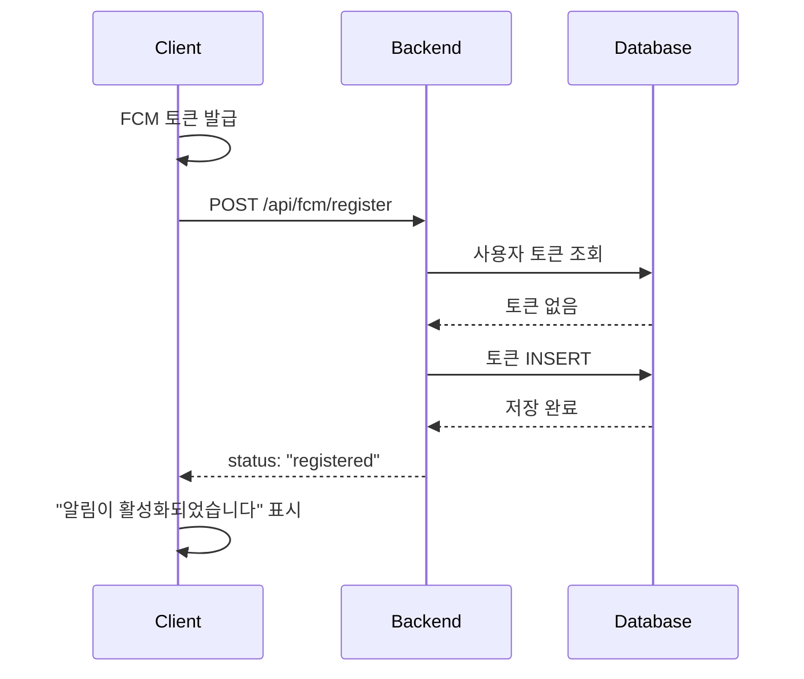
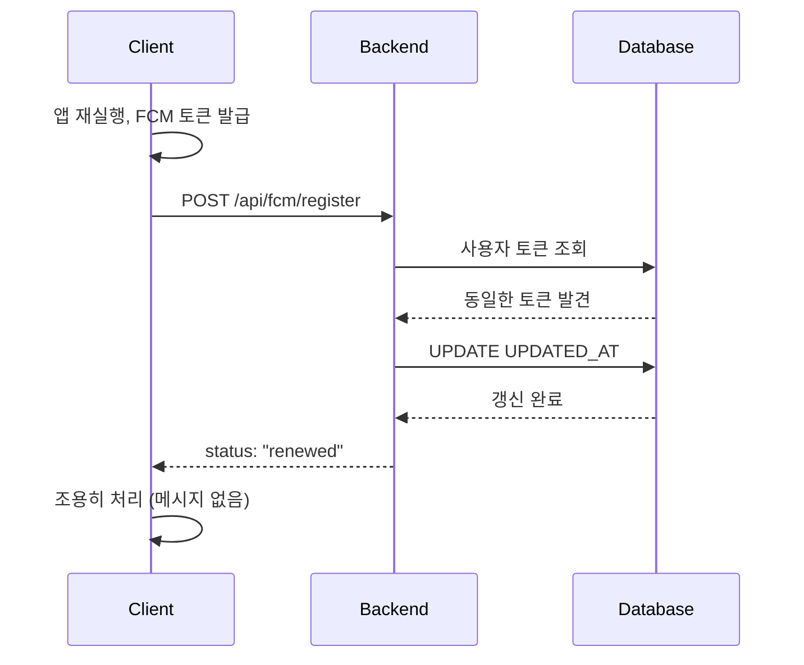
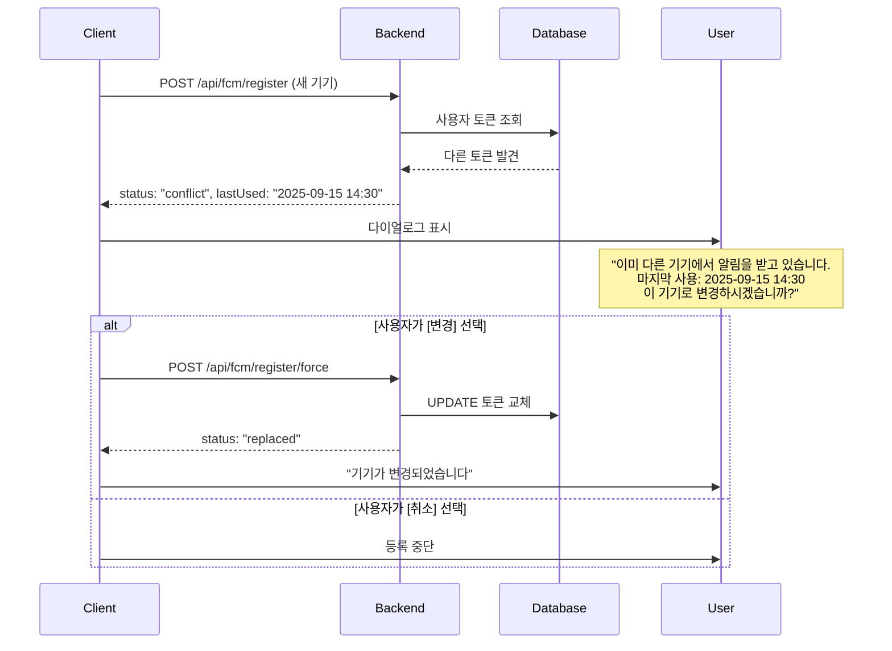
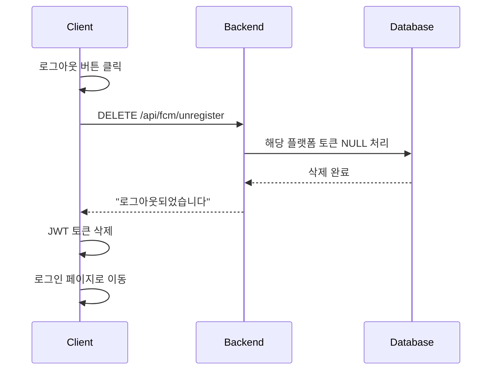
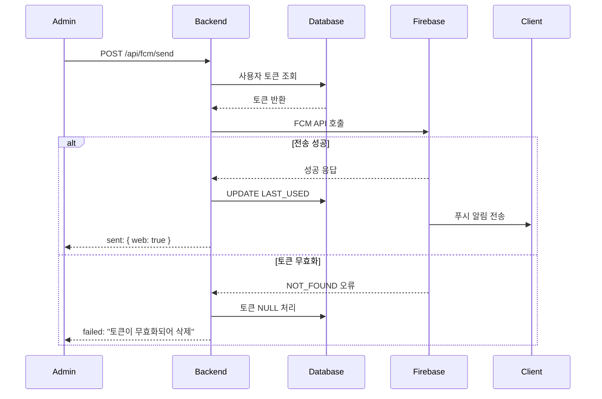

# FCM 푸시 알림 기능 구현 가이드

## 📋 목차
1. [개요](#개요)
2. [시스템 아키텍처](#시스템-아키텍처)
3. [데이터베이스 설계](#데이터베이스-설계)
4. [API 명세서](#api-명세서)
5. [구현 파일 목록](#구현-파일-목록)
6. [사용 시나리오](#사용-시나리오)
7. [테스트 가이드](#테스트-가이드)
8. [트러블슈팅](#트러블슈팅)

---

## 개요

### 프로젝트 정보
- **프로젝트명**: BlueCrab LMS FCM 푸시 알림 시스템
- **구현 날짜**: 2025-10-01
- **기술 스택**: Spring Boot, Firebase Cloud Messaging, MySQL, JPA

### 주요 기능
- ✅ 플랫폼별(Android, iOS, Web) FCM 토큰 관리
- ✅ 사용자별 알림 전송
- ✅ 일괄 알림 전송
- ✅ 전체 브로드캐스트
- ✅ 토큰 충돌 감지 및 처리
- ✅ 로그아웃 시 토큰 자동 삭제
- ✅ 무효화된 토큰 자동 제거
- ✅ 토큰 사용 통계

---

## 시스템 아키텍처

### 전체 구조

```
┌─────────────┐         ┌──────────────┐         ┌─────────────┐
│   Client    │         │   Backend    │         │   Firebase  │
│  (Web/App)  │ ◄─────► │  Spring Boot │ ◄─────► │     FCM     │
└─────────────┘         └──────────────┘         └─────────────┘
       │                        │                        │
       │ 1. FCM 토큰 발급         │                       │
       ├───────────────────────►│                        │
       │                        │ 2. 토큰 저장 (DB)       │
       │                        ├───────────┐            │
       │                        │           │            │
       │                        │◄──────────┘            │
       │ 3. 토큰 등록 완료        │                        │
       │◄───────────────────────┤                        │
       │                        │                        │
       │                        │ 4. 알림 전송 요청        │
       │                        ├───────────────────────►│
       │                        │                        │
       │                        │ 5. 전송 결과 반환        │
       │                        │◄───────────────────────┤
       │                        │                        │
       │ 6. 푸시 알림 수신        │                        │
       │◄───────────────────────┼────────────────────────┤
```

### 컴포넌트 구조

```
Controller Layer (FcmTokenController)
    ↓
Service Layer (FcmTokenService)
    ↓
Repository Layer (FcmTokenRepository)
    ↓
Database (FCM_TOKEN_TABLE)
    ↓
Firebase Cloud Messaging
```

---

## 데이터베이스 설계

### FCM_TOKEN_TABLE 구조

```sql
CREATE TABLE `FCM_TOKEN_TABLE` (
    `FCM_IDX` INT(11) NOT NULL AUTO_INCREMENT COMMENT 'FCM 토큰 ID',
    `USER_IDX` INT(11) NOT NULL COMMENT '사용자 ID (FK)',
    `USER_CODE` VARCHAR(255) NOT NULL COMMENT '학번/교번',

    `FCM_TOKEN_ANDROID` VARCHAR(255) NULL DEFAULT NULL COMMENT '안드로이드 토큰',
    `FCM_TOKEN_IOS` VARCHAR(255) NULL DEFAULT NULL COMMENT 'iOS 토큰',
    `FCM_TOKEN_WEB` VARCHAR(255) NULL DEFAULT NULL COMMENT '웹 토큰',

    `FCM_TOKEN_ANDROID_LAST_USED` DATETIME NULL COMMENT '안드로이드 토큰 마지막 사용일시',
    `FCM_TOKEN_IOS_LAST_USED` DATETIME NULL COMMENT 'iOS 토큰 마지막 사용일시',
    `FCM_TOKEN_WEB_LAST_USED` DATETIME NULL COMMENT '웹 토큰 마지막 사용일시',

    `UPDATED_AT` DATETIME NOT NULL DEFAULT CURRENT_TIMESTAMP ON UPDATE CURRENT_TIMESTAMP COMMENT '최종 수정일시',

    PRIMARY KEY (`FCM_IDX`) USING BTREE,
    UNIQUE INDEX `uq_user` (`USER_IDX`) USING BTREE,
    INDEX `idx_user_code` (`USER_CODE`) USING BTREE,
    CONSTRAINT `fk_fcm_user` FOREIGN KEY (`USER_IDX`) REFERENCES `USER_TBL` (`USER_IDX`) ON UPDATE CASCADE ON DELETE CASCADE
)
COMMENT='FCM 토큰 관리'
COLLATE='utf8mb4_unicode_ci'
ENGINE=InnoDB;
```

### 마이그레이션 SQL (LAST_USED 컬럼 추가)

```sql
-- 기존 테이블에 LAST_USED 컬럼 추가
ALTER TABLE `FCM_TOKEN_TABLE`
ADD COLUMN `FCM_TOKEN_ANDROID_LAST_USED` DATETIME NULL COMMENT '안드로이드 토큰 마지막 사용일시' AFTER `FCM_TOKEN_ANDROID`,
ADD COLUMN `FCM_TOKEN_IOS_LAST_USED` DATETIME NULL COMMENT 'iOS 토큰 마지막 사용일시' AFTER `FCM_TOKEN_IOS`,
ADD COLUMN `FCM_TOKEN_WEB_LAST_USED` DATETIME NULL COMMENT '웹 토큰 마지막 사용일시' AFTER `FCM_TOKEN_WEB`;
```

### 테이블 설계 특징

| 특징 | 설명 |
|------|------|
| **플랫폼별 분리** | 각 플랫폼(Android, iOS, Web)별로 독립적인 컬럼 관리 |
| **사용자 단일성** | `UNIQUE INDEX (USER_IDX)` → 사용자당 1개 레코드 |
| **외래키 제약** | `CASCADE` → 사용자 삭제 시 토큰도 자동 삭제 |
| **마지막 사용 추적** | 각 플랫폼별 마지막 알림 전송 성공 시간 기록 |

---

## API 명세서

### 공통 사항

#### 인증
- **방식**: Bearer Token (JWT)
- **헤더**: `Authorization: Bearer {JWT_TOKEN}`

#### 응답 형식
```json
{
  "success": true,
  "message": "메시지",
  "data": { ... },
  "timestamp": "2025-10-01T12:00:00Z"
}
```

#### 플랫폼 값
- `ANDROID` - 안드로이드 앱
- `IOS` - iOS 앱
- `WEB` - 웹 브라우저

---

### 1. 사용자용 API

#### 1.1 FCM 토큰 등록
```
POST /api/fcm/register
```

**Request**
```json
{
  "fcmToken": "eX1A2B3C4D...",
  "platform": "WEB"
}
```

**Response - 최초 등록**
```json
{
  "success": true,
  "message": "알림이 활성화되었습니다.",
  "data": {
    "status": "registered",
    "message": "알림이 활성화되었습니다"
  }
}
```

**Response - 동일 기기 재등록**
```json
{
  "success": true,
  "message": "토큰이 갱신되었습니다.",
  "data": {
    "status": "renewed",
    "message": "토큰이 갱신되었습니다"
  }
}
```

**Response - 충돌 발생**
```json
{
  "success": true,
  "message": "이미 다른 기기에서 알림을 받고 있습니다.",
  "data": {
    "status": "conflict",
    "message": "이미 다른 기기에서 알림을 받고 있습니다",
    "platform": "WEB",
    "lastUsed": "2025-09-15T14:30:00"
  }
}
```

#### 1.2 FCM 토큰 강제 변경
```
POST /api/fcm/register/force
```

**Request**
```json
{
  "fcmToken": "eX1A2B3C4D...",
  "platform": "WEB"
}
```

**Response**
```json
{
  "success": true,
  "message": "기기가 변경되었습니다.",
  "data": {
    "status": "replaced",
    "message": "기기가 변경되었습니다"
  }
}
```

#### 1.3 FCM 토큰 삭제 (로그아웃)
```
DELETE /api/fcm/unregister
```

**Request**
```json
{
  "fcmToken": "eX1A2B3C4D...",
  "platform": "WEB"
}
```

**Response**
```json
{
  "success": true,
  "message": "로그아웃되었습니다.",
  "data": "success"
}
```

---

### 2. 관리자용 API

#### 2.1 특정 사용자 알림 전송
```
POST /api/fcm/send
```

**Request (방식 1: 단일 사용자 - 기존 방식)**
```json
{
  "userCode": "20241234",
  "title": "과제 제출 마감 알림",
  "body": "Java 프로그래밍 과제 제출이 1시간 남았습니다",
  "data": {
    "type": "ASSIGNMENT",
    "assignmentId": "123"
  }
}
```

**Request (방식 2: 여러 사용자 - 신규 방식)**
```json
{
  "targetType": "USER",
  "targeta": ["20241234", "20241235"],
  "title": "과제 제출 마감 알림",
  "body": "Java 프로그래밍 과제 제출이 1시간 남았습니다",
  "data": {
    "type": "ASSIGNMENT",
    "assignmentId": "123"
  }
}
```

**파라미터 설명**:
- **방식 1 (하위 호환)**:
  - `userCode`: 단일 사용자 학번/교번 (String)

- **방식 2 (신규)**:
  - `targetType`: 대상 타입 (현재 "USER"만 지원)
  - `targeta`: 사용자 코드 배열 (List<String>)

**Response**
```json
{
  "success": true,
  "message": "알림 전송이 완료되었습니다.",
  "data": {
    "status": "success",
    "sent": {
      "android": false,
      "ios": false,
      "web": true
    },
    "failedReasons": {
      "android": "토큰이 등록되지 않았습니다",
      "ios": "토큰이 등록되지 않았습니다"
    }
  }
}
```

> **💡 참고**: 방식 2를 사용하면 여러 사용자에게 동시에 전송 가능하며, 각 사용자의 모든 플랫폼(Android, iOS, Web)으로 전송됩니다. 기존 `/api/fcm/send/batch`와 유사하지만 단일 엔드포인트에서 처리됩니다.

#### 2.2 여러 사용자 일괄 전송
```
POST /api/fcm/send/batch
```

**Request**
```json
{
  "userCodes": ["20241234", "20241235", "20241236"],
  "title": "수업 공지",
  "body": "내일 수업이 온라인으로 변경되었습니다",
  "platforms": ["ANDROID", "IOS", "WEB"],
  "data": {
    "type": "NOTICE"
  }
}
```

**Response**
```json
{
  "success": true,
  "message": "일괄 알림 전송이 완료되었습니다.",
  "data": {
    "status": "success",
    "totalUsers": 3,
    "successCount": 5,
    "failureCount": 4,
    "details": [
      {
        "userCode": "20241234",
        "sent": {
          "android": true,
          "web": true
        },
        "failed": {
          "ios": "토큰이 등록되지 않았습니다"
        }
      }
    ]
  }
}
```

#### 2.3 전체 브로드캐스트
```
POST /api/fcm/send/broadcast
```

**Request**
```json
{
  "title": "시스템 점검 안내",
  "body": "오늘 23:00 ~ 01:00 시스템 점검이 있습니다",
  "platforms": ["ANDROID", "IOS", "WEB"],
  "filter": {
    "userType": "STUDENT"
  },
  "data": {
    "type": "SYSTEM"
  }
}
```

**Response**
```json
{
  "success": true,
  "message": "브로드캐스트 알림 전송이 완료되었습니다.",
  "data": {
    "status": "success",
    "totalTokens": 1250,
    "successCount": 1248,
    "failureCount": 2,
    "invalidTokens": ["token1...", "token2..."]
  }
}
```

#### 2.4 토큰 통계 조회
```
GET /api/fcm/stats
```

**Response**
```json
{
  "success": true,
  "message": "통계 조회가 완료되었습니다.",
  "data": {
    "totalUsers": 500,
    "registeredUsers": 320,
    "byPlatform": {
      "android": 180,
      "ios": 90,
      "web": 50
    },
    "activeTokens": {
      "android": 150,
      "ios": 70,
      "web": 40
    },
    "inactiveTokens": {
      "android": 10,
      "ios": 5,
      "web": 3
    }
  }
}
```

---

## 구현 파일 목록

### 1. Entity
- `FcmToken.java` - FCM 토큰 엔티티

### 2. Repository
- `FcmTokenRepository.java` - FCM 토큰 데이터 액세스

### 3. DTO (9개)

#### Request
- `FcmRegisterRequest.java` - 토큰 등록 요청
- `FcmUnregisterRequest.java` - 토큰 삭제 요청
- `FcmSendRequest.java` - 단일 전송 요청
- `FcmBatchSendRequest.java` - 일괄 전송 요청
- `FcmBroadcastRequest.java` - 브로드캐스트 요청

#### Response
- `FcmRegisterResponse.java` - 토큰 등록 응답
- `FcmSendResponse.java` - 단일 전송 응답
- `FcmBatchSendResponse.java` - 일괄 전송 응답
- `FcmBroadcastResponse.java` - 브로드캐스트 응답
- `FcmStatsResponse.java` - 통계 조회 응답

### 4. Service
- `FcmTokenService.java` - FCM 토큰 관리 및 알림 전송 비즈니스 로직

### 5. Controller
- `FcmTokenController.java` - FCM API 엔드포인트

---

## 사용 시나리오

### 시나리오 1: 최초 토큰 등록



### 시나리오 2: 동일 기기 재등록



### 시나리오 3: 다른 기기 등록 (충돌)



### 시나리오 4: 로그아웃 토큰 삭제



### 시나리오 5: 알림 전송 및 토큰 무효화



---

## 테스트 가이드

### 1. 환경 설정

#### Firebase 설정
1. Firebase Console에서 서비스 계정 키 생성
2. `src/main/resources/firebase-service-account.json` 저장
3. `FirebaseConfig.java`에서 경로 확인

#### 데이터베이스 마이그레이션
```sql
-- LAST_USED 컬럼 추가
ALTER TABLE `FCM_TOKEN_TABLE`
ADD COLUMN `FCM_TOKEN_ANDROID_LAST_USED` DATETIME NULL AFTER `FCM_TOKEN_ANDROID`,
ADD COLUMN `FCM_TOKEN_IOS_LAST_USED` DATETIME NULL AFTER `FCM_TOKEN_IOS`,
ADD COLUMN `FCM_TOKEN_WEB_LAST_USED` DATETIME NULL AFTER `FCM_TOKEN_WEB`;
```

### 2. 빌드 및 실행

```bash
cd backend/BlueCrab
mvn clean install
mvn spring-boot:run
```

### 3. API 테스트 (Postman)

#### Step 1: 로그인하여 JWT 토큰 발급
```
POST http://localhost:8080/api/auth/login
Content-Type: application/json

{
  "username": "student@example.com",
  "password": "password123"
}
```

**응답에서 `accessToken` 복사**

#### Step 2: FCM 토큰 등록
```
POST http://localhost:8080/api/fcm/register
Authorization: Bearer {accessToken}
Content-Type: application/json

{
  "fcmToken": "test-fcm-token-123",
  "platform": "WEB"
}
```

#### Step 3: 알림 전송 테스트
```
POST http://localhost:8080/api/fcm/send
Authorization: Bearer {accessToken}
Content-Type: application/json

{
  "userCode": "20241234",
  "title": "테스트 알림",
  "body": "푸시 알림 테스트 메시지입니다"
}
```

#### Step 4: 통계 조회
```
GET http://localhost:8080/api/fcm/stats
Authorization: Bearer {accessToken}
```

### 4. 클라이언트 연동 (웹)

#### Firebase 초기화 (firebase-messaging-sw.js)
```javascript
importScripts('https://www.gstatic.com/firebasejs/9.0.0/firebase-app-compat.js');
importScripts('https://www.gstatic.com/firebasejs/9.0.0/firebase-messaging-compat.js');

firebase.initializeApp({
  apiKey: "YOUR_API_KEY",
  authDomain: "YOUR_PROJECT.firebaseapp.com",
  projectId: "YOUR_PROJECT_ID",
  storageBucket: "YOUR_PROJECT.appspot.com",
  messagingSenderId: "YOUR_SENDER_ID",
  appId: "YOUR_APP_ID"
});

const messaging = firebase.messaging();
```

#### 토큰 발급 및 등록
```javascript
import { getMessaging, getToken } from "firebase/messaging";

async function registerFcmToken() {
  try {
    const messaging = getMessaging();
    const token = await getToken(messaging, {
      vapidKey: 'YOUR_VAPID_KEY'
    });

    // 백엔드로 토큰 전송
    const response = await fetch('/api/fcm/register', {
      method: 'POST',
      headers: {
        'Authorization': `Bearer ${localStorage.getItem('accessToken')}`,
        'Content-Type': 'application/json'
      },
      body: JSON.stringify({
        fcmToken: token,
        platform: 'WEB'
      })
    });

    const result = await response.json();

    if (result.data.status === 'conflict') {
      // 충돌 다이얼로그 표시
      const confirmed = confirm(
        `이미 다른 기기에서 알림을 받고 있습니다.\n` +
        `마지막 사용: ${result.data.lastUsed}\n\n` +
        `이 기기로 변경하시겠습니까?`
      );

      if (confirmed) {
        // 강제 등록
        await fetch('/api/fcm/register/force', {
          method: 'POST',
          headers: {
            'Authorization': `Bearer ${localStorage.getItem('accessToken')}`,
            'Content-Type': 'application/json'
          },
          body: JSON.stringify({
            fcmToken: token,
            platform: 'WEB'
          })
        });
      }
    }
  } catch (error) {
    console.error('FCM 토큰 등록 실패:', error);
  }
}

// 로그인 후 호출
registerFcmToken();
```

#### 로그아웃 시 토큰 삭제
```javascript
async function logout() {
  const token = await getToken(messaging);

  // 토큰 삭제
  await fetch('/api/fcm/unregister', {
    method: 'DELETE',
    headers: {
      'Authorization': `Bearer ${localStorage.getItem('accessToken')}`,
      'Content-Type': 'application/json'
    },
    body: JSON.stringify({
      fcmToken: token,
      platform: 'WEB'
    })
  });

  // JWT 토큰 삭제
  localStorage.removeItem('accessToken');

  // 로그인 페이지로 이동
  window.location.href = '/login';
}
```

---

## 트러블슈팅

### 1. 토큰 등록 실패

#### 문제: "사용자를 찾을 수 없습니다"
**원인**: JWT 토큰이 유효하지 않거나 만료됨
**해결**:
```bash
# 1. 토큰 재발급
POST /api/auth/login

# 2. 새로운 accessToken으로 재시도
```

#### 문제: "FCM_TOKEN_XXX_LAST_USED 컬럼이 존재하지 않습니다"
**원인**: DB 마이그레이션 미실행
**해결**:
```sql
ALTER TABLE `FCM_TOKEN_TABLE`
ADD COLUMN `FCM_TOKEN_ANDROID_LAST_USED` DATETIME NULL,
ADD COLUMN `FCM_TOKEN_IOS_LAST_USED` DATETIME NULL,
ADD COLUMN `FCM_TOKEN_WEB_LAST_USED` DATETIME NULL;
```

### 2. 알림 전송 실패

#### 문제: "Firebase Admin SDK 초기화 실패"
**원인**: Firebase 서비스 계정 키 파일 경로 오류
**해결**:
```java
// FirebaseConfig.java 확인
@PostConstruct
public void initialize() {
    try {
        FileInputStream serviceAccount = new FileInputStream(
            "src/main/resources/firebase-service-account.json"
        );
        // ...
    }
}
```

#### 문제: "NOT_FOUND: Registration token not registered"
**원인**: FCM 토큰이 무효화됨 (앱 삭제, 권한 해제 등)
**해결**: 자동 처리됨 - 서비스에서 해당 토큰을 자동으로 NULL 처리

### 3. 성능 이슈

#### 문제: 브로드캐스트 시 메모리 부족
**원인**: 대량의 토큰을 한 번에 조회
**해결**:
```java
// FcmTokenService.sendBroadcast() 수정
// 페이징 처리 추가
Page<FcmToken> tokens = fcmTokenRepository.findAll(
    PageRequest.of(page, 1000)
);
```

#### 문제: 통계 조회 속도 느림
**원인**: 전체 토큰을 반복문으로 처리
**해결**:
```java
// Repository에 집계 쿼리 추가
@Query("SELECT COUNT(f) FROM FcmToken f WHERE f.fcmTokenWeb IS NOT NULL " +
       "AND f.fcmTokenWebLastUsed > :threshold")
long countActiveWebTokens(@Param("threshold") LocalDateTime threshold);
```

### 4. 보안 이슈

#### 문제: 관리자 권한 없이 브로드캐스트 가능
**원인**: 관리자 권한 검증 미구현
**해결**:
```java
// FcmTokenController에 추가
@PostMapping("/send/broadcast")
@PreAuthorize("hasRole('ADMIN')")
public ResponseEntity<...> sendBroadcast(...) {
    // ...
}
```

---

## 부록

### A. 에러 코드 정의

| 코드 | 설명 | HTTP Status |
|------|------|-------------|
| `INVALID_TOKEN` | 유효하지 않은 FCM 토큰 | 400 |
| `INVALID_PLATFORM` | 잘못된 플랫폼 값 | 400 |
| `USER_NOT_FOUND` | 사용자를 찾을 수 없음 | 404 |
| `UNAUTHORIZED` | 인증 실패 | 401 |
| `CONFLICT` | 토큰 충돌 | 409 |
| `FCM_SERVICE_ERROR` | FCM 서비스 오류 | 500 |

### B. FCM 오류 코드 처리

| FCM 오류 코드 | 의미 | 처리 방법 |
|--------------|------|----------|
| `NOT_FOUND` | 토큰이 등록되지 않음 | 토큰 삭제 |
| `INVALID_ARGUMENT` | 잘못된 토큰 형식 | 토큰 삭제 |
| `REGISTRATION_TOKEN_NOT_REGISTERED` | 토큰 미등록 | 토큰 삭제 |
| `SENDER_ID_MISMATCH` | Sender ID 불일치 | 로그만 기록 |

### C. 미사용 토큰 정리 배치

```java
@Scheduled(cron = "0 0 3 * * *") // 매일 새벽 3시
public void cleanupInactiveTokens() {
    LocalDateTime cutoffDate = LocalDateTime.now().minusDays(90);
    List<FcmToken> inactiveTokens = fcmTokenRepository.findInactiveTokens(cutoffDate);

    for (FcmToken token : inactiveTokens) {
        // Android
        if (token.getFcmTokenAndroidLastUsed() != null &&
            token.getFcmTokenAndroidLastUsed().isBefore(cutoffDate)) {
            token.setFcmTokenAndroid(null);
            token.setFcmTokenAndroidLastUsed(null);
        }

        // iOS, Web 동일 처리
        // ...

        fcmTokenRepository.save(token);
    }

    logger.info("미사용 토큰 정리 완료: {} 건", inactiveTokens.size());
}
```

---

## 참고 자료

- [Firebase Cloud Messaging 공식 문서](https://firebase.google.com/docs/cloud-messaging)
- [Firebase Admin SDK Java](https://firebase.google.com/docs/admin/setup)
- [Spring Boot Reference Documentation](https://spring.io/projects/spring-boot)

---

**작성일**: 2025-10-01
**작성자**: BlueCrab Development Team
**버전**: 1.1.0

---

## 변경 이력

### v1.1.0 (2025-10-13)
- ✅ `POST /api/fcm/send` API에 새로운 요청 방식 추가
  - 기존: `userCode` (단일 사용자)
  - 신규: `targetType` + `targeta` (여러 사용자)
- ✅ 하위 호환성 유지: 기존 방식 계속 지원
- ✅ 테스트 페이지 Authorization 헤더 로직 개선
- ✅ FCM 관련 엔드포인트 테스트 페이지에 추가

### v1.0.0 (2025-10-01)
- 🎉 초기 버전 릴리스
- FCM 토큰 관리 기본 기능 구현
- 알림 전송 API 구현
