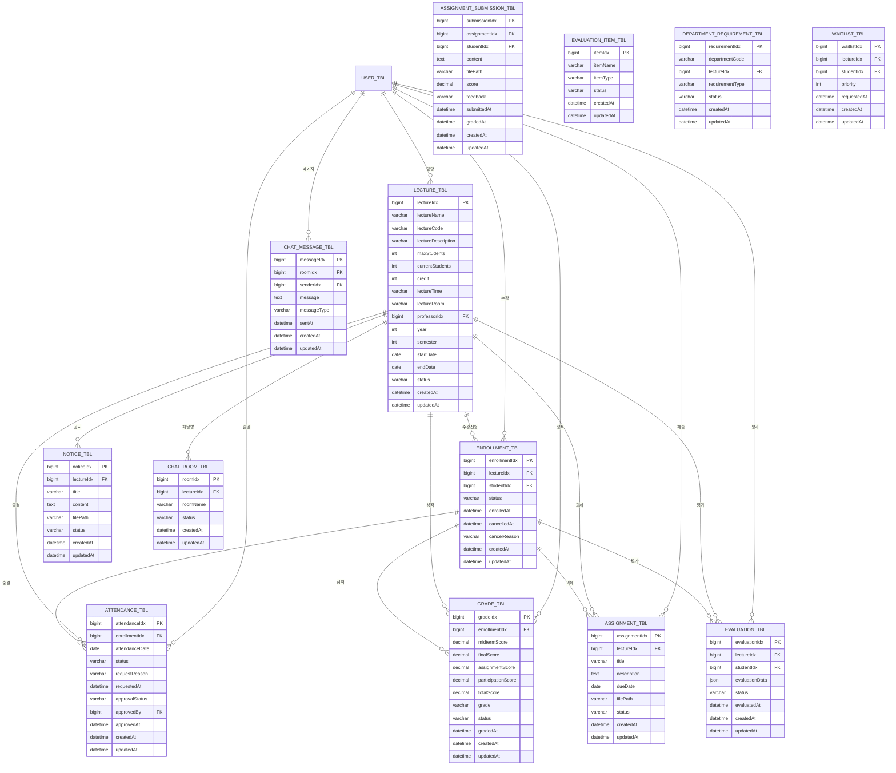

# 01. 데이터베이스 설계

> **작성일**: 2025-10-09
> **버전**: 1.0

---

## 📊 데이터베이스 설계 개요

강의 관리 시스템의 데이터베이스 설계를 정의합니다. MariaDB를 기반으로 한 관계형 데이터베이스 구조입니다.

---

## 📋 목차

1. [ERD 다이어그램](#1-erd-다이어그램)
2. [테이블 스키마](#2-테이블-스키마)
3. [제약조건 및 인덱스](#3-제약조건-및-인덱스)
4. [데이터 마이그레이션](#4-데이터-마이그레이션)

---

## 1. ERD 다이어그램



---

## 2. 테이블 스키마

### **LECTURE_TBL - 강의 정보 테이블**

```sql
CREATE TABLE LECTURE_TBL (
    lectureIdx BIGINT PRIMARY KEY AUTO_INCREMENT COMMENT '강의 고유번호',
    lectureName VARCHAR(200) NOT NULL COMMENT '강의명',
    lectureCode VARCHAR(20) UNIQUE NOT NULL COMMENT '강의코드',
    lectureDescription TEXT COMMENT '강의 설명',
    maxStudents INT NOT NULL DEFAULT 30 COMMENT '최대 수강인원',
    currentStudents INT NOT NULL DEFAULT 0 COMMENT '현재 수강인원',
    credit INT NOT NULL COMMENT '학점',
    lectureTime VARCHAR(100) COMMENT '강의 시간 (예: 월1,2 수3,4)',
    lectureRoom VARCHAR(50) COMMENT '강의실',
    professorIdx BIGINT NOT NULL COMMENT '담당 교수 IDX',
    year INT NOT NULL COMMENT '학년도',
    semester INT NOT NULL COMMENT '학기 (1:1학기, 2:2학기)',
    startDate DATE NOT NULL COMMENT '강의 시작일',
    endDate DATE NOT NULL COMMENT '강의 종료일',
    status VARCHAR(20) NOT NULL DEFAULT 'ACTIVE' COMMENT '상태 (ACTIVE:활성, CANCELLED:폐강)',
    createdAt DATETIME NOT NULL DEFAULT CURRENT_TIMESTAMP,
    updatedAt DATETIME NOT NULL DEFAULT CURRENT_TIMESTAMP ON UPDATE CURRENT_TIMESTAMP,

    FOREIGN KEY (professorIdx) REFERENCES USER_TBL(userIdx)
) ENGINE=InnoDB DEFAULT CHARSET=utf8mb4 COLLATE=utf8mb4_unicode_ci;
```

### **ENROLLMENT_TBL - 수강신청 테이블**

```sql
CREATE TABLE ENROLLMENT_TBL (
    enrollmentIdx BIGINT PRIMARY KEY AUTO_INCREMENT COMMENT '수강신청 고유번호',
    lectureIdx BIGINT NOT NULL COMMENT '강의 IDX',
    studentIdx BIGINT NOT NULL COMMENT '학생 IDX',
    status VARCHAR(20) NOT NULL DEFAULT 'ENROLLED' COMMENT '상태 (ENROLLED:수강중, CANCELLED:취소, COMPLETED:완료)',
    enrolledAt DATETIME NOT NULL DEFAULT CURRENT_TIMESTAMP COMMENT '수강신청일',
    cancelledAt DATETIME NULL COMMENT '취소일',
    cancelReason VARCHAR(500) COMMENT '취소 사유',
    createdAt DATETIME NOT NULL DEFAULT CURRENT_TIMESTAMP,
    updatedAt DATETIME NOT NULL DEFAULT CURRENT_TIMESTAMP ON UPDATE CURRENT_TIMESTAMP,

    FOREIGN KEY (lectureIdx) REFERENCES LECTURE_TBL(lectureIdx),
    FOREIGN KEY (studentIdx) REFERENCES USER_TBL(userIdx),
    UNIQUE KEY uk_enrollment (lectureIdx, studentIdx)
) ENGINE=InnoDB DEFAULT CHARSET=utf8mb4 COLLATE=utf8mb4_unicode_ci;
```

### **ATTENDANCE_TBL - 출결 테이블**

```sql
CREATE TABLE ATTENDANCE_TBL (
    attendanceIdx BIGINT PRIMARY KEY AUTO_INCREMENT COMMENT '출결 고유번호',
    enrollmentIdx BIGINT NOT NULL COMMENT '수강신청 IDX',
    attendanceDate DATE NOT NULL COMMENT '출결 날짜',
    status VARCHAR(20) NOT NULL DEFAULT 'ABSENT' COMMENT '출결 상태 (PRESENT:출석, LATE:지각, ABSENT:결석, EXCUSED:공결)',
    requestReason VARCHAR(500) COMMENT '사유신청 내용',
    requestedAt DATETIME NULL COMMENT '사유신청 시간',
    approvalStatus VARCHAR(20) DEFAULT 'PENDING' COMMENT '승인 상태 (PENDING:대기, APPROVED:승인, REJECTED:거부)',
    approvedBy BIGINT NULL COMMENT '승인자 IDX',
    approvedAt DATETIME NULL COMMENT '승인 시간',
    createdAt DATETIME NOT NULL DEFAULT CURRENT_TIMESTAMP,
    updatedAt DATETIME NOT NULL DEFAULT CURRENT_TIMESTAMP ON UPDATE CURRENT_TIMESTAMP,

    FOREIGN KEY (enrollmentIdx) REFERENCES ENROLLMENT_TBL(enrollmentIdx),
    FOREIGN KEY (approvedBy) REFERENCES USER_TBL(userIdx),
    UNIQUE KEY uk_attendance (enrollmentIdx, attendanceDate)
) ENGINE=InnoDB DEFAULT CHARSET=utf8mb4 COLLATE=utf8mb4_unicode_ci;
```

### **GRADE_TBL - 성적 테이블**

```sql
CREATE TABLE GRADE_TBL (
    gradeIdx BIGINT PRIMARY KEY AUTO_INCREMENT COMMENT '성적 고유번호',
    enrollmentIdx BIGINT NOT NULL COMMENT '수강신청 IDX',
    midtermScore DECIMAL(5,2) NULL COMMENT '중간고사 점수',
    finalScore DECIMAL(5,2) NULL COMMENT '기말고사 점수',
    assignmentScore DECIMAL(5,2) NULL COMMENT '과제 점수',
    participationScore DECIMAL(5,2) NULL COMMENT '참여도 점수',
    totalScore DECIMAL(5,2) NULL COMMENT '총점',
    grade VARCHAR(2) NULL COMMENT '학점 (A+, A, B+, B, C+, C, D+, D, F)',
    status VARCHAR(20) NOT NULL DEFAULT 'IN_PROGRESS' COMMENT '상태 (IN_PROGRESS:진행중, FINALIZED:확정)',
    gradedAt DATETIME NULL COMMENT '성적 입력일',
    createdAt DATETIME NOT NULL DEFAULT CURRENT_TIMESTAMP,
    updatedAt DATETIME NOT NULL DEFAULT CURRENT_TIMESTAMP ON UPDATE CURRENT_TIMESTAMP,

    FOREIGN KEY (enrollmentIdx) REFERENCES ENROLLMENT_TBL(enrollmentIdx),
    UNIQUE KEY uk_grade (enrollmentIdx)
) ENGINE=InnoDB DEFAULT CHARSET=utf8mb4 COLLATE=utf8mb4_unicode_ci;
```

### **ASSIGNMENT_TBL - 과제 테이블**

```sql
CREATE TABLE ASSIGNMENT_TBL (
    assignmentIdx BIGINT PRIMARY KEY AUTO_INCREMENT COMMENT '과제 고유번호',
    lectureIdx BIGINT NOT NULL COMMENT '강의 IDX',
    title VARCHAR(200) NOT NULL COMMENT '과제 제목',
    description TEXT COMMENT '과제 설명',
    dueDate DATE NOT NULL COMMENT '제출 마감일',
    filePath VARCHAR(500) COMMENT '첨부파일 경로',
    status VARCHAR(20) NOT NULL DEFAULT 'ACTIVE' COMMENT '상태 (ACTIVE:활성, DELETED:삭제)',
    createdAt DATETIME NOT NULL DEFAULT CURRENT_TIMESTAMP,
    updatedAt DATETIME NOT NULL DEFAULT CURRENT_TIMESTAMP ON UPDATE CURRENT_TIMESTAMP,

    FOREIGN KEY (lectureIdx) REFERENCES LECTURE_TBL(lectureIdx)
) ENGINE=InnoDB DEFAULT CHARSET=utf8mb4 COLLATE=utf8mb4_unicode_ci;
```

### **ASSIGNMENT_SUBMISSION_TBL - 과제 제출 테이블**

```sql
CREATE TABLE ASSIGNMENT_SUBMISSION_TBL (
    submissionIdx BIGINT PRIMARY KEY AUTO_INCREMENT COMMENT '제출 고유번호',
    assignmentIdx BIGINT NOT NULL COMMENT '과제 IDX',
    studentIdx BIGINT NOT NULL COMMENT '학생 IDX',
    content TEXT COMMENT '제출 내용',
    filePath VARCHAR(500) COMMENT '제출 파일 경로',
    score DECIMAL(5,2) NULL COMMENT '점수',
    feedback TEXT COMMENT '피드백',
    submittedAt DATETIME NULL COMMENT '제출 시간',
    gradedAt DATETIME NULL COMMENT '채점 시간',
    createdAt DATETIME NOT NULL DEFAULT CURRENT_TIMESTAMP,
    updatedAt DATETIME NOT NULL DEFAULT CURRENT_TIMESTAMP ON UPDATE CURRENT_TIMESTAMP,

    FOREIGN KEY (assignmentIdx) REFERENCES ASSIGNMENT_TBL(assignmentIdx),
    FOREIGN KEY (studentIdx) REFERENCES USER_TBL(userIdx),
    UNIQUE KEY uk_submission (assignmentIdx, studentIdx)
) ENGINE=InnoDB DEFAULT CHARSET=utf8mb4 COLLATE=utf8mb4_unicode_ci;
```

### **EVALUATION_ITEM_TBL - 평가 항목 테이블**

```sql
CREATE TABLE EVALUATION_ITEM_TBL (
    itemIdx BIGINT PRIMARY KEY AUTO_INCREMENT COMMENT '항목 고유번호',
    itemName VARCHAR(200) NOT NULL COMMENT '항목명',
    itemType VARCHAR(50) NOT NULL COMMENT '항목 유형',
    status VARCHAR(20) NOT NULL DEFAULT 'ACTIVE' COMMENT '상태',
    createdAt DATETIME NOT NULL DEFAULT CURRENT_TIMESTAMP,
    updatedAt DATETIME NOT NULL DEFAULT CURRENT_TIMESTAMP ON UPDATE CURRENT_TIMESTAMP
) ENGINE=InnoDB DEFAULT CHARSET=utf8mb4 COLLATE=utf8mb4_unicode_ci;
```

### **EVALUATION_TBL - 강의 평가 테이블**

```sql
CREATE TABLE EVALUATION_TBL (
    evaluationIdx BIGINT PRIMARY KEY AUTO_INCREMENT COMMENT '평가 고유번호',
    lectureIdx BIGINT NOT NULL COMMENT '강의 IDX',
    studentIdx BIGINT NOT NULL COMMENT '학생 IDX',
    evaluationData JSON NOT NULL COMMENT '평가 데이터 (JSON)',
    status VARCHAR(20) NOT NULL DEFAULT 'IN_PROGRESS' COMMENT '상태',
    evaluatedAt DATETIME NULL COMMENT '평가 완료 시간',
    createdAt DATETIME NOT NULL DEFAULT CURRENT_TIMESTAMP,
    updatedAt DATETIME NOT NULL DEFAULT CURRENT_TIMESTAMP ON UPDATE CURRENT_TIMESTAMP,

    FOREIGN KEY (lectureIdx) REFERENCES LECTURE_TBL(lectureIdx),
    FOREIGN KEY (studentIdx) REFERENCES USER_TBL(userIdx),
    UNIQUE KEY uk_evaluation (lectureIdx, studentIdx)
) ENGINE=InnoDB DEFAULT CHARSET=utf8mb4 COLLATE=utf8mb4_unicode_ci;
```

### **NOTICE_TBL - 공지사항 테이블**

```sql
CREATE TABLE NOTICE_TBL (
    noticeIdx BIGINT PRIMARY KEY AUTO_INCREMENT COMMENT '공지 고유번호',
    lectureIdx BIGINT NOT NULL COMMENT '강의 IDX',
    title VARCHAR(200) NOT NULL COMMENT '제목',
    content TEXT NOT NULL COMMENT '내용',
    filePath VARCHAR(500) COMMENT '첨부파일 경로',
    status VARCHAR(20) NOT NULL DEFAULT 'ACTIVE' COMMENT '상태',
    createdAt DATETIME NOT NULL DEFAULT CURRENT_TIMESTAMP,
    updatedAt DATETIME NOT NULL DEFAULT CURRENT_TIMESTAMP ON UPDATE CURRENT_TIMESTAMP,

    FOREIGN KEY (lectureIdx) REFERENCES LECTURE_TBL(lectureIdx)
) ENGINE=InnoDB DEFAULT CHARSET=utf8mb4 COLLATE=utf8mb4_unicode_ci;
```

### **CHAT_ROOM_TBL - 채팅방 테이블**

```sql
CREATE TABLE CHAT_ROOM_TBL (
    roomIdx BIGINT PRIMARY KEY AUTO_INCREMENT COMMENT '채팅방 고유번호',
    lectureIdx BIGINT NOT NULL COMMENT '강의 IDX',
    roomName VARCHAR(100) NOT NULL COMMENT '채팅방 이름',
    status VARCHAR(20) NOT NULL DEFAULT 'ACTIVE' COMMENT '상태',
    createdAt DATETIME NOT NULL DEFAULT CURRENT_TIMESTAMP,
    updatedAt DATETIME NOT NULL DEFAULT CURRENT_TIMESTAMP ON UPDATE CURRENT_TIMESTAMP,

    FOREIGN KEY (lectureIdx) REFERENCES LECTURE_TBL(lectureIdx)
) ENGINE=InnoDB DEFAULT CHARSET=utf8mb4 COLLATE=utf8mb4_unicode_ci;
```

### **CHAT_MESSAGE_TBL - 채팅 메시지 테이블**

```sql
CREATE TABLE CHAT_MESSAGE_TBL (
    messageIdx BIGINT PRIMARY KEY AUTO_INCREMENT COMMENT '메시지 고유번호',
    roomIdx BIGINT NOT NULL COMMENT '채팅방 IDX',
    senderIdx BIGINT NOT NULL COMMENT '보낸사람 IDX',
    message TEXT NOT NULL COMMENT '메시지 내용',
    messageType VARCHAR(20) NOT NULL DEFAULT 'TEXT' COMMENT '메시지 유형',
    sentAt DATETIME NOT NULL DEFAULT CURRENT_TIMESTAMP COMMENT '보낸 시간',
    createdAt DATETIME NOT NULL DEFAULT CURRENT_TIMESTAMP,
    updatedAt DATETIME NOT NULL DEFAULT CURRENT_TIMESTAMP ON UPDATE CURRENT_TIMESTAMP,

    FOREIGN KEY (roomIdx) REFERENCES CHAT_ROOM_TBL(roomIdx),
    FOREIGN KEY (senderIdx) REFERENCES USER_TBL(userIdx)
) ENGINE=InnoDB DEFAULT CHARSET=utf8mb4 COLLATE=utf8mb4_unicode_ci;
```

### **DEPARTMENT_REQUIREMENT_TBL - 학과 요구사항 테이블**

```sql
CREATE TABLE DEPARTMENT_REQUIREMENT_TBL (
    requirementIdx BIGINT PRIMARY KEY AUTO_INCREMENT COMMENT '요구사항 고유번호',
    departmentCode VARCHAR(20) NOT NULL COMMENT '학과 코드',
    lectureIdx BIGINT NOT NULL COMMENT '강의 IDX',
    requirementType VARCHAR(20) NOT NULL COMMENT '요구사항 유형 (REQUIRED:필수, ELECTIVE:선택)',
    status VARCHAR(20) NOT NULL DEFAULT 'ACTIVE' COMMENT '상태',
    createdAt DATETIME NOT NULL DEFAULT CURRENT_TIMESTAMP,
    updatedAt DATETIME NOT NULL DEFAULT CURRENT_TIMESTAMP ON UPDATE CURRENT_TIMESTAMP,

    FOREIGN KEY (lectureIdx) REFERENCES LECTURE_TBL(lectureIdx)
) ENGINE=InnoDB DEFAULT CHARSET=utf8mb4 COLLATE=utf8mb4_unicode_ci;
```

### **WAITLIST_TBL - 대기열 테이블**

```sql
CREATE TABLE WAITLIST_TBL (
    waitlistIdx BIGINT PRIMARY KEY AUTO_INCREMENT COMMENT '대기열 고유번호',
    lectureIdx BIGINT NOT NULL COMMENT '강의 IDX',
    studentIdx BIGINT NOT NULL COMMENT '학생 IDX',
    priority INT NOT NULL DEFAULT 1 COMMENT '우선순위',
    requestedAt DATETIME NOT NULL DEFAULT CURRENT_TIMESTAMP COMMENT '신청 시간',
    createdAt DATETIME NOT NULL DEFAULT CURRENT_TIMESTAMP,
    updatedAt DATETIME NOT NULL DEFAULT CURRENT_TIMESTAMP ON UPDATE CURRENT_TIMESTAMP,

    FOREIGN KEY (lectureIdx) REFERENCES LECTURE_TBL(lectureIdx),
    FOREIGN KEY (studentIdx) REFERENCES USER_TBL(userIdx),
    UNIQUE KEY uk_waitlist (lectureIdx, studentIdx)
) ENGINE=InnoDB DEFAULT CHARSET=utf8mb4 COLLATE=utf8mb4_unicode_ci;
```

---

## 3. 제약조건 및 인덱스

### **주요 제약조건**

```sql
-- 수강신청 인원 제한 체크
DELIMITER //
CREATE TRIGGER check_enrollment_limit
BEFORE INSERT ON ENROLLMENT_TBL
FOR EACH ROW
BEGIN
    DECLARE current_count INT;
    SELECT currentStudents INTO current_count
    FROM LECTURE_TBL
    WHERE lectureIdx = NEW.lectureIdx;

    IF current_count >= (SELECT maxStudents FROM LECTURE_TBL WHERE lectureIdx = NEW.lectureIdx) THEN
        SIGNAL SQLSTATE '45000' SET MESSAGE_TEXT = '강의 정원이 초과되었습니다.';
    END IF;
END//
DELIMITER ;

-- 성적 범위 체크
DELIMITER //
CREATE TRIGGER check_score_range
BEFORE UPDATE ON GRADE_TBL
FOR EACH ROW
BEGIN
    IF NEW.midtermScore > 100 OR NEW.midtermScore < 0 THEN
        SIGNAL SQLSTATE '45000' SET MESSAGE_TEXT = '중간고사 점수는 0-100 사이여야 합니다.';
    END IF;
    IF NEW.finalScore > 100 OR NEW.finalScore < 0 THEN
        SIGNAL SQLSTATE '45000' SET MESSAGE_TEXT = '기말고사 점수는 0-100 사이여야 합니다.';
    END IF;
    IF NEW.assignmentScore > 100 OR NEW.assignmentScore < 0 THEN
        SIGNAL SQLSTATE '45000' SET MESSAGE_TEXT = '과제 점수는 0-100 사이여야 합니다.';
    END IF;
    IF NEW.participationScore > 100 OR NEW.participationScore < 0 THEN
        SIGNAL SQLSTATE '45000' SET MESSAGE_TEXT = '참여도 점수는 0-100 사이여야 합니다.';
    END IF;
END//
DELIMITER ;
```

### **인덱스 설계**

```sql
-- 강의 조회 최적화
CREATE INDEX idx_lecture_professor ON LECTURE_TBL(professorIdx);
CREATE INDEX idx_lecture_year_semester ON LECTURE_TBL(year, semester);
CREATE INDEX idx_lecture_status ON LECTURE_TBL(status);

-- 수강신청 조회 최적화
CREATE INDEX idx_enrollment_student ON ENROLLMENT_TBL(studentIdx);
CREATE INDEX idx_enrollment_lecture ON ENROLLMENT_TBL(lectureIdx);
CREATE INDEX idx_enrollment_status ON ENROLLMENT_TBL(status);

-- 출결 조회 최적화
CREATE INDEX idx_attendance_enrollment ON ATTENDANCE_TBL(enrollmentIdx);
CREATE INDEX idx_attendance_date ON ATTENDANCE_TBL(attendanceDate);
CREATE INDEX idx_attendance_status ON ATTENDANCE_TBL(approvalStatus);

-- 성적 조회 최적화
CREATE INDEX idx_grade_enrollment ON GRADE_TBL(enrollmentIdx);
CREATE INDEX idx_grade_status ON GRADE_TBL(status);

-- 과제 조회 최적화
CREATE INDEX idx_assignment_lecture ON ASSIGNMENT_TBL(lectureIdx);
CREATE INDEX idx_assignment_due_date ON ASSIGNMENT_TBL(dueDate);

-- 채팅 성능 최적화
CREATE INDEX idx_chat_message_room ON CHAT_MESSAGE_TBL(roomIdx);
CREATE INDEX idx_chat_message_sent_at ON CHAT_MESSAGE_TBL(sentAt);
```

---

## 4. 데이터 마이그레이션

### **초기 데이터 삽입**

```sql
-- 평가 항목 초기 데이터
INSERT INTO EVALUATION_ITEM_TBL (itemName, itemType, status) VALUES
('강의 내용의 적절성', 'CONTENT', 'ACTIVE'),
('강의 자료의 유용성', 'MATERIAL', 'ACTIVE'),
('강의 진행 속도', 'PACE', 'ACTIVE'),
('교수의 강의 태도', 'ATTITUDE', 'ACTIVE'),
('전반적인 만족도', 'OVERALL', 'ACTIVE');

-- 샘플 강의 데이터 (테스트용)
INSERT INTO LECTURE_TBL (
    lectureName, lectureCode, maxStudents, credit,
    professorIdx, year, semester, startDate, endDate, status
) VALUES
('자바 프로그래밍', 'CS101', 30, 3, 1, 2025, 1, '2025-03-01', '2025-06-30', 'ACTIVE'),
('데이터베이스', 'CS201', 25, 3, 2, 2025, 1, '2025-03-01', '2025-06-30', 'ACTIVE');
```

### **데이터 마이그레이션 전략**

1. **기존 데이터 백업**
   ```sql
   mysqldump -u username -p database_name > backup.sql
   ```

2. **테이블 생성 및 제약조건 적용**

3. **데이터 이전**
   ```sql
   -- 기존 USER_TBL에서 교수/학생 데이터 분리 로직
   INSERT INTO LECTURE_TBL (lectureName, lectureCode, ...)
   SELECT ... FROM existing_lecture_table;
   ```

4. **데이터 검증**
   ```sql
   -- 데이터 무결성 체크
   SELECT COUNT(*) FROM LECTURE_TBL;
   SELECT COUNT(*) FROM ENROLLMENT_TBL;
   ```

5. **인덱스 생성 및 최적화**

---

## 🎯 설계 완료

데이터베이스 설계가 완료되었습니다. 모든 테이블 스키마, 제약조건, 인덱스가 정의되었으며, 데이터 마이그레이션 전략도 준비되었습니다.