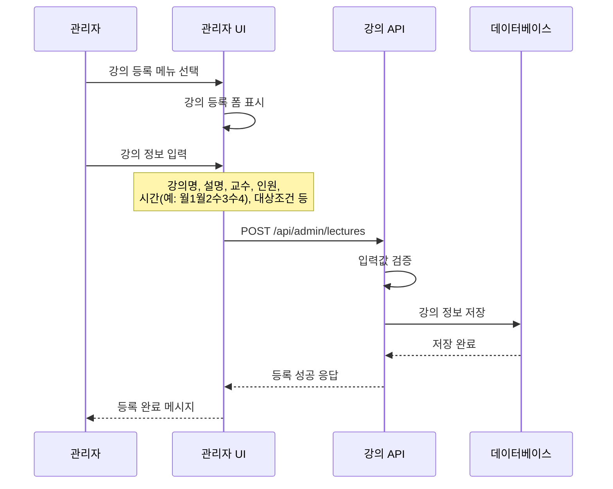
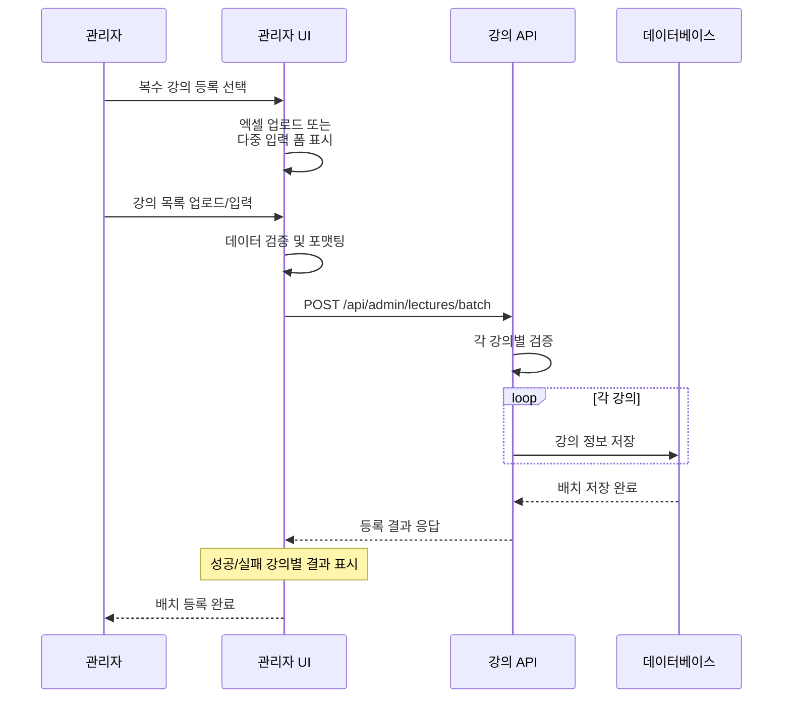
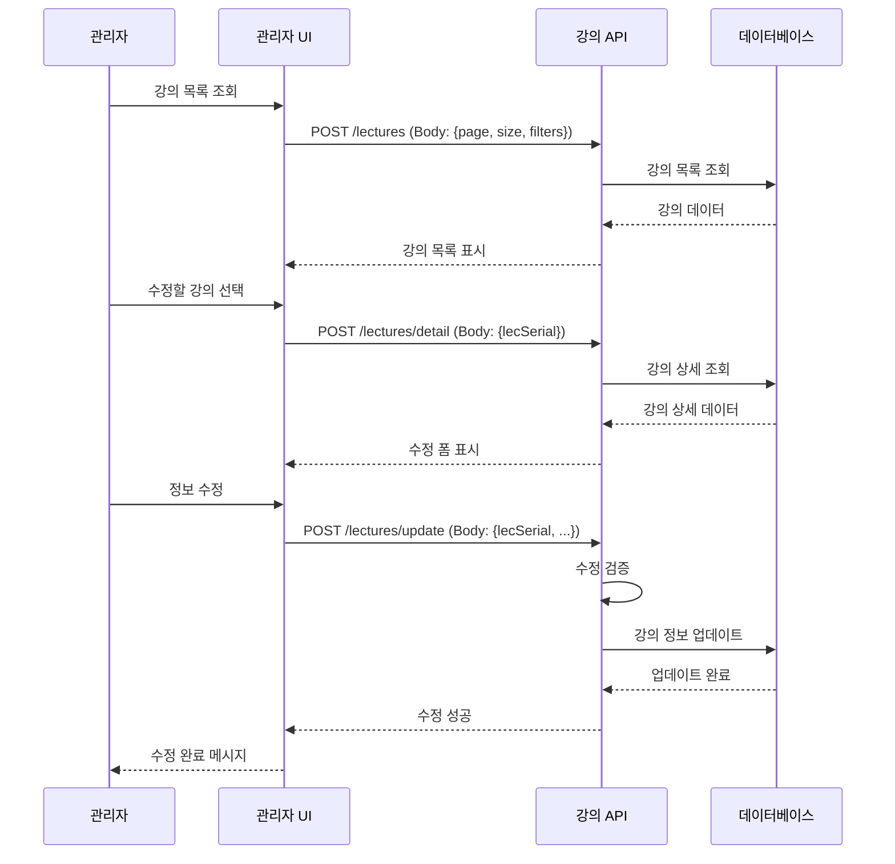
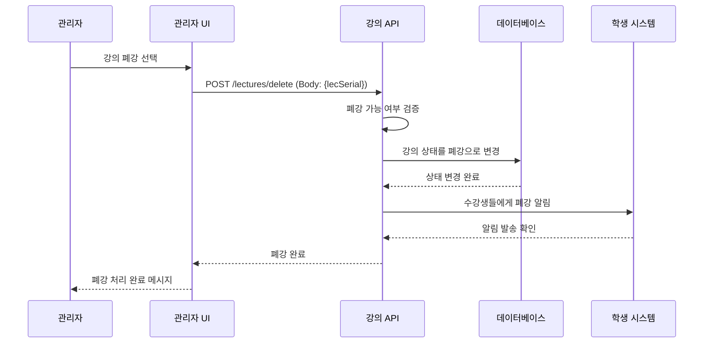
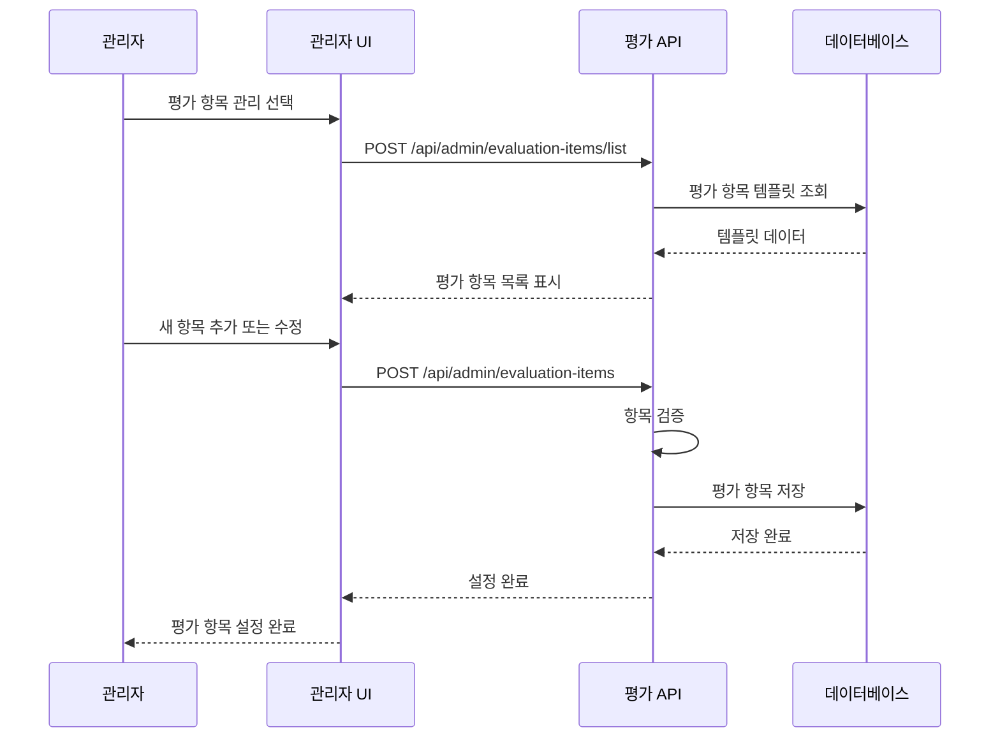
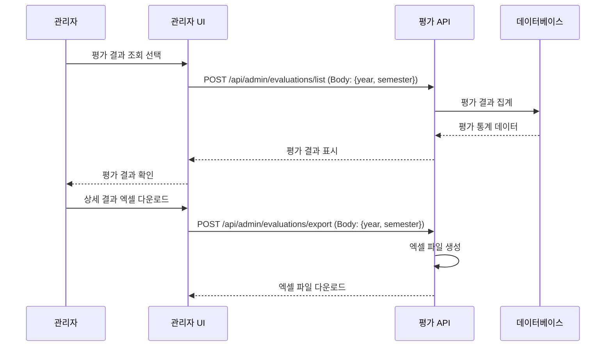
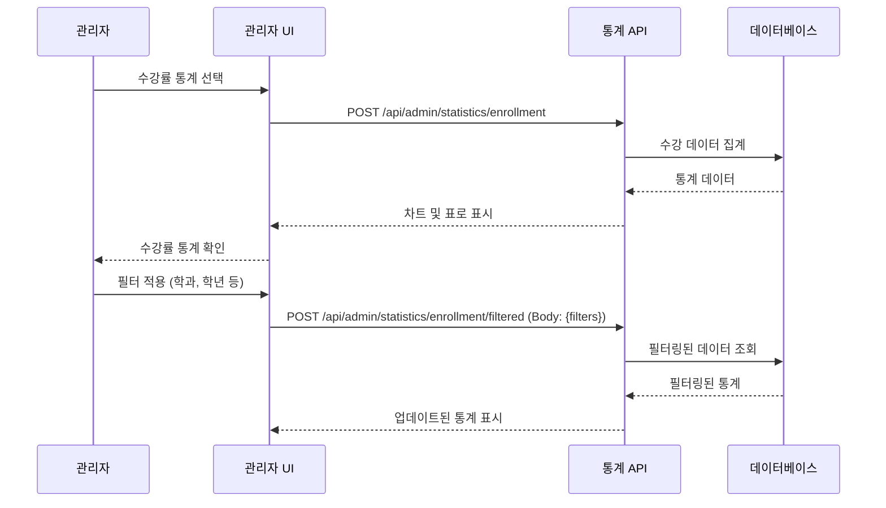
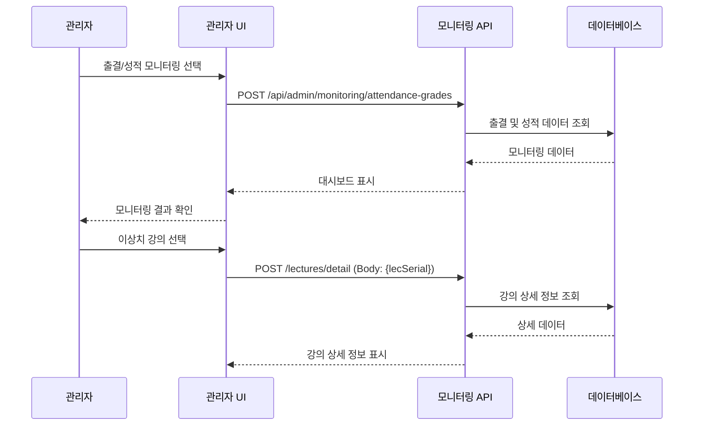

# 04. 관리자 플로우

## 관리자 기능 플로우

---

## 📋 목차

1. [강의 등록 플로우](#1-강의-등록-플로우)
2. [강의 관리 플로우](#2-강의-관리-플로우)
3. [강의 평가 관리 플로우](#3-강의-평가-관리-플로우)
4. [통계 및 모니터링 플로우](#4-통계-및-모니터링-플로우)

---

## 1. 강의 등록 플로우

### **1.1 단일 강의 등록**



### **1.2 복수 강의 등록 (배치)**



### **1.3 강의 등록 상세 프로세스**

#### **입력 검증 단계**
1. **필수값 체크**: 강의명, 코드, 교수, 최대인원 등
2. **중복 체크**: 강의코드, 시간 겹침 등
3. **참조 검증**: 교수 존재 여부, 학과 코드 유효성
4. **비즈니스 규칙**: 최소인원 ≤ 최대인원, 시간 형식(월1월2수3수4) 등
5. **시간 형식 검증**: 
   - 형식: `월1월2수3수4` (요일명+교시 반복)
   - 요일: 월, 화, 수, 목, 금 중 하나
   - 교시: 1~9 사이의 숫자
   - 예시: `월1`, `월1화2`, `월1월2수3수4`
   - 사용자 입력 지원: `월1,2 수3,4` 형태도 자동 변환 가능

#### **데이터 저장 단계**
1. **LECTURE_TBL**: 기본 강의 정보 저장
2. **LECTURE_SCHEDULE**: 시간표 정보 저장
3. **LECTURE_DEPARTMENT_REQUIREMENT**: 전공별 필수/교양 설정 저장

#### **강의 시간 형식 가이드**

##### **기본 형식**
- **저장 형식**: `월1월2수3수4` (요일명+교시 연속)
- **요일 표기**: 월, 화, 수, 목, 금
- **교시 범위**: 1~9
- **DB 필드**: `LEC_TIME` VARCHAR(100)

##### **입력 방식**
관리자는 두 가지 형식으로 강의 시간을 입력할 수 있으며, 시스템이 자동으로 표준 형식으로 변환합니다:

1. **표준 형식** (직접 입력):
   ```
   월1월2수3수4
   ```

2. **편의 형식** (콤마/공백 사용):
   ```
   월1,2 수3,4
   화2,3,4
   월1 화2 수3 목4 금5
   ```

##### **형식 변환 예시**

| 사용자 입력 | 저장 형식 | 설명 |
|------------|----------|------|
| `월1,2 수3,4` | `월1월2수3수4` | 월요일 1,2교시 + 수요일 3,4교시 |
| `화2,3,4` | `화2화3화4` | 화요일 2,3,4교시 |
| `월1` | `월1` | 월요일 1교시만 |
| `월1 화2 수3` | `월1화2수3` | 월/화/수 각 1개 교시 |

##### **변환 로직**
시스템은 다음 JavaScript 함수로 자동 변환합니다:

```javascript
function convertLectureTimeFormat(input) {
    if (!input || input.trim() === '') {
        return '';
    }
    
    // 정규식: (요일)(숫자들) 패턴 찾기
    const regex = /([월화수목금])([0-9,\s]+)/g;
    let result = '';
    let match;
    
    while ((match = regex.exec(input)) !== null) {
        const day = match[1];  // 요일
        const periods = match[2]
            .replace(/\s+/g, '')  // 공백 제거
            .split(',')           // 콤마로 분리
            .filter(p => p);      // 빈 문자열 제거
        
        // 각 교시를 요일과 결합
        periods.forEach(period => {
            result += day + period;
        });
    }
    
    return result;
}
```

##### **사용 예시 (브라우저 콘솔 테스트)**
```javascript
// 테스트 파일에서 사용
const userInput = prompt('강의 시간 (예: 월1,2 수3,4):');
const dbFormat = convertLectureTimeFormat(userInput);
console.log('입력:', userInput);
console.log('저장:', dbFormat);
```

##### **유효성 검증**
- 요일은 반드시 월/화/수/목/금 중 하나
- 교시는 1~9 범위의 숫자
- 빈 값 허용 (선택 입력)
- 중복 시간 체크 (다른 강의와 겹침 방지)

---

## 2. 강의 관리 플로우

### **2.1 강의 수정 플로우**



### **2.2 강의 폐강 플로우**



---

## 3. 강의 평가 관리 플로우

### **3.1 평가 항목 설정** (미구현)



### **3.2 평가 결과 조회** (미구현)



---

## 4. 통계 및 모니터링 플로우

### **4.1 수강률 통계 조회** (미구현)



### **4.2 출결 및 성적 모니터링** (미구현)



---

## 관리자 주요 업무

### 학기 준비
1. 강의 계획 수립 및 교수별 강의 배정
2. 강의 정보 등록
3. 평가 항목 설정 (미구현)
4. 수강신청 기간 설정

### 학기 운영
1. 강의 모니터링 (수강률, 출결률)
2. 이슈 대응 (정원 조정, 시간 변경)
3. 통계 분석 (미구현)

### 학기 종료
1. 평가 결과 분석 (미구현)
2. 성적 모니터링 (미구현)
3. 다음 학기 준비