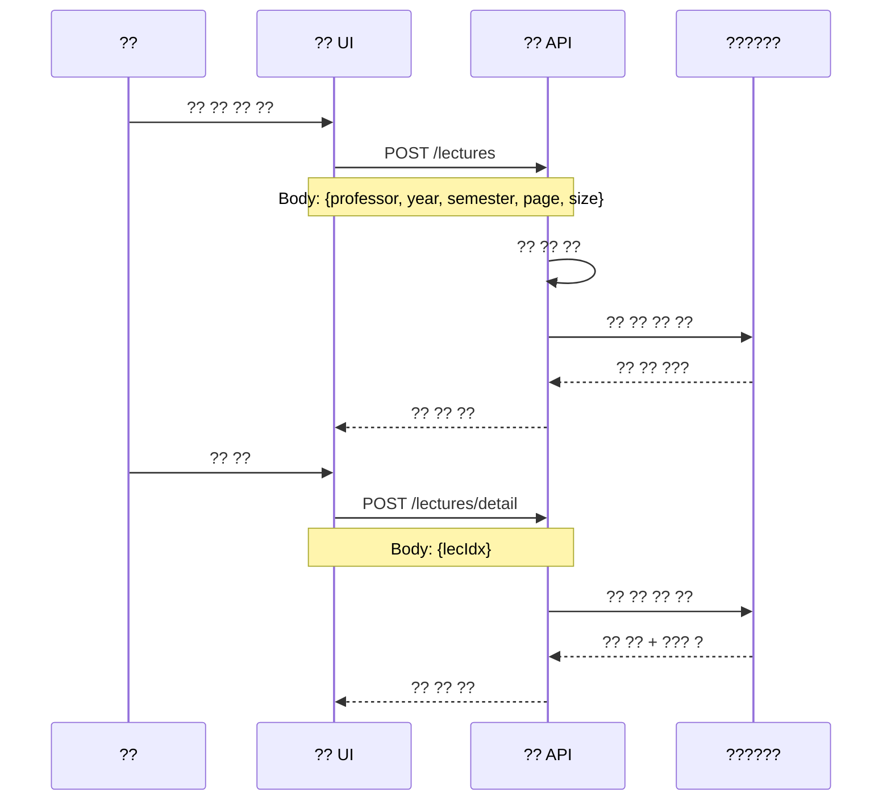

# 05. ?? ???

> **???**: 2025-10-10  
> **?? ??**: 2025-10-16  
> **??**: 4.0 (POST ?? ??)  
> **????**: 
> - **Phase 7.0**: ?? ?? API? POST ???? ?? (Request Body ?? ??)
> - **Phase 6.9**: ?? ?? ??? ?? ?? (?/?/? 3?? ??)
> - ?? ?? ??/?? ??? ??
> - ??? ?? ?? API ??
> - ?? ?? ?? ?? ??
---
## ????? ?? ?? ???
??? ?? ?? ??? ?? ????? ???? ?????.
## ?? ??
1. [?? ?? ?? ???](#1-??-??-??-???)
2. [??? ?? ???](#2-???-??-???)
3. [?? ?? ??? ??](#3-??-??-???)
4. [?? ?? ???](#4-??-??-???)
5. [?? ?? ???](#5-??-??-???)
## 1. ?? ?? ?? ???
### **1.1 ?? ?? ?? ? ??**

### **API ?????**
- `POST /lectures` - ?? ?? ?? ?? (Body: {professor, year, semester, page, size})
- `POST /lectures/detail` - ?? ?? ?? (Body: {lecIdx})
### **????? ?? ??**
```javascript
// ?? ?? ??
async function getProfessorLectures() {
    const response = await fetch('/lectures', {
        method: 'POST',
        headers: {
            'Content-Type': 'application/json',
            'Authorization': `Bearer ${token}`
        },
        body: JSON.stringify({
            professor: professorCode,
            year: 2025,
            semester: 1,
            page: 0,
            size: 20
        })
    });
    const result = await response.json();
    
    if (result.success) {
        displayLectureList(result.data);
    }
}
```---
## 2. ??? ?? ???
### **2.1 ??? ?? ??**
### **2.1 ??? ?? ??**sequenceDiagram
```mermaid    participant UI as ?? UI
sequenceDiagram    participant API as ?? API
    participant Professor as ??    participant DB as ??????
    participant API as ?? API    Professor->>UI: ??? ?? ??
    participant DB as ??????    UI->>API: POST /enrollments/list (Body: lecIdx=1&page=0&size=20
    API->>DB: ???? ?? ?? (?? ?? ??)
    Professor->>UI: ??? ?? ??    DB-->>API: ??? ???
    UI->>API: POST /enrollments/list (Body: lecIdx=1&page=0&size=20    API-->>UI: ??? ?? ??
    API->>DB: ???? ?? ?? (?? ?? ??)    
    DB-->>API: ??? ???    Professor->>UI: ??? ?? ?? ??
    API-->>UI: ??? ?? ??    UI->>API: POST /enrollments/detail (Body: {enrollmentIdx})
        API->>DB: ??? ?? ?? ??
    Professor->>UI: ??? ?? ?? ??    DB-->>API: ?? ?? (???, ?? ?)
    UI->>API: POST /enrollments/detail (Body: {enrollmentIdx})    API-->>UI: ?? ?? ??
    API->>DB: ??? ?? ?? ??```
    DB-->>API: ?? ?? (???, ?? ?)
    API-->>UI: ?? ?? ??#### **API ?????**
```- `POST /enrollments/list (Body: lecIdx={id}` - ??? ??
- `POST /enrollments/detail (Body: {enrollmentIdx})` - ??? ?? ??
#### **????? ?? ??**
- `POST /enrollments/list (Body: lecIdx={id}` - ??? ??```javascript
- `POST /enrollments/detail (Body: {enrollmentIdx})` - ??? ?? ??// ??? ?? ??
async function getStudentList(lecIdx) {
### **????? ?? ??**    const response = await fetch(`/api/enrollments?lecIdx=${lecIdx}&page=0&size=20`, {
        headers: { 'Authorization': `Bearer ${token}` }
```javascript    });
// ??? ?? ??    const result = await response.json();
async function getStudentList(lecIdx) {    
    const response = await fetch(`/api/enrollments?lecIdx=${lecIdx}&page=0&size=20`, {    if (result.success) {
        headers: { 'Authorization': `Bearer ${token}` }        displayStudents(result.data.content);
    });        updatePagination(result.data);
    const result = await response.json();    }
    if (result.success) {```
        displayStudents(result.data.content);
        updatePagination(result.data);---
}## 3. ?? ?? ??? ??
### **3.1 ?? ??**
## 3. ?? ?? ??? ??sequenceDiagram
### **3.1 ?? ??**    participant UI as ?? UI
    participant API as ?? API
```mermaid    participant DB as ??????
    participant Professor as ??    Professor->>UI: ?? ?? ?? ??
    participant UI as ?? UI    UI->>UI: ??? ?? ??
    participant API as ?? API    
    participant DB as ??????    Professor->>UI: ??? ?? ?? ?? (?/?/?)
    UI->>API: POST /api/professor/attendance/mark
    Professor->>UI: ?? ?? ?? ??    Note over UI,API: Body: {enrollmentIdx, sessionNumber, status}
    UI->>UI: ??? ?? ??    
        API->>DB: ?? ??? ???? ("1?2?3?...")
    Professor->>UI: ??? ?? ?? ?? (?/?/?)    API->>DB: ??? ??? ("75/80")
    UI->>API: POST /api/professor/attendance/mark    DB-->>API: ???? ??
    Note over UI,API: Body: {enrollmentIdx, sessionNumber, status}    API-->>UI: ?? ??
        UI-->>Professor: ?? ?? ?? ??
    API->>DB: ?? ??? ???? ("1?2?3?...")```
    API->>DB: ??? ??? ("75/80")
    DB-->>API: ???? ??### **3.2 ?? ?? ?? ??**
    API-->>UI: ?? ??
    UI-->>Professor: ?? ?? ?? ??```mermaid
```sequenceDiagram
### **3.2 ?? ?? ?? ??**    participant UI as ?? UI
    participant Professor as ??    Professor->>UI: ?? ?? ?? ??
    participant UI as ?? UI    UI->>API: POST /api/professor/attendance/requests (Body: {lecIdx, status})  ????lecIdx=1&status=PENDING
    participant API as ?? API    API->>DB: ?? ?? ?? ??
    participant DB as ??????    DB-->>API: ?? ??
    API-->>UI: ?? ?? ??
    Professor->>UI: ?? ?? ?? ??    
    UI->>API: POST /api/professor/attendance/requests (Body: {lecIdx, status})  ????lecIdx=1&status=PENDING    Professor->>UI: ?? ??/?? ??
    API->>DB: ?? ?? ?? ??    
    DB-->>API: ?? ??    alt ???? ??
    API-->>UI: ?? ?? ??        UI->>API: PUT /api/professor/attendance/requests/{id}/approve
            Note over UI,API: Body: {professorIdx}
    Professor->>UI: ?? ??/?? ??        API->>DB: ?? ?? + ?? ??? "?"��"?" ??
            DB-->>API: ?? ??
    alt ???? ??        API-->>UI: ?? ?? ??
        UI->>API: PUT /api/professor/attendance/requests/{id}/approve    else ???? ??
        Note over UI,API: Body: {professorIdx}        UI->>API: PUT /api/professor/attendance/requests/{id}/reject
        API->>DB: ?? ?? + ?? ??? "?"��"?" ??        Note over UI,API: Body: {professorIdx, rejectReason}
        DB-->>API: ?? ??        API->>DB: ?? ?? ??
        API-->>UI: ?? ?? ??        DB-->>API: ?? ??
    else ???? ??        API-->>UI: ?? ?? ??
        UI->>API: PUT /api/professor/attendance/requests/{id}/reject    end
        Note over UI,API: Body: {professorIdx, rejectReason}```
        API->>DB: ?? ?? ??
        DB-->>API: ?? ??#### **?? ?? API ?????**
        API-->>UI: ?? ?? ??
    end| **??** | **???** | **?????** | **??** |
```|---------|-----------|---------------|----------|
| ?? ?? | `POST` | `/api/professor/attendance/mark` | ?? ? ?? ?? |
### **?? ?? API ?????**| ?? ?? | `GET` | `/api/professor/attendance/requests` | ?? ?? ?? ?? |
| ?? ?? | `PUT` | `/api/professor/attendance/requests/{id}/approve` | ?? ?? (?��?) |
| **??** | **???** | **?????** | **??** || ?? ?? | `PUT` | `/api/professor/attendance/requests/{id}/reject` | ?? ?? |
|---------|-----------|---------------|----------|| ?? ?? | `GET` | `/api/professor/attendance/requests/count` | ?? ?? ?? ?? |
| ?? ?? | `GET` | `/api/professor/attendance/requests` | ?? ?? ?? ?? |#### **?? ?? ??**
| ?? ?? | `PUT` | `/api/professor/attendance/requests/{id}/approve` | ?? ?? (?��?) |- `?` - ?? (?? ??)
| ?? ?? | `PUT` | `/api/professor/attendance/requests/{id}/reject` | ?? ?? |- `?` - ?? (?? ??)
| ?? ?? | `GET` | `/api/professor/attendance/requests/count` | ?? ?? ?? ?? |- `?` - ?? (?? ??)
### **?? ?? ??**#### **????? ?? ??**
- `?` - ?? (?? ??)```javascript
- `?` - ?? (?? ??)// ?? ??
- `?` - ?? (?? ??)async function markAttendance(enrollmentIdx, sessionNumber, status) {
    const response = await fetch('/api/professor/attendance/mark', {
### **????? ?? ??**        method: 'POST',
```javascript            'Content-Type': 'application/json',
// ?? ??            'Authorization': `Bearer ${token}`
async function markAttendance(enrollmentIdx, sessionNumber, status) {        },
    const response = await fetch('/api/professor/attendance/mark', {        body: JSON.stringify({
        method: 'POST',            enrollmentIdx: enrollmentIdx,
        headers: {            sessionNumber: sessionNumber,
            'Content-Type': 'application/json',            status: status  // "?", "?", "?"
            'Authorization': `Bearer ${token}`        })
        },    });
        body: JSON.stringify({    
            enrollmentIdx: enrollmentIdx,    const result = await response.json();
            sessionNumber: sessionNumber,    if (result.success) {
            status: status  // "?", "?", "?"        alert('?? ?? ??');
        })        refreshAttendanceList();
    });    }
    if (result.success) {// ?? ?? ?? ?? ??
        alert('?? ?? ??');async function getAttendanceRequests(lecIdx) {
        refreshAttendanceList();    const response = await fetch(
    }        `/api/professor/attendance/requests?lecIdx=${lecIdx}&status=PENDING&page=0&size=20`, 
}        {
            headers: { 'Authorization': `Bearer ${token}` }
// ?? ?? ?? ?? ??        }
async function getAttendanceRequests(lecIdx) {    );
    const response = await fetch(    
        `/api/professor/attendance/requests?lecIdx=${lecIdx}&status=PENDING&page=0&size=20`,     const result = await response.json();
        {    if (result.success) {
            headers: { 'Authorization': `Bearer ${token}` }        displayRequests(result.data.content);
        }        updateRequestCount(result.data.totalElements);
    );    }
    if (result.success) {// ?? ?? ?? ??
        displayRequests(result.data.content);async function approveAttendanceRequest(requestIdx, professorIdx) {
        updateRequestCount(result.data.totalElements);    const response = await fetch(`/api/professor/attendance/requests/${requestIdx}/approve`, {
    }        method: 'PUT',
}        headers: {
// ?? ?? ?? ??            'Authorization': `Bearer ${token}`
async function approveAttendanceRequest(requestIdx, professorIdx) {        },
    const response = await fetch(`/api/professor/attendance/requests/${requestIdx}/approve`, {        body: JSON.stringify({ professorIdx: professorIdx })
        method: 'PUT',    });
        headers: {    
            'Content-Type': 'application/json',    const result = await response.json();
            'Authorization': `Bearer ${token}`    if (result.success) {
        },        alert('?? ?? ?? ??');
        body: JSON.stringify({ professorIdx: professorIdx })        refreshRequestList();
    if (result.success) {// ?? ?? ?? ??
        alert('?? ?? ?? ??');async function rejectAttendanceRequest(requestIdx, professorIdx, rejectReason) {
        refreshRequestList();    const response = await fetch(`/api/professor/attendance/requests/${requestIdx}/reject`, {
// ?? ?? ?? ??            'Authorization': `Bearer ${token}`
async function rejectAttendanceRequest(requestIdx, professorIdx, rejectReason) {        },
    const response = await fetch(`/api/professor/attendance/requests/${requestIdx}/reject`, {        body: JSON.stringify({
        method: 'PUT',            professorIdx: professorIdx,
        headers: {            rejectReason: rejectReason
            'Content-Type': 'application/json',        })
            'Authorization': `Bearer ${token}`    });
        },    
        body: JSON.stringify({    const result = await response.json();
            professorIdx: professorIdx,    if (result.success) {
            rejectReason: rejectReason        alert('??? ???????');
        })        refreshRequestList();
    const result = await response.json();```
    if (result.success) {    API->>DB: ?? ?? ?? ??
        alert('??? ???????');    DB-->>API: ?? ?? ???
        refreshRequestList();    API-->>UI: ?? ?? ?? ??
    }```
```### **1.2 ?? ?? ??**
---```mermaid
## 4. ?? ?? ???    participant Professor as ??
### **4.1 ?? ?? ? ??**    participant API as ?? API
sequenceDiagram    Professor->>UI: ?? ?? ?? ??
    participant Professor as ??    UI->>UI: ?? ?? ?? ? ??
    participant API as ?? API    Professor->>UI: ?? ??, ?? ? ??
    participant DB as ??????    UI->>API: PUT /api/professor/lectures/{id}
    API->>API: ?? ?? ??
    Professor->>UI: ?? ?? ?? ??    Note over API: ?? ???? ??
    UI->>UI: ?? ?? ?? ? ??
        API->>DB: ?? ?? ????
    Professor->>UI: ?? ?? ?? (??, ??, ???)    DB-->>API: ???? ??
    UI->>API: POST /api/professor/assignments    API-->>UI: ?? ??
    Note over UI,API: Body: {lecIdx, title, content, dueDate}    UI-->>Professor: ?? ?? ???
    ```
    API->>DB: ?? ?? ??
    DB-->>API: ?? ??### **1.3 ???? ?? ??**
    API-->>UI: ?? ?? ??
    UI-->>Professor: ?? ?? ?? ??```mermaid
### **4.2 ?? ?? ?? ??**    participant UI as ?? UI
    participant API as ?? API
    participant Professor as ??    Professor->>UI: ?? ?? ?? ??
    participant UI as ?? UI    UI->>UI: ?? ?? ? ??
    participant API as ?? API
    participant DB as ??????    Professor->>UI: ?? ??, ?? ??
    Note over UI: ?? ?? ?? ??
    Professor->>UI: ?? ?? ??
    UI->>API: POST /api/assignments/list (Body: 1    UI->>API: POST /api/professor/lectures/{id}/notices
    API->>DB: ?? ?? ??    API->>API: ?? ??
    DB-->>API: ?? ?? ???    API->>DB: ???? ??
    API-->>UI: ?? ?? ??    DB-->>API: ?? ??
    Professor->>UI: ?? ?? ?? ?? ??    API-->>UI: ?? ?? ??
    UI->>API: POST /api/assignments/submissions (Body: {assignmentIdx})    UI-->>Professor: ???? ?? ??
    API->>DB: ?? ?? ??```
    DB-->>API: ?? ?? ???
    API-->>UI: ?? ?? ?? (??/???)---
### **?? ?? API ?????**
| **??** | **???** | **?????** | **??** |
|---------|-----------|---------------|----------|```mermaid
| ?? ?? | `POST` | `/api/professor/assignments` | ? ?? ?? |sequenceDiagram
| ?? ?? | `GET` | `/api/professor/assignments` | ?? ?? ?? |    participant Professor as ??
| ?? ?? | `PUT` | `/api/professor/assignments/{id}` | ?? ?? ?? |    participant UI as ?? UI
| ?? ?? | `DELETE` | `/api/professor/assignments/{id}` | ?? ?? |    participant API as ??? API
| ?? ?? | `GET` | `/api/professor/assignments/{id}/submissions` | ?? ?? ?? |    participant DB as ??????
### **????? ?? ??**    Professor->>UI: ??? ?? ??
    UI->>API: POST /lectures/detail`n    Note over UI,API: Body: {lecIdx}/students
```javascript    API->>API: ?? ??
// ?? ??    API->>DB: ??? ?? ??
async function createAssignment(lecIdx, assignmentData) {    Note over DB: ?? ??, ?????,<br/>??, ??, ?? ?
    const response = await fetch('/api/professor/assignments', {
        method: 'POST',    DB-->>API: ??? ???
        headers: {    API-->>UI: ??? ?? ??
            'Content-Type': 'application/json',    UI-->>Professor: ??? ?? ??
        },    Professor->>UI: ??? ?? ?? ??
        body: JSON.stringify({    UI->>API: POST /api/professor/students/detail (Body: {studentId})  ???
            lecIdx: lecIdx,    API->>DB: ?? ?? ?? ??
            title: assignmentData.title,    DB-->>API: ?? ???
            content: assignmentData.content,    API-->>UI: ?? ?? ?? ??
            dueDate: assignmentData.dueDate```
    });### **2.2 ???? ?? ? ??**
    const result = await response.json();```mermaid
    if (result.success) {sequenceDiagram
        alert('??? ???????');    participant Professor as ??
        refreshAssignmentList();    participant UI as ?? UI
    }    participant Chat as ?? ???
}    participant DB as ??????
// ?? ?? ?? ??    Professor->>UI: ?? ?? ? ??
async function getSubmissionStatus(assignmentIdx) {    UI->>Chat: ??? ??/??
    const response = await fetch(`/api/professor/assignments/${assignmentIdx}/submissions`, {    Chat->>DB: ??? ?? ??
        headers: { 'Authorization': `Bearer ${token}` }    DB-->>Chat: ??? ???
        Professor->>UI: ??? ??
    const result = await response.json();    UI->>Chat: ??? ??
    if (result.success) {    Chat->>DB: ??? ??
        displaySubmissionStatus(result.data);    DB-->>Chat: ?? ??
}    Chat->>UI: ??? ?? ??
```    UI-->>Professor: ??? ?? ??
---    Note over Chat: ??? ?? ??
## 5. ?? ?? ???
### **5.1 ?? ?? ? ??**
## 3. ?? ?? ???
sequenceDiagram### **3.1 ?? ?? ??**
    participant UI as ?? UI```mermaid
    participant API as ?? APIsequenceDiagram
    participant DB as ??????    participant Professor as ??
    Professor->>UI: ?? ?? ?? ??    participant API as ?? API
    UI->>API: POST /enrollments/list (Body: lecIdx=1    participant DB as ??????
    API->>DB: ??? ?? ??
    DB-->>API: ??? ???    Professor->>UI: ?? ?? ??
    API-->>UI: ??? ?? ??    UI->>API: POST /lectures/detail`n    Note over UI,API: Body: {lecIdx}/attendance
        API->>DB: ?? ??? ??
    Professor->>UI: ??? ?? ??    Note over DB: ??? ?? ??,<br/>??? ??? ??
    UI->>API: PUT /api/enrollments/{id}/grade
    Note over UI,API: Body: {midtermScore, finalScore, assignmentScore}    DB-->>API: ?? ???
        API-->>UI: ?? ?? ??
    API->>DB: ?? ?? ????    UI-->>Professor: ?? ?? ??
    API->>API: ? ?? ?? ??
    DB-->>API: ???? ??    Professor->>UI: ?? ?? ??
    API-->>UI: ?? ?? ??    UI->>API: POST /api/professor/attendance/list (Body: {date})  ???2025-03-15
```    API->>DB: ?? ?? ?? ??
    DB-->>API: ??? ?? ???
### **?? ?? API ?????**    API-->>UI: ??? ?? ?? ??
|---------|-----------|---------------|----------|### **3.2 ?? ?? ??**
| ?? ?? | `PUT` | `/api/enrollments/{id}/grade` | ?? ?? ?? |
| ?? ?? | `GET` | `/api/enrollments/{id}` | ?? ?? ?? |```mermaid
| ?? ?? | `GET` | `/api/professor/lectures/{id}/statistics` | ?? ?? ?? |sequenceDiagram
### **????? ?? ??**    participant UI as ?? UI
    participant API as ?? API
```javascript    participant DB as ??????
// ?? ??    participant Student as ?? ???
async function updateGrade(enrollmentIdx, gradeData) {
    const response = await fetch(`/api/enrollments/${enrollmentIdx}/grade`, {    Professor->>UI: ?? ?? ?? ??
        method: 'PUT',    UI->>API: POST /api/professor/attendance/requests (Body: {lecIdx, status})  ???
        headers: {    API->>DB: ??? ?? ?? ??
            'Content-Type': 'application/json',    DB-->>API: ?? ?? ??
            'Authorization': `Bearer ${token}`    API-->>UI: ?? ?? ?? ??
        body: JSON.stringify({    Professor->>UI: ?? ??/?? ??
            midtermScore: gradeData.midterm,    UI->>API: PUT /api/professor/attendance/{id}/approve
            finalScore: gradeData.final,    API->>API: ?? ??
            assignmentScore: gradeData.assignment    API->>DB: ?? ?? ????
        })    DB-->>API: ???? ??
        API->>Student: ?? ?? ?? ??
    const result = await response.json();    Student-->>API: ?? ??
        alert('??? ???????');    API-->>UI: ?? ??
        refreshGradeList();    UI-->>Professor: ?? ?? ?? ??
```### **3.3 ?? ?? ? ??**
## ?? ?? ???? ??    participant Professor as ??
### **?? ??**    participant API as ?? API
- ?? ?? ?
- ? ??? ?    Professor->>UI: ?? ?? ??
- **?? ?? ?? ?? ?** ??    UI->>API: POST /lectures/detail`n    Note over UI,API: Body: {lecIdx}/attendance/stats
- ??? ?? ?    API->>DB: ?? ?? ??
- ?? ???    Note over DB: ?? ???, ???,<br/>???, ??? ??
### **???? ??**    DB-->>API: ?? ???
    API-->>UI: ?? ?? ?? ??
- ?? ?? ??    UI-->>Professor: ?? ?? ??
- ?? ?? ?? ?? ??
- ?? ??    Professor->>UI: ?? ??? ????
- ?? ??    UI->>API: POST /api/professor/attendance/export (Body: {lecIdx})  ???
- ??? ??    API->>API: ??/PDF ??
    API-->>UI: ??? ?? ????
---```
## ?? ???? ????---
### **Version 3.0 (2025-10-15) - Phase 6.9**## 4. ?? ?? ???
- ? **?? ?? ??? ??**### **4.1 ?? ?? ? ??**
  - ?? ?? API (`POST /api/professor/attendance/mark`)
  - ?? ?? ??/?? ???```mermaid
  - ?? ??: ?/?/? 3??? ???sequenceDiagram
  - ??? ?? ?? ??? ?? ("1?2?3?...")    participant Professor as ??
### **Version 2.3 (2025-10-14) - Phase 6.8**    participant API as ?? API
- ? ?? ?? DTO ?? ??
- ? AssignmentExtendedTbl Lazy Loading ?? ??    Professor->>UI: ?? ?? ??
    UI->>API: POST /lectures/detail`n    Note over UI,API: Body: {lecIdx}/grades
### **Version 2.2 (2025-10-13)**    API->>DB: ?? ??? ??
    DB-->>API: ?? ???
- ? ?? ?? ?? ?? ??    API-->>UI: ?? ?? ? ??
- ? ?? ??? ??? + ????? ?? ??
    Professor->>UI: ?? ??/??
    Note over UI: ??/??/??/?? ??
    UI->>API: PUT /api/professor/grades
    API->>API: ?? ??
    Note over API: ?? ??, ?? ??
    API->>DB: ?? ??
    DB-->>API: ?? ??
    API-->>UI: ?? ?? ??
    UI-->>Professor: ?? ?? ??
### **4.2 ?? ?? ? ??**
    participant API as ?? API
    participant Student as ?? ???
    Professor->>UI: ?? ?? ??
    UI->>API: POST /api/professor/grades/{lectureId}/finalize
    API->>API: ?? ??? ??
    Note over API: ?? ?? ?? ?? ??
    API->>DB: ?? ?? ??
    DB-->>API: ?? ??
    API->>Student: ?? ?? ??
    Student-->>API: ?? ??
    API-->>UI: ?? ?? ??
    UI-->>Professor: ?? ?? ?? ??
## 5. ?? ?? ???
### **5.1 ?? ?? ? ??**
#### **Phase 6.8 DTO ?? ??**
- **??? ??**: camelCase (lecIdx, title, body, maxScore, dueDate)
- **??? ??**: AssignmentExtendedTbl (assignmentData JSON ??)
- **API ??**: RESTful, camelCase ??
    Professor->>UI: ?? ?? ??
    UI->>UI: ?? ?? ? ??
    Professor->>UI: ?? ?? ??
    Note over UI: lecIdx: ?? ID<br/>title: ?? ??<br/>body: ?? ??<br/>maxScore: ??<br/>dueDate: ???
    UI->>API: POST /api/assignments
    Note over API: DTO ??<br/>{lecIdx, title, body,<br/>maxScore, dueDate}
    API->>API: ?? ?? ??
    Note over API: ?? ?? ??<br/>?? ?? ??<br/>?? ?? ??
    API->>DB: AssignmentExtendedTbl ??
    Note over DB: assignmentData JSON:<br/>{assignment: {...},<br/>submissions: []}
    DB-->>API: ?? ?? (assignmentIdx ??)
    API-->>UI: 201 Created
    Note over API: {assignmentIdx, lecIdx,<br/>assignmentData}
    UI-->>Professor: ?? ?? ??
    Note over UI: ????? ?? ?? ??
### **5.2 ?? ?? ??**
#### **?? ??: Lazy Loading ??? ?? ??**
- **??**: `AssignmentExtendedTbl.lecture` ??? LAZY ??? JSON ??? ? `LazyInitializationException` ??
- **??**: `@JsonIgnore` ????? ???? JSON ???? ??
- **??**: ?? JSON ?? ? 400 Bad Request ?? ??
    UI->>API: POST /api/assignments/list (Body: {id}&page={n}&size={n}
    Note over API: DTO ?? ????:<br/>lecIdx (camelCase)
    API->>DB: Page<AssignmentExtendedTbl> ??
    Note over DB: lecture ???<br/>@JsonIgnore?<br/>??? ??
    DB-->>API: Page ?? ??
    API->>API: JSON ???
    Note over API: lecture ?? ??<br/>assignmentData ??
    API-->>UI: 200 OK - Page<Assignment>
    Note over API: {content: [...],<br/>totalElements,<br/>totalPages, ...}
    UI->>UI: assignmentData JSON ??
    Note over UI: assignment.title<br/>assignment.description<br/>assignment.dueDate<br/>assignment.maxScore
    UI-->>Professor: ?? ?? ??
    Note over UI: ??, ???, ??,<br/>?? ? ??
### **5.3 ??? ?? ?? ??**
    Professor->>UI: ??? ?? ?? ??
    UI->>API: POST /api/assignments/detail (Body: {assignmentIdx})
    Note over API: assignmentData JSON ??
    API->>DB: AssignmentExtendedTbl ??
    DB-->>API: assignmentData JSON
    Note over DB: {assignment: {...},<br/>submissions: [...]}
    API-->>UI: 200 OK - AssignmentData
    Note over API: {assignment, submissions}
    UI->>UI: submissions ?? ??
    Note over UI: studentIdx, submittedAt,<br/>fileUrl, score, feedback
    UI-->>Professor: ??? ?? ??
    Note over UI: ???, ???,<br/>??, ?? ??
### **5.4 ?? ??**
    participant Student as ?? ??
    Professor->>UI: ??? ?? ? ??
    UI->>UI: ?? ? ??
    Professor->>UI: ?? ? ??? ??
    Note over UI: studentIdx<br/>score<br/>feedback
    UI->>API: PUT /api/assignments/{id}/grade
    Note over API: DTO ??<br/>{studentIdx, score,<br/>feedback}
    API->>DB: assignmentData JSON ????
    Note over DB: submissions ????<br/>?? ?? ??<br/>score, feedback,<br/>gradedAt ????
    API->>Student: ?? ?? ?? ??
    Student-->>API: ?? ??
    API-->>UI: 200 OK
    UI-->>Professor: ?? ?? ??
### **?? ?? ??? ?? ??**
?? ?? ??? `ASSIGNMENT_EXTENDED_TBL.ASSIGNMENT_DATA` (LONGTEXT) ??? JSON ???? ?????.
#### **JSON ?? ??**
```json
{
  "assignment": {
    "title": "???? ?? ???",
    "description": "5000? ??? ???? ?????",
    "dueDate": "2025-10-30T23:59:59",
    "maxScore": 100,
    "createdAt": "2025-10-01T09:00:00"
  },
  "submissions": [
    {
      "studentIdx": 101,
      "submitted": true,
      "submissionMethod": "?? ?? (2025-10-15)",
      "submittedAt": "2025-10-15T14:30:00",
      "score": 95,
      "feedback": "?????",
      "gradedAt": "2025-10-16T10:00:00"
    },
      "studentIdx": 102,
      "submissionMethod": "??? ?? (prof@example.com)",
      "submittedAt": "2025-10-16T09:00:00",
      "score": 88,
      "feedback": "???",
      "gradedAt": "2025-10-17T11:00:00"
      "studentIdx": 103,
      "submitted": false,
      "submissionMethod": null,
      "submittedAt": null,
      "score": 0,
      "feedback": "???",
      "gradedAt": "2025-10-31T10:00:00"
  ]
#### **??? ?? ??**
| ?? ? | ?? ?? | LONGTEXT ?? ?? |
|---------|-----------|-------------------|
| 20? | ? 6KB | 0.0001% |
| 50? | ? 15KB | 0.0004% |
| 100? | ? 30KB | 0.0007% |
| 500? | ? 150KB | 0.0035% |
| **LONGTEXT ??** | **4GB** | **100%** |
?? **??**: ?? 500???? ?? ?? ???, ?? ???(1000?+)??? ??? ?? ?????.
#### **?? ??**
1. **???? ?? ??**
   - ?? ?? ?? ?? (??/???/???? ??? ??)
   - DB?? ?? ?? + ?? ??? ??
2. **??? ?? ?? ??**
   - `submissionMethod` ??? ??? ?? ??
   - ??: "?? ?? (2025-10-15)", "??? ??", "?? ???? ?? ??"
3. **JSON ?? ???**
   - ??? ?? ?? ?? ?? ??
   - ?? ??? ?? + ?? ?? ?? ??
4. **?? ?? ??**
   - `score` ??? ?? ?? ? ?? ??
   - ???? ?? = ???? + ???? + ��(????)
### **5.5 ?? ??**
    Professor->>UI: ?? ?? ??
    API->>DB: ?? ?? ??
    API-->>UI: ?? ?? ?? ??
    Professor->>UI: ?? ?? ??
    Note over UI: title, body,<br/>dueDate, maxScore
    UI->>API: PUT /api/assignments/{id}
    Note over API: DTO ??<br/>{title, body,<br/>dueDate, maxScore}
    Note over DB: assignment ??<br/>?? ????
    DB-->>API: ???? ??
    Note over API: {assignmentIdx, lecIdx}
    UI-->>Professor: ?? ?? ??
### **5.6 ?? ??**
    Professor->>UI: ?? ?? ??
    UI->>UI: ?? ?? ????
    Professor->>UI: ?? ??
    UI->>API: DELETE /api/assignments/{id}
    API->>API: ?? ?? ??
    Note over API: ?? ?? ??
    API->>DB: AssignmentExtendedTbl ??
    DB-->>API: ?? ??
    API-->>UI: 204 No Content
    UI-->>Professor: ?? ?? ??
### **5.7 ?? ? ?? ??**
    participant API as ?? API
    Professor->>UI: ?? ?? ??
    UI->>UI: ?? ?? ? ??
    Professor->>UI: ?? ??, ?? ??
    UI->>API: POST /api/professor/cancellations
    API->>API: ?? ??
    Note over API: ??? ?? ??,<br/>??? ??
    API->>DB: ?? ?? ??
    API-->>UI: ?? ?? ??
    UI-->>Professor: ?? ?? ??
    Professor->>UI: ?? ?? ????
    UI->>API: POST /api/professor/makeups
    API->>DB: ?? ??? ??
    API-->>UI: ?? ??? ?? ??
## ?? ?? ?? ?? ????
### **?? ? ??**
1. **?? ?? ??**: ??? ?? ?? ? ??
2. **?? ?? ??**: ??, ??, ???? ??
3. **???? ??**: ???? ? ?? ?? ??
### **???? ??**
1. **??? ????**: ?? ?? ?? ??
2. **?? ??**: ?? ??? ???? ??
3. **?? ??**: ?? ???? ? ?? ??
### **?? ? ??**
1. **?? ??**: ?? ?? ?? ? ????
2. **?? ??**: ???? ??, ?? ??
3. **?? ??**: ?? ?? ? ??
4. **?? ??**: ?? ???? ?? ??
### **?? ? ??**
1. **?? ??**: ?? ?? ?? ?? ? ??
2. **??? ??**: ???? ?? ?? ??
3. **?? ?? ??**: ???? ?? ? ??
## ?? ?? ??
?? ???? ????? [?? ???](./06-?????.md)?? ?? ??? ?? ????? ?????.


