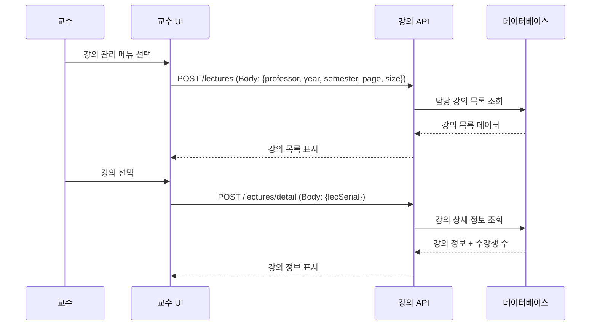
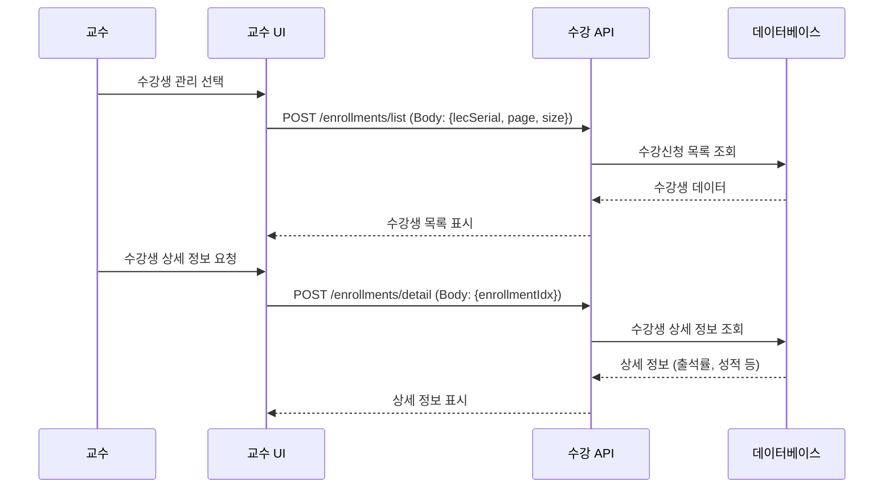
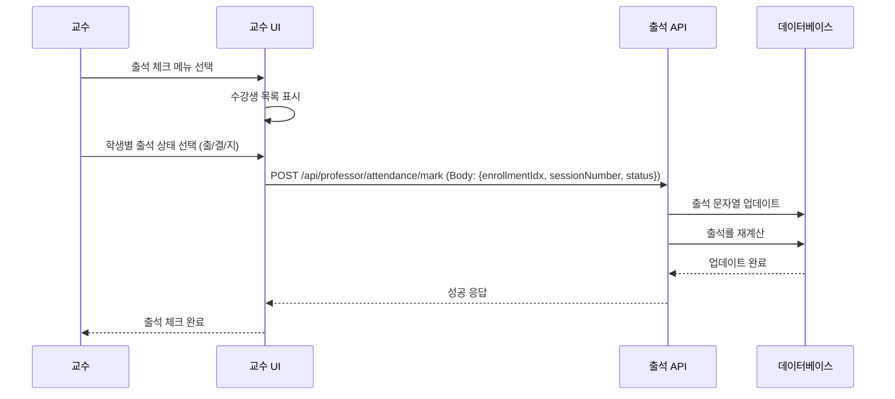
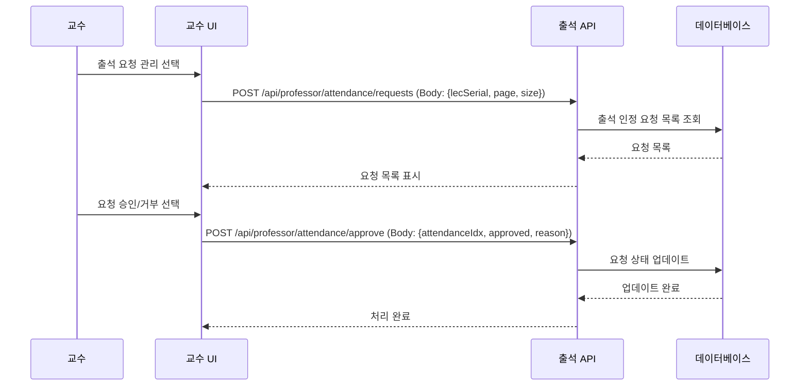
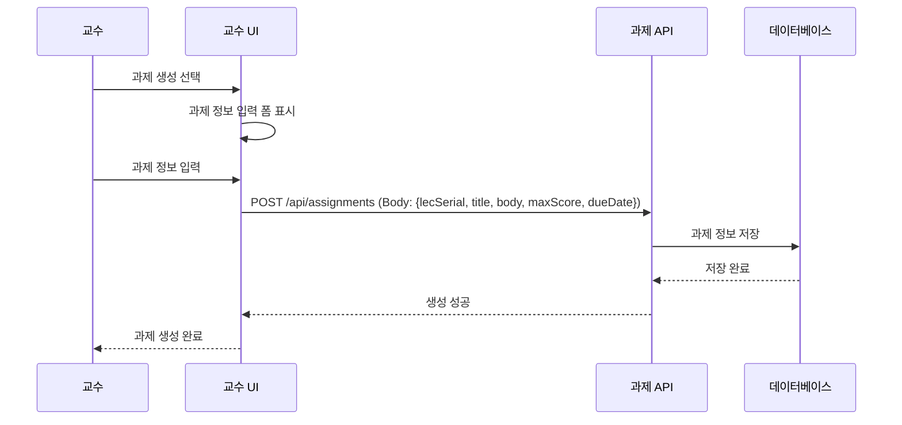
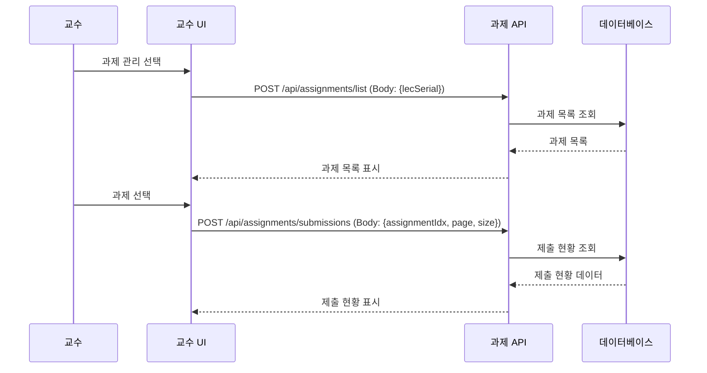
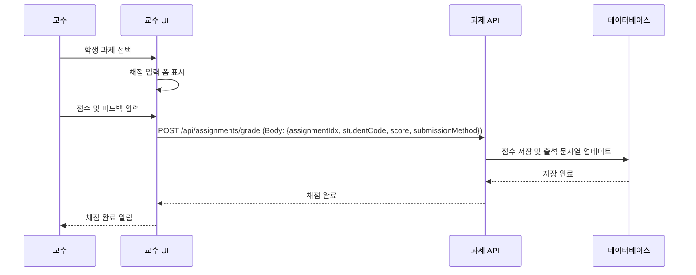
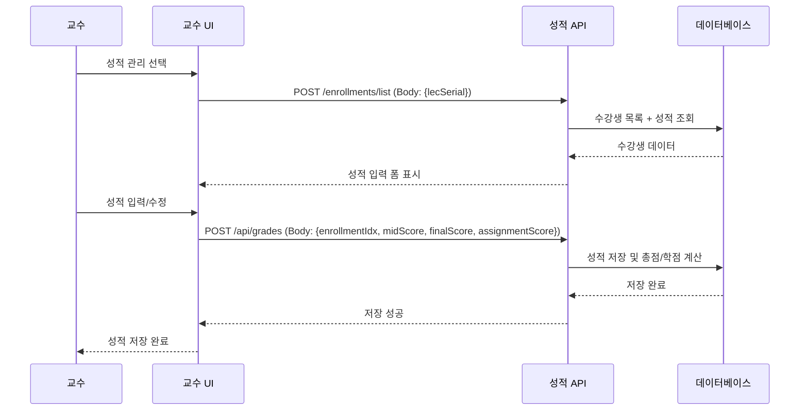
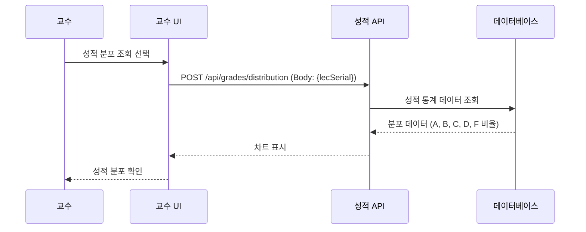

# 05. 교수 플로우

## 교수 기능 플로우

## 목차

1. [강의 사전 준비](#1-강의-사전-준비)
2. [수강생 관리](#2-수강생-관리)
3. [출석 관리](#3-출석-관리)
4. [과제 관리](#4-과제-관리)
5. [성적 관리](#5-성적-관리)

---

## 1. 강의 사전 준비

### 1.1 강의 목록 조회



**API 엔드포인트:**
- `POST /lectures` - 교수 담당 강의 목록
- `POST /lectures/detail` - 강의 상세 정보

**프론트엔드 예시:**

```javascript
// 강의 목록 조회
async function getProfessorLectures() {
    const response = await fetch('/lectures', {
        method: 'POST',
        headers: {
            'Content-Type': 'application/json',
            'Authorization': `Bearer ${token}`
        },
        body: JSON.stringify({
            professor: "22", // USER_IDX
            year: 2025,
            semester: 1,
            page: 0,
            size: 20
        })
    });
    const result = await response.json();
    
    if (result.success) {
        displayLectureList(result.data);
    }
}
```

---

## 2. 수강생 관리

### 2.1 수강생 목록 조회



**API 엔드포인트:**
- `POST /enrollments/list` - 수강생 목록
- `POST /enrollments/detail` - 수강생 상세 정보

**프론트엔드 예시:**

```javascript
// 수강생 목록 조회
async function getStudentList(lecSerial) {
    const response = await fetch('/enrollments/list', {
        method: 'POST',
        headers: {
            'Content-Type': 'application/json',
            'Authorization': `Bearer ${token}`
        },
        body: JSON.stringify({
            lecSerial: lecSerial,
            page: 0,
            size: 20
        })
    });
    const result = await response.json();
    
    if (result.success) {
        displayStudents(result.data.content);
    }
}
```

---

## 3. 출석 관리

### 3.1 출석 체크



### 3.2 출석 인정 요청 관리



**출석 상태 코드:**
- `출` - 출석
- `결` - 결석
- `지` - 지각

**API 엔드포인트:**
- `POST /api/professor/attendance/mark` - 출석 체크
- `POST /api/professor/attendance/requests` - 출석 인정 요청 목록
- `POST /api/professor/attendance/approve` - 출석 요청 승인/거부

**프론트엔드 예시:**

```javascript
// 출석 체크
async function markAttendance(enrollmentIdx, sessionNumber, status) {
    const response = await fetch('/api/professor/attendance/mark', {
        method: 'POST',
        headers: {
            'Content-Type': 'application/json',
            'Authorization': `Bearer ${token}`
        },
        body: JSON.stringify({
            enrollmentIdx: enrollmentIdx,
            sessionNumber: sessionNumber,
            status: status // '출', '결', '지'
        })
    });
    const result = await response.json();
    
    if (result.success) {
        alert('출석 체크 완료');
    }
}

// 출석 요청 목록 조회
async function getAttendanceRequests(lecSerial) {
    const response = await fetch('/api/professor/attendance/requests', {
        method: 'POST',
        headers: {
            'Content-Type': 'application/json',
            'Authorization': `Bearer ${token}`
        },
        body: JSON.stringify({
            lecSerial: lecSerial,
            page: 0,
            size: 20
        })
    });
    const result = await response.json();
    
    if (result.success) {
        displayRequests(result.data.content);
    }
}
```

---

## 4. 과제 관리

### 4.1 과제 생성



### 4.2 과제 제출 현황 조회



### 4.3 과제 채점



**API 엔드포인트:**
- `POST /api/assignments` - 과제 생성
- `POST /api/assignments/list` - 과제 목록
- `POST /api/assignments/submissions` - 과제 제출 현황
- `POST /api/assignments/grade` - 과제 채점
- `POST /api/assignments/update` - 과제 수정
- `POST /api/assignments/{assignmentIdx}` (Body: {action: "delete"}) - 과제 삭제

**프론트엔드 예시:**

```javascript
// 과제 생성
async function createAssignment(lecSerial, title, body, maxScore, dueDate) {
    const response = await fetch('/api/assignments', {
        method: 'POST',
        headers: {
            'Content-Type': 'application/json',
            'Authorization': `Bearer ${token}`
        },
        body: JSON.stringify({
            lecSerial: lecSerial,
            title: title,
            body: body,
            maxScore: maxScore,
            dueDate: dueDate
        })
    });
    const result = await response.json();
    
    if (result.success) {
        alert('과제 생성 완료');
    }
}

// 과제 채점
async function gradeAssignment(assignmentIdx, studentCode, score, submissionMethod) {
    const response = await fetch('/api/assignments/grade', {
        method: 'POST',
        headers: {
            'Content-Type': 'application/json',
            'Authorization': `Bearer ${token}`
        },
        body: JSON.stringify({
            assignmentIdx: assignmentIdx,
            studentCode: studentCode,
            submissionMethod: submissionMethod,
            score: score,
            action: 'grade'
        })
    });
    const result = await response.json();
    
    if (result.success) {
        alert('채점 완료');
    }
}
```

---

## 5. 성적 관리

### 5.1 성적 입력 및 수정



### 5.2 성적 분포 확인



**API 엔드포인트:** (미구현)
- `POST /api/grades` - 성적 입력/수정
- `POST /api/grades/distribution` - 성적 분포 조회
- `POST /api/grades/export` - 성적 엑셀 다운로드

**프론트엔드 예시:**

```javascript
// 성적 입력 (미구현 - 형식만 제공)
async function submitGrades(enrollmentIdx, midScore, finalScore, assignmentScore) {
    const response = await fetch('/api/grades', {
        method: 'POST',
        headers: {
            'Content-Type': 'application/json',
            'Authorization': `Bearer ${token}`
        },
        body: JSON.stringify({
            enrollmentIdx: enrollmentIdx,
            midScore: midScore,
            finalScore: finalScore,
            assignmentScore: assignmentScore
        })
    });
    const result = await response.json();
    
    if (result.success) {
        alert('성적 저장 완료');
    }
}
```

---

## 교수 주요 업무

### 학기 시작
1. 강의 정보 확인
2. 강의 계획서 업로드 (미구현)
3. 수강생 명단 확인

### 학기 운영
1. 출석 관리 (출/결/지 체크)
2. 출석 인정 요청 처리
3. 과제 생성 및 채점
4. 수강생 질의응답

### 학기 종료
1. 기말 성적 입력 (미구현)
2. 성적 분포 확인 (미구현)
3. 강의 평가 결과 확인 (미구현)
