# 05. 교수 플로우

> **작성일**: 2025-10-10
> **버전**: 2.1 (명명 규칙 통일 버전)
> **변경사항**: 모든 필드명을 대문자 + 언더스코어 규칙으로 통일

---

## 👨‍🏫 교수 기능 플로우

교수의 강의 관리 시스템 사용 시나리오를 단계별로 정의합니다.

---

## 📋 목차

1. [강의 사전 준비 플로우](#1-강의-사전-준비-플로우)
2. [수강생 관리 플로우](#2-수강생-관리-플로우)
3. [출결 관리 플로우](#3-출결-관리-플로우)
4. [성적 관리 플로우](#4-성적-관리-플로우)
5. [강의 운영 플로우](#5-강의-운영-플로우)

---

## 1. 강의 사전 준비 플로우

### **1.1 강의 목록 조회 및 관리**

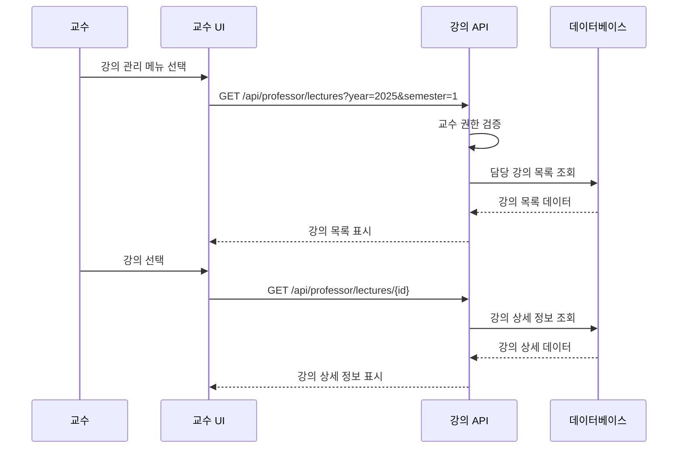

### **1.2 강의 정보 수정**

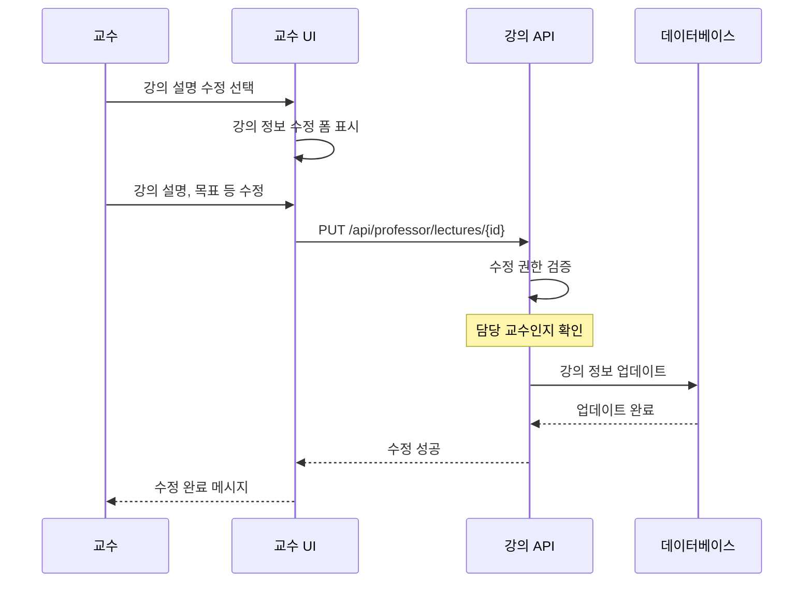

### **1.3 공지사항 사전 작성**

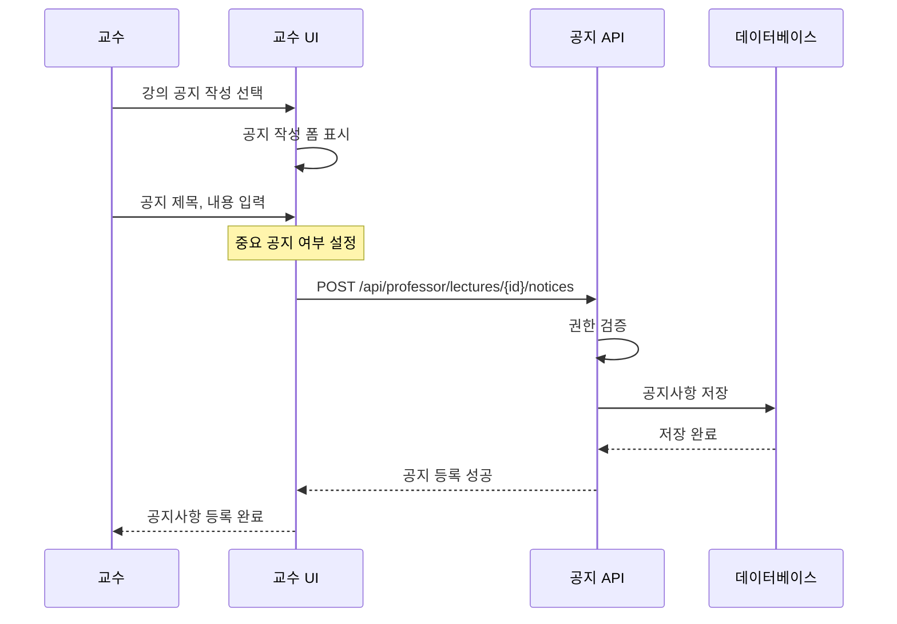

---

## 2. 수강생 관리 플로우

### **2.1 수강생 목록 조회**

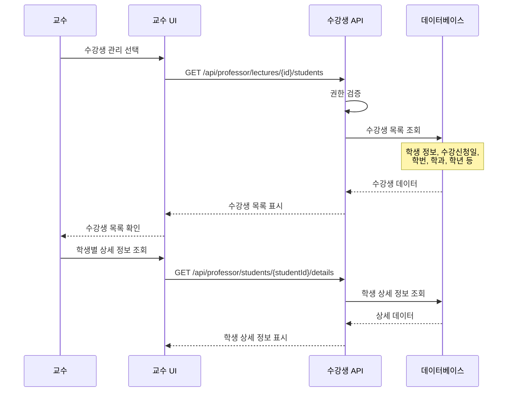

### **2.2 수강생별 상담 및 관리**

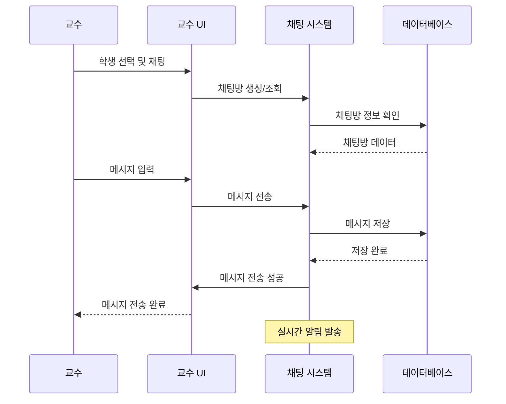

---

## 3. 출결 관리 플로우

### **3.1 출석 현황 조회**

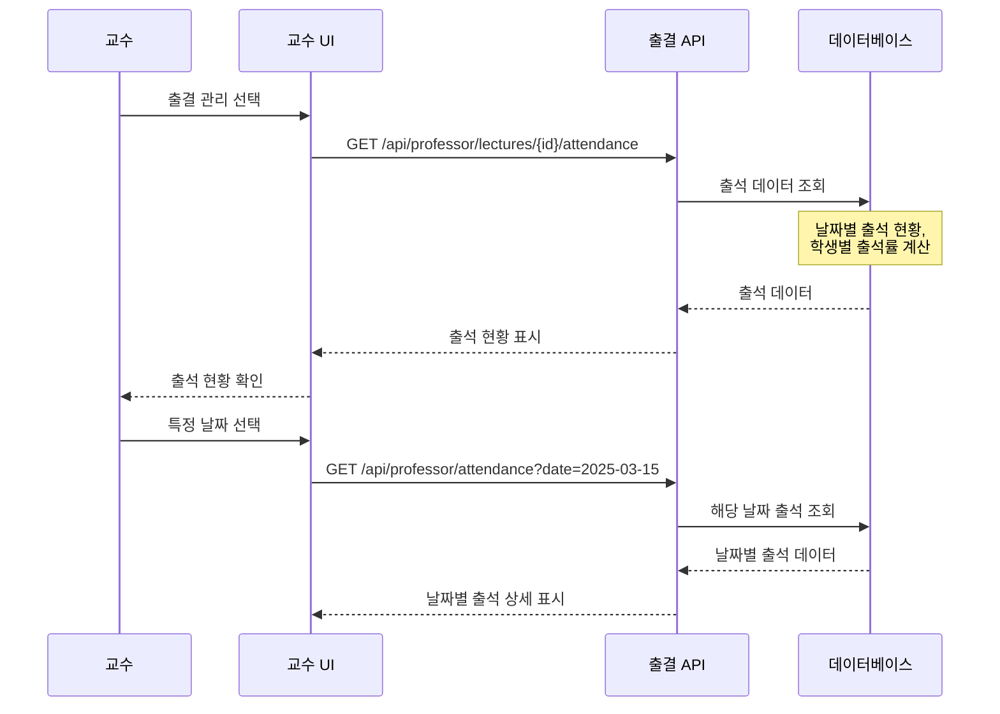

### **3.2 출석 승인 처리**

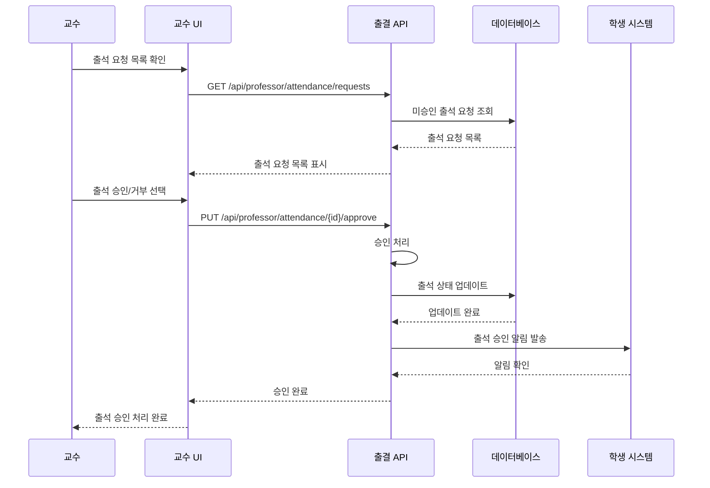

### **3.3 출석 통계 및 보고**

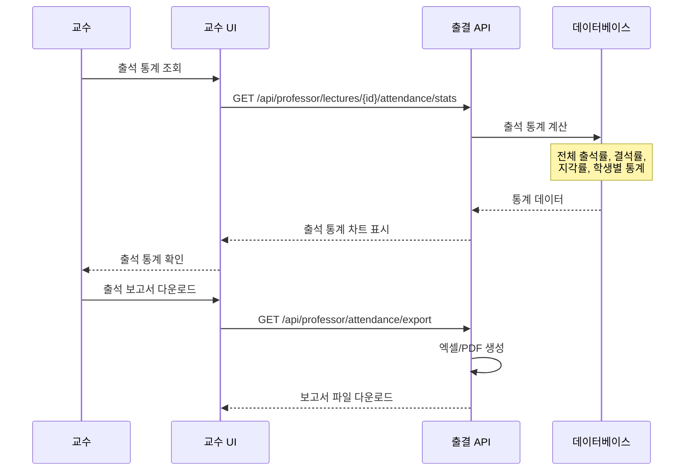

---

## 4. 성적 관리 플로우

### **4.1 성적 입력 및 수정**

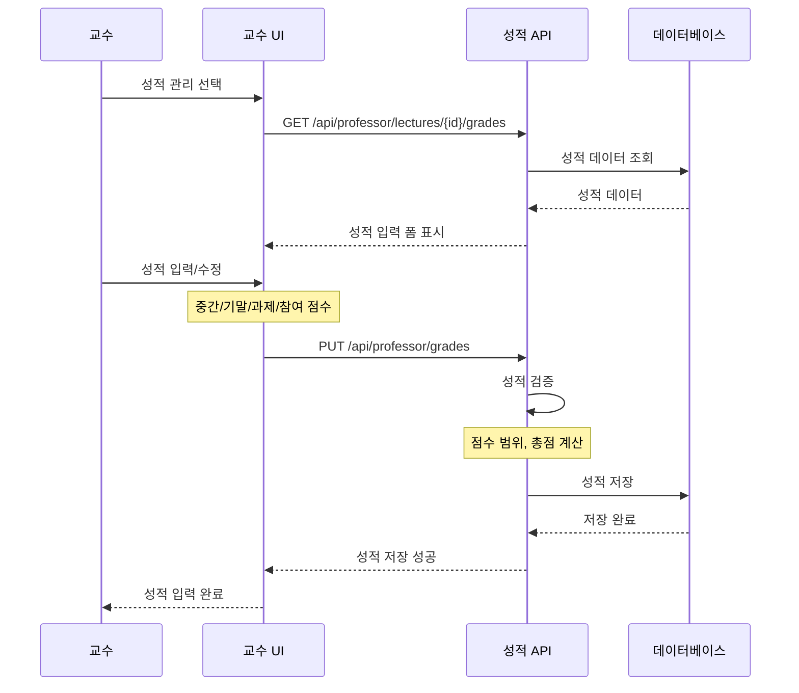

### **4.2 성적 확정 및 공개**

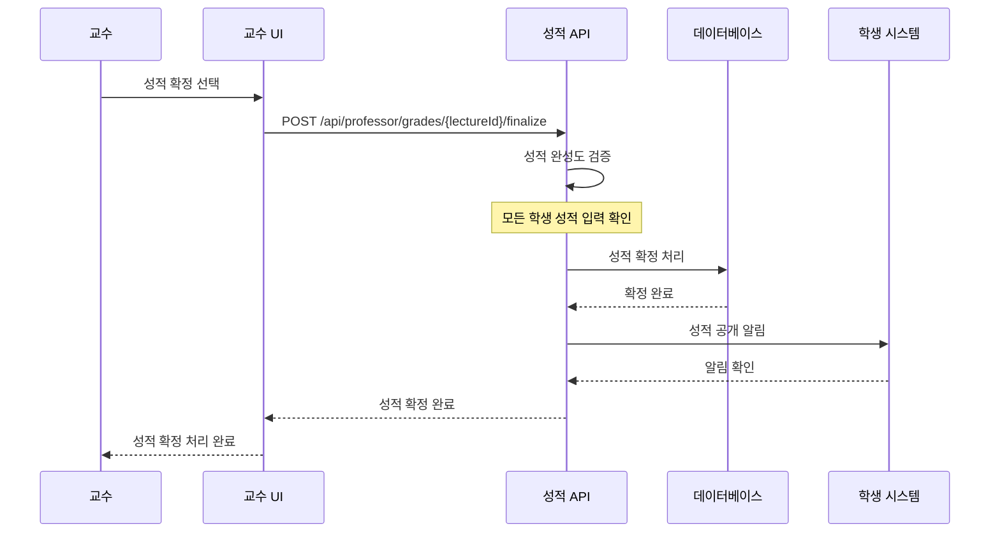

---

## 5. 강의 운영 플로우

### **5.1 과제 관리**

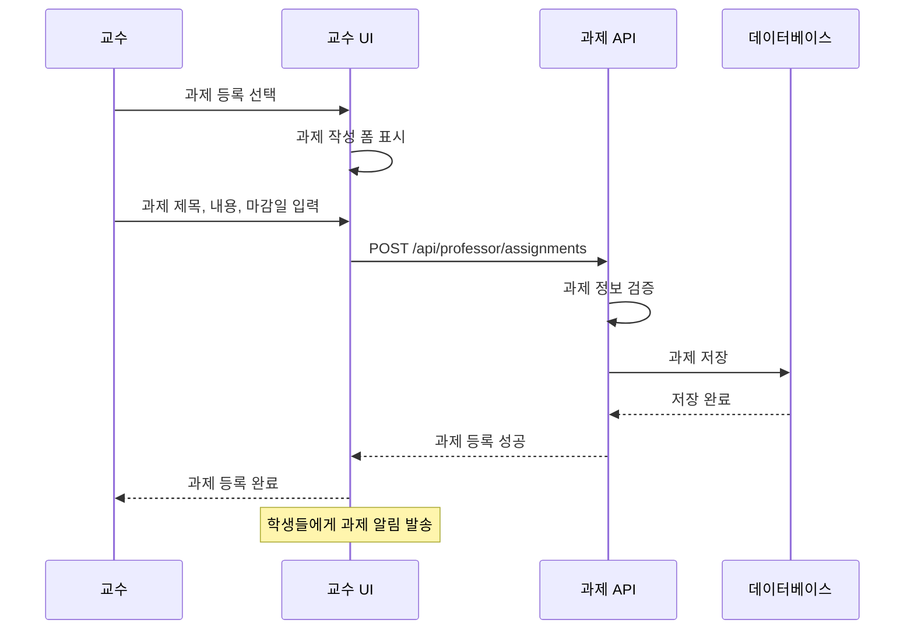

### **5.2 과제 채점**

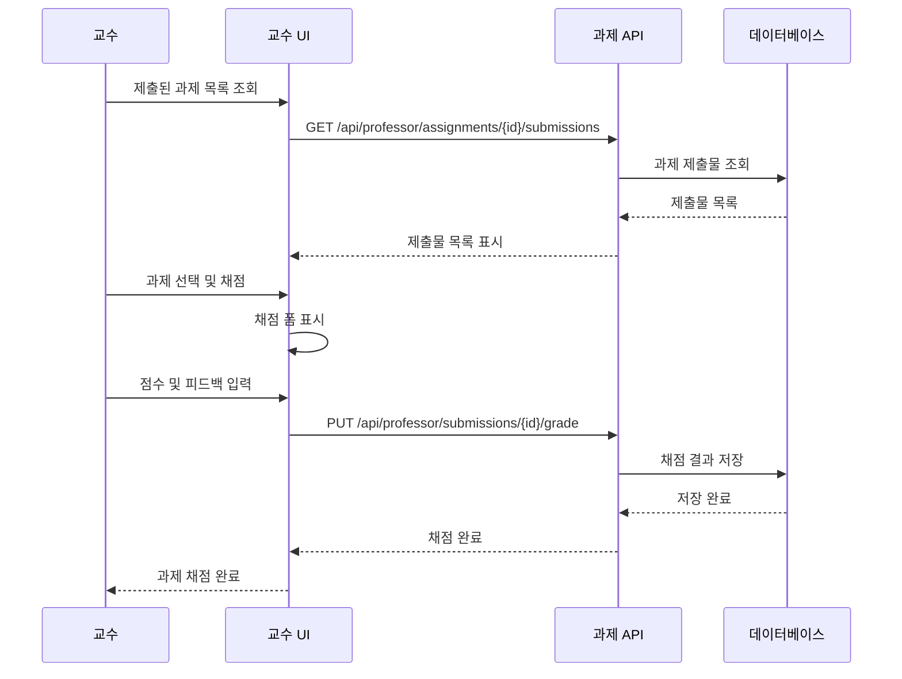

### **5.3 휴강 및 보강 관리**

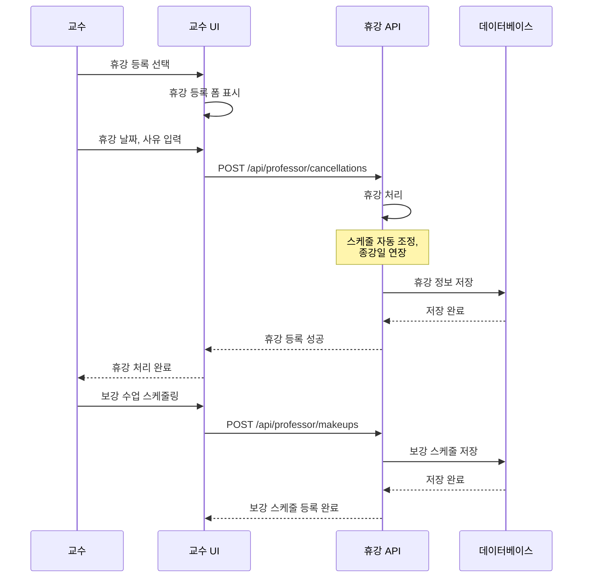

---

## 📋 교수 주요 업무 프로세스

### **학기 전 준비**
1. **강의 계획 검토**: 배정된 강의 확인 및 준비
2. **강의 정보 보완**: 설명, 목표, 평가방법 작성
3. **공지사항 작성**: 수강신청 전 주요 공지 등록

### **수강신청 기간**
1. **수강생 모니터링**: 등록 학생 현황 확인
2. **문의 대응**: 학생 질문에 채팅으로 응대
3. **강의 준비**: 세부 커리큘럼 및 자료 준비

### **학기 중 운영**
1. **출결 관리**: 매주 출석 승인 및 모니터링
2. **강의 진행**: 공지사항 등록, 자료 공유
3. **과제 관리**: 과제 출제 및 채점
4. **학생 상담**: 개별 학생과의 채팅 상담

### **학기 말 정리**
1. **성적 입력**: 모든 평가 요소 입력 및 확정
2. **피드백 수렴**: 학생들의 강의 평가 확인
3. **다음 학기 준비**: 개선사항 정리 및 계획

---

## 🎯 다음 단계

교수 플로우를 정의했으니 [학생 플로우](./06-학생플로우.md)에서 학생 관점의 사용 시나리오를 기술합니다.