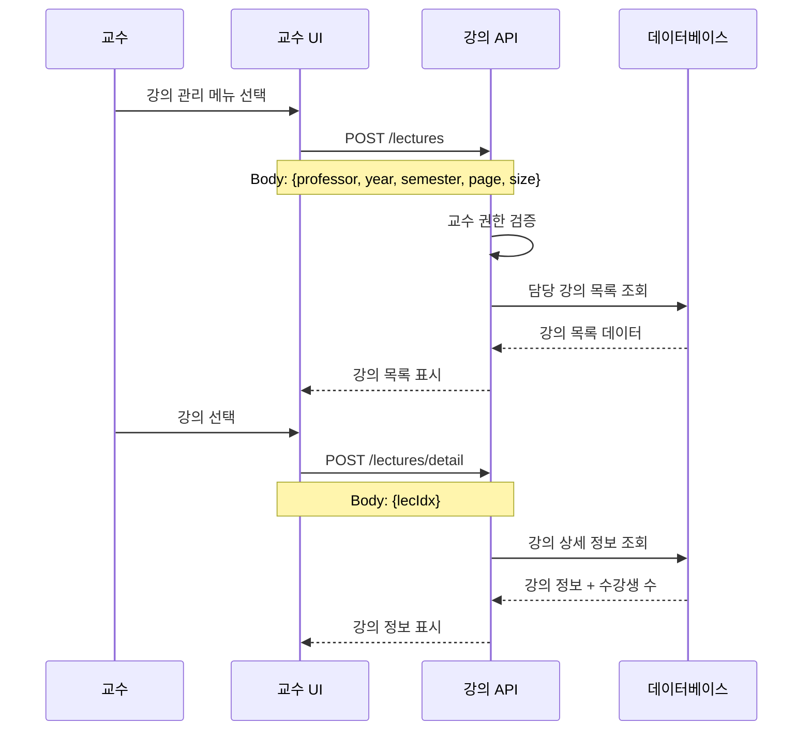
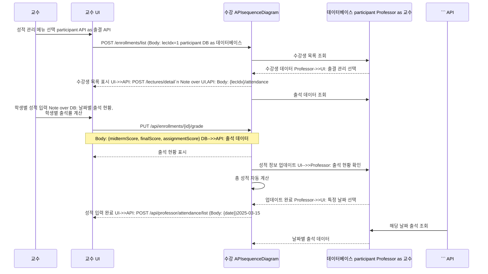
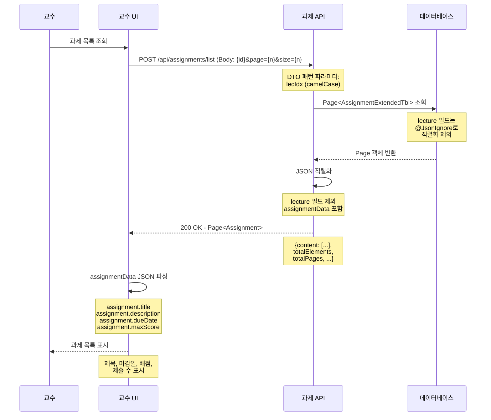
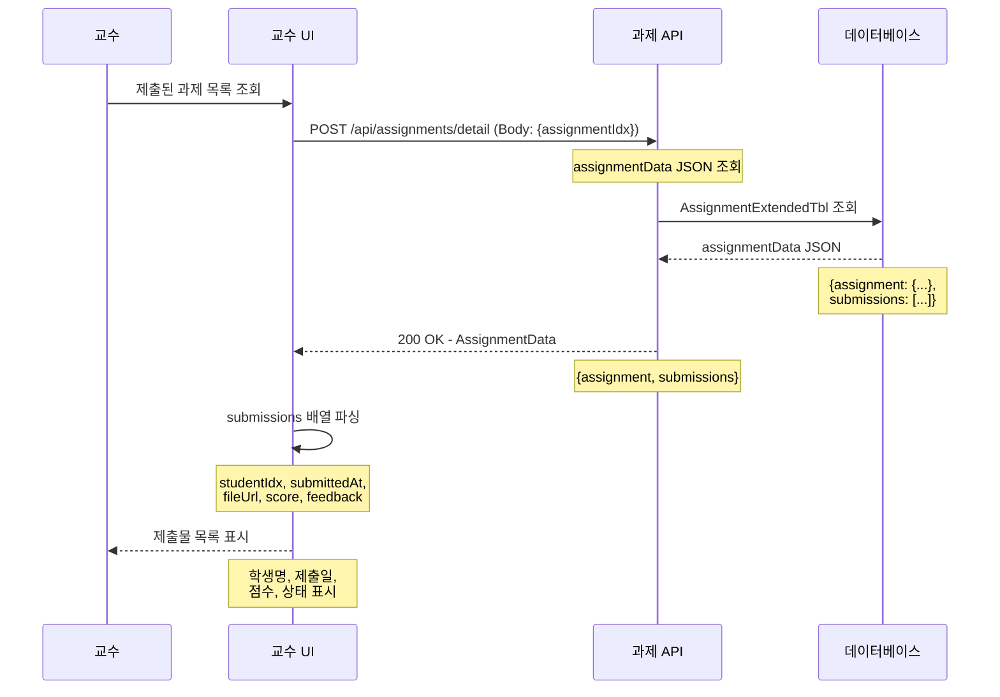
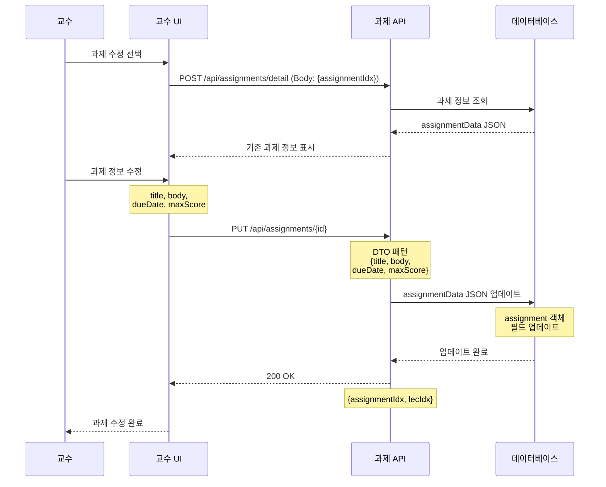

# 05. 교수 플로우

> **작성일**: 2025-10-10  
> **최종 수정**: 2025-10-16  
> **버전**: 4.0 (POST 방식 통일)  
> **변경사항**: 
> - **Phase 7.0**: 모든 조회 API를 POST 방식으로 통일 (Request Body 기반 통신)
> - **Phase 7.0**: 모든 조회 API를 POST 방식으로 통일 (Request Body 기반 통신)`n> - **Phase 6.9**: 출석 관리 시스템 구현 완료 (출/결/지 3가지 상태)
> - 출석 인정 요청/승인 시스템 추가
> - 교수용 출석 관리 API 추가
> - 기존 버그 수정 내역 유지

---

## 👨‍🏫 교수 기능 플로우

교수의 강의 관리 시스템 사용 시나리오를 단계별로 정의합니다.

---

## 📋 목차

1. [강의 사전 준비 플로우](#1-강의-사전-준비-플로우)
2. [수강생 관리 플로우](#2-수강생-관리-플로우)
3. [출석 관리 플로우 🆕](#3-출석-관리-플로우)
4. [과제 관리 플로우](#4-과제-관리-플로우)
5. [성적 관리 플로우](#5-성적-관리-플로우)

---

## 1. 강의 사전 준비 플로우

### **1.1 강의 목록 조회 및 관리**



```

### **API 엔드포인트**

- `POST /lectures` - 교수 담당 강의 목록 (Body: {professor, year, semester, page, size})
- `POST /lectures/detail` - 강의 상세 정보 (Body: {lecIdx})

### **프론트엔드 사용 예시**

```javascript
// 강의 목록 조회
async function getProfessorLectures() {
    const response = await fetch('/lectures', {
        method: 'POST',
        headers: {
            'Content-Type': 'application/json',
            'Authorization': `Bearer ${token}`
        },
        body: JSON.stringify({
            professor: professorCode,
            year: 2025,
            semester: 1,
            page: 0,
            size: 20
        })
    });
    const result = await response.json();
    
    if (result.success) {
        displayLectureList(result.data);
    }
}
```---

```

## 2. 수강생 관리 플로우

---

### **2.1 수강생 목록 조회**

## 2. 수강생 관리 플로우

```mermaid

### **2.1 수강생 목록 조회**sequenceDiagram

    participant Professor as 교수

```mermaid    participant UI as 교수 UI

sequenceDiagram    participant API as 수강 API

    participant Professor as 교수    participant DB as 데이터베이스

    participant UI as 교수 UI

    participant API as 수강 API    Professor->>UI: 수강생 관리 선택

    participant DB as 데이터베이스    UI->>API: POST /enrollments/list (Body: lecIdx=1&page=0&size=20

    API->>DB: 수강신청 목록 조회 (학생 정보 포함)

    Professor->>UI: 수강생 관리 선택    DB-->>API: 수강생 데이터

    UI->>API: POST /enrollments/list (Body: lecIdx=1&page=0&size=20    API-->>UI: 수강생 목록 표시

    API->>DB: 수강신청 목록 조회 (학생 정보 포함)    

    DB-->>API: 수강생 데이터    Professor->>UI: 수강생 상세 정보 요청

    API-->>UI: 수강생 목록 표시    UI->>API: POST /enrollments/detail (Body: {enrollmentIdx})

        API->>DB: 수강생 상세 정보 조회

    Professor->>UI: 수강생 상세 정보 요청    DB-->>API: 상세 정보 (출석률, 성적 등)

    UI->>API: POST /enrollments/detail (Body: {enrollmentIdx})    API-->>UI: 상세 정보 표시

    API->>DB: 수강생 상세 정보 조회```

    DB-->>API: 상세 정보 (출석률, 성적 등)

    API-->>UI: 상세 정보 표시#### **API 엔드포인트**

```- `POST /enrollments/list (Body: lecIdx={id}` - 수강생 목록

- `POST /enrollments/detail (Body: {enrollmentIdx})` - 수강생 상세 정보

### **API 엔드포인트**

#### **프론트엔드 사용 예시**

- `POST /enrollments/list (Body: lecIdx={id}` - 수강생 목록```javascript

- `POST /enrollments/detail (Body: {enrollmentIdx})` - 수강생 상세 정보// 수강생 목록 조회

async function getStudentList(lecIdx) {

### **프론트엔드 사용 예시**    const response = await fetch(`/api/enrollments?lecIdx=${lecIdx}&page=0&size=20`, {

        headers: { 'Authorization': `Bearer ${token}` }

```javascript    });

// 수강생 목록 조회    const result = await response.json();

async function getStudentList(lecIdx) {    

    const response = await fetch(`/api/enrollments?lecIdx=${lecIdx}&page=0&size=20`, {    if (result.success) {

        headers: { 'Authorization': `Bearer ${token}` }        displayStudents(result.data.content);

    });        updatePagination(result.data);

    const result = await response.json();    }

    }

    if (result.success) {```

        displayStudents(result.data.content);

        updatePagination(result.data);---

    }

}## 3. 출석 관리 플로우 🆕

```

### **3.1 출석 체크**

---

```mermaid

## 3. 출석 관리 플로우 🆕sequenceDiagram

    participant Professor as 교수

### **3.1 출석 체크**    participant UI as 교수 UI

    participant API as 출석 API

```mermaid    participant DB as 데이터베이스

sequenceDiagram

    participant Professor as 교수    Professor->>UI: 출석 체크 메뉴 선택

    participant UI as 교수 UI    UI->>UI: 수강생 목록 표시

    participant API as 출석 API    

    participant DB as 데이터베이스    Professor->>UI: 학생별 출석 상태 선택 (출/결/지)

    UI->>API: POST /api/professor/attendance/mark

    Professor->>UI: 출석 체크 메뉴 선택    Note over UI,API: Body: {enrollmentIdx, sessionNumber, status}

    UI->>UI: 수강생 목록 표시    

        API->>DB: 출석 문자열 업데이트 ("1출2출3결...")

    Professor->>UI: 학생별 출석 상태 선택 (출/결/지)    API->>DB: 출석률 재계산 ("75/80")

    UI->>API: POST /api/professor/attendance/mark    DB-->>API: 업데이트 완료

    Note over UI,API: Body: {enrollmentIdx, sessionNumber, status}    API-->>UI: 성공 응답

        UI-->>Professor: 출석 체크 완료 알림

    API->>DB: 출석 문자열 업데이트 ("1출2출3결...")```

    API->>DB: 출석률 재계산 ("75/80")

    DB-->>API: 업데이트 완료### **3.2 출석 인정 요청 관리**

    API-->>UI: 성공 응답

    UI-->>Professor: 출석 체크 완료 알림```mermaid

```sequenceDiagram

    participant Professor as 교수

### **3.2 출석 인정 요청 관리**    participant UI as 교수 UI

    participant API as 출석 API

```mermaid    participant DB as 데이터베이스

sequenceDiagram

    participant Professor as 교수    Professor->>UI: 출석 인정 요청 확인

    participant UI as 교수 UI    UI->>API: POST /api/professor/attendance/requests (Body: {lecIdx, status})?lecIdx=1&status=PENDING

    participant API as 출석 API    API->>DB: 대기 중인 요청 조회

    participant DB as 데이터베이스    DB-->>API: 요청 목록

    API-->>UI: 요청 목록 표시

    Professor->>UI: 출석 인정 요청 확인    

    UI->>API: POST /api/professor/attendance/requests (Body: {lecIdx, status})?lecIdx=1&status=PENDING    Professor->>UI: 요청 승인/반려 결정

    API->>DB: 대기 중인 요청 조회    

    DB-->>API: 요청 목록    alt 승인하는 경우

    API-->>UI: 요청 목록 표시        UI->>API: PUT /api/professor/attendance/requests/{id}/approve

            Note over UI,API: Body: {professorIdx}

    Professor->>UI: 요청 승인/반려 결정        API->>DB: 요청 승인 + 출석 문자열 "결"→"출" 변경

            DB-->>API: 승인 완료

    alt 승인하는 경우        API-->>UI: 승인 완료 응답

        UI->>API: PUT /api/professor/attendance/requests/{id}/approve    else 반려하는 경우

        Note over UI,API: Body: {professorIdx}        UI->>API: PUT /api/professor/attendance/requests/{id}/reject

        API->>DB: 요청 승인 + 출석 문자열 "결"→"출" 변경        Note over UI,API: Body: {professorIdx, rejectReason}

        DB-->>API: 승인 완료        API->>DB: 요청 반려 처리

        API-->>UI: 승인 완료 응답        DB-->>API: 반려 완료

    else 반려하는 경우        API-->>UI: 반려 완료 응답

        UI->>API: PUT /api/professor/attendance/requests/{id}/reject    end

        Note over UI,API: Body: {professorIdx, rejectReason}```

        API->>DB: 요청 반려 처리

        DB-->>API: 반려 완료#### **출석 관리 API 엔드포인트**

        API-->>UI: 반려 완료 응답

    end| **기능** | **메서드** | **엔드포인트** | **설명** |

```|---------|-----------|---------------|----------|

| 출석 체크 | `POST` | `/api/professor/attendance/mark` | 수업 중 출석 체크 |

### **출석 관리 API 엔드포인트**| 요청 목록 | `GET` | `/api/professor/attendance/requests` | 출석 인정 요청 목록 |

| 요청 승인 | `PUT` | `/api/professor/attendance/requests/{id}/approve` | 요청 승인 (결→출) |

| **기능** | **메서드** | **엔드포인트** | **설명** || 요청 반려 | `PUT` | `/api/professor/attendance/requests/{id}/reject` | 요청 반려 |

|---------|-----------|---------------|----------|| 대기 개수 | `GET` | `/api/professor/attendance/requests/count` | 대기 중인 요청 개수 |

| 출석 체크 | `POST` | `/api/professor/attendance/mark` | 수업 중 출석 체크 |

| 요청 목록 | `GET` | `/api/professor/attendance/requests` | 출석 인정 요청 목록 |#### **출석 상태 코드**

| 요청 승인 | `PUT` | `/api/professor/attendance/requests/{id}/approve` | 요청 승인 (결→출) |- `출` - 출석 (정상 출석)

| 요청 반려 | `PUT` | `/api/professor/attendance/requests/{id}/reject` | 요청 반려 |- `결` - 결석 (무단 결석)

| 대기 개수 | `GET` | `/api/professor/attendance/requests/count` | 대기 중인 요청 개수 |- `지` - 지각 (늦은 출석)


### **출석 상태 코드**#### **프론트엔드 사용 예시**


- `출` - 출석 (정상 출석)```javascript

- `결` - 결석 (무단 결석)// 출석 체크

- `지` - 지각 (늦은 출석)async function markAttendance(enrollmentIdx, sessionNumber, status) {

    const response = await fetch('/api/professor/attendance/mark', {

### **프론트엔드 사용 예시**        method: 'POST',

        headers: {

```javascript            'Content-Type': 'application/json',

// 출석 체크            'Authorization': `Bearer ${token}`

async function markAttendance(enrollmentIdx, sessionNumber, status) {        },

    const response = await fetch('/api/professor/attendance/mark', {        body: JSON.stringify({

        method: 'POST',            enrollmentIdx: enrollmentIdx,

        headers: {            sessionNumber: sessionNumber,

            'Content-Type': 'application/json',            status: status  // "출", "결", "지"

            'Authorization': `Bearer ${token}`        })

        },    });

        body: JSON.stringify({    

            enrollmentIdx: enrollmentIdx,    const result = await response.json();

            sessionNumber: sessionNumber,    if (result.success) {

            status: status  // "출", "결", "지"        alert('출석 체크 완료');

        })        refreshAttendanceList();

    });    }

    }

    const result = await response.json();

    if (result.success) {// 출석 인정 요청 목록 조회

        alert('출석 체크 완료');async function getAttendanceRequests(lecIdx) {

        refreshAttendanceList();    const response = await fetch(

    }        `/api/professor/attendance/requests?lecIdx=${lecIdx}&status=PENDING&page=0&size=20`, 

}        {

            headers: { 'Authorization': `Bearer ${token}` }

// 출석 인정 요청 목록 조회        }

async function getAttendanceRequests(lecIdx) {    );

    const response = await fetch(    

        `/api/professor/attendance/requests?lecIdx=${lecIdx}&status=PENDING&page=0&size=20`,     const result = await response.json();

        {    if (result.success) {

            headers: { 'Authorization': `Bearer ${token}` }        displayRequests(result.data.content);

        }        updateRequestCount(result.data.totalElements);

    );    }

    }

    const result = await response.json();

    if (result.success) {// 출석 인정 요청 승인

        displayRequests(result.data.content);async function approveAttendanceRequest(requestIdx, professorIdx) {

        updateRequestCount(result.data.totalElements);    const response = await fetch(`/api/professor/attendance/requests/${requestIdx}/approve`, {

    }        method: 'PUT',

}        headers: {

            'Content-Type': 'application/json',

// 출석 인정 요청 승인            'Authorization': `Bearer ${token}`

async function approveAttendanceRequest(requestIdx, professorIdx) {        },

    const response = await fetch(`/api/professor/attendance/requests/${requestIdx}/approve`, {        body: JSON.stringify({ professorIdx: professorIdx })

        method: 'PUT',    });

        headers: {    

            'Content-Type': 'application/json',    const result = await response.json();

            'Authorization': `Bearer ${token}`    if (result.success) {

        },        alert('출석 인정 승인 완료');

        body: JSON.stringify({ professorIdx: professorIdx })        refreshRequestList();

    });    }

    }

    const result = await response.json();

    if (result.success) {// 출석 인정 요청 반려

        alert('출석 인정 승인 완료');async function rejectAttendanceRequest(requestIdx, professorIdx, rejectReason) {

        refreshRequestList();    const response = await fetch(`/api/professor/attendance/requests/${requestIdx}/reject`, {

    }        method: 'PUT',

}        headers: {

            'Content-Type': 'application/json',

// 출석 인정 요청 반려            'Authorization': `Bearer ${token}`

async function rejectAttendanceRequest(requestIdx, professorIdx, rejectReason) {        },

    const response = await fetch(`/api/professor/attendance/requests/${requestIdx}/reject`, {        body: JSON.stringify({

        method: 'PUT',            professorIdx: professorIdx,

        headers: {            rejectReason: rejectReason

            'Content-Type': 'application/json',        })

            'Authorization': `Bearer ${token}`    });

        },    

        body: JSON.stringify({    const result = await response.json();

            professorIdx: professorIdx,    if (result.success) {

            rejectReason: rejectReason        alert('요청이 반려되었습니다');

        })        refreshRequestList();

    });    }

    }

    const result = await response.json();```

    if (result.success) {    API->>DB: 강의 상세 정보 조회

        alert('요청이 반려되었습니다');    DB-->>API: 강의 상세 데이터

        refreshRequestList();    API-->>UI: 강의 상세 정보 표시

    }```

}

```### **1.2 강의 정보 수정**


---```mermaid

sequenceDiagram

## 4. 과제 관리 플로우    participant Professor as 교수

    participant UI as 교수 UI

### **4.1 과제 생성 및 관리**    participant API as 강의 API

    participant DB as 데이터베이스

```mermaid

sequenceDiagram    Professor->>UI: 강의 설명 수정 선택

    participant Professor as 교수    UI->>UI: 강의 정보 수정 폼 표시

    participant UI as 교수 UI

    participant API as 과제 API    Professor->>UI: 강의 설명, 목표 등 수정

    participant DB as 데이터베이스    UI->>API: PUT /api/professor/lectures/{id}

    API->>API: 수정 권한 검증

    Professor->>UI: 과제 생성 메뉴 선택    Note over API: 담당 교수인지 확인

    UI->>UI: 과제 정보 입력 폼 표시

        API->>DB: 강의 정보 업데이트

    Professor->>UI: 과제 정보 입력 (제목, 내용, 마감일)    DB-->>API: 업데이트 완료

    UI->>API: POST /api/professor/assignments    API-->>UI: 수정 성공

    Note over UI,API: Body: {lecIdx, title, content, dueDate}    UI-->>Professor: 수정 완료 메시지

    ```

    API->>DB: 과제 정보 저장

    DB-->>API: 저장 완료### **1.3 공지사항 사전 작성**

    API-->>UI: 과제 생성 성공

    UI-->>Professor: 과제 생성 완료 알림```mermaid

```sequenceDiagram

    participant Professor as 교수

### **4.2 과제 제출 현황 조회**    participant UI as 교수 UI

    participant API as 공지 API

```mermaid    participant DB as 데이터베이스

sequenceDiagram

    participant Professor as 교수    Professor->>UI: 강의 공지 작성 선택

    participant UI as 교수 UI    UI->>UI: 공지 작성 폼 표시

    participant API as 과제 API

    participant DB as 데이터베이스    Professor->>UI: 공지 제목, 내용 입력

    Note over UI: 중요 공지 여부 설정

    Professor->>UI: 과제 목록 조회

    UI->>API: POST /api/assignments/list (Body: 1    UI->>API: POST /api/professor/lectures/{id}/notices

    API->>DB: 과제 목록 조회    API->>API: 권한 검증

    DB-->>API: 과제 목록 데이터    API->>DB: 공지사항 저장

    API-->>UI: 과제 목록 표시    DB-->>API: 저장 완료

    

    Professor->>UI: 특정 과제 제출 현황 요청    API-->>UI: 공지 등록 성공

    UI->>API: POST /api/assignments/submissions (Body: {assignmentIdx})    UI-->>Professor: 공지사항 등록 완료

    API->>DB: 제출 현황 조회```

    DB-->>API: 제출 현황 데이터

    API-->>UI: 제출 현황 표시 (제출/미제출)---

```

## 2. 수강생 관리 플로우

### **과제 관리 API 엔드포인트**

### **2.1 수강생 목록 조회**

| **기능** | **메서드** | **엔드포인트** | **설명** |

|---------|-----------|---------------|----------|```mermaid

| 과제 생성 | `POST` | `/api/professor/assignments` | 새 과제 생성 |sequenceDiagram

| 과제 목록 | `GET` | `/api/professor/assignments` | 교수 과제 목록 |    participant Professor as 교수

| 과제 수정 | `PUT` | `/api/professor/assignments/{id}` | 과제 정보 수정 |    participant UI as 교수 UI

| 과제 삭제 | `DELETE` | `/api/professor/assignments/{id}` | 과제 삭제 |    participant API as 수강생 API

| 제출 현황 | `GET` | `/api/professor/assignments/{id}/submissions` | 과제 제출 현황 |    participant DB as 데이터베이스


### **프론트엔드 사용 예시**    Professor->>UI: 수강생 관리 선택

    UI->>API: POST /lectures/detail`n    Note over UI,API: Body: {lecIdx}/students

```javascript    API->>API: 권한 검증

// 과제 생성    API->>DB: 수강생 목록 조회

async function createAssignment(lecIdx, assignmentData) {    Note over DB: 학생 정보, 수강신청일,<br/>학번, 학과, 학년 등

    const response = await fetch('/api/professor/assignments', {

        method: 'POST',    DB-->>API: 수강생 데이터

        headers: {    API-->>UI: 수강생 목록 표시

            'Content-Type': 'application/json',    UI-->>Professor: 수강생 목록 확인

            'Authorization': `Bearer ${token}`

        },    Professor->>UI: 학생별 상세 정보 조회

        body: JSON.stringify({    UI->>API: GET /api/professor/students/{studentId}/details

            lecIdx: lecIdx,    API->>DB: 학생 상세 정보 조회

            title: assignmentData.title,    DB-->>API: 상세 데이터

            content: assignmentData.content,    API-->>UI: 학생 상세 정보 표시

            dueDate: assignmentData.dueDate```

        })

    });### **2.2 수강생별 상담 및 관리**

    

    const result = await response.json();```mermaid

    if (result.success) {sequenceDiagram

        alert('과제가 생성되었습니다');    participant Professor as 교수

        refreshAssignmentList();    participant UI as 교수 UI

    }    participant Chat as 채팅 시스템

}    participant DB as 데이터베이스


// 과제 제출 현황 조회    Professor->>UI: 학생 선택 및 채팅

async function getSubmissionStatus(assignmentIdx) {    UI->>Chat: 채팅방 생성/조회

    const response = await fetch(`/api/professor/assignments/${assignmentIdx}/submissions`, {    Chat->>DB: 채팅방 정보 확인

        headers: { 'Authorization': `Bearer ${token}` }    DB-->>Chat: 채팅방 데이터

    });

        Professor->>UI: 메시지 입력

    const result = await response.json();    UI->>Chat: 메시지 전송

    if (result.success) {    Chat->>DB: 메시지 저장

        displaySubmissionStatus(result.data);    DB-->>Chat: 저장 완료

    }

}    Chat->>UI: 메시지 전송 성공

```    UI-->>Professor: 메시지 전송 완료


---    Note over Chat: 실시간 알림 발송

```

## 5. 성적 관리 플로우

---

### **5.1 성적 입력 및 관리**

## 3. 출결 관리 플로우



| **기능** | **메서드** | **엔드포인트** | **설명** |

|---------|-----------|---------------|----------|### **3.2 출석 승인 처리**

| 성적 입력 | `PUT` | `/api/enrollments/{id}/grade` | 학생 성적 입력 |

| 성적 조회 | `GET` | `/api/enrollments/{id}` | 학생 성적 조회 |```mermaid

| 성적 통계 | `GET` | `/api/professor/lectures/{id}/statistics` | 강의 성적 통계 |sequenceDiagram

    participant Professor as 교수

### **프론트엔드 사용 예시**    participant UI as 교수 UI

    participant API as 출결 API

```javascript    participant DB as 데이터베이스

// 성적 입력    participant Student as 학생 시스템

async function updateGrade(enrollmentIdx, gradeData) {

    const response = await fetch(`/api/enrollments/${enrollmentIdx}/grade`, {    Professor->>UI: 출석 요청 목록 확인

        method: 'PUT',    UI->>API: POST /api/professor/attendance/requests (Body: {lecIdx, status})

        headers: {    API->>DB: 미승인 출석 요청 조회

            'Content-Type': 'application/json',    DB-->>API: 출석 요청 목록

            'Authorization': `Bearer ${token}`    API-->>UI: 출석 요청 목록 표시

        },

        body: JSON.stringify({    Professor->>UI: 출석 승인/거부 선택

            midtermScore: gradeData.midterm,    UI->>API: PUT /api/professor/attendance/{id}/approve

            finalScore: gradeData.final,    API->>API: 승인 처리

            assignmentScore: gradeData.assignment    API->>DB: 출석 상태 업데이트

        })    DB-->>API: 업데이트 완료

    });

        API->>Student: 출석 승인 알림 발송

    const result = await response.json();    Student-->>API: 알림 확인

    if (result.success) {

        alert('성적이 입력되었습니다');    API-->>UI: 승인 완료

        refreshGradeList();    UI-->>Professor: 출석 승인 처리 완료

    }```

}

```### **3.3 출석 통계 및 보고**


---```mermaid

sequenceDiagram

## 📊 교수 대시보드 요약    participant Professor as 교수

    participant UI as 교수 UI

### **주요 지표**    participant API as 출결 API

    participant DB as 데이터베이스

- 담당 강의 수

- 총 수강생 수    Professor->>UI: 출석 통계 조회

- **출석 인정 대기 요청 수** 🆕    UI->>API: POST /lectures/detail`n    Note over UI,API: Body: {lecIdx}/attendance/stats

- 미채점 과제 수    API->>DB: 출석 통계 계산

- 평균 출석률    Note over DB: 전체 출석률, 결석률,<br/>지각률, 학생별 통계


### **바로가기 메뉴**    DB-->>API: 통계 데이터

    API-->>UI: 출석 통계 차트 표시

- 출석 체크 🆕    UI-->>Professor: 출석 통계 확인

- 출석 인정 요청 관리 🆕

- 과제 관리    Professor->>UI: 출석 보고서 다운로드

- 성적 입력    UI->>API: POST /api/professor/attendance/export (Body: {lecIdx})

- 수강생 관리    API->>API: 엑셀/PDF 생성

    API-->>UI: 보고서 파일 다운로드

---```


## 🔄 업데이트 히스토리---


### **Version 3.0 (2025-10-15) - Phase 6.9**## 4. 성적 관리 플로우


- ✅ **출석 관리 시스템 완료**### **4.1 성적 입력 및 수정**

  - 출석 체크 API (`POST /api/professor/attendance/mark`)

  - 출석 인정 요청/승인 시스템```mermaid

  - 출석 상태: 출/결/지 3가지로 간소화sequenceDiagram

  - 문자열 기반 출석 데이터 저장 ("1출2출3결...")    participant Professor as 교수

    participant UI as 교수 UI

### **Version 2.3 (2025-10-14) - Phase 6.8**    participant API as 성적 API

    participant DB as 데이터베이스

- ✅ 과제 관리 DTO 패턴 적용

- ✅ AssignmentExtendedTbl Lazy Loading 버그 수정    Professor->>UI: 성적 관리 선택

    UI->>API: POST /lectures/detail`n    Note over UI,API: Body: {lecIdx}/grades

### **Version 2.2 (2025-10-13)**    API->>DB: 성적 데이터 조회

    DB-->>API: 성적 데이터

- ✅ 교수 이름 조회 기능 추가    API-->>UI: 성적 입력 폼 표시

- ✅ 모든 필드명 대문자 + 언더스코어 규칙 통일
    Professor->>UI: 성적 입력/수정
    Note over UI: 중간/기말/과제/참여 점수

    UI->>API: PUT /api/professor/grades
    API->>API: 성적 검증
    Note over API: 점수 범위, 총점 계산

    API->>DB: 성적 저장
    DB-->>API: 저장 완료
    API-->>UI: 성적 저장 성공
    UI-->>Professor: 성적 입력 완료
```

### **4.2 성적 확정 및 공개**


---

## 5. 강의 운영 플로우

### **5.1 과제 생성 및 등록**

#### **Phase 6.8 DTO 패턴 적용**
- **필드명 규칙**: camelCase (lecIdx, title, body, maxScore, dueDate)
- **엔티티 구조**: AssignmentExtendedTbl (assignmentData JSON 저장)
- **API 규격**: RESTful, camelCase 응답


### **5.2 과제 목록 조회**

#### **버그 수정: Lazy Loading 직렬화 문제 해결**
- **문제**: `AssignmentExtendedTbl.lecture` 필드의 LAZY 로딩이 JSON 직렬화 시 `LazyInitializationException` 발생
- **해결**: `@JsonIgnore` 어노테이션 추가하여 JSON 응답에서 제외
- **효과**: 이중 JSON 응답 및 400 Bad Request 에러 해결



### **5.3 제출된 과제 목록 조회**



### **5.4 과제 채점**


---

### **📊 과제 데이터 저장 구조**

과제 제출 현황은 `ASSIGNMENT_EXTENDED_TBL.ASSIGNMENT_DATA` (LONGTEXT) 컬럼에 JSON 형식으로 저장됩니다.

#### **JSON 구조 예시**

```json
{
  "assignment": {
    "title": "중간고사 대체 레포트",
    "description": "5000자 이상의 레포트를 작성하시오",
    "dueDate": "2025-10-30T23:59:59",
    "maxScore": 100,
    "createdAt": "2025-10-01T09:00:00"
  },
  "submissions": [
    {
      "studentIdx": 101,
      "submitted": true,
      "submissionMethod": "서면 제출 (2025-10-15)",
      "submittedAt": "2025-10-15T14:30:00",
      "score": 95,
      "feedback": "훌륭합니다",
      "gradedAt": "2025-10-16T10:00:00"
    },
    {
      "studentIdx": 102,
      "submitted": true,
      "submissionMethod": "이메일 제출 (prof@example.com)",
      "submittedAt": "2025-10-16T09:00:00",
      "score": 88,
      "feedback": "양호함",
      "gradedAt": "2025-10-17T11:00:00"
    },
    {
      "studentIdx": 103,
      "submitted": false,
      "submissionMethod": null,
      "submittedAt": null,
      "score": 0,
      "feedback": "미제출",
      "gradedAt": "2025-10-31T10:00:00"
    }
  ]
}
```

#### **데이터 크기 산정**

| 학생 수 | 예상 크기 | LONGTEXT 용량 대비 |
|---------|-----------|-------------------|
| 20명 | 약 6KB | 0.0001% |
| 50명 | 약 15KB | 0.0004% |
| 100명 | 약 30KB | 0.0007% |
| 500명 | 약 150KB | 0.0035% |
| **LONGTEXT 최대** | **4GB** | **100%** |

💡 **결론**: 학생 500명까지도 전혀 문제 없으며, 대형 강의실(1000명+)에서도 충분히 수용 가능합니다.

#### **설계 철학**

1. **오프라인 제출 모델**
   - 실제 파일 저장 없음 (서면/이메일/드라이브 등으로 제출)
   - DB에는 제출 상태 + 채점 결과만 저장

2. **유연한 제출 방식 기록**
   - `submissionMethod` 필드에 교수가 직접 입력
   - 예시: "서면 제출 (2025-10-15)", "이메일 제출", "구글 드라이브 링크 제출"

3. **JSON 기반 확장성**
   - 스키마 변경 없이 필드 추가 가능
   - 단일 쿼리로 과제 + 모든 제출 현황 조회

4. **성적 관리 통합**
   - `score` 필드는 성적 계산 시 자동 반영
   - 수강생별 총점 = 중간고사 + 기말고사 + Σ(과제점수)

---

### **5.5 과제 수정**



### **5.6 과제 삭제**


### **5.7 휴강 및 보강 관리**


---

## 📋 교수 주요 업무 프로세스

### **학기 전 준비**
1. **강의 계획 검토**: 배정된 강의 확인 및 준비
2. **강의 정보 보완**: 설명, 목표, 평가방법 작성
3. **공지사항 작성**: 수강신청 전 주요 공지 등록

### **수강신청 기간**
1. **수강생 모니터링**: 등록 학생 현황 확인
2. **문의 대응**: 학생 질문에 채팅으로 응대
3. **강의 준비**: 세부 커리큘럼 및 자료 준비

### **학기 중 운영**
1. **출결 관리**: 매주 출석 승인 및 모니터링
2. **강의 진행**: 공지사항 등록, 자료 공유
3. **과제 관리**: 과제 출제 및 채점
4. **학생 상담**: 개별 학생과의 채팅 상담

### **학기 말 정리**
1. **성적 입력**: 모든 평가 요소 입력 및 확정
2. **피드백 수렴**: 학생들의 강의 평가 확인
3. **다음 학기 준비**: 개선사항 정리 및 계획

---

## 🎯 다음 단계

교수 플로우를 정의했으니 [학생 플로우](./06-학생플로우.md)에서 학생 관점의 사용 시나리오를 기술합니다.


