# 06. ����E ���로우

> **�E�성�E�**: 2025-10-10  
> **�E�좁E�E�적E*: 2025-10-14  
> **�E�E��E*: 2.3 (�E��E �E��E�E�E����E�E��E� �E�가)  
> **�E��E��E����**: 
> - �E��E� ���E���E�E�� �E��E��E�E+ �E��E�스�E�어 �E�칙으�E�E����E�
> - EnrollmentController DTO ������ �E�E�� �E��E
> - HTTP 400 �E�러 ����E� �E�E��E(PageImpl �E�E��)
> - �E��E �E��E�E�E����E�E��E� �E�가 (lecProf + lecProfName)

---

## 👨‍🎁E����E �E��E� ���로우

����E�E�E�E�의 �E��E� �E�스���E�E��E� �E�나�E��E��E� �E��E�E��E��E�E�의����E�다.

---

## 📋 �E��E�

1. [�E�강신�E� ���로우](#1-�E�강신�E�-���로우)
2. [���기 �E�E���동 ���로우](#2-���기-�E�E���동-���로우)
3. [�E�결 �E��E� ���로우](#3-�E�결-�E��E�-���로우)
4. [�E��E�E�E��E� ���로우](#4-�E��E�E�E��E�-���로우)
5. [�E�의 ���가 ���로우](#5-�E�의-���가-���로우)

---

## 1. �E�강신�E� ���로우

### **1.1 �E�각E�E��E� �E�의 �E����E*

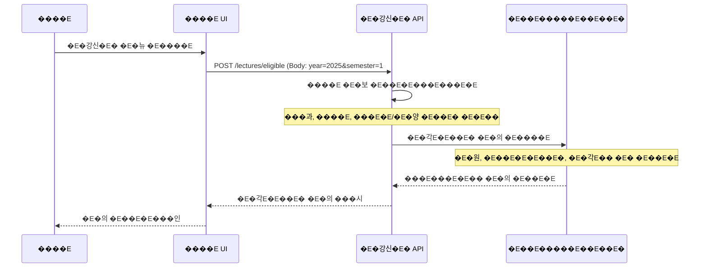

### **1.2 �E�강신�E� �E�리**

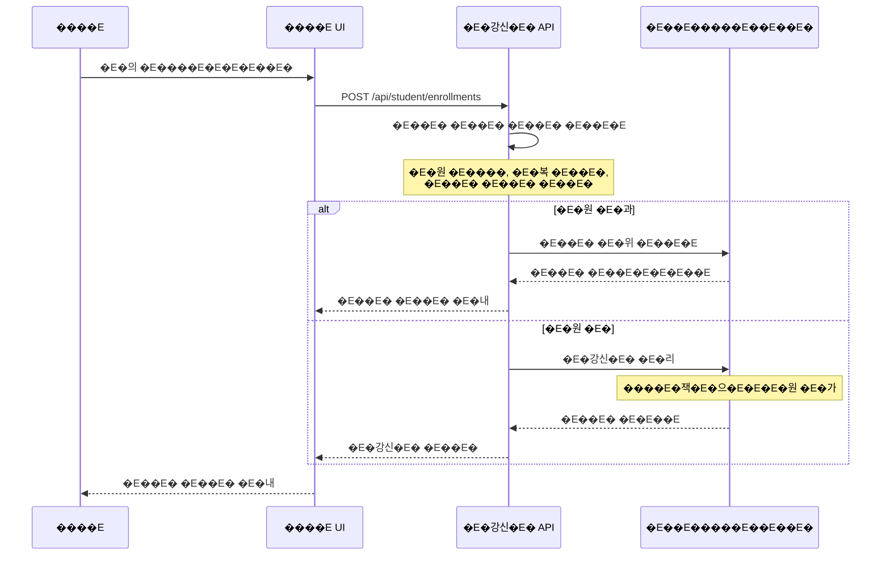

### **1.3 �E��E�E�E�의 �E��E�**

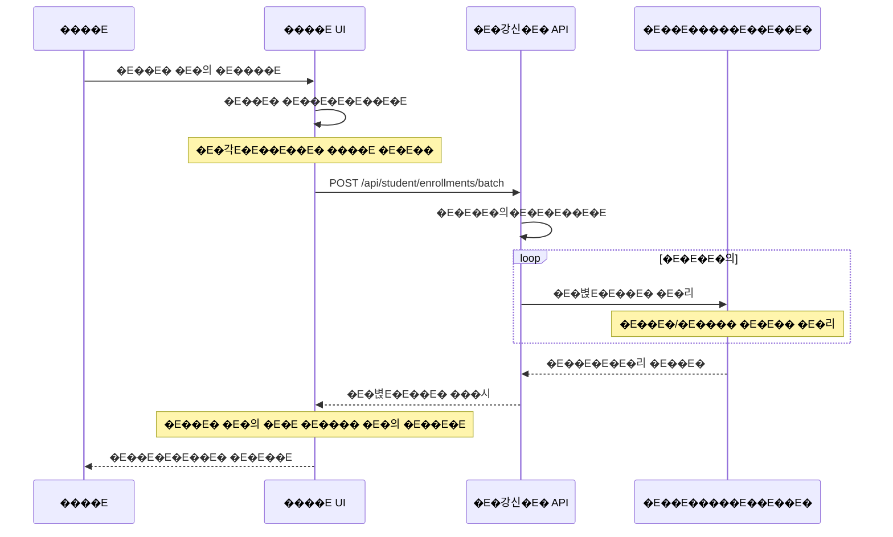

### **1.4 �E�강신�E� �E��E�E*

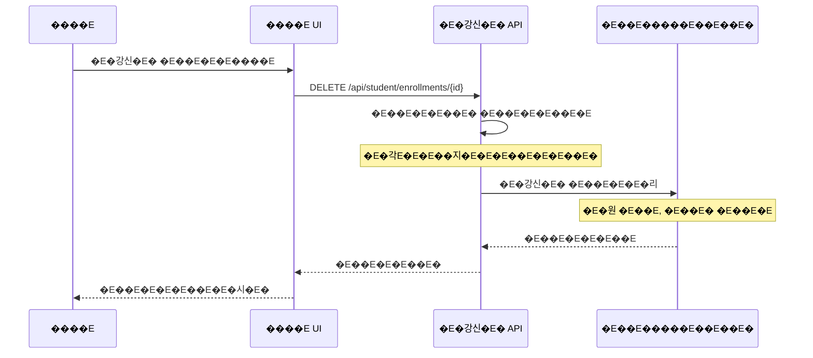

---

## 2. ���기 �E�E���동 ���로우

### **2.1 �E� �E�각E�E��E�E�E����E*

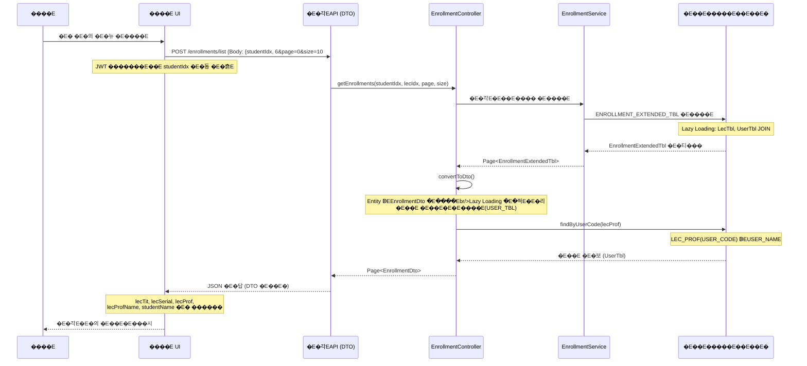

### **DTO �E�답 �E��E�**

```json
{
  "content": [
    {
      "enrollmentIdx": 1,
      "lecIdx": 101,
      "lecSerial": "CS101",
      "lecTit": "�E�밁E���E��그�E�밁E,
      "lecProf": "PROF001",
      "lecProfName": "�E��E��E",
      "lecPoint": 3,
      "lecTime": "�E��E 10:00-11:30",
      "studentIdx": 6,
      "studentCode": "2024001",
      "studentName": "���길�E�E,
      "enrollmentStatus": "ENROLLED",
      "enrollmentDate": "2024-09-01"
    }
  ],
  "totalElements": 5,
  "totalPages": 1,
  "size": 10,
  "number": 0
}
```

**�E��E�E���E�� �E��E�E*:
- `lecProf`: �E��E �E�드 (USER_CODE) - �E�E "PROF001", "11"
- `lecProfName`: �E��E �E��E�E(USER_NAME) - �E�E "�E��E��E", "�E��E��E�"
- `studentCode`: ���벁E(USER_CODE)
- `studentName`: ����E �E��E�E(USER_NAME)

### **2.2 �E�의 �E��E��E���� ���인**

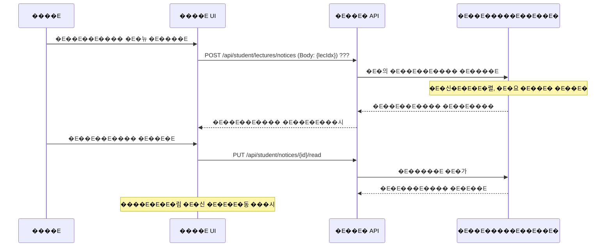

### **2.3 �E��E �E�E��**

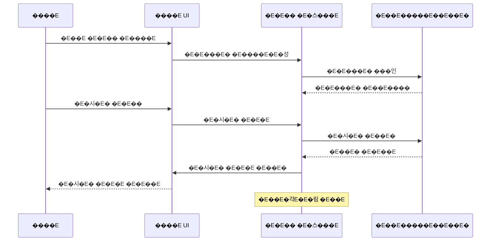

---

## 3. �E�결 �E��E� ���로우

### **3.1 �E��E �E�청**

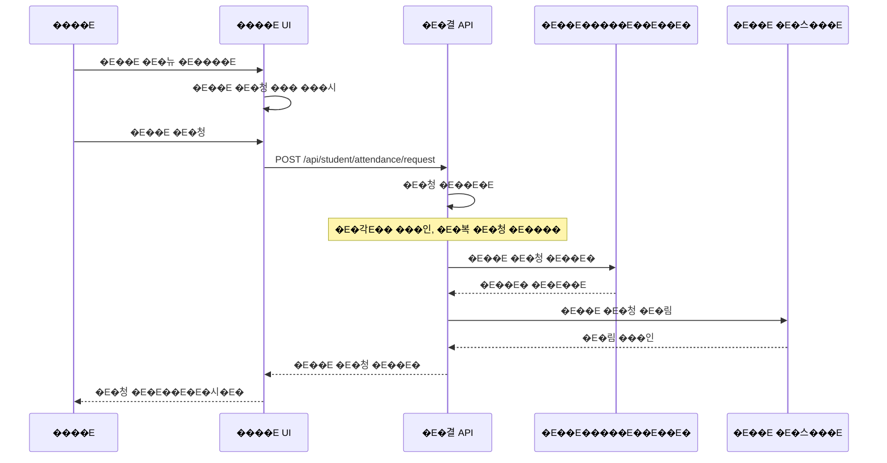

### **3.2 �E��E ���E�� �E����E*

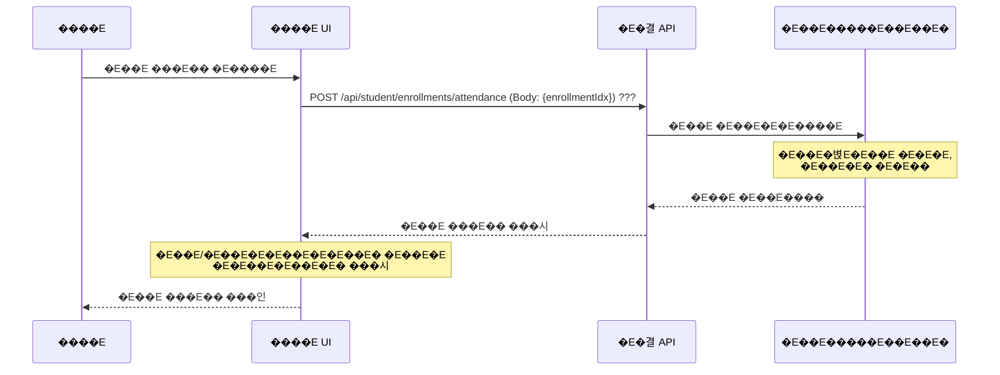

---

## 4. �E��E�E�E��E� ���로우

### **4.1 �E��E�E�E��E�E�E����E*

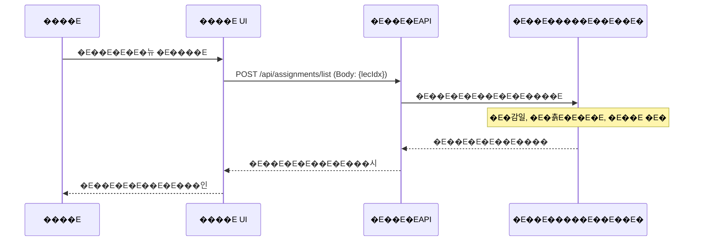

### **4.2 �E��E�E�E�춁E(�E����E���E� �E��E�E**

> ⚠�E�E**�E�요**: �E� �E�스���은 **�E��E�E���일�E�E�E��E����지 �E�습�E�다**. ����E�E� �E�면, �E��E�일, �E��E� �E�라�E��E�E�E� �E��E�E� �E��E�한 �E��E�으�E�E�E����E���E� �E�출하�E�, �E�스���에�E�는 **�E�춁E�E�E��E�E�E�E�E�E�E��E�E*����E�다.

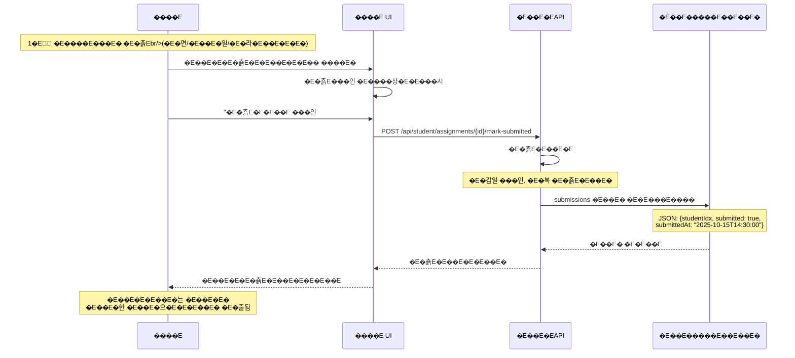

**�E�춁E�E�크���로우:**
1. ����E�E� **�E����E���E��E��E�E�E��E�E�E�춁E* (�E�면, �E��E�일, �E�라�E��E�E�E�E�� �E�)
2. �E�스���에�E�E**"�E�춁E�E�E��E �E�E��** ����E����여 �E�춁E�E�E�E�E�E�E��E�E
3. DB�E�E`submissions` �E��E��E�E`{submitted: true, submittedAt: "..."}`�E�E�E��E�
4. �E��E�E� �E�중에 **�E�춁E�E��E�을 �E�E��E�E�E��**���여 �E��E�E(�E�E "�E�면 �E�춁E(2025-10-15)")

### **4.3 �E��E�E�E��E� ���인**

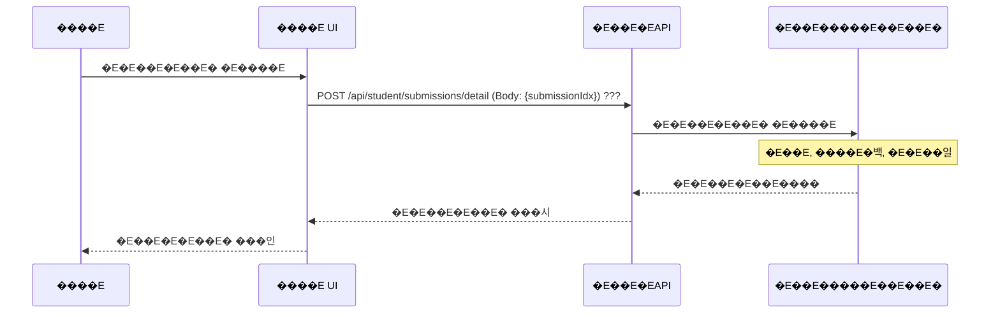

---

## 5. �E�의 ���가 ���로우

### **5.1 ���가 �E��E� �E�의 �E����E*

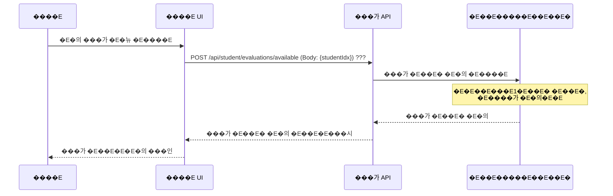

### **5.2 �E�의 ���가 �E�춁E*

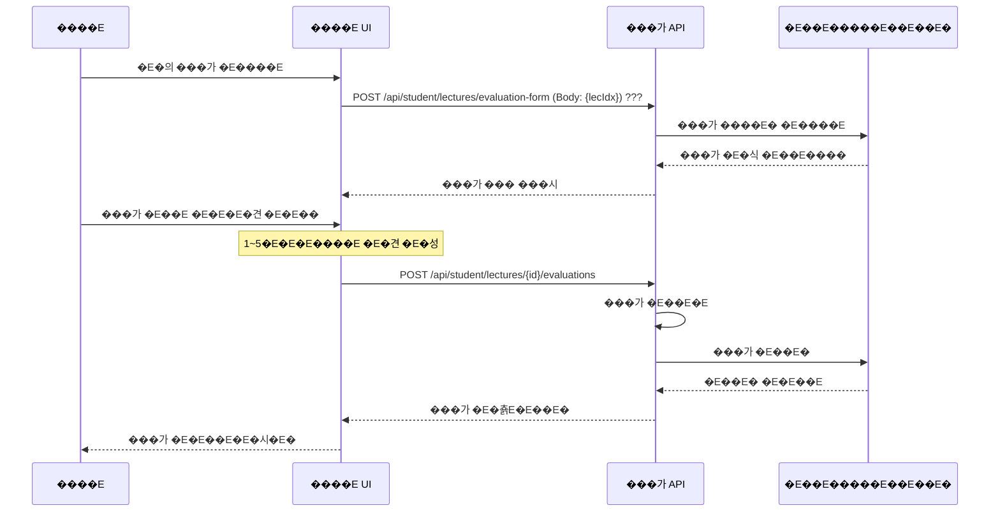

---

## 📋 ����E �E��E�E�E�E�� ���E��세�E�

### **�E�강신�E� �E��E�E*
1. **�E�의 ���색**: �E��E� �E�의 �E��E�E�E�E�E�E�� �E�보 ���인
2. **�E��E� �E�E��**: �E�각E�� �E��E����여 �E��E��E�위 �E��E�E
3. **�E��E� �E����E*: �E�볁E�E�는 �E��E�E�E��E� �E�리
4. **�E��E� ���인**: �E��E�/�E���� �E�E�E��E� �E�위 ���인

### **���기 �E�E���동**
1. **�E��E �E��E�**: 
   - �E� �E�의�E�각E�E��E �E�청
   - �E�의 �E�각E��: `�E�E�E�E�E�E�E�E` ���식 (�E�E �E�요�E� 1,2�E�시, �E�요�E� 3,4�E�시)
2. **�E��E� ���인**: �E��E �E��E��E���� �E�E�E�요 �E�림 ���인
3. **�E��E�E�E�행**: �E��E�E�E�춁E�E�E�E��E� ���인
4. **�E�E�� ���용**: ���E���E�E�E��E�E� �E�E�� �E�E��

### **���기 �E�E�E�리**
1. **�E�의 ���가**: �E�강한 �E��E� �E�의 ���가 �E�춁E
2. **�E��E�E���인**: �E�좁E�E��E�E�E�E���적E���인
3. **����E�백 ���용**: �E��E�E���기 �E�각E�E�E�� �E�립

---

## 🎯 �E��E�E�E��E�E

����E ���로우�E� �E�의���으�E�E[�E����E�E��E](./07-�E����E�E�E�Emd)�E��E �E�밁E�E��E�E��E�E����E�E�E���E�E�E�립����E�다.
