# 06. 학생 플로우

> **작성일**: 2025-10-10  
> **최종 수정**: 2025-10-16  
> **버전**: 4.0 (POST 방식 통일)  
> **변경사항**: 
> - 모든 필드명을 대문자 + 언더스코어 규칙으로 통일
> - EnrollmentController DTO 패턴 적용 반영
> - HTTP 400 에러 해결 완료 (PageImpl 적용)
> - 교수 이름 조회 기능 추가 (lecProf + lecProfName)
> - **모든 API 엔드포인트를 POST 방식으로 변경** 

---

##  학생 기능 플로우

학생의 강의 관리 시스템 사용 시나리오를 단계별로 정의합니다.

---

##  목차

1. [수강신청 플로우](#1-수강신청-플로우)
2. [학기 중 활동 플로우](#2-학기-중-활동-플로우)
3. [출결 관리 플로우](#3-출결-관리-플로우)
4. [과제 관리 플로우](#4-과제-관리-플로우)
5. [강의 평가 플로우](#5-강의-평가-플로우)

---

## 1. 수강신청 플로우

### **1.1 수강 가능 강의 조회**

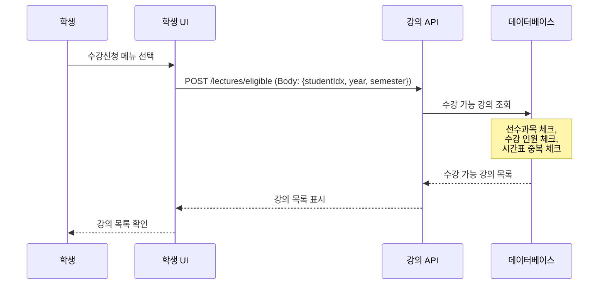

### **1.2 수강신청**

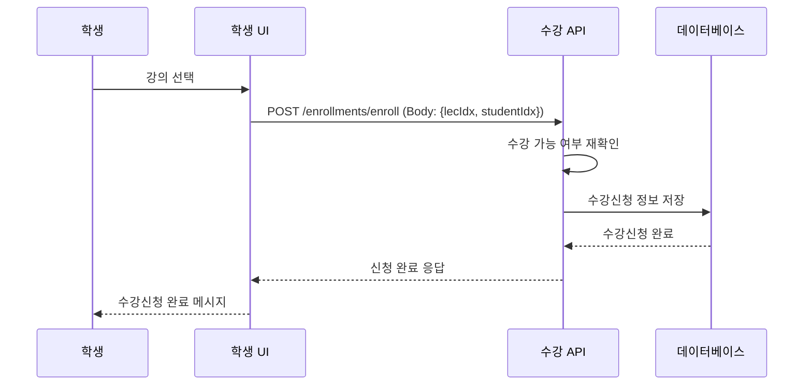

### **1.3 내 수강신청 목록 조회**

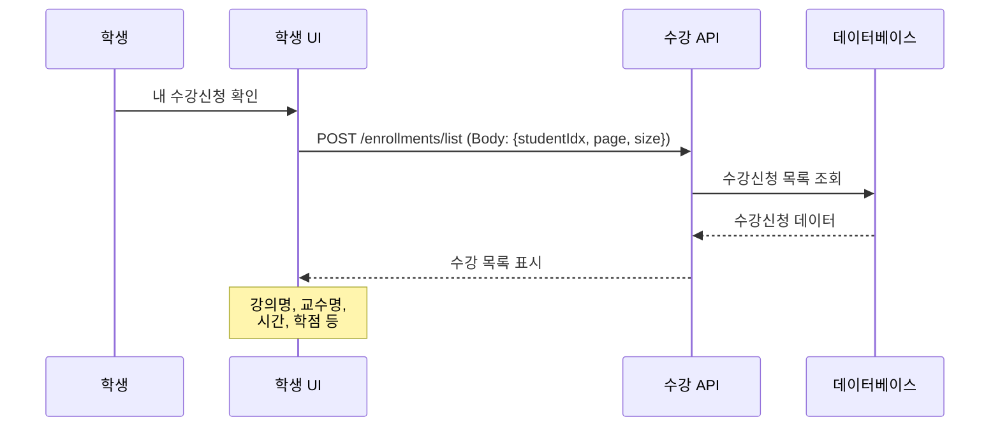

---

## 2. 학기 중 활동 플로우

### **2.1 강의 공지사항 확인**  미구현

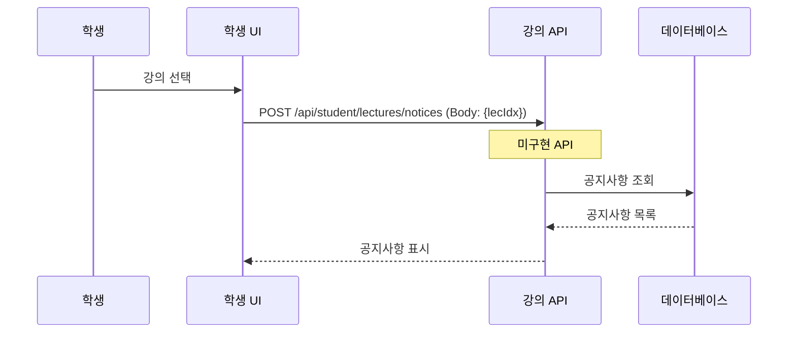

---

## 3. 출결 관리 플로우

### **3.1 내 출석 현황 조회**  미구현

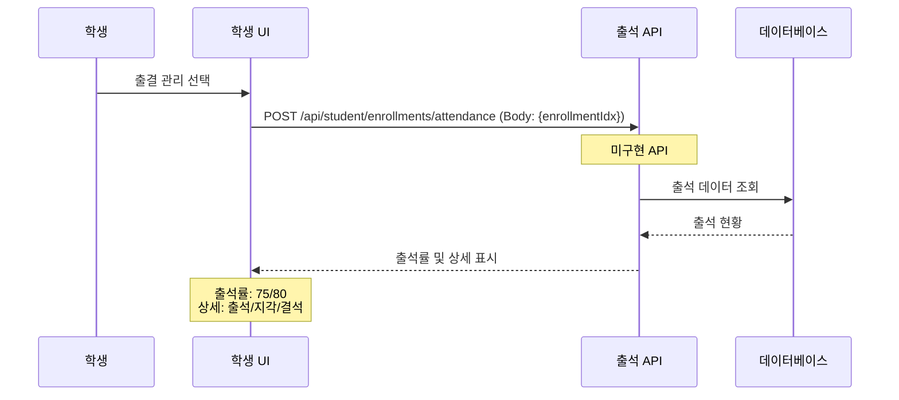

### **3.2 출석 인정 요청**

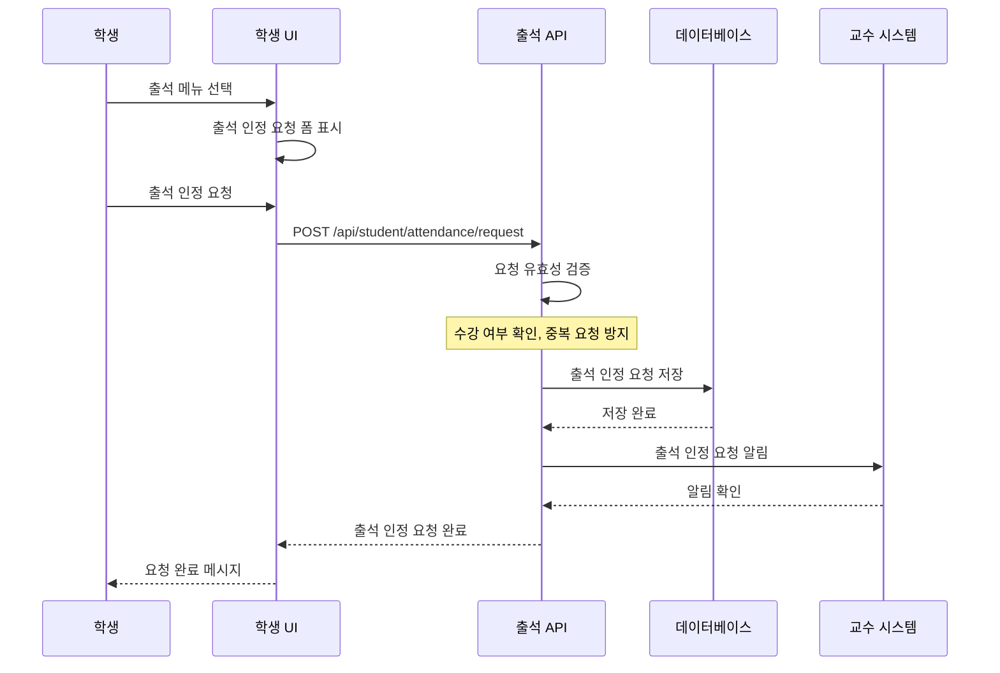

---

## 4. 과제 관리 플로우

### **4.1 과제 목록 조회**

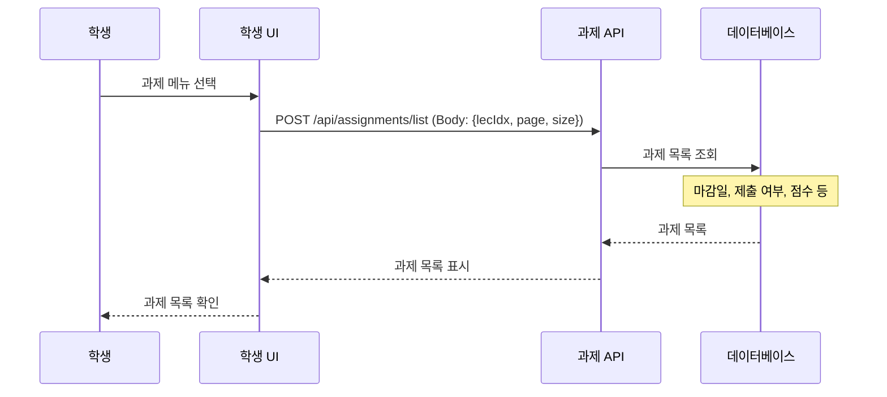

### **4.2 과제 제출 (오프라인 제출)**  미구현

>  **중요**: 이 시스템은 **과제 파일 업로드를 지원하지 않습니다**. 학생들은 대면, 이메일, 또는 다른 플랫폼을 통해 과제를 제출하며, 시스템에서는 **제출 완료 여부만 기록**합니다.

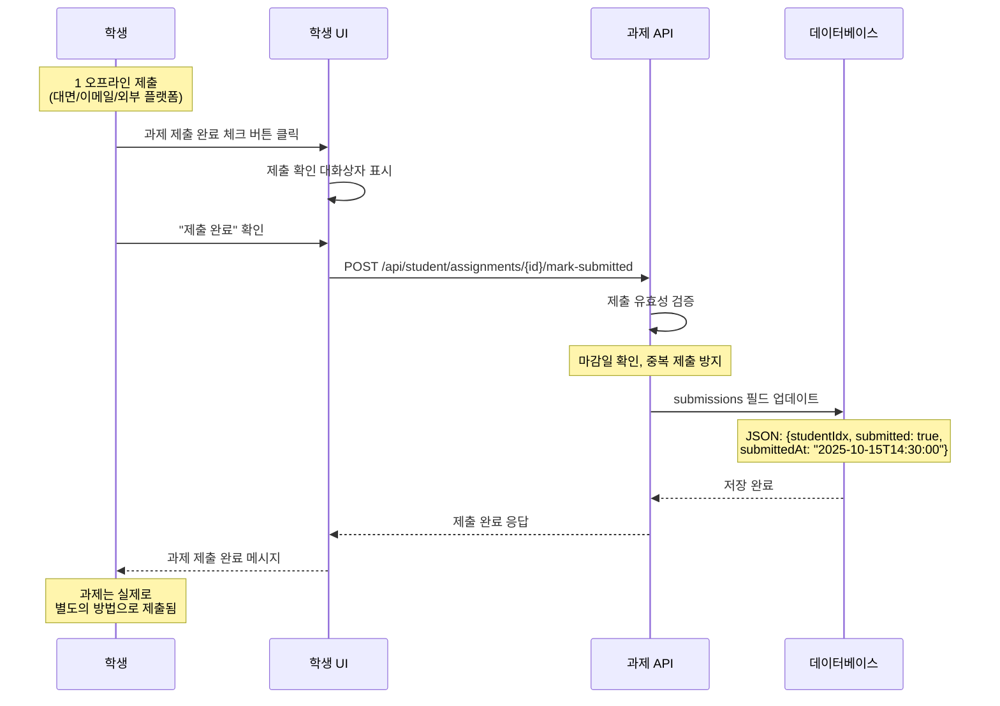

**제출 프로세스:**
1. 학생은 **오프라인으로 과제를 제출** (대면, 이메일, 외부 플랫폼 등)
2. 시스템에서 **"제출 완료" 버튼**을 클릭하여 제출 상태를 기록
3. DB의 `submissions` 필드에 `{submitted: true, submittedAt: "..."}` 저장
4. 교수는 나중에 **제출 목록을 확인**하여 채점 (예: "대면 제출(2025-10-15)")

### **4.3 과제 제출 내역 확인**  미구현

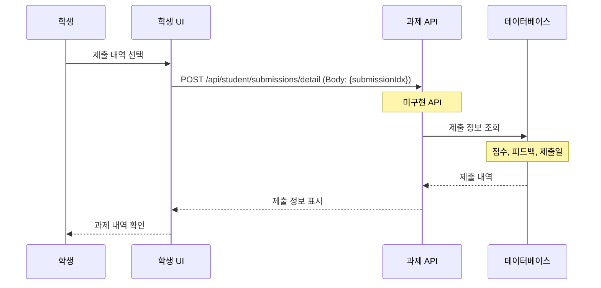

---

## 5. 강의 평가 플로우

### **5.1 평가 가능 강의 조회**  미구현

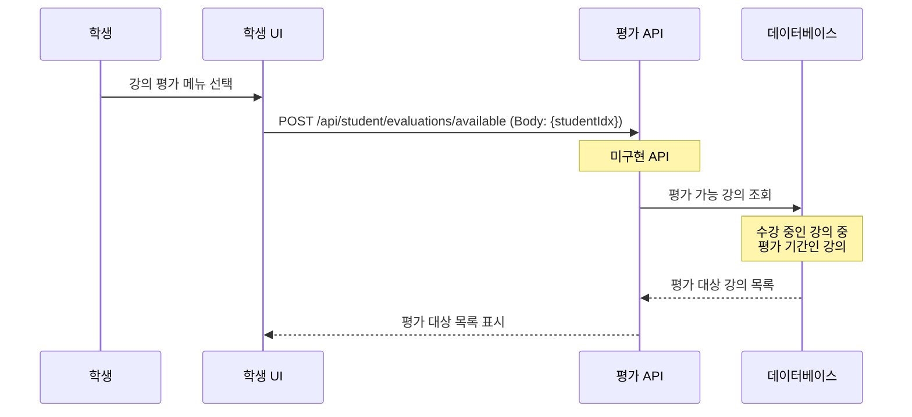

### **5.2 강의 평가 제출**  미구현

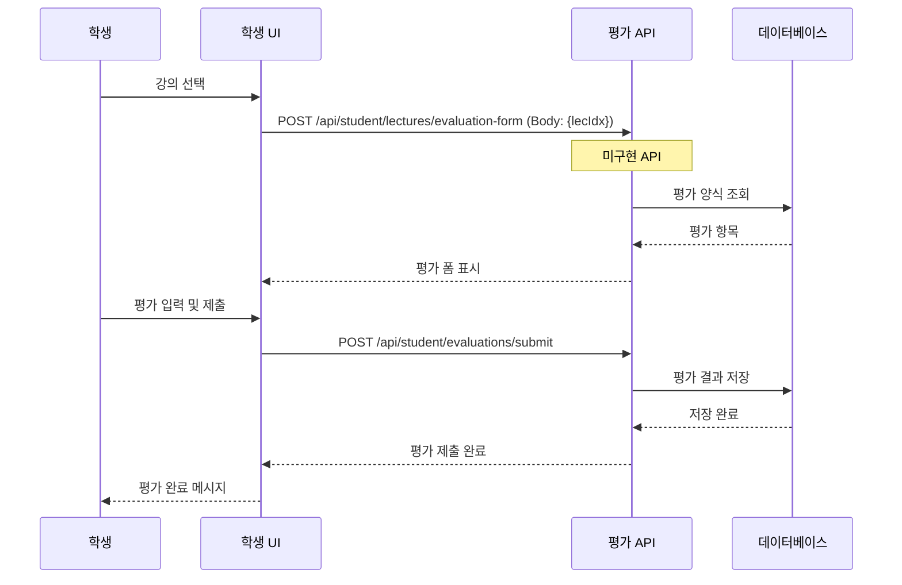

---

##  학생 주요 업무 프로세스

### **수강신청 기간**
1. **수강 가능 강의 조회**: 선수과목, 인원, 시간 체크
2. **수강신청 진행**: 희망 강의 선택 및 신청
3. **수강신청 확인**: 신청 내역 확인 및 수정

### **학기 중**
1. **강의 수강**: 공지사항 확인, 출석 체크
2. **과제 관리**: 과제 목록 확인, 제출
3. **출결 관리**: 출석 현황 확인, 인정 요청
4. **채팅 활용**: 교수 및 학생 간 채팅 참여

### **학기 말**
1. **과제 마무리**: 미제출 과제 확인
2. **성적 확인**: 중간/기말 성적 조회
3. **강의 평가**: 수강 강의 평가 제출

---

##  다음 단계

학생 플로우에 이어서 [구현 순서](./07-구현순서.md) 및 [프론트엔드 연동](./08-프론트엔드연동.md)을 참고하여 전체 시스템을 구축합니다.