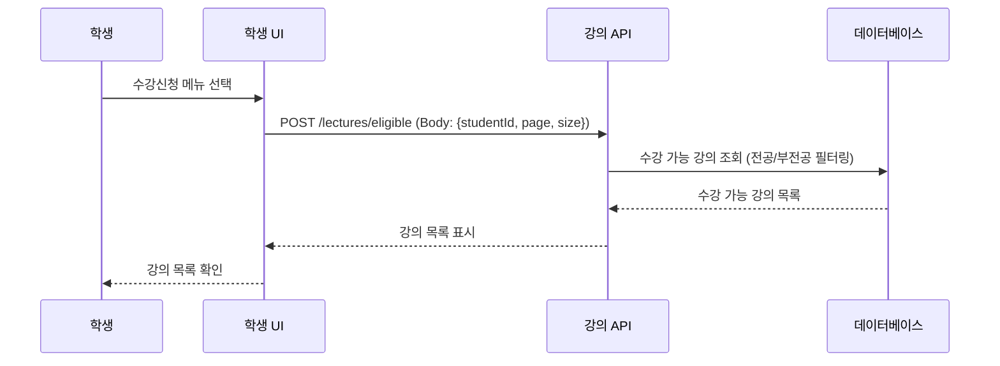
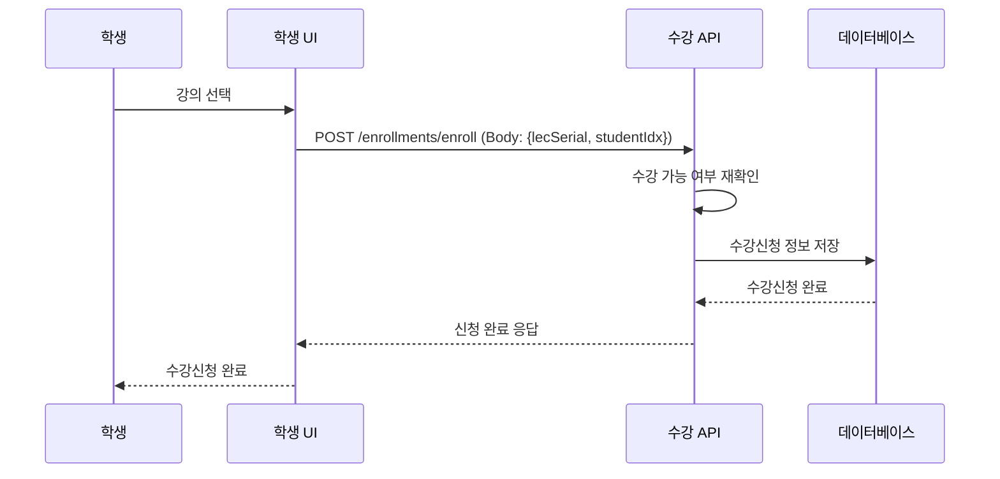
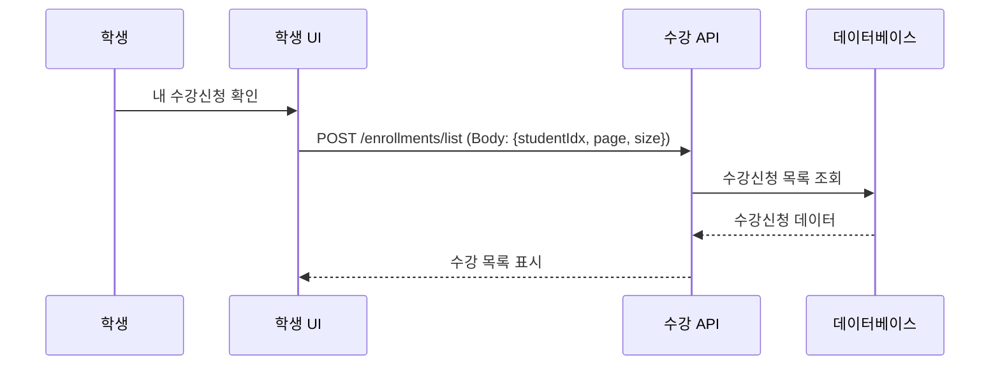
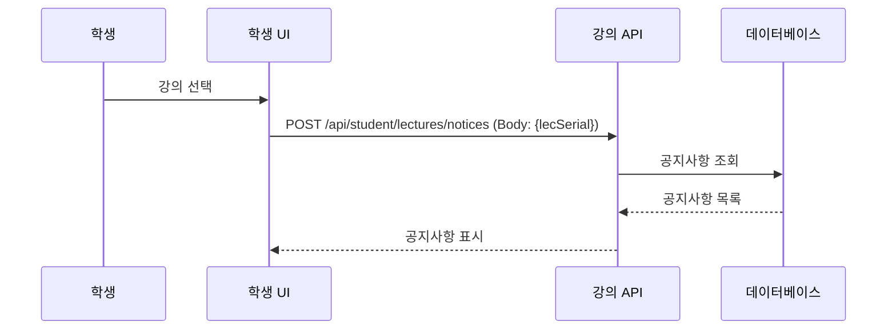
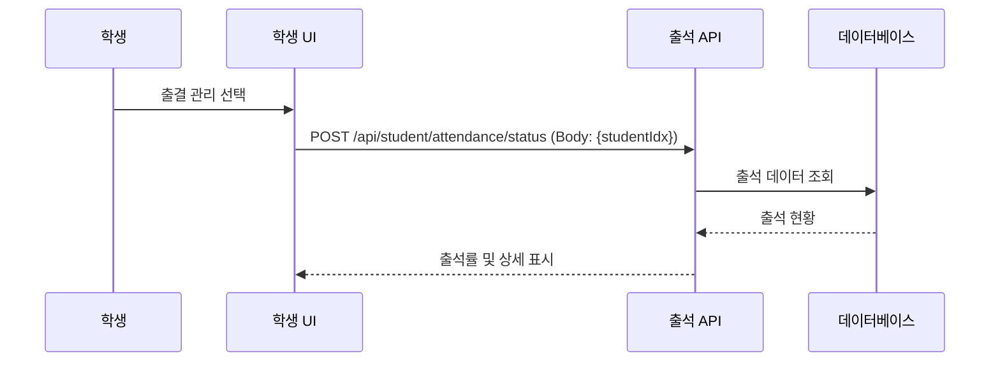
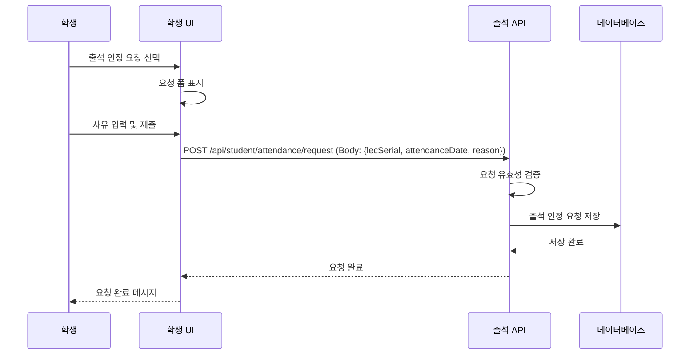
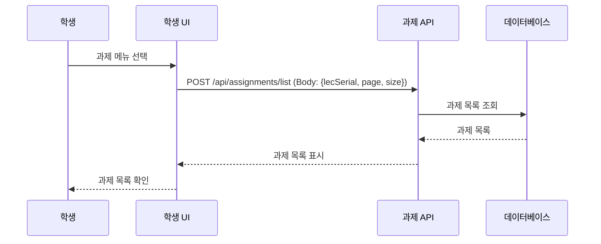
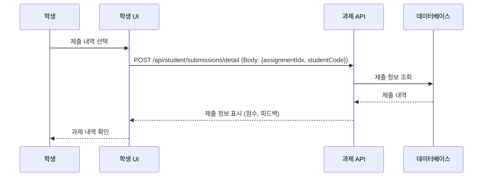
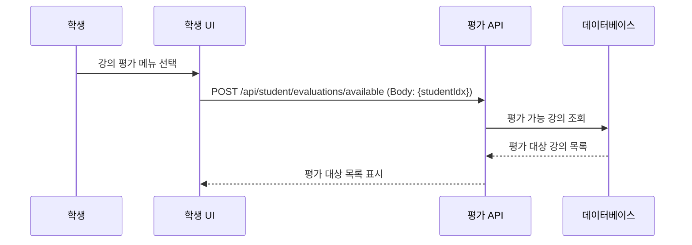
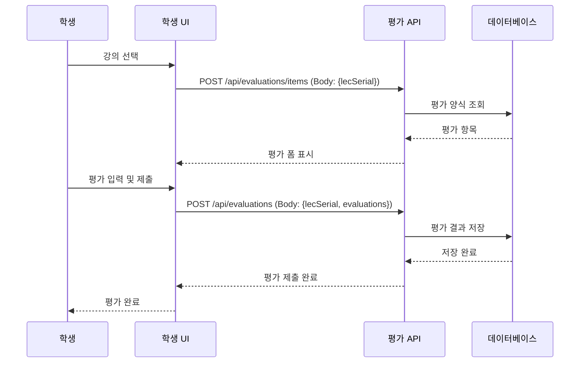

# 06. 학생 플로우

## 학생 기능 플로우

## 목차

1. [수강신청](#1-수강신청)
2. [학기 중 활동](#2-학기-중-활동)
3. [출결 관리](#3-출결-관리)
4. [과제 관리](#4-과제-관리)
5. [강의 평가](#5-강의-평가)

---

## 1. 수강신청

### 1.1 수강 가능 강의 조회



### 1.2 수강신청



### 1.3 내 수강신청 목록 조회



**API 엔드포인트:**
- `POST /lectures/eligible` - 수강 가능 강의 조회
- `POST /enrollments/enroll` - 수강신청
- `POST /enrollments/list` - 내 수강 목록
- `POST /enrollments/drop` - 수강 취소

**프론트엔드 예시:**

```javascript
// 수강 가능 강의 조회
async function getEligibleLectures(studentId) {
    const response = await fetch('/lectures/eligible', {
        method: 'POST',
        headers: {
            'Content-Type': 'application/json',
            'Authorization': `Bearer ${token}`
        },
        body: JSON.stringify({
            studentId: studentId,
            page: 0,
            size: 20
        })
    });
    const result = await response.json();
    
    if (result.success) {
        displayLectures(result.data.eligibleLectures);
    }
}

// 수강신청
async function enrollLecture(lecSerial, studentIdx) {
    const response = await fetch('/enrollments/enroll', {
        method: 'POST',
        headers: {
            'Content-Type': 'application/json',
            'Authorization': `Bearer ${token}`
        },
        body: JSON.stringify({
            lecSerial: lecSerial,
            studentIdx: studentIdx
        })
    });
    const result = await response.json();
    
    if (result.success) {
        alert('수강신청 완료');
    }
}
```

---

## 2. 학기 중 활동

### 2.1 강의 공지사항 확인 (미구현)



---

## 3. 출결 관리

### 3.1 내 출석 현황 조회 (미구현)



### 3.2 출석 인정 요청



**API 엔드포인트:**
- `POST /api/student/attendance/status` - 출석 현황 조회 (미구현)
- `POST /api/student/attendance/request` - 출석 인정 요청

**프론트엔드 예시:**

```javascript
// 출석 인정 요청
async function requestAttendance(lecSerial, attendanceDate, reason) {
    const response = await fetch('/api/student/attendance/request', {
        method: 'POST',
        headers: {
            'Content-Type': 'application/json',
            'Authorization': `Bearer ${token}`
        },
        body: JSON.stringify({
            lecSerial: lecSerial,
            attendanceDate: attendanceDate,
            reason: reason
        })
    });
    const result = await response.json();
    
    if (result.success) {
        alert('출석 인정 요청 완료');
    }
}
```

---

## 4. 과제 관리

### 4.1 과제 목록 조회



### 4.2 과제 제출 (오프라인)

> **중요**: 이 시스템은 과제 파일 업로드를 지원하지 않습니다. 학생은 대면, 이메일, 또는 외부 플랫폼을 통해 과제를 제출하며, 교수가 제출 여부와 점수를 입력합니다.

**제출 프로세스:**
1. 학생이 오프라인으로 과제 제출 (대면, 이메일, 외부 플랫폼)
2. 교수가 시스템에서 제출 여부 확인 및 채점
3. DB의 `submissions` 필드에 `{submitted: true, score: X, submissionMethod: "email"}` 저장

### 4.3 과제 제출 내역 확인 (미구현)



**API 엔드포인트:**
- `POST /api/assignments/list` - 과제 목록
- `POST /api/assignments/detail` - 과제 상세
- `POST /api/student/submissions/detail` - 제출 내역 (미구현)

**프론트엔드 예시:**

```javascript
// 과제 목록 조회
async function getAssignmentList(lecSerial) {
    const response = await fetch('/api/assignments/list', {
        method: 'POST',
        headers: {
            'Content-Type': 'application/json',
            'Authorization': `Bearer ${token}`
        },
        body: JSON.stringify({
            lecSerial: lecSerial,
            page: 0,
            size: 10
        })
    });
    const result = await response.json();
    
    if (result.success) {
        displayAssignments(result.data.content);
    }
}
```

---

## 5. 강의 평가

### 5.1 평가 가능 강의 조회 (미구현)



### 5.2 강의 평가 제출 (미구현)



**API 엔드포인트:** (미구현)
- `POST /api/student/evaluations/available` - 평가 가능 강의
- `POST /api/evaluations/items` - 평가 항목 조회
- `POST /api/evaluations` - 강의 평가 제출

---

## 학생 주요 업무

### 수강신청 기간
1. 수강 가능 강의 조회 (전공/부전공 필터링)
2. 수강신청 진행
3. 수강신청 확인 및 취소

### 학기 중
1. 강의 공지사항 확인 (미구현)
2. 과제 목록 확인 및 제출
3. 출석 현황 확인 (미구현)
4. 출석 인정 요청

### 학기 말
1. 과제 마무리
2. 성적 확인 (미구현)
3. 강의 평가 제출 (미구현)
