# 06. E 로우

> **E성E**: 2025-10-10  
> **E좁EE적E*: 2025-10-14  
> **EEE*: 2.3 (EE EEEEEEE E가)  
> **EEE**: 
> - EE EEE EEEE+ EE스E어 E칙으EEE
> - EnrollmentController DTO  EE EE
> - HTTP 400 E러 E EEE(PageImpl EE)
> - EE EEEEEEE E가 (lecProf + lecProfName)

---

## 👨‍🎁EE EE 로우

EEEE의 EE E스EEE E나EEE EEEEEE의E다.

---

## 📋 EE

1. [E강신E 로우](#1-E강신E-로우)
2. [기 EE동 로우](#2-기-EE동-로우)
3. [E결 EE 로우](#3-E결-EE-로우)
4. [EEEEE 로우](#4-EEEEE-로우)
5. [E의 가 로우](#5-E의-가-로우)

---

## 1. E강신E 로우

### **1.1 E각EEE E의 EE*

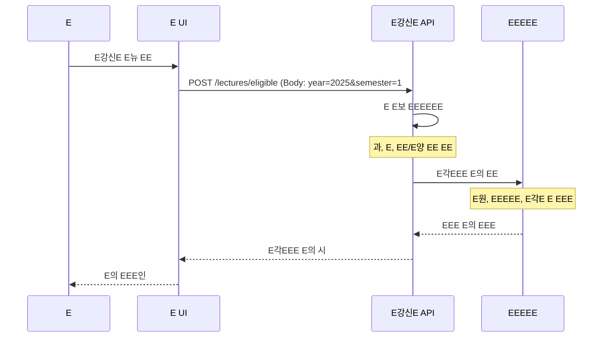

### **1.2 E강신E E리**

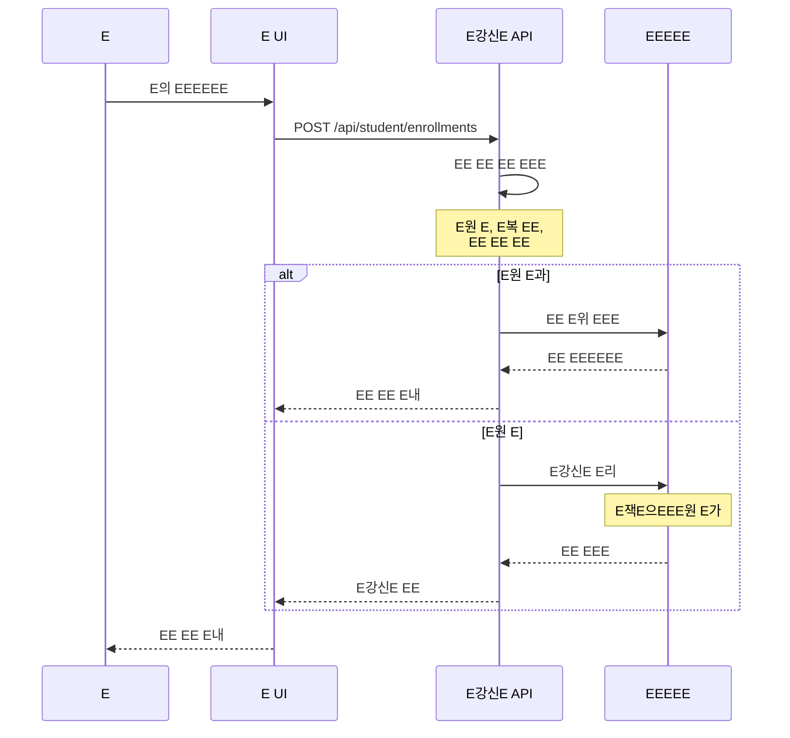

### **1.3 EEEE의 EE**

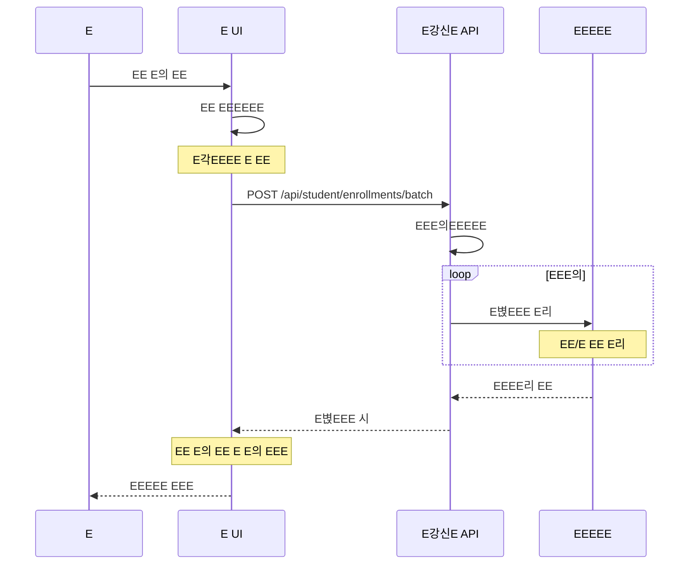

### **1.4 E강신E EEE*

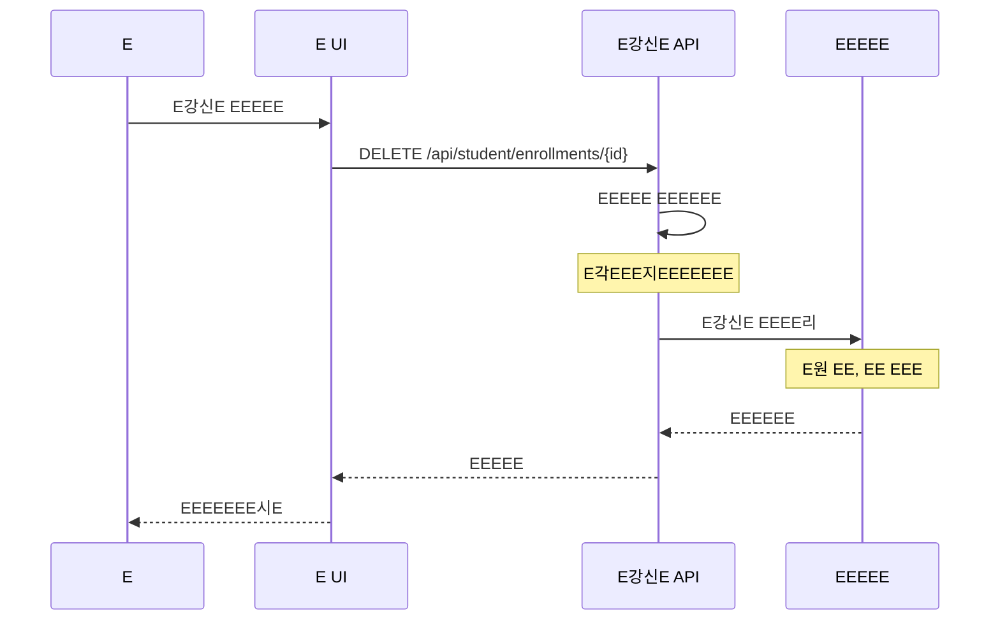

---

## 2. 기 EE동 로우

### **2.1 E E각EEEEEE*

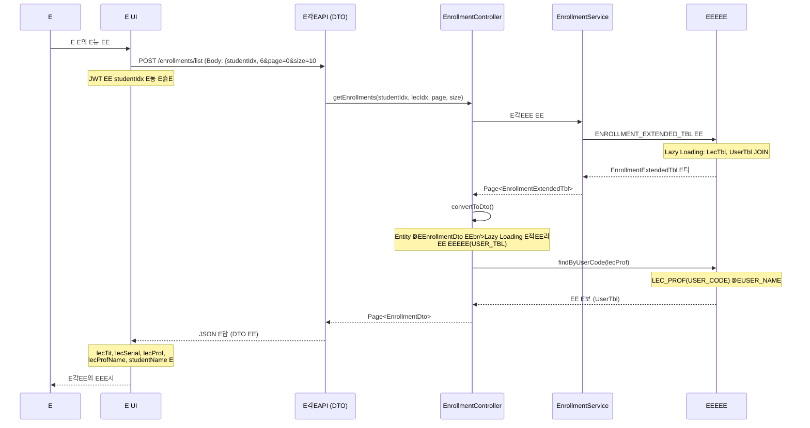

### **DTO E답 EE**

```json
{
  "content": [
    {
      "enrollmentIdx": 1,
      "lecIdx": 101,
      "lecSerial": "CS101",
      "lecTit": "E밁EE그E밁E,
      "lecProf": "PROF001",
      "lecProfName": "EEE",
      "lecPoint": 3,
      "lecTime": "EE 10:00-11:30",
      "studentIdx": 6,
      "studentCode": "2024001",
      "studentName": "길EE,
      "enrollmentStatus": "ENROLLED",
      "enrollmentDate": "2024-09-01"
    }
  ],
  "totalElements": 5,
  "totalPages": 1,
  "size": 10,
  "number": 0
}
```

**EEEE EEE*:
- `lecProf`: EE E드 (USER_CODE) - EE "PROF001", "11"
- `lecProfName`: EE EEE(USER_NAME) - EE "EEE", "EEE"
- `studentCode`: 벁E(USER_CODE)
- `studentName`: E EEE(USER_NAME)

### **2.2 E의 EEE 인**

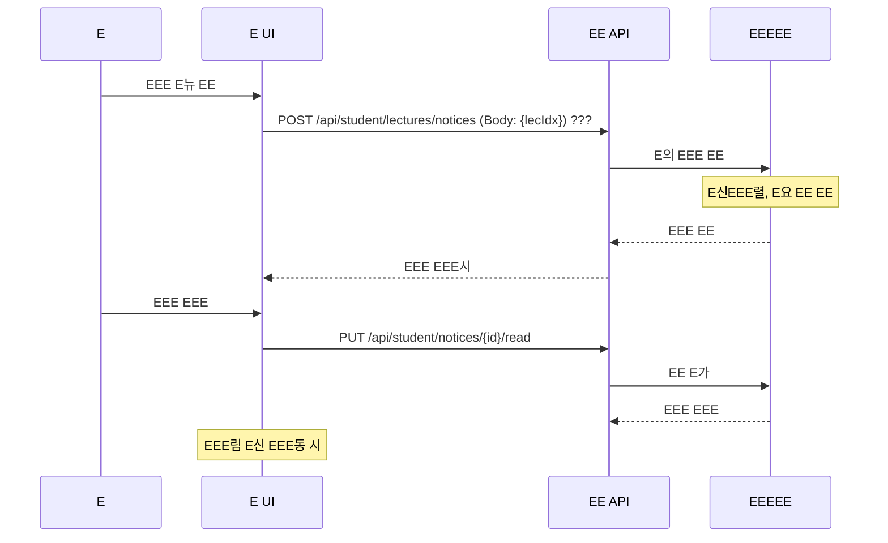

### **2.3 EE EE**

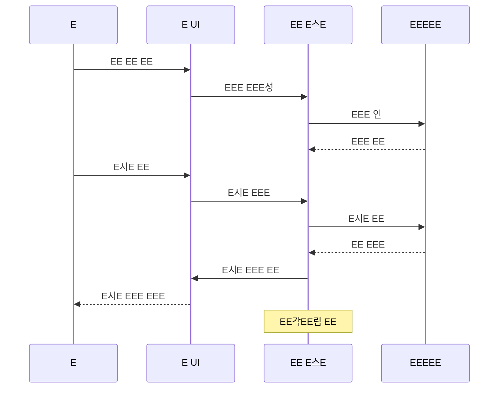

---

## 3. E결 EE 로우

### **3.1 EE E청**

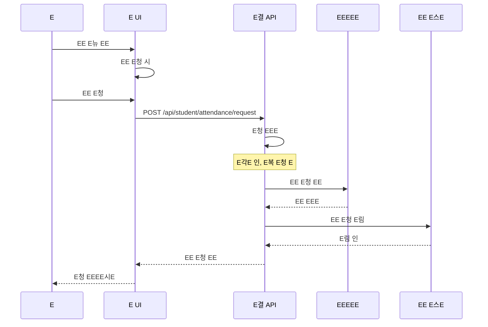

### **3.2 EE E EE*

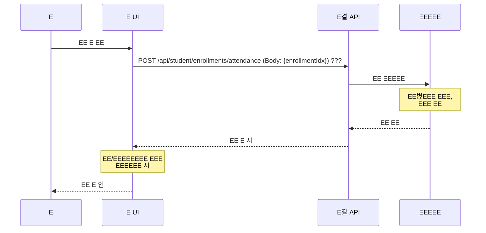

---

## 4. EEEEE 로우

### **4.1 EEEEEEEE*

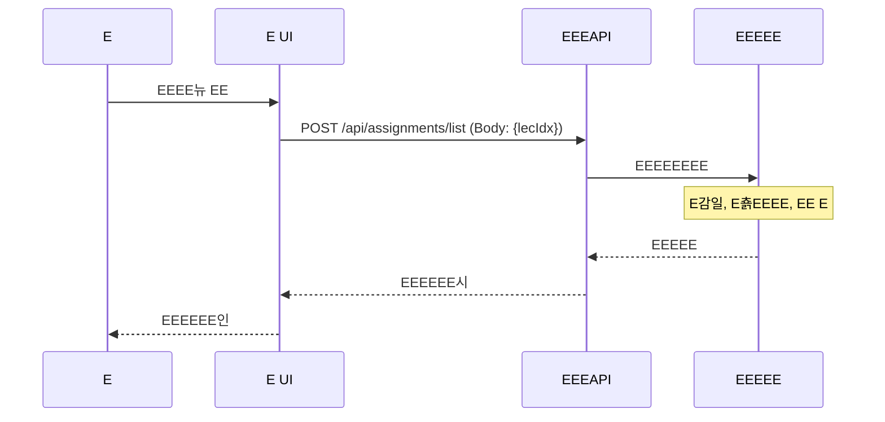

### **4.2 EEEE춁E(EEE EEE**

> ⚠EE**E요**: E E스은 **EEE일EEEE지 E습E다**. EE E면, EE일, EE E라EEEE EEE EE한 EE으EEEEE E출하E, E스에E는 **E춁EEEEEEEEEEEE*E다.

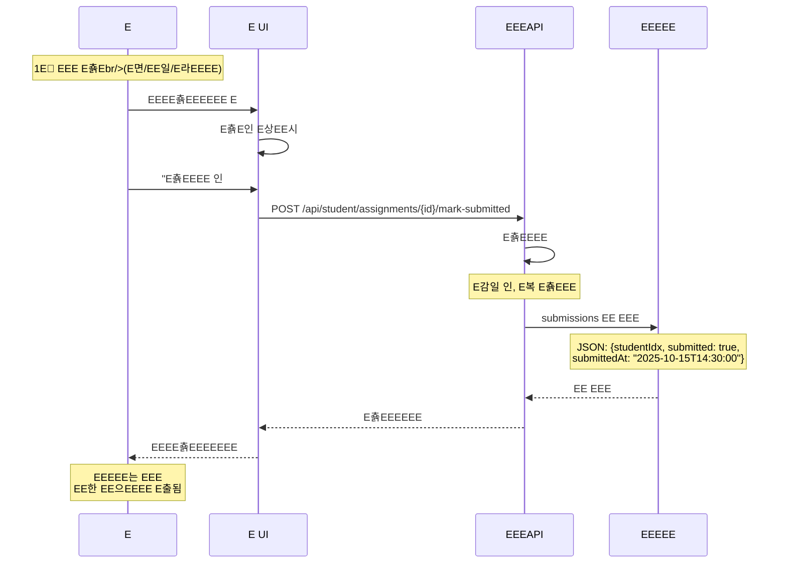

**E춁EE크로우:**
1. EE **EEEEEEEEEE춁E* (E면, EE일, E라EEEEE E)
2. E스에EE**"E춁EEEE EE** E여 E춁EEEEEEEEE
3. DBEE`submissions` EEEE`{submitted: true, submittedAt: "..."}`EEEE
4. EEE E중에 **E춁EEE을 EEEEE**여 EEE(EE "E면 E춁E(2025-10-15)")

### **4.3 EEEEE 인**

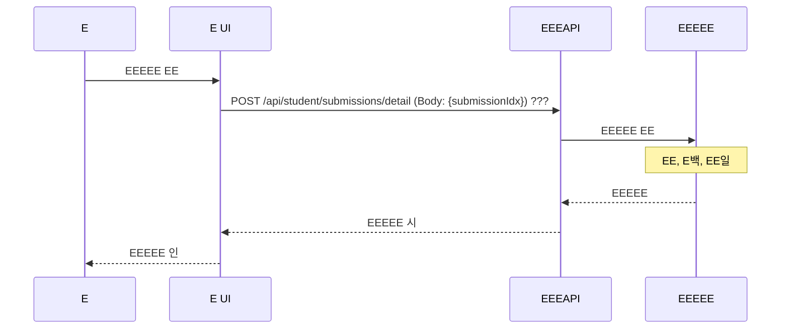

---

## 5. E의 가 로우

### **5.1 가 EE E의 EE*

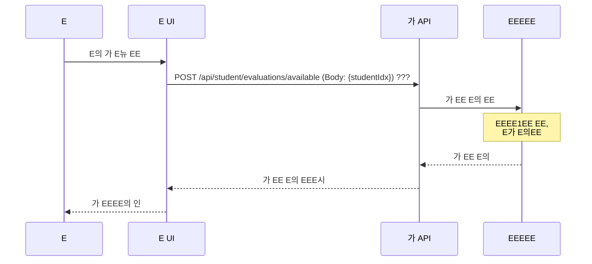

### **5.2 E의 가 E춁E*

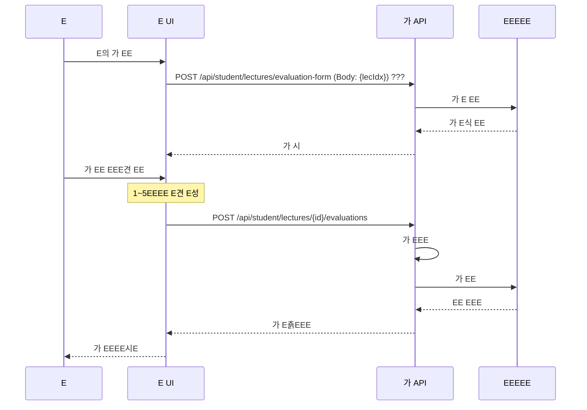

---

## 📋 E EEEEE E세E

### **E강신E EEE*
1. **E의 색**: EE E의 EEEEEEE E보 인
2. **EE EE**: E각E EE여 EEE위 EEE
3. **EE EE*: E볁EE는 EEEEE E리
4. **EE 인**: EE/E EEEE E위 인

### **기 EE동**
1. **EE EE**: 
   - E E의E각EEE E청
   - E의 E각E: `EEEEEEEE` 식 (EE E요E 1,2E시, E요E 3,4E시)
2. **EE 인**: EE EEE EEE요 E림 인
3. **EEEE행**: EEEE춁EEEEE 인
4. **EE 용**: EEEEEE EE EE

### **기 EEE리**
1. **E의 가**: E강한 EE E의 가 E춁E
2. **EEE인**: E좁EEEEEE적E인
3. **E백 용**: EEE기 E각EEE E립

---

## 🎯 EEEEEE

E 로우E E의으EE[EEEE](./07-EEEEEmd)EE E밁EEEEEEEEEEEE립E다.
