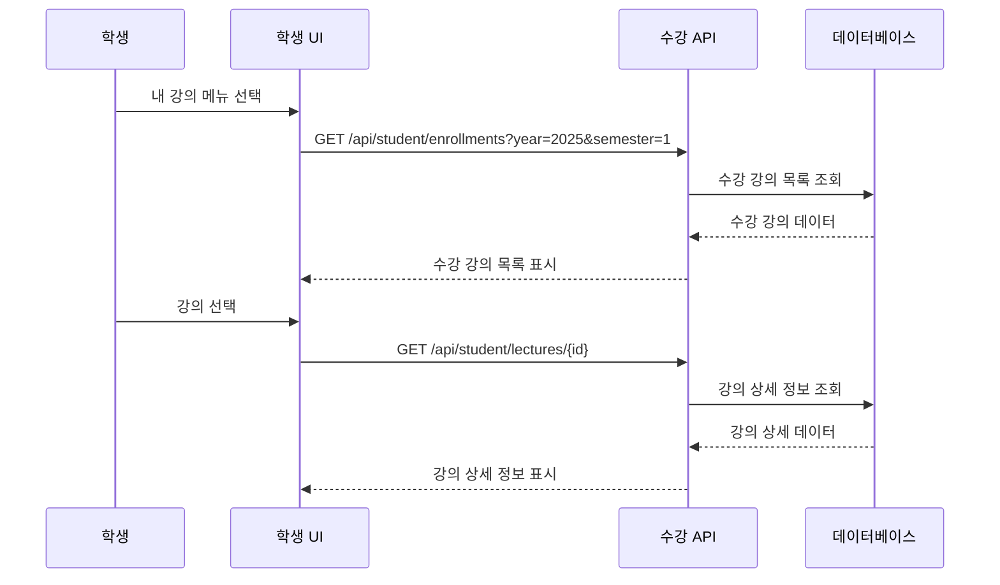

# 06. 학생 플로우

> **작성일**: 2025-10-09
> **버전**: 1.0

---

## 👨‍🎓 학생 기능 플로우

학생의 강의 관리 시스템 사용 시나리오를 단계별로 정의합니다.

---

## 📋 목차

1. [수강신청 플로우](#1-수강신청-플로우)
2. [학기 중 활동 플로우](#2-학기-중-활동-플로우)
3. [출결 관리 플로우](#3-출결-관리-플로우)
4. [과제 관리 플로우](#4-과제-관리-플로우)
5. [강의 평가 플로우](#5-강의-평가-플로우)

---

## 1. 수강신청 플로우

### **1.1 수강 가능 강의 조회**

### **1.2 수강신청 처리**

### **1.3 다중 강의 신청**

### **1.4 수강신청 취소**

---

## 2. 학기 중 활동 플로우

### **2.1 내 수강 목록 조회**

### **2.2 강의 공지사항 확인**

### **2.3 교수 채팅**

---

## 3. 출결 관리 플로우

### **3.1 출석 요청**

### **3.2 출석 현황 조회**

---

## 4. 과제 관리 플로우

### **4.1 과제 목록 조회**

### **4.2 과제 제출**

### **4.3 과제 결과 확인**

---

## 5. 강의 평가 플로우

### **5.1 평가 가능 강의 조회**

### **5.2 강의 평가 제출**

---

## 📋 학생 주요 업무 프로세스

### **수강신청 기간**
1. **강의 탐색**: 관심 강의 검색 및 상세 정보 확인
2. **신청 계획**: 시간표 고려하여 우선순위 결정
3. **신청 실행**: 개별 또는 다중 신청 처리
4. **결과 확인**: 성공/실패 및 보결 순위 확인

### **학기 중 활동**
1. **출석 관리**: 매 강의시간 출석 요청
2. **공지 확인**: 교수 공지사항 및 중요 알림 확인
3. **과제 수행**: 과제 제출 및 결과 확인
4. **상담 활용**: 필요시 교수와 채팅 상담

### **학기 말 정리**
1. **강의 평가**: 수강한 모든 강의 평가 제출
2. **성적 확인**: 최종 성적 및 학점 확인
3. **피드백 활용**: 다음 학기 수강 계획 수립

---

## 🎯 다음 단계

학생 플로우를 정의했으니 [구현 순서](./07-구현순서.md)에서 개발 단계별 구현 계획을 수립합니다.