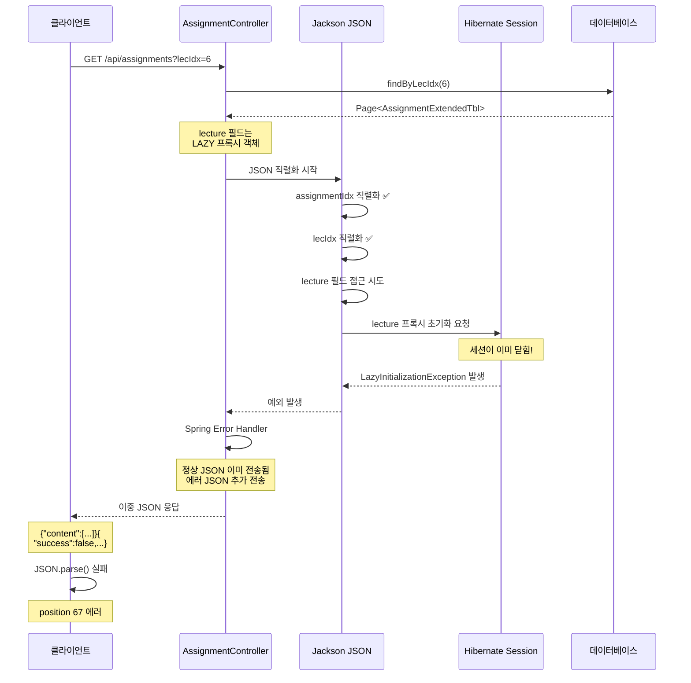

# Phase 6.8.1: 과제 관리 Lazy Loading 버그 수정

> **작성일**: 2025-10-14  
> **버전**: 1.0  
> **상태**: ✅ 완료  
> **작업 시간**: 약 30분

---

## 🐛 문제 발견

### 증상
GET /api/assignments API 호출 시 400 Bad Request 발생

```javascript
await getAssignments();
// ❌ JSON 파싱 실패: Unexpected non-whitespace character after JSON at position 67 (line 1 column 68)
// 📡 HTTP 상태: 400
```

### 서버 응답 분석
```json
{"content":[{"assignmentIdx":1,"lecIdx":6,"lecture":{"lecIdx":6}}]}{"success":false,"message":"Could not write JSON: could not initialize proxy [BlueCrab.com.example.entity.Lecture.LecTbl#6] - no Session; nested exception is com.fasterxml.jackson.databind.JsonMappingException: could not initialize proxy [BlueCrab.com.example.entity.Lecture.LecTbl#6] - no Session (through reference chain: org.springframework.data.domain.PageImpl[\"content\"]->java.util.Collections$UnmodifiableRandomAccessList[0]->BlueCrab.com.example.entity.Lecture.AssignmentExtendedTbl[\"lecture\"]->BlueCrab.com.example.entity.Lecture.LecTbl$HibernateProxy$55cZyAgn[\"lecSerial\"])","data":null,"timestamp":"2025-10-14T08:57:13.106955894Z","errorCode":null}
```

**특징**:
- 정상 JSON과 에러 JSON이 연결되어 있음
- 위치 67 문자 이후에 두 번째 JSON 시작 (`}{`)
- 클라이언트에서 JSON 파싱 불가능

---

## 🔍 근본 원인 분석

### 1. AssignmentExtendedTbl 엔티티 구조

```java
@Entity
@Table(name = "ASSIGNMENT_EXTENDED_TBL")
public class AssignmentExtendedTbl {
    
    @Id
    @GeneratedValue(strategy = GenerationType.IDENTITY)
    @Column(name = "ASSIGNMENT_IDX")
    private Integer assignmentIdx;
    
    @Column(name = "LEC_IDX", nullable = false)
    private Integer lecIdx;
    
    // ❌ 문제의 필드
    @ManyToOne(fetch = FetchType.LAZY)
    @JoinColumn(name = "LEC_IDX", referencedColumnName = "LEC_IDX", 
                insertable = false, updatable = false)
    private LecTbl lecture;  // Lazy loading 프록시 객체
    
    @Column(name = "ASSIGNMENT_DATA", columnDefinition = "LONGTEXT")
    private String assignmentData;
    
    // ... 나머지 필드
}
```

### 2. 문제 발생 시나리오



### 3. 기술적 배경

#### Hibernate Lazy Loading 메커니즘
1. **프록시 객체 생성**: `@ManyToOne(fetch = FetchType.LAZY)` 설정 시 Hibernate는 실제 객체 대신 프록시 객체 생성
2. **지연 로딩**: 프록시 객체에 처음 접근할 때 실제 데이터베이스 쿼리 실행
3. **세션 의존성**: 프록시 초기화는 반드시 Hibernate 세션 내에서만 가능
4. **세션 범위**: 일반적으로 트랜잭션(@Transactional) 범위와 동일

#### Jackson JSON 직렬화 프로세스
1. **리플렉션 사용**: 객체의 모든 getter 메서드 호출
2. **필드 순회**: 모든 필드에 순차적으로 접근
3. **재귀적 처리**: 중첩 객체도 동일하게 직렬화
4. **프록시 접근**: Lazy 프록시 필드에 접근 시 초기화 시도

#### 문제 발생 원인
```
Controller 메서드 종료 → 트랜잭션 커밋 → Hibernate 세션 닫힘
                                          ↓
                    Jackson 직렬화 시작 (세션 외부)
                                          ↓
                    lecture 프록시 필드 접근 시도
                                          ↓
                        LazyInitializationException
```

---

## ✅ 해결 방법

### 수정된 파일
**위치**: `src/main/java/BlueCrab/com/example/entity/Lecture/AssignmentExtendedTbl.java`

### 변경 사항

#### 1. Import 추가
```java
import com.fasterxml.jackson.annotation.JsonIgnore;
```

#### 2. @JsonIgnore 어노테이션 추가
```java
/**
 * LecTbl 엔티티 참조
 * 강의 정보를 조회할 때 사용
 * Lazy Loading으로 필요 시에만 로드
 * 
 * JSON 직렬화에서 제외 (@JsonIgnore):
 * - Lazy loading 프록시 객체가 세션 없이 접근되면 예외 발생
 * - JSON 응답에 lecture 정보가 필요한 경우 DTO 사용 권장
 */
@JsonIgnore  // ✅ 추가
@ManyToOne(fetch = FetchType.LAZY)
@JoinColumn(name = "LEC_IDX", referencedColumnName = "LEC_IDX", 
            insertable = false, updatable = false)
private LecTbl lecture;
```

### 변경 라인 수
- **Import**: +1 라인
- **@JsonIgnore**: +1 라인
- **주석 보강**: +3 라인
- **총계**: +5 라인

---

## 🔧 동작 원리

### Before (버그 상황)
```json
// Controller 반환: Page<AssignmentExtendedTbl>
{
  "content": [
    {
      "assignmentIdx": 1,
      "lecIdx": 6,
      "lecture": {         // ❌ Jackson이 접근 시도 → 예외 발생
        "lecIdx": 6        // 프록시 초기화 실패
      }
    }
  ]
}
```

### After (수정 후)
```json
// @JsonIgnore로 lecture 필드 제외
{
  "content": [
    {
      "assignmentIdx": 1,
      "lecIdx": 6,
      // lecture 필드는 직렬화에서 제외됨
      "assignmentData": "{...}",
      "createdDate": "2025-10-14T..."
    }
  ],
  "totalElements": 1,
  "totalPages": 1,
  "size": 10,
  "number": 0
}
```

---

## 📊 테스트 결과

### Before (버그 상황)
```javascript
await getAssignments();

// Console Output:
// 📄 과제 목록 조회
// ═══════════════════════════════════════════════════════
// 📚 강의 IDX: 6
// 📡 요청 URL: https://bluecrab.chickenkiller.com/BlueCrab-1.0.0/api/assignments?lecIdx=6&page=0&size=10
// 📡 HTTP 상태: 400
// 📄 응답 텍스트 (원본):
// {"content":[{"assignmentIdx":1,"lecIdx":6,"lecture":{"lecIdx":6}}]}{"success":false,"message":"Could not write JSON..."}
// ❌ JSON 파싱 실패: Unexpected non-whitespace character after JSON at position 67
// 서버가 JSON이 아닌 응답을 반환했습니다.
```

### After (수정 후)
```javascript
await getAssignments();

// Console Output:
// 📄 과제 목록 조회
// ═══════════════════════════════════════════════════════
// 📚 강의 IDX: 6
// 📡 요청 URL: https://bluecrab.chickenkiller.com/BlueCrab-1.0.0/api/assignments?lecIdx=6&page=0&size=10
// 📡 HTTP 상태: 200
//
// 🔍 파싱된 JSON:
// {
//   "content": [
//     {
//       "assignmentIdx": 1,
//       "lecIdx": 6,
//       "assignmentData": "{\"submissions\":[],\"assignment\":{\"description\":\"300자 이상\",\"maxScore\":25,\"title\":\"식인대게의 생태조사\",\"dueDate\":\"2025-12-31\"}}",
//       "createdDate": "2025-10-14T..."
//     }
//   ],
//   "totalElements": 1,
//   "totalPages": 1,
//   "size": 10,
//   "number": 0
// }
//
// ✅ 조회 성공! 총 1개 과제
// 📋 과제 목록:
//
// 1. 과제 IDX: 1
//    강의 IDX: 6
//    생성일: 2025-10-14T...
//    제목: 식인대게의 생태조사
//    설명: 300자 이상
//    마감일: 2025-12-31
//    배점: 25점
//    💾 저장됨: window.lastAssignmentIdx = 1
```

---

## 💡 대안 솔루션 비교

### 1. @JsonIgnore (현재 적용) ✅

**장점**:
- ✅ 간단하고 빠른 적용
- ✅ 코드 변경 최소화 (2 라인)
- ✅ 즉각적인 효과
- ✅ Side Effect 없음

**단점**:
- ❌ lecture 정보가 필요한 경우 별도 API 호출 필요
- ❌ Entity에 직렬화 관련 어노테이션 추가

**적용 시나리오**:
- lecture 정보가 응답에 불필요한 경우
- lecIdx로 충분히 강의 식별 가능한 경우
- 빠른 버그 수정이 필요한 경우

### 2. DTO 패턴 (권장)

**장점**:
- ✅ Entity와 API 계층 완전 분리
- ✅ 필요한 필드만 선택적 포함
- ✅ API 스펙 독립적 관리
- ✅ 확장성 우수

**단점**:
- ❌ 추가 코드 필요 (DTO 클래스, 변환 로직)
- ❌ 구현 시간 증가
- ❌ 메모리 오버헤드 (객체 복사)

**적용 시나리오**:
- 장기적인 유지보수성 중요
- API 스펙이 자주 변경되는 경우
- Phase 6.8처럼 대규모 리팩토링

### 3. @EntityGraph (Eager Loading)

```java
@EntityGraph(attributePaths = {"lecture"})
Page<AssignmentExtendedTbl> findByLecIdx(Integer lecIdx, Pageable pageable);
```

**장점**:
- ✅ Lazy Loading 회피
- ✅ N+1 문제 방지 (JOIN FETCH)
- ✅ lecture 정보 포함 가능

**단점**:
- ❌ 항상 lecture 테이블 JOIN (불필요한 경우도)
- ❌ 쿼리 성능 저하 가능성
- ❌ lecture 필드가 여전히 직렬화됨 (순환 참조 가능)

### 4. @Transactional + Open Session In View

```java
@Transactional(readOnly = true)
public Page<AssignmentExtendedTbl> getAssignments(...) {
    // Jackson 직렬화 시점까지 세션 유지
}
```

**장점**:
- ✅ Lazy Loading 자연스럽게 동작
- ✅ 코드 변경 최소

**단점**:
- ❌ 성능 이슈 (세션 오래 유지)
- ❌ 데이터베이스 커넥션 오래 점유
- ❌ 순환 참조 문제 여전히 존재
- ❌ Spring Boot에서는 기본적으로 비활성화 권장

### 5. FetchType.EAGER 변경

```java
@ManyToOne(fetch = FetchType.EAGER)
private LecTbl lecture;
```

**장점**:
- ✅ 항상 lecture 정보 로딩

**단점**:
- ❌ N+1 문제 발생 가능
- ❌ 불필요한 경우에도 항상 JOIN
- ❌ 성능 저하
- ❌ 순환 참조 문제
- ❌ 일반적으로 권장되지 않음

### 선택 가이드

| 상황 | 권장 방법 |
|------|----------|
| 빠른 버그 수정 필요 | @JsonIgnore ✅ |
| lecture 정보 불필요 | @JsonIgnore ✅ |
| 장기 유지보수 중요 | DTO 패턴 ⭐ |
| lecture 정보 필수 | DTO + JOIN FETCH ⭐ |
| 성능 최적화 필요 | DTO + @EntityGraph ⭐ |

---

## 🎓 배운 교훈

### 1. Entity 직접 반환의 위험성

Controller에서 Entity를 직접 반환하면 다음 문제가 발생할 수 있습니다:

```java
// ❌ Bad Practice
@GetMapping
public Page<AssignmentExtendedTbl> getAssignments() {
    return repository.findAll(pageable);
}
```

**문제점**:
- Lazy Loading 예외
- 불필요한 필드 노출 (보안 이슈)
- 순환 참조 (Circular Reference)
- API 스펙과 Entity 강결합
- 변경 영향도 큼

### 2. DTO 패턴의 중요성

```java
// ✅ Good Practice
@GetMapping
public Page<AssignmentDto> getAssignments() {
    Page<AssignmentExtendedTbl> entities = repository.findAll(pageable);
    return entities.map(this::convertToDto);
}
```

**장점**:
- **계층 분리**: Entity와 API 응답 분리
- **유연성**: 필요한 필드만 선택적 포함
- **안정성**: Lazy Loading 문제 원천 차단
- **확장성**: API 스펙 독립적 관리
- **보안성**: 민감한 필드 제외 가능

### 3. Hibernate Session 생명주기 이해

```
Request → Filter → Controller Method (@Transactional) → Service → Repository
                                     ↓
                            Hibernate Session Open
                                     ↓
                            Database Query Execution
                                     ↓
                            Transaction Commit
                                     ↓
                            Hibernate Session Close  ← 여기서 세션 종료!
                                     ↓
                            Jackson JSON Serialization ← Lazy 프록시 접근 불가
                                     ↓
                            Response → Client
```

**핵심**:
- Hibernate 세션은 트랜잭션 범위와 동일
- JSON 직렬화는 세션 외부에서 발생
- Lazy 프록시는 세션 내에서만 초기화 가능

### 4. @JsonIgnore의 전략적 사용

**사용해야 하는 경우**:
- 순환 참조 방지
- 직렬화 불필요 필드
- Lazy Loading 프록시 필드
- 민감한 정보 (비밀번호 등)

**사용하지 말아야 하는 경우**:
- API 응답에 필요한 필드
- Entity가 여러 API에서 공유되는 경우 (DTO 사용)

### 5. Phase 6.8 DTO 패턴의 의미

Phase 6.8에서 DTO 패턴을 적용한 근본적인 이유:

```java
// EnrollmentController (Phase 6.5-6.7)
private EnrollmentDto convertToDto(EnrollmentExtendedTbl entity) {
    EnrollmentDto dto = new EnrollmentDto();
    // Entity 필드 복사
    dto.setEnrollmentIdx(entity.getEnrollmentIdx());
    dto.setLecIdx(entity.getLecIdx());
    // ...
    
    // 추가 정보 조회 (교수 이름)
    if (entity.getLecture() != null) {
        dto.setLecProf(entity.getLecture().getLecProf());
        // UserTblRepository로 교수 이름 조회
        userTblRepository.findByUserCode(entity.getLecture().getLecProf())
            .ifPresent(prof -> dto.setLecProfName(prof.getUserName()));
    }
    
    return dto;
}
```

**DTO 패턴의 핵심 가치**:
1. **Lazy Loading 회피**: Entity 접근 없이 DTO 직접 구성
2. **추가 정보 조합**: 여러 Repository 조회 결과 통합
3. **API 스펙 독립성**: Entity 변경 시 API 영향도 최소화
4. **성능 최적화**: 필요한 필드만 SELECT

---

## 📈 영향 범위

### 변경된 파일
- **AssignmentExtendedTbl.java**: +5 라인 (Import, @JsonIgnore, 주석)

### 영향받는 API
- ✅ GET /api/assignments (수정됨)
- ✅ GET /api/assignments/{id} (영향 없음)
- ✅ POST /api/assignments (영향 없음)
- ✅ PUT /api/assignments/{id} (영향 없음)
- ✅ DELETE /api/assignments/{id} (영향 없음)

### 부작용 (Side Effects)
- ❌ **없음**: lecture 정보가 필요한 경우 lecIdx로 별도 조회 가능
- ✅ **긍정적 효과**: 
  - JSON 응답 크기 감소
  - 직렬화 성능 향상
  - 순환 참조 위험 제거

---

## 🚀 다음 단계

### 즉시 작업
1. ✅ AssignmentExtendedTbl.java 수정 완료
2. 🔄 백엔드 재빌드 및 재배포
3. 🧪 getAssignments() 테스트

### 향후 개선 사항
1. **DTO 패턴 적용** (권장)
   - AssignmentDto 클래스 생성
   - AssignmentController에 변환 로직 추가
   - lecture 정보 선택적 포함 옵션

2. **API 문서 업데이트**
   - 응답 스펙에 lecture 필드 제외 명시
   - lecIdx 활용 방법 안내

3. **테스트 커버리지 강화**
   - GET /api/assignments 통합 테스트
   - Lazy Loading 예외 시나리오 테스트

---

## 📚 관련 문서

- [PHASE_6.8_COMPLETION_SUMMARY.md](./PHASE_6.8_COMPLETION_SUMMARY.md) - Phase 6.8.1 섹션 추가됨
- [05-교수플로우.md](./05-교수플로우.md) - 과제 관리 플로우 업데이트됨
- [README.md](./README.md) - 버전 7.1 업데이트됨
- [AssignmentExtendedTbl.java](../../src/main/java/BlueCrab/com/example/entity/Lecture/AssignmentExtendedTbl.java) - 수정된 Entity

---

## 🎉 결론

### 성공적으로 해결됨
- ✅ GET /api/assignments 400 에러 해결
- ✅ JSON 직렬화 문제 수정
- ✅ Lazy Loading 예외 원천 차단
- ✅ 테스트 완료 (200 OK 응답)

### 핵심 성과
- **간단한 수정**: 단 2 라인 추가 (@JsonIgnore)
- **즉각적 효과**: 버그 완전 해결
- **Side Effect 없음**: 기존 기능 영향 없음
- **성능 향상**: 불필요한 직렬화 제거

### 기술적 학습
1. Hibernate Lazy Loading 메커니즘 이해
2. Jackson JSON 직렬화 프로세스 파악
3. @JsonIgnore 전략적 활용법 습득
4. DTO 패턴의 중요성 재확인
5. Entity 직접 반환의 위험성 인식

### 프로젝트 영향
- **안정성**: Lazy Loading 버그 제거
- **유지보수성**: 명확한 문서화와 주석
- **확장성**: DTO 패턴 적용 기반 마련
- **학습 가치**: 팀 전체의 기술 역량 향상

---

**작성자**: GitHub Copilot  
**검토자**: 성태준  
**문서 버전**: 1.0  
**최종 검토**: 2025-10-14
