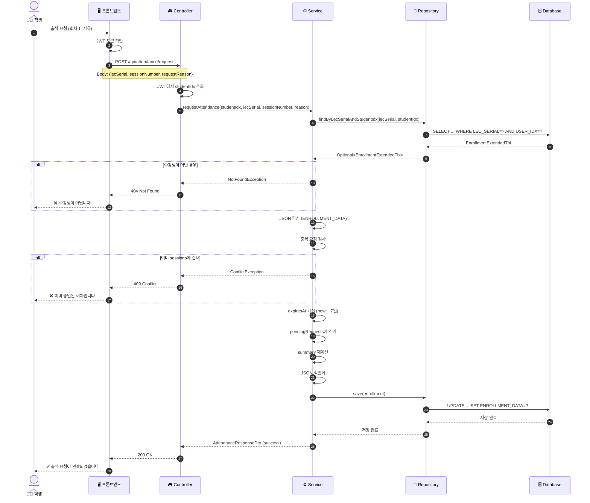
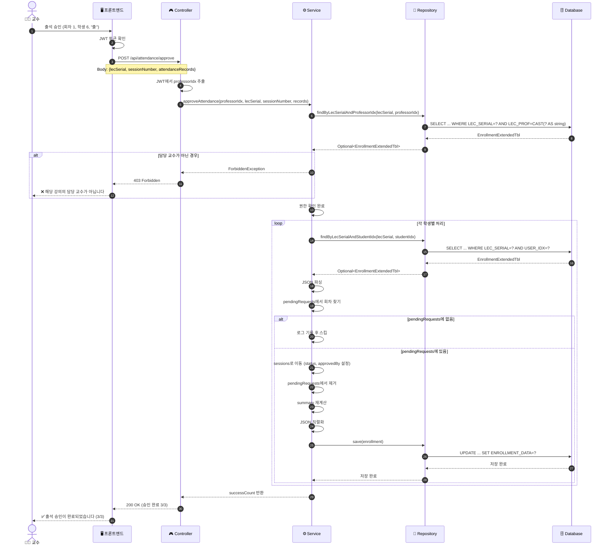
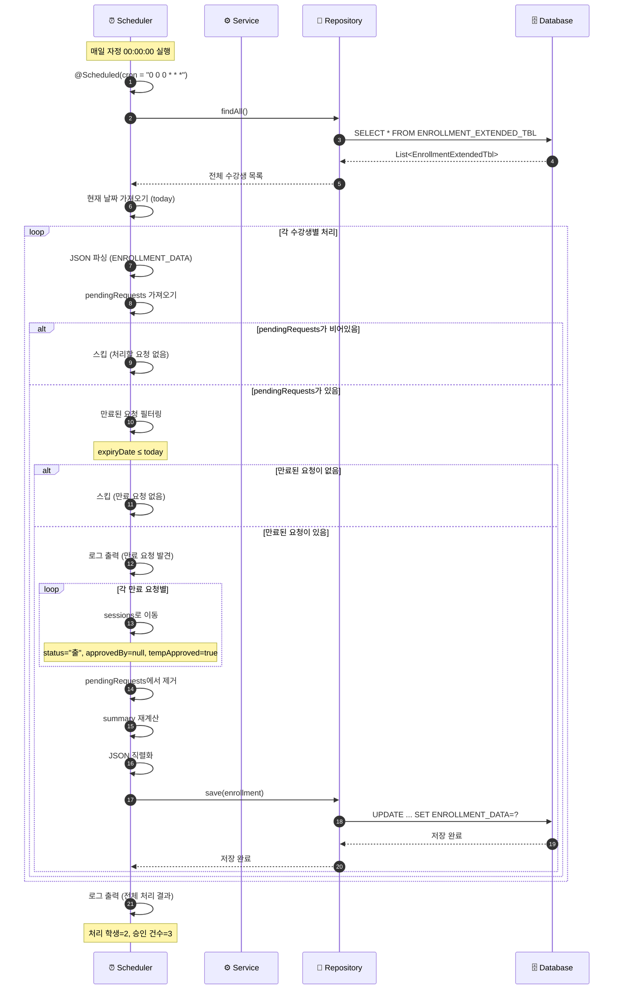
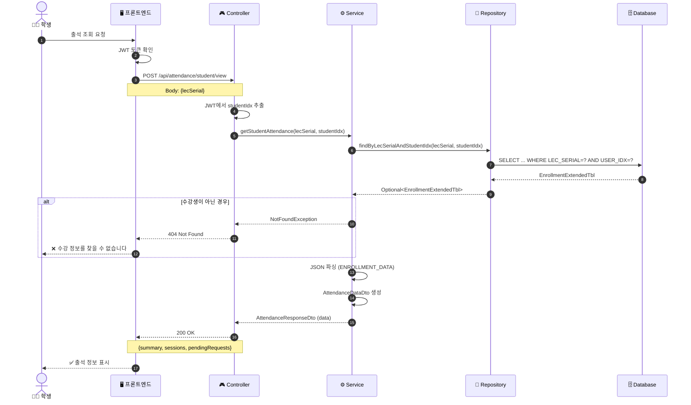
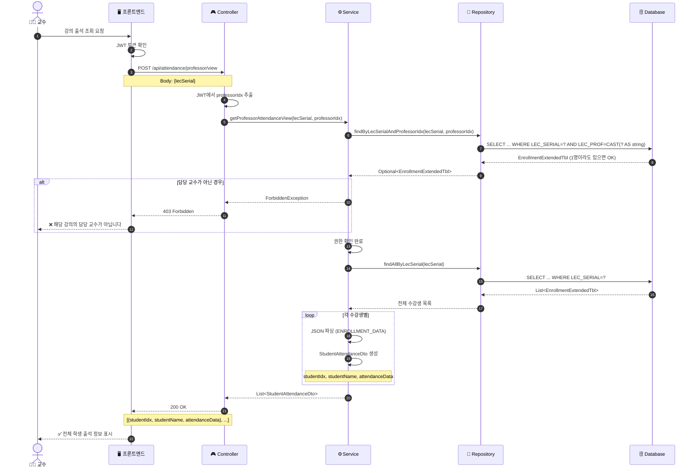
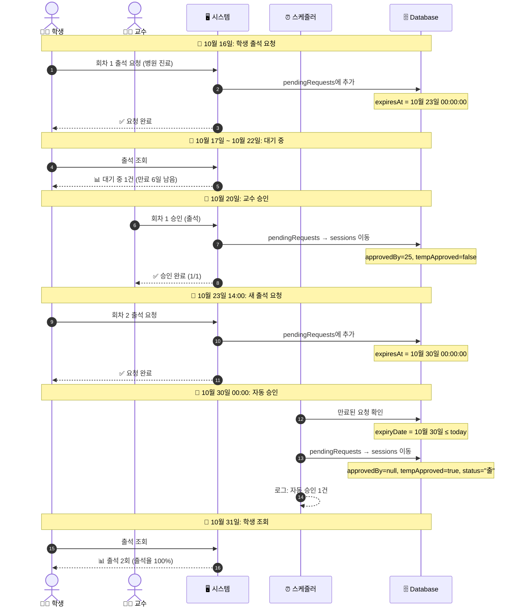
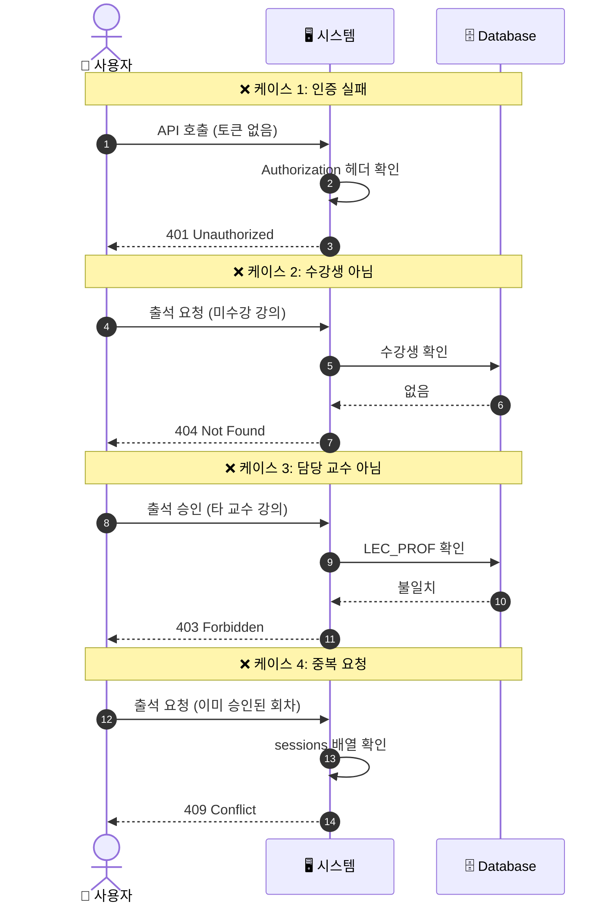

# 08. 시퀀스 다이어그램

> 📊 출결 관리 시스템의 전체 흐름을 시각화한 다이어그램

---

## 개요

출결 관리 시스템의 주요 플로우를 Mermaid 시퀀스 다이어그램으로 표현합니다.

### 다이어그램 목록

1. **학생 출석 요청 플로우**: 학생이 출석 요청을 보내는 과정
2. **교수 출석 승인 플로우**: 교수가 출석을 승인하는 과정
3. **자동 승인 플로우**: 스케줄러가 만료된 요청을 자동 승인
4. **출석 조회 플로우**: 학생/교수가 출석 기록을 조회

---

## 1. 학생 출석 요청 플로우

### 시퀀스 다이어그램



### 주요 단계 설명

| 단계 | 설명 | 비고 |
|-----|------|------|
| 1-3 | 학생이 출석 요청 전송 | JWT 토큰 필수 |
| 4 | JWT에서 studentIdx 추출 | 인증 단계 |
| 5-8 | 수강생 여부 확인 | DB 조회 |
| 9-10 | JSON 파싱 및 검증 | ENROLLMENT_DATA 파싱 |
| 11-12 | 중복 요청 검사 | sessions 배열 확인 |
| 13-15 | 요청 데이터 생성 | expiresAt = now + 7일 |
| 16-19 | DB 저장 | JSON 직렬화 후 UPDATE |
| 20-21 | 성공 응답 | 200 OK |

---

## 2. 교수 출석 승인 플로우

### 시퀀스 다이어그램



### 주요 단계 설명

| 단계 | 설명 | 비고 |
|-----|------|------|
| 1-3 | 교수가 승인 요청 전송 | attendanceRecords 배열 |
| 4 | JWT에서 professorIdx 추출 | 인증 단계 |
| 5-8 | 교수 권한 검증 | LEC_PROF = professorIdx |
| 9-10 | 권한 확인 완료 | ForbiddenException 방지 |
| 11-22 | 각 학생별 반복 처리 | 일괄 승인 지원 |
| 15-16 | pendingRequests 확인 | 없으면 스킵 |
| 17-21 | sessions로 이동 | approvedBy, tempApproved 설정 |
| 23-24 | 성공 응답 | (3/3) 형식 |

---

## 3. 자동 승인 플로우 (스케줄러)

### 시퀀스 다이어그램



### 주요 단계 설명

| 단계 | 설명 | 비고 |
|-----|------|------|
| 1 | 매일 자정 실행 | Cron: 0 0 0 * * * |
| 2-5 | 전체 수강생 조회 | findAll() |
| 6 | 현재 날짜 가져오기 | LocalDate.now() |
| 7-9 | JSON 파싱 | pendingRequests 확인 |
| 10-12 | 만료된 요청 필터링 | expiryDate ≤ today |
| 14-16 | sessions로 이동 | 자동 승인 플래그 설정 |
| 17-20 | DB 저장 | JSON 직렬화 후 UPDATE |
| 21 | 로그 출력 | 처리 결과 요약 |

---

## 4. 출석 조회 플로우

### 4-1. 학생 출석 조회



### 4-2. 교수 출석 조회



### 주요 차이점

| 구분 | 학생 조회 | 교수 조회 |
|-----|----------|----------|
| **권한 검증** | studentIdx 일치 확인 | professorIdx = LEC_PROF |
| **조회 범위** | 본인 1명 | 전체 수강생 |
| **반환 데이터** | AttendanceDataDto | List<StudentAttendanceDto> |
| **에러 케이스** | 404 Not Found | 403 Forbidden |

---

## 5. 전체 통합 플로우

### 종합 시퀀스 다이어그램



### 전체 플로우 요약

| 날짜 | 이벤트 | 액션 | 결과 |
|-----|--------|------|------|
| 10/16 14:30 | 학생 요청 | 회차 1 요청 | pendingRequests 추가 |
| 10/20 10:00 | 교수 승인 | 회차 1 승인 | sessions 이동 (교수) |
| 10/23 14:00 | 학생 요청 | 회차 2 요청 | pendingRequests 추가 |
| 10/30 00:00 | 자동 승인 | 회차 2 만료 | sessions 이동 (자동) |
| 10/31 09:00 | 학생 조회 | 출석 조회 | 2회 출석, 100% |

---

## 6. 에러 플로우

### 권한 오류 플로우



---

## 다이어그램 사용 가이드

### Mermaid 렌더링

이 다이어그램들은 Mermaid 문법으로 작성되었습니다. 다음 도구들에서 렌더링 가능합니다:

1. **GitHub**: 마크다운 파일에서 자동 렌더링
2. **VS Code**: Mermaid Preview 확장 설치
3. **Mermaid Live Editor**: https://mermaid.live
4. **Notion, Confluence**: Mermaid 블록 지원

### 다이어그램 수정

```markdown
# 참여자 추가
participant NewService as 🆕 새로운 서비스

# 노트 추가
Note over Service: 추가 설명

# 조건문
alt 조건
    Service->>DB: 동작
else 다른 조건
    Service->>DB: 다른 동작
end

# 반복문
loop 반복
    Service->>DB: 반복 동작
end
```

---

## 주의사항

### 프론트엔드 개발자

1. **비동기 처리**
   - API 호출은 async/await 사용
   - 로딩 상태 표시 필수

2. **에러 처리**
   - HTTP 상태 코드별 메시지 표시
   - 401/403/404/409 구분

3. **실시간 업데이트**
   - 자동 승인 후 출석율 변경 가능
   - 주기적 새로고침 또는 WebSocket 고려

### 백엔드 개발자

1. **트랜잭션**
   - JSON 업데이트는 원자적 처리
   - 롤백 시 데이터 일관성 유지

2. **동시성**
   - 같은 회차에 대한 동시 요청 처리
   - 낙관적 잠금 고려

3. **성능**
   - 대량 수강생 조회 시 페이징
   - 인덱스 활용 (LEC_SERIAL, USER_IDX)

---

## 다음 단계

- **[09. 예외 처리 및 확장](./09_예외_처리_및_확장.md)**: 전체 에러 처리 전략
- **[03. 학생 출석 요청](./03_학생_출석_요청.md)**: 요청 플로우 상세
- **[04. 교수 출석 승인](./04_교수_출석_승인.md)**: 승인 플로우 상세
- **[06. 자동 승인 메커니즘](./06_자동_승인_메커니즘.md)**: 스케줄러 플로우 상세

---

**📚 [목차로 돌아가기](./README.md)**
