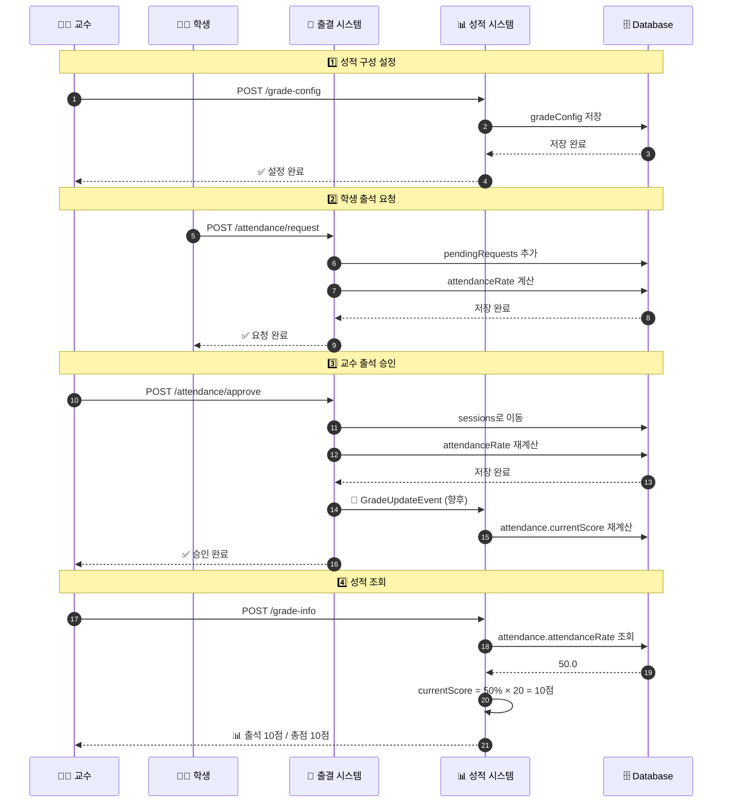

# 10. 성적 관리 시스템 연동

> 🔗 출결 관리와 성적 관리 시스템의 연동 가이드

---

## 개요

출결 관리 시스템은 **출석율(attendanceRate)**까지 계산합니다. 이를 **성적 점수**로 변환하는 것은 **성적 관리 시스템**의 역할입니다.

### 시스템 구분

| 시스템 | 역할 | 데이터 위치 |
|--------|------|------------|
| **출결 관리** | 출석율 계산 | `attendance.summary.attendanceRate` |
| **성적 관리** | 점수 변환 | `grade.attendance.currentScore` |

---

## 현재 데이터 구조

### 출결 관리가 저장하는 데이터

```json
{
  "attendance": {
    "summary": {
      "attended": 1,
      "late": 0,
      "absent": 1,
      "totalSessions": 2,
      "attendanceRate": 50.0,  // ← 출석율 (백분율)
      "updatedAt": "2025-10-23 15:14:28"
    },
    "sessions": [...],
    "pendingRequests": [...]
  }
}
```

### 성적 관리가 저장해야 하는 데이터

```json
{
  "grade": {
    "attendance": {
      "maxScore": 20,           // ← 출석 만점 (교수 설정)
      "currentScore": 10.0,     // ← 출석 점수 (attendanceRate × maxScore / 100)
      "percentage": 50.0        // ← 성적 백분율
    },
    "assignments": [...],
    "total": {
      "score": 10.0,            // ← 합계 점수
      "maxScore": 100,          // ← 전체 만점
      "percentage": 10.0        // ← 전체 백분율
    }
  }
}
```

---

## 문제 상황

### 현재 DB 상태

```json
{
  "grade": {},  // ← 비어있음!
  "attendance": {
    "summary": {
      "attendanceRate": 50.0
    }
  }
}
```

### 원인

1. **교수가 성적 구성을 설정하지 않음**
   - `grade-config` API를 실행하지 않음
   - `attendanceMaxScore`가 설정되지 않음

2. **이벤트 연동이 실행되지 않음**
   - 출석 변경 시 성적 재계산 이벤트 미발생
   - `GradeUpdateEvent` 연동 안 됨

---

## 해결 방법

### 1단계: 교수가 성적 구성 설정

교수가 먼저 강의별 성적 비율을 설정해야 합니다.

#### API 호출 예시

```javascript
// 브라우저 콘솔에서 실행
const token = window.authToken || localStorage.getItem('accessToken');

const response = await fetch(
    'https://bluecrab.chickenkiller.com/BlueCrab-1.0.0/api/enrollments/grade-config',
    {
        method: 'POST',
        headers: {
            'Content-Type': 'application/json',
            'Authorization': `Bearer ${token}`
        },
        body: JSON.stringify({
            action: 'set-config',
            lecSerial: 'ETH201',
            attendanceMaxScore: 20,      // ← 출석 만점 20점
            assignmentTotalScore: 50,    // 과제 만점 50점
            examTotalScore: 30,          // 시험 만점 30점
            latePenaltyPerSession: 0.5,  // 지각 1회당 0.5점 감점
            gradeDistribution: {
                A: 30,  // A등급 30%
                B: 40,  // B등급 40%
                C: 20,  // C등급 20%
                D: 10   // D등급 10%
            }
        })
    }
);

const data = await response.json();
console.log(data);
```

#### 응답 예시

```json
{
  "success": true,
  "message": "성적 구성이 설정되었습니다.",
  "data": {
    "lecIdx": 48,
    "gradeConfig": {
      "attendanceMaxScore": 20,
      "assignmentTotalScore": 50,
      "examTotalScore": 30,
      "latePenaltyPerSession": 0.5,
      "gradeDistribution": {"A": 30, "B": 40, "C": 20, "D": 10},
      "totalMaxScore": 100,
      "configuredAt": "2025-10-23T16:00:00"
    }
  }
}
```

#### DB 변경 사항

```json
{
  "gradeConfig": {  // ← 새로 추가됨!
    "attendanceMaxScore": 20,
    "assignmentTotalScore": 50,
    "examTotalScore": 30,
    "latePenaltyPerSession": 0.5,
    "gradeDistribution": {"A": 30, "B": 40, "C": 20, "D": 10},
    "totalMaxScore": 100,
    "configuredAt": "2025-10-23T16:00:00"
  },
  "grade": {},  // ← 아직 비어있음 (다음 단계 필요)
  "attendance": {
    "summary": {
      "attendanceRate": 50.0
    }
  }
}
```

---

## 2단계: 성적 재계산 실행

성적 구성 설정 후, 출석 점수를 계산해야 합니다.

### 방법 A: 수동 재계산 (권장)

교수가 성적 조회 시 자동으로 계산됩니다.

```javascript
// 학생별 성적 조회 (자동 계산)
const response = await fetch(
    'https://bluecrab.chickenkiller.com/BlueCrab-1.0.0/api/enrollments/grade-info',
    {
        method: 'POST',
        headers: {
            'Content-Type': 'application/json',
            'Authorization': `Bearer ${token}`
        },
        body: JSON.stringify({
            action: 'get-grade',
            lecSerial: 'ETH201',
            studentIdx: 6
        })
    }
);

const data = await response.json();
console.log(data);
```

#### 응답 예시

```json
{
  "success": true,
  "data": {
    "studentIdx": 6,
    "studentName": "김학생",
    "grade": {
      "attendance": {
        "maxScore": 20,
        "currentScore": 10.0,     // ← attendanceRate(50%) × 20점 = 10점
        "percentage": 50.0,
        "lateCount": 0,
        "latePenalty": 0.0
      },
      "assignments": [],
      "total": {
        "score": 10.0,
        "maxScore": 100,
        "percentage": 10.0
      }
    }
  }
}
```

### 방법 B: 이벤트 기반 자동 연동 (향후 구현)

출석 변경 시 자동으로 성적이 재계산됩니다.

```java
// AttendanceService.java (향후 개선)
@Transactional
public void approveAttendance(...) {
    // 1. 출석 승인 처리
    processApproval(...);
    
    // 2. 성적 재계산 이벤트 발행 ⭐
    eventPublisher.publishEvent(
        new GradeUpdateEvent(this, lecIdx, studentIdx, "ATTENDANCE")
    );
}
```

```java
// GradeEventListener.java
@Component
public class GradeEventListener {
    
    @EventListener
    @Async
    public void handleGradeUpdate(GradeUpdateEvent event) {
        // 출석 점수 재계산
        gradeCalculationService.calculateStudentGrade(
            event.getLecIdx(),
            event.getStudentIdx()
        );
    }
}
```

---

## 출석 점수 계산 로직

### 기본 공식

```
출석 점수 = (attendanceRate / 100) × attendanceMaxScore - latePenalty
```

### 예시 계산

#### 케이스 1: 출석율 50%, 지각 0회

```
출석율: 50%
출석 만점: 20점
지각 감점: 0점

출석 점수 = (50 / 100) × 20 - 0 = 10점
```

#### 케이스 2: 출석율 100%, 지각 3회

```
출석율: 100%
출석 만점: 20점
지각 1회당 감점: 0.5점
지각 횟수: 3회
지각 감점: 3 × 0.5 = 1.5점

출석 점수 = (100 / 100) × 20 - 1.5 = 18.5점
```

#### 케이스 3: 출석율 80%, 지각 2회

```
출석율: 80%
출석 만점: 20점
지각 1회당 감점: 0.5점
지각 횟수: 2회
지각 감점: 2 × 0.5 = 1.0점

출석 점수 = (80 / 100) × 20 - 1.0 = 15점
```

### Java 구현

```java
public double calculateAttendanceScore(
    AttendanceSummaryDto summary,
    GradeConfigDto config
) {
    // 1. 기본 출석 점수
    double baseScore = (summary.getAttendanceRate() / 100.0) 
                     * config.getAttendanceMaxScore();
    
    // 2. 지각 감점
    double latePenalty = summary.getLate() 
                       * config.getLatePenaltyPerSession();
    
    // 3. 최종 점수 (0점 미만 방지)
    double finalScore = Math.max(0, baseScore - latePenalty);
    
    return finalScore;
}
```

---

## 통합 데이터 구조

### 최종 DB 상태

```json
{
  "gradeConfig": {
    "attendanceMaxScore": 20,
    "assignmentTotalScore": 50,
    "examTotalScore": 30,
    "latePenaltyPerSession": 0.5,
    "gradeDistribution": {"A": 30, "B": 40, "C": 20, "D": 10},
    "totalMaxScore": 100,
    "configuredAt": "2025-10-23T16:00:00"
  },
  "grade": {
    "attendance": {
      "maxScore": 20,
      "currentScore": 10.0,
      "percentage": 50.0,
      "rate": 50.0,
      "lateCount": 0,
      "latePenalty": 0.0
    },
    "assignments": [],
    "total": {
      "score": 10.0,
      "maxScore": 100,
      "percentage": 10.0
    },
    "letterGrade": null  // 최종 배정 전
  },
  "attendance": {
    "summary": {
      "attended": 1,
      "late": 0,
      "absent": 1,
      "totalSessions": 2,
      "attendanceRate": 50.0,
      "updatedAt": "2025-10-23 15:14:28"
    },
    "sessions": [
      {
        "sessionNumber": 1,
        "status": "출",
        "requestDate": "2025-10-23 14:12:34",
        "approvedDate": "2025-10-23 15:01:24",
        "approvedBy": 25,
        "tempApproved": false
      },
      {
        "sessionNumber": 2,
        "status": "결",
        "requestDate": "2025-10-23 15:13:10",
        "approvedDate": "2025-10-23 15:14:28",
        "approvedBy": 25,
        "tempApproved": false
      }
    ],
    "pendingRequests": []
  },
  "enrollment": {
    "status": "ENROLLED",
    "enrollmentDate": "2025-10-17 22:55:20"
  }
}
```

---

## 시스템 간 데이터 흐름

### 플로우 다이어그램



---

## 시스템 비교

### 출결 관리 vs 성적 관리

| 항목 | 출결 관리 | 성적 관리 |
|-----|----------|----------|
| **저장 위치** | `attendance` 객체 | `grade` 객체 |
| **주요 데이터** | 출석율, sessions, pendingRequests | 출석 점수, 과제 점수, 총점 |
| **계산 항목** | attendanceRate (%) | currentScore (점수) |
| **업데이트 시점** | 출석 승인 시 | 성적 조회/계산 시 |
| **API 엔드포인트** | `/api/attendance/*` | `/api/enrollments/grade-*` |
| **담당 문서** | 출결관리/API_플로우_문서 | 성적관리/성적관리_시스템_문서.md |

---

## 개발자 가이드

### 프론트엔드 개발자

#### 1. 성적 구성 설정 화면

```jsx
function GradeConfigPage({ lecSerial }) {
    const [config, setConfig] = useState({
        attendanceMaxScore: 20,
        assignmentTotalScore: 50,
        examTotalScore: 30,
        latePenaltyPerSession: 0.5
    });
    
    const handleSave = async () => {
        const response = await fetch('/api/enrollments/grade-config', {
            method: 'POST',
            headers: {
                'Content-Type': 'application/json',
                'Authorization': `Bearer ${getToken()}`
            },
            body: JSON.stringify({
                action: 'set-config',
                lecSerial,
                ...config
            })
        });
        
        const data = await response.json();
        if (data.success) {
            alert('성적 구성이 설정되었습니다.');
        }
    };
    
    return (
        <div>
            <h2>성적 구성 설정</h2>
            <label>
                출석 만점:
                <input 
                    type="number" 
                    value={config.attendanceMaxScore}
                    onChange={(e) => setConfig({
                        ...config, 
                        attendanceMaxScore: Number(e.target.value)
                    })}
                />
            </label>
            {/* 나머지 입력 필드... */}
            <button onClick={handleSave}>저장</button>
        </div>
    );
}
```

#### 2. 통합 성적 표시

```jsx
function StudentGradePage({ lecSerial }) {
    const [gradeData, setGradeData] = useState(null);
    
    useEffect(() => {
        fetchGrade();
    }, [lecSerial]);
    
    const fetchGrade = async () => {
        const response = await fetch('/api/enrollments/grade-info', {
            method: 'POST',
            headers: {
                'Content-Type': 'application/json',
                'Authorization': `Bearer ${getToken()}`
            },
            body: JSON.stringify({
                action: 'get-grade',
                lecSerial
            })
        });
        
        const data = await response.json();
        if (data.success) {
            setGradeData(data.data);
        }
    };
    
    if (!gradeData) return <div>로딩 중...</div>;
    
    return (
        <div>
            <h2>성적 정보</h2>
            
            {/* 출석 점수 */}
            <div>
                <h3>출석</h3>
                <p>출석율: {gradeData.grade.attendance.rate}%</p>
                <p>출석 점수: {gradeData.grade.attendance.currentScore} / {gradeData.grade.attendance.maxScore}</p>
                <p>지각 {gradeData.grade.attendance.lateCount}회 (감점 {gradeData.grade.attendance.latePenalty}점)</p>
            </div>
            
            {/* 총점 */}
            <div>
                <h3>총점</h3>
                <p>점수: {gradeData.grade.total.score} / {gradeData.grade.total.maxScore}</p>
                <p>백분율: {gradeData.grade.total.percentage.toFixed(1)}%</p>
                <p>등급: {gradeData.grade.letterGrade || '미배정'}</p>
            </div>
        </div>
    );
}
```

### 백엔드 개발자

#### 1. 이벤트 발행 추가 (향후)

```java
@Service
@Transactional(readOnly = true)
public class AttendanceService {
    
    @Autowired
    private ApplicationEventPublisher eventPublisher;
    
    @Transactional
    public void approveAttendance(...) {
        // 출석 승인 처리
        int successCount = processApprovals(...);
        
        // 성적 재계산 이벤트 발행
        for (AttendanceApprovalRecordDto record : attendanceRecords) {
            eventPublisher.publishEvent(
                new GradeUpdateEvent(
                    this,
                    lecIdx,
                    record.getStudentIdx(),
                    "ATTENDANCE"
                )
            );
        }
        
        return successCount;
    }
}
```

#### 2. 이벤트 리스너 구현

```java
@Component
@Slf4j
public class GradeEventListener {
    
    @Autowired
    private GradeCalculationService gradeCalculationService;
    
    @EventListener
    @Async
    @Transactional
    public void handleGradeUpdate(GradeUpdateEvent event) {
        log.info("성적 재계산 이벤트: lecIdx={}, studentIdx={}, type={}", 
                 event.getLecIdx(), 
                 event.getStudentIdx(), 
                 event.getUpdateType());
        
        try {
            // 성적 재계산
            gradeCalculationService.calculateStudentGrade(
                event.getLecIdx(),
                event.getStudentIdx()
            );
            
            log.info("성적 재계산 완료: studentIdx={}", event.getStudentIdx());
            
        } catch (Exception e) {
            log.error("성적 재계산 실패: studentIdx={}", 
                      event.getStudentIdx(), e);
        }
    }
}
```

---

## 주의사항

### 1. 성적 구성 설정 필수

출석 점수를 계산하려면 **반드시 교수가 먼저 성적 구성을 설정**해야 합니다.

```
출석 승인 → attendanceRate 계산 ✅
성적 구성 설정 → attendanceMaxScore 설정 ✅
성적 조회 → currentScore 계산 ✅
```

### 2. 시스템 분리

출결 관리와 성적 관리는 **독립적인 시스템**입니다:

- 출결 관리: 출석 여부 관리
- 성적 관리: 점수 계산 및 등급 배정

### 3. 데이터 일관성

두 시스템의 데이터는 **동일한 ENROLLMENT_DATA**에 저장되므로:

- JSON 구조 충돌 방지
- 동시 업데이트 제어 필요
- 트랜잭션 범위 주의

---

## 다음 단계

### 단계별 실행 가이드

1. ✅ **출석 관리 테스트 완료** (현재 상태)
   - 출석 요청/승인/조회 모두 작동
   - attendanceRate 계산 완료

2. 🔄 **성적 구성 설정** (다음 단계)
   - 교수가 grade-config API 실행
   - attendanceMaxScore 등 설정

3. 🔄 **성적 조회 테스트**
   - grade-info API로 출석 점수 확인
   - currentScore 계산 검증

4. 🔄 **이벤트 연동** (향후)
   - GradeUpdateEvent 발행
   - 자동 재계산 구현

---

## 관련 문서

- **[성적 관리 시스템 문서](../../성적관리/성적관리_시스템_문서.md)**: 전체 성적 관리 시스템
- **[01. 개요](./01_개요.md)**: 출결 관리 시스템 개요
- **[07. 데이터 구조](./07_데이터_구조.md)**: attendance 데이터 구조
- **[README.md](./README.md)**: 전체 문서 목차

---

**📚 [목차로 돌아가기](./README.md)**
