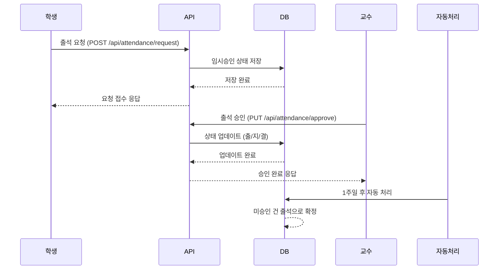

# 출석 요청/승인 기능 플로우 문서

## 개요

출결 관리 시스템의 출석 요청 및 승인 기능을 위한 상세 플로우 문서입니다. 학생의 출석 요청부터 교수의 승인까지의 전체 프로세스를 정의합니다.

## 구성 요소

- **출석 요청 API** (학생용)
- **출석 승인 API** (교수용)

## 상세 플로우

### 1. 학생 출석 요청

학생이 출석 요청 API를 사용하여 수강 중인 특정 강의의 출석을 요청합니다.

**요청 조건:**

- 수강 중인 강의에 한함
- 특정 회차의 강의 출석 요청 (예: 80회 강의 중 n회차)
- 프론트엔드에서 출석 요청 가능한 회차를 필터링하여 제공

**API 엔드포인트:** `POST /api/attendance/request`

**요청 파라미터:**

```json
{
  "lectureId": "강의 ID",
  "sessionNumber": "강의 회차 (예: 1, 2, 3...)",
  "studentId": "학생 ID"
}
```

### 2. 출석 승인 처리 (교수)

교수가 출석 승인 API를 사용하여 담당 강의의 학생 출석 요청을 처리합니다.

**승인 옵션:**

- 출석 (출)
- 지각 (지)
- 결석 (결)

**API 엔드포인트:** `PUT /api/attendance/approve`

**요청 파라미터:**

```json
{
  "lectureId": "강의 ID",
  "sessionNumber": "강의 회차",
  "attendanceRecords": [
    {
      "studentId": "학생 ID",
      "status": "출석|지각|결석"
    }
  ]
}
```

### 3. 자동 승인 메커니즘

학생의 출석 요청이 접수되면 다음과 같은 자동 처리 로직이 적용됩니다:

**임시 승인:**

- 출석 요청 즉시 "임시 승인" 상태로 설정
- 유효 기간: 1주일 (7일)

**자동 확정:**

- 1주일 이내에 교수 승인/거부 없음 → 자동으로 "출석"으로 확정
- 교수 거부(지각/결석) 시 → 해당 상태로 확정

**일주일 탐지 로직:**

```java
// pendingRequests의 expiresAt 필드 기준
LocalDateTime now = LocalDateTime.now();
LocalDateTime expiresAt = request.getExpiresAt();

if (now.isAfter(expiresAt)) {
    // 1주일 경과: 자동 출석 처리
    status = "출";
    tempApproved = false;
    // sessions 배열에 추가
}
```

**스케줄러 구현:**

```java
@Scheduled(fixedRate = 3600000) // 1시간마다 실행
public void processExpiredRequests() {
    // 모든 enrollment에서 pendingRequests 검사
    // 만료된 요청을 sessions로 이동 및 자동 출석 처리
}
```

## 데이터베이스 설계 (DB 변경 최소화 방안)

### 기존 구조 활용

현재 `ENROLLMENT_EXTENDED_TBL.ENROLLMENT_DATA` JSON 필드를 확장하여 사용합니다.

**현재 attendance 구조:**

```json
{
  "attendance": {
    "attended": 30,
    "late": 5,
    "absent": 5,
    "updatedAt": "2025-10-20 15:51:09"
  }
}
```

**확장된 attendance 구조:**

```json
{
  "attendance": {
    "summary": {
      "attended": 30,
      "late": 5,
      "absent": 5,
      "totalSessions": 80,
      "attendanceRate": 37.5,  // (attended / totalSessions) * 100
      "updatedAt": "2025-10-20 15:51:09"
    },
    "sessions": [
      {
        "sessionNumber": 1,
        "status": "출",
        "requestDate": "2025-10-22T10:00:00",
        "approvedDate": "2025-10-22T10:30:00",
        "approvedBy": 123,
        "tempApproved": false
      },
      {
        "sessionNumber": 2,
        "status": "지",
        "requestDate": "2025-10-22T14:00:00",
        "approvedDate": "2025-10-22T14:15:00",
        "approvedBy": 123,
        "tempApproved": false
      }
    ],
    "pendingRequests": [
      {
        "sessionNumber": 3,
        "requestDate": "2025-10-22T16:00:00",
        "expiresAt": "2025-10-29T16:00:00",
        "tempApproved": true
      }
    ]
  }
}
```

**합산 로직 (출석율 계산):**

```java
public void updateAttendanceSummary(JsonNode attendance) {
    int attended = 0, late = 0, absent = 0;
    ArrayNode sessions = (ArrayNode) attendance.get("sessions");

    for (JsonNode session : sessions) {
        String status = session.get("status").asText();
        switch (status) {
            case "출": attended++; break;
            case "지": late++; break;
            case "결": absent++; break;
        }
    }

    int totalSessions = sessions.size();
    double attendanceRate = totalSessions > 0 ? (attended * 100.0) / totalSessions : 0.0;

    // summary 업데이트
    ObjectNode summary = (ObjectNode) attendance.get("summary");
    summary.put("attended", attended);
    summary.put("late", late);
    summary.put("absent", absent);
    summary.put("totalSessions", totalSessions);
    summary.put("attendanceRate", attendanceRate);
}
```

### 데이터 마이그레이션

기존 데이터는 `summary` 필드로 이동시키고, `sessions`와 `pendingRequests`를 추가합니다.

### 장점

- **DB 스키마 변경 없음**: JSON 구조 확장만으로 구현 가능
- **역호환성 유지**: 기존 데이터 구조 보존
- **유연한 확장**: 필요시 추가 필드 쉽게 확장 가능

### 구현 고려사항

- **JSON 업데이트**: 부분 업데이트를 위한 효율적인 쿼리 필요
- **인덱싱**: JSON 필드 검색을 위한 인덱스 고려
- **백업**: 데이터 구조 변경 전 반드시 백업 수행
- **배열 관리**: pendingRequests 배열이 무한정 늘어나지 않도록 스케줄러로 정리

### Pending Requests 관리 방안

**배열 크기 제한**: 강의 최대 회차가 80회이므로 `pendingRequests` 배열도 최대 80개로 제한됨

- 각 학생-강의 조합당 최대 80개의 pending 요청만 존재 가능
- 배열 길이가 무한정 늘어나지 않으므로 별도 정리 로직 불필요
- 메모리 사용량 예측 가능하고 관리 용이

**장점**:

- 구현 단순화: 스케줄러나 별도 정리 로직 불필요
- 성능 예측 가능: 최대 크기가 명확함
- 유지보수 용이: 복잡한 정리 로직 제거

## 시퀀스 다이어그램



## 예외 처리

- **중복 요청:** 동일 회차에 대한 재요청 시 기존 요청 업데이트
- **권한 검증:** 학생은 본인 강의만, 교수는 담당 강의만 접근 가능
- **기간 초과:** 강의 종료 후 일정 기간(예: 1개월)까지만 요청 가능

## 향후 확장 고려사항

- 출석 QR코드 스캔 기능
- GPS 기반 자동 출석 체크
- 출석 통계 및 리포트 기능
- 출석 알림 시스템 (푸시/이메일)
