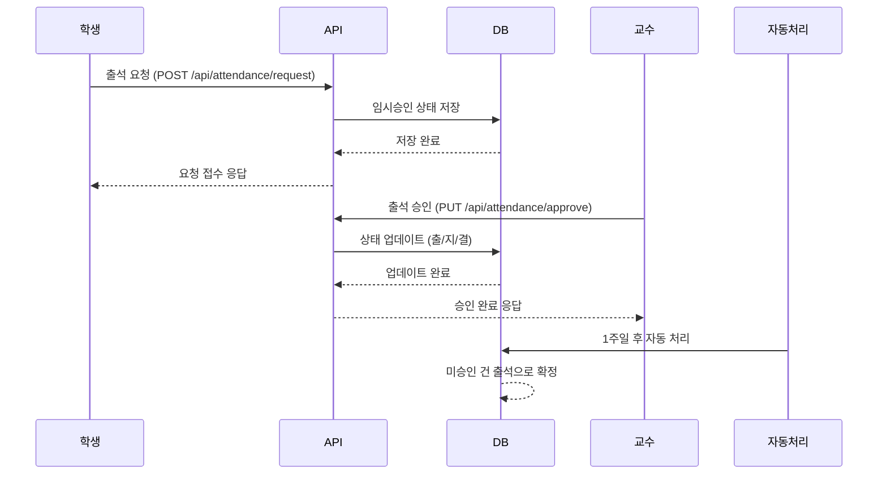

# 출석 요청/승인 기능 플로우 문서

## 개요

출결 관리 시스템의 출석 요청 및 승인 기능을 위한 상세 플로우 문서입니다. 학생의 출석 요청부터 교수의 승인까지의 전체 프로세스를 정의합니다.

## 구성 요소

- **출석 요청 API** (학생용)
- **출석 승인 API** (교수용)

## 상세 플로우

### 1. 학생 출석 요청

학생이 출석 요청 API를 사용하여 수강 중인 특정 강의의 출석을 요청합니다.

**요청 조건:**

- 수강 중인 강의에 한함
- 특정 회차의 강의 출석 요청 (예: 80회 강의 중 n회차)
- 프론트엔드에서 출석 요청 가능한 회차를 필터링하여 제공

**API 엔드포인트:** `POST /api/attendance/request`

**요청 파라미터:**

```json
{
  "lecSerial": "CS101",
  "sessionNumber": 1,
  "requestReason": "교통체증"
}
```

**참고:** `studentIdx`는 JWT 토큰에서 자동으로 추출됩니다.

### 2. 출석 승인 처리 (교수)

교수가 출석 승인 API를 사용하여 담당 강의의 학생 출석 요청을 처리합니다.

**승인 옵션:**

- 출석 (출)
- 지각 (지)
- 결석 (결)

**API 엔드포인트:** `POST /api/attendance/approve`

**요청 파라미터:**

```json
{
  "lecSerial": "CS101",
  "sessionNumber": 1,
  "attendanceRecords": [
    {
      "studentIdx": 6,
      "status": "출"
    }
  ]
}
```

**참고:** 
- `professorIdx`는 JWT 토큰에서 자동으로 추출됩니다.
- 출석 상태는 "출", "지", "결" 중 하나를 사용합니다.

**교수 권한 검증:**

교수가 해당 강의의 담당 교수인지 검증하는 로직:

```java
// Repository Query (EnrollmentExtendedTblRepository.java)
@Query("SELECT e FROM EnrollmentExtendedTbl e " +
       "WHERE e.lecTbl.lecSerial = :lecSerial " +
       "AND e.lecTbl.lecProf = CAST(:professorIdx AS string)")
Optional<EnrollmentExtendedTbl> findByLecSerialAndProfessorIdx(
    @Param("lecSerial") String lecSerial, 
    @Param("professorIdx") Integer professorIdx
);
```

**검증 흐름:**

1. JWT 토큰에서 `professorIdx` 추출 (예: `25`)
2. 요청한 `lecSerial` 값 사용 (예: `'ETH201'`)
3. `LEC_TBL`에서 `LEC_SERIAL='ETH201'`인 강의 조회
4. 해당 강의의 `LEC_PROF` 필드와 `CAST(professorIdx AS string)` 비교
   - `LEC_PROF`는 `USER_IDX`를 문자열로 저장 (예: `'25'`)
   - `CAST(25 AS string)` = `'25'` ✅
5. 일치하면 권한 확인 완료, 불일치하면 403 Forbidden

**장점:**
- ✅ **단순함**: 직접 비교로 성능 향상
- ✅ **효율성**: 불필요한 `USER_TBL` JOIN/서브쿼리 제거
- ✅ **명확함**: `LEC_PROF`가 직접 `USER_IDX` 저장

### 3. 자동 승인 메커니즘

학생의 출석 요청이 접수되면 다음과 같은 자동 처리 로직이 적용됩니다:

**임시 승인:**

- 출석 요청 즉시 "임시 승인" 상태로 설정
- 유효 기간: 날짜 기준 7일 (시간 무관)
- 만료 날짜 계산: 요청일 + 7일의 00:00:00

**자동 확정:**

- 7일 후 날짜의 오전 5시 스케줄러 실행 시 → 자동으로 "출석"으로 확정
- 교수 승인/거부(출/지/결) 시 → 해당 상태로 확정
- 예: 10/23 08:00 요청 → 10/30 00:00:00 만료 → 10/30 05:00 처리

**날짜 기준 만료 로직:**

```java
// pendingRequests의 expiresAt 필드는 날짜 기준으로 설정
LocalDateTime expiresAt = LocalDateTime.now()
    .plusDays(7)
    .withHour(0).withMinute(0).withSecond(0).withNano(0);

// 스케줄러에서 날짜 기준 비교
LocalDate today = LocalDate.now();
LocalDate expiresDate = request.getExpiresAt().toLocalDate();

if (!expiresDate.isAfter(today)) {
    // 만료 날짜가 오늘이거나 이전: 자동 출석 처리
    status = "출";
    tempApproved = true;
    // sessions 배열에 추가
}
```

**스케줄러 구현:**

```java
@Scheduled(cron = "0 0 5 * * *")  // 매일 오전 5시 실행
@Transactional
public void processExpiredRequests() {
    LocalDate today = LocalDate.now();  // 오늘 날짜 (시간 제외)
    
    // 모든 enrollment에서 pendingRequests 검사
    for (EnrollmentExtendedTbl enrollment : enrollmentRepository.findAll()) {
        AttendanceDataDto attendanceData = parseAttendanceData(
            enrollment.getEnrollmentData()
        );
        
        if (attendanceData.getPendingRequests() == null) {
            continue;
        }
        
        // 만료된 요청 필터링 (날짜 기준)
        List<AttendancePendingRequestDto> expiredRequests = 
            attendanceData.getPendingRequests().stream()
                .filter(request -> {
                    LocalDate expiresDate = request.getExpiresAt().toLocalDate();
                    // 만료 날짜가 오늘이거나 이전이면 만료됨
                    return !expiresDate.isAfter(today);
                })
                .collect(Collectors.toList());
        
        // sessions에 "출석"으로 이동
        for (AttendancePendingRequestDto expiredRequest : expiredRequests) {
            moveToSessions(attendanceData, expiredRequest);
        }
        
        // pendingRequests에서 제거
        attendanceData.getPendingRequests().removeAll(expiredRequests);
        
        // summary 재계산 및 저장
        recalculateSummary(attendanceData);
        String updatedJson = serializeToEnrollmentData(
            attendanceData, 
            enrollment.getEnrollmentData()
        );
        enrollment.setEnrollmentData(updatedJson);
        enrollmentRepository.save(enrollment);
    }
}
```

## 데이터베이스 설계 (DB 변경 최소화 방안)

### 기존 구조 활용

현재 `ENROLLMENT_EXTENDED_TBL.ENROLLMENT_DATA` JSON 필드를 확장하여 사용합니다.

**현재 attendance 구조:**

```json
{
  "attendance": {
    "attended": 30,
    "late": 5,
    "absent": 5,
    "updatedAt": "2025-10-20 15:51:09"
  }
}
```

**확장된 attendance 구조:**

```json
{
  "attendance": {
    "summary": {
      "attended": 30,
      "late": 5,
      "absent": 5,
      "totalSessions": 80,
      "attendanceRate": 37.5,  // (attended / totalSessions) * 100
      "updatedAt": "2025-10-20 15:51:09"
    },
    "sessions": [
      {
        "sessionNumber": 1,
        "status": "출",
        "requestDate": "2025-10-22 10:00:00",
        "approvedDate": "2025-10-22 10:30:00",
        "approvedBy": 25,
        "tempApproved": false
      },
      {
        "sessionNumber": 2,
        "status": "지",
        "requestDate": "2025-10-22 14:00:00",
        "approvedDate": "2025-10-22 14:15:00",
        "approvedBy": 25,
        "tempApproved": false
      }
    ],
    "pendingRequests": [
      {
        "sessionNumber": 3,
        "requestDate": "2025-10-23 10:00:00",
        "expiresAt": "2025-10-30 00:00:00",
        "requestReason": "교통체증",
        "tempApproved": true
      }
    ]
  }
}
```

**합산 로직 (출석율 계산):**

```java
public void updateAttendanceSummary(JsonNode attendance) {
    int attended = 0, late = 0, absent = 0;
    ArrayNode sessions = (ArrayNode) attendance.get("sessions");

    for (JsonNode session : sessions) {
        String status = session.get("status").asText();
        switch (status) {
            case "출": attended++; break;
            case "지": late++; break;
            case "결": absent++; break;
        }
    }

    int totalSessions = sessions.size();
    double attendanceRate = totalSessions > 0 ? (attended * 100.0) / totalSessions : 0.0;

    // summary 업데이트
    ObjectNode summary = (ObjectNode) attendance.get("summary");
    summary.put("attended", attended);
    summary.put("late", late);
    summary.put("absent", absent);
    summary.put("totalSessions", totalSessions);
    summary.put("attendanceRate", attendanceRate);
}
```

### 데이터 마이그레이션

기존 데이터는 `summary` 필드로 이동시키고, `sessions`와 `pendingRequests`를 추가합니다.

### 장점

- **DB 스키마 변경 없음**: JSON 구조 확장만으로 구현 가능
- **역호환성 유지**: 기존 데이터 구조 보존
- **유연한 확장**: 필요시 추가 필드 쉽게 확장 가능

### 구현 고려사항

- **JSON 업데이트**: 부분 업데이트를 위한 효율적인 쿼리 필요
- **인덱싱**: JSON 필드 검색을 위한 인덱스 고려
- **백업**: 데이터 구조 변경 전 반드시 백업 수행
- **배열 관리**: pendingRequests 배열이 무한정 늘어나지 않도록 스케줄러로 정리

### Pending Requests 관리 방안

**배열 크기 제한**: 강의 최대 회차가 80회이므로 `pendingRequests` 배열도 최대 80개로 제한됨

- 각 학생-강의 조합당 최대 80개의 pending 요청만 존재 가능
- 배열 길이가 무한정 늘어나지 않으므로 별도 정리 로직 불필요
- 메모리 사용량 예측 가능하고 관리 용이

**장점**:

- 구현 단순화: 스케줄러나 별도 정리 로직 불필요
- 성능 예측 가능: 최대 크기가 명확함
- 유지보수 용이: 복잡한 정리 로직 제거

## 시퀀스 다이어그램



## 예외 처리

- **중복 요청:** 동일 회차에 대한 재요청 시 기존 요청 업데이트
- **권한 검증:** 학생은 본인 강의만, 교수는 담당 강의만 접근 가능
- **기간 초과:** 강의 종료 후 일정 기간(예: 1개월)까지만 요청 가능

## 향후 확장 고려사항

- 출석 QR코드 스캔 기능
- GPS 기반 자동 출석 체크
- 출석 통계 및 리포트 기능
- 출석 알림 시스템 (푸시/이메일)
