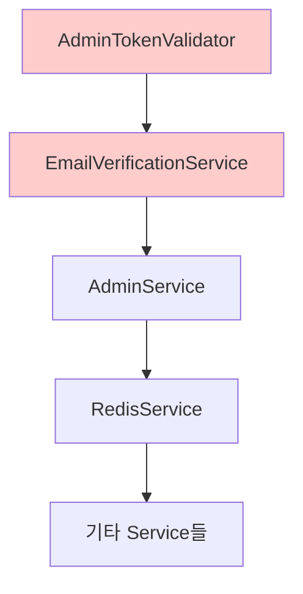

# BlueCrab 백엔드 의존성 관계 완전 분석

> **분석 일자**: 2025-09-28  
> **분석 범위**: Controller, Service, Repository, Util 레이어간 의존성  
> **분석 방법**: @Autowired, 생성자 주입, 직접 호출 관계 추적

## 🏗️ 전체 아키텍처 의존성 다이어그램

```mermaid
graph TD
    %% Controller Layer
    AC[AuthController] --> AS[AuthService]
    AC --> RU[RequestUtils]
    
    AdminC[AdminController] --> AdminS[AdminService]
    AdminC --> RU
    
    AEAC[AdminEmailAuthController] --> ES[EmailService]
    AEAC --> ATV[AdminTokenValidator]
    AEAC --> ACG[AuthCodeGenerator]
    AEAC --> ACV[AuthCodeValidator]
    AEAC --> ATR[AdminTblRepository]
    
    BC[BoardController] --> BS[BoardService]
    
    UC[UserController] --> UTS[UserTblService]
    
    PC[ProfileController] --> PS[ProfileService]
    
    PRC[PasswordResetController] --> PRS[PasswordResetService]
    
    %% Service Layer Dependencies
    AS --> UTR[UserTblRepository]
    AS --> JU[JwtUtil]
    AS --> AppConfig
    
    AdminS --> ATR
    AdminS --> EVS[EmailVerificationService]
    AdminS --> RS[RedisService]
    AdminS --> JU
    
    BS --> BR[BoardRepository]
    BS --> ATR
    BS --> UTR
    
    UTS --> UTR
    
    PS --> PVR[ProfileViewRepository]
    PS --> ICS[ImageCacheService]
    PS --> MIS[MinIOService]
    
    PRS --> ES
    PRS --> RS
    
    %% Util Dependencies
    ATV --> EVS
    UNE[UserNameExtractor] --> UTR
    UNE --> ATR
    
    %% Security Layer
    CUDS[CustomUserDetailsService] --> UTR
    CUDS --> ATR
    
    %% External Dependencies
    ES --> JavaMailSender
    RS --> RedisTemplate
    MIS --> MinIOClient
```



## 📊 레이어별 의존성 상세 분석

### 🎯 **1. Controller 레이어 (14개 클래스)**

#### **AuthController** → **의존성 2개**
| 의존성 클래스 | 타입 | 용도 | 위험도
|-------------|------|------|--------|
| `AuthService` | Service | 인증 비즈니스 로직 | 🟢 낮음 |
| `RequestUtils` | Util | IP 주소 추출 | 🟢 낮음 |

#### **AdminController** → **의존성 2개**
| 의존성 클래스 | 타입 | 용도 | 위험도
|-------------|------|------|--------|
| `AdminService` | Service | 관리자 인증 로직 | 🟢 낮음 |
| `RequestUtils` | Util | IP 주소 추출 | 🟢 낮음 |

#### **AdminEmailAuthController** → **의존성 5개** ⚠️
| 의존성 클래스 | 타입 | 용도 | 위험도
|-------------|------|------|--------|
| `AdminTblRepository` | Repository | **직접 DB 접근** | 🔴 높음 |
| `EmailService` | Service | 이메일 발송 | 🟡 중간 |
| `AdminTokenValidator` | Util | 토큰 검증 | 🟡 중간 |
| `AuthCodeGenerator` | Util | 인증 코드 생성 | 🟡 중간 |
| `AuthCodeValidator` | Util | 인증 코드 검증 | 🟡 중간 |

#### **BoardController** → **의존성 1개**
| 의존성 클래스 | 타입 | 용도 | 위험도
|-------------|------|------|--------|
| `BoardService` | Service | 게시판 비즈니스 로직 | 🟢 낮음 |

#### **UserController** → **의존성 1개**
| 의존성 클래스 | 타입 | 용도 | 위험도
|-------------|------|------|--------|
| `UserTblService` | Service | 사용자 관리 로직 | 🟢 낮음 |

#### **ProfileController** → **의존성 1개**
| 의존성 클래스 | 타입 | 용도 | 위험도
|-------------|------|------|--------|
| `ProfileService` | Service | 프로필 관리 로직 | 🟢 낮음 |

#### **PasswordResetController** → **의존성 1개**
| 의존성 클래스 | 타입 | 용도 | 위험도
|-------------|------|------|--------|
| `PasswordResetService` | Service | 비밀번호 재설정 로직 | 🟢 낮음 |

### 🔧 **2. Service 레이어 (13개 클래스)**

#### **AuthService** → **의존성 4개**
| 의존성 클래스 | 타입 | 용도 | 위험도
|-------------|------|------|--------|
| `UserTblRepository` | Repository | 사용자 DB 조회 | 🟢 낮음 |
| `JwtUtil` | Util | JWT 토큰 처리 | 🟢 낮음 |
| `AppConfig` | Config | 설정 정보 | 🟢 낮음 |
| `PasswordEncoder` | Spring | 비밀번호 암호화 | 🟢 낮음 |

#### **AdminService** → **의존성 4개**
| 의존성 클래스 | 타입 | 용도 | 위험도
|-------------|------|------|--------|
| `AdminTblRepository` | Repository | 관리자 DB 조회 | 🟢 낮음 |
| `EmailVerificationService` | Service | 이메일 인증 | 🟡 중간 |
| `RedisService` | Service | 캐시 관리 | 🟡 중간 |
| `JwtUtil` | Util | JWT 토큰 처리 | 🟢 낮음 |

#### **BoardService** → **의존성 3개**
| 의존성 클래스 | 타입 | 용도 | 위험도
|-------------|------|------|--------|
| `BoardRepository` | Repository | 게시판 DB 조회 | 🟢 낮음 |
| `AdminTblRepository` | Repository | 관리자 정보 확인 | 🟡 중간 |
| `UserTblRepository` | Repository | 사용자 정보 확인 | 🟡 중간 |

#### **UserTblService** → **의존성 1개**
| 의존성 클래스 | 타입 | 용도 | 위험도
|-------------|------|------|--------|
| `UserTblRepository` | Repository | 사용자 DB 조회 | 🟢 낮음 |

#### **ProfileService** → **의존성 3개**
| 의존성 클래스 | 타입 | 용도 | 위험도
|-------------|------|------|--------|
| `ProfileViewRepository` | Repository | 프로필 뷰 조회 | 🟢 낮음 |
| `ImageCacheService` | Service | 이미지 캐시 관리 | 🟡 중간 |
| `MinIOService` | Service | 파일 스토리지 | 🟡 중간 |

#### **EmailService** → **의존성 1개**
| 의존성 클래스 | 타입 | 용도 | 위험도
|-------------|------|------|--------|
| `JavaMailSender` | Spring | 이메일 발송 | 🟢 낮음 |

### 🛠️ **3. Repository 레이어 (4개 클래스)**

#### **Repository 목록**
| Repository | Entity | 주요 의존 Service |
|-----------|--------|------------------|
| `UserTblRepository` | UserTbl | AuthService, UserTblService, BoardService |
| `AdminTblRepository` | AdminTbl | AdminService, BoardService |
| `BoardRepository` | BoardTbl | BoardService |
| `ProfileViewRepository` | ProfileView | ProfileService |

### 🔧 **4. Util 레이어 의존성 분석**

#### **인증/보안 관련 Util (7개)**
| Util 클래스 | 의존성 | 기능 중복도 |
|------------|--------|-----------|
| `JwtUtil` | 없음 (독립적) | 🟢 낮음 |
| `AdminJwtTokenBuilder` | 없음 | 🔴 높음 (JwtUtil과 중복) |
| `AdminTokenValidator` | EmailVerificationService | 🔴 높음 |
| `AuthCodeGenerator` | 없음 | 🟡 중간 |
| `AuthCodeValidator` | 없음 | 🟡 중간 |
| `SHA256Util` | 없음 | 🟡 중간 (PasswordEncoder와 중복) |
| `UserVerificationUtils` | 없음 | 🟡 중간 |

#### **Rate Limiting 관련 Util (3개)**
| Util 클래스 | 의존성 | 기능 중복도 |
|------------|--------|-----------|
| `MailAuthRateLimitUtils` | 없음 | 🔴 높음 |
| `PasswordResetRateLimiter` | 없음 | 🔴 높음 |
| `AccountRecoveryRateLimiter` | 없음 | 🔴 높음 |

#### **사용자 정보 추출 Util**
| Util 클래스 | 의존성 | 용도 |
|------------|--------|-----|
| `UserNameExtractor` | UserTblRepository, AdminTblRepository | 사용자명 추출 |

## 🚨 **심각한 의존성 문제 분석**

### ⚠️ **1. Controller → Repository 직접 의존 (안티패턴)**

```java
// ❌ 문제: AdminEmailAuthController → AdminTblRepository 직접 접근
@RestController
public class AdminEmailAuthController {
    @Autowired
    private AdminTblRepository adminTblRepository; // 위반!
    
    // Controller가 직접 Repository에 접근하면 안됨
}
```

**해결방안:**
```java
// ✅ 올바른 방식: Controller → Service → Repository
@RestController  
public class AdminEmailAuthController {
    @Autowired
    private AdminService adminService; // Service를 통한 접근
}
```

### ⚠️ **2. 순환 의존성 위험**



### ⚠️ **3. 중복 기능으로 인한 의존성 복잡화**

#### **JWT 처리 중복**
- `JwtUtil` (일반 사용자용)
- `AdminJwtTokenBuilder` (관리자용) 
- `AdminTokenValidator` (관리자 검증용)

#### **Rate Limiting 중복**
- `MailAuthRateLimitUtils`
- `PasswordResetRateLimiter` 
- `AccountRecoveryRateLimiter`

#### **암호화 중복**
- `SHA256Util` (관리자용)
- `PasswordEncoder` (일반 사용자용)

## 💡 **리팩토링 우선순위**

### 🔴 **최우선 (Critical)**

#### 1. **Controller → Repository 직접 접근 제거**
```java
// 현재 문제 상황
AdminEmailAuthController → AdminTblRepository ❌

// 해결 방안
AdminEmailAuthController → AdminService → AdminTblRepository ✅
```

#### 2. **중복 JWT 클래스 통합**
```java
// 통합 전 (3개 클래스)
JwtUtil + AdminJwtTokenBuilder + AdminTokenValidator

// 통합 후 (1개 클래스)
UnifiedJwtUtil {
    // 일반/관리자 공통 처리
    generateToken(user, role)
    validateToken(token, role)
}
```

### 🟡 **높은 우선순위**

#### 1. **Rate Limiter 클래스 통합**
```java
// 통합 전 (3개 클래스)
MailAuthRateLimitUtils
PasswordResetRateLimiter  
AccountRecoveryRateLimiter

// 통합 후 (1개 클래스)
RateLimitManager {
    checkLimit(type, identifier)
    incrementAttempt(type, identifier)
}
```

#### 2. **Service 간 의존성 단순화**
- AdminService ← EmailVerificationService 의존성 제거
- ProfileService 내부 Service 의존성 최적화

### 🟢 **중간 우선순위**

#### 1. **Util 클래스 역할 명확화**
- 단일 책임 원칙 적용
- 공통 기능 추상화

#### 2. **Repository 접근 패턴 표준화**
- 모든 Service에서 동일한 Repository 접근 방식 적용

## 📈 **의존성 메트릭 분석**

### **복잡도 지수**
| 레이어 | 평균 의존성 수 | 최대 의존성 | 문제 클래스 |
|--------|---------------|-------------|------------|
| Controller | 1.8개 | 5개 | AdminEmailAuthController |
| Service | 2.3개 | 4개 | AdminService, ProfileService |
| Util | 0.4개 | 2개 | UserNameExtractor |

### **순환 의존성 위험도**
- **높음**: Admin 관련 클래스들
- **중간**: Email/Auth 관련 클래스들  
- **낮음**: Board, User 관련 클래스들

### **리팩토링 영향도**
- **AdminEmailAuthController 수정**: 높음 (5개 의존성)
- **JWT 클래스 통합**: 중간 (3개 클래스 영향)
- **Rate Limiter 통합**: 낮음 (독립적 클래스들)

---

## 📋 **다음 단계 (Phase 2)**

1. **Controller → Repository 직접 접근 수정**
2. **중복 기능 클래스 통합 계획**
3. **순환 의존성 해결 방안**
4. **성능 영향도 분석**

*이 문서는 의존성 관계 완전 분석 결과이며, 아키텍처 개선을 위한 구체적 실행 계획을 포함합니다.*