# Blue Crab LMS - 전체 시스템 아키텍처 다이어그램

## 1. 레이어드 아키텍처 (Layered Architecture)

### 1.1 4계층 구조

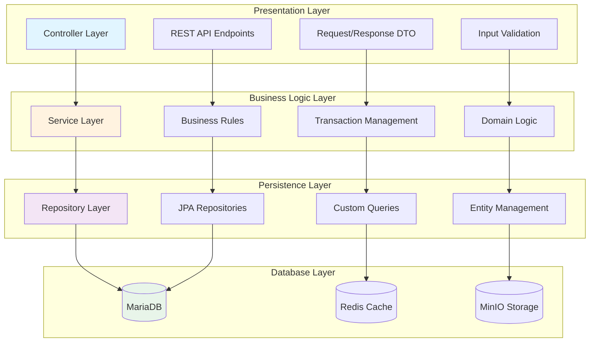

### 1.2 배포 아키텍처 (Deployment Architecture)

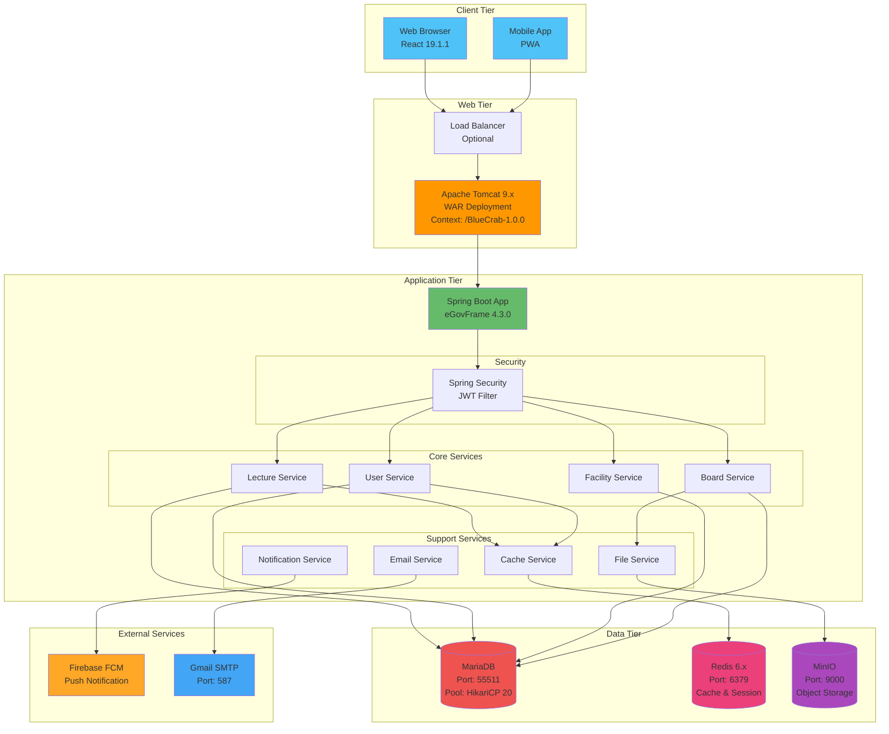

### 1.3 도메인 중심 패키지 구조

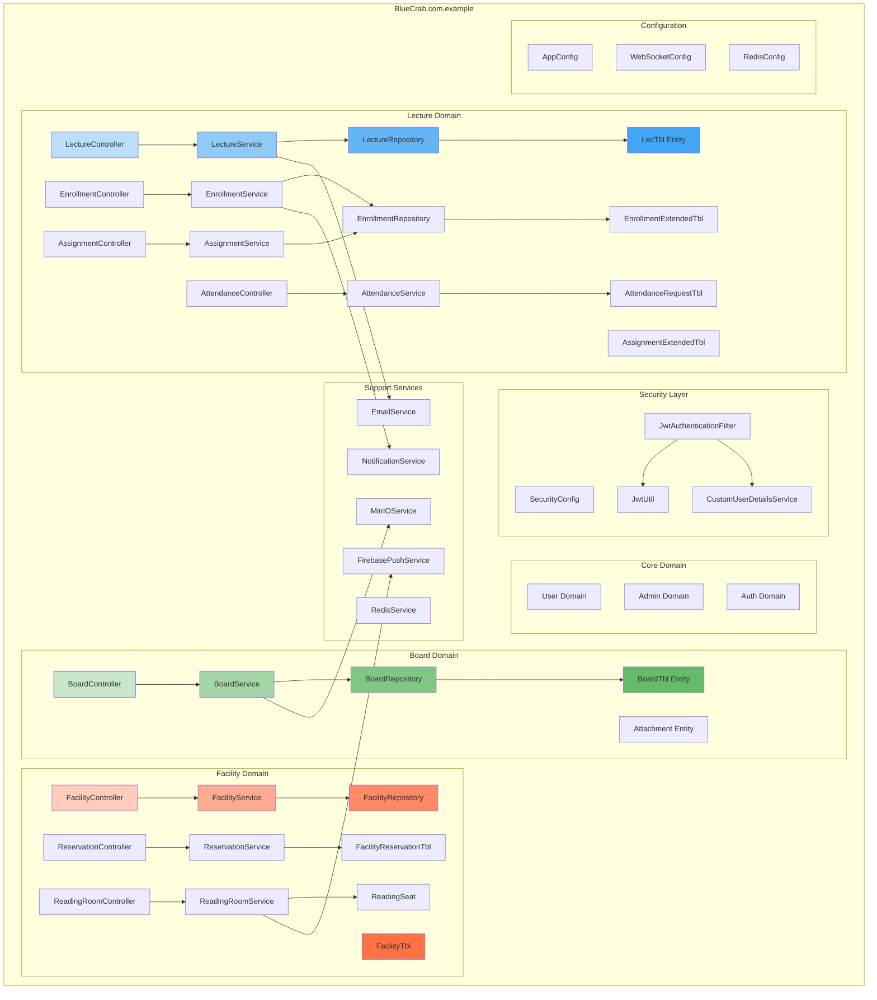

### 1.4 클라이언트-서버 통신 아키텍처

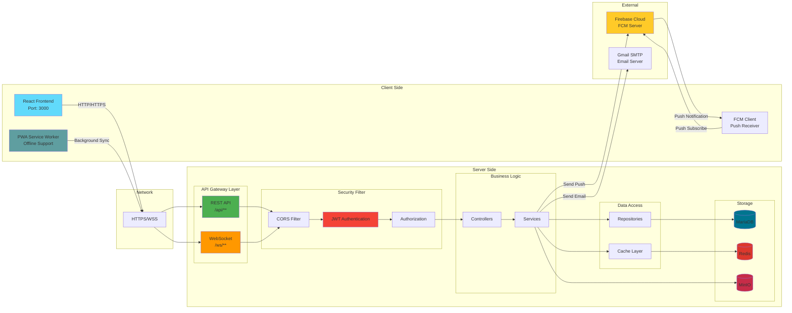

### 1.5 서비스 간 의존성 다이어그램

```mermaid
graph TB
    subgraph "Presentation Controllers"
        LECTURE_C[LectureController]
        ENROLL_C[EnrollmentController]
        ASSIGN_C[AssignmentController]
        ATTEND_C[AttendanceController]
        BOARD_C[BoardController]
        FAC_C[FacilityController]
        USER_C[UserController]
        AUTH_C[AuthController]
    end

    subgraph "Business Services"
        LECTURE_S[LectureService]
        ENROLL_S[EnrollmentService]
        ASSIGN_S[AssignmentService]
        ATTEND_S[AttendanceService]
        GRADE_S[GradeManagementService]
        BOARD_S[BoardService]
        FAC_S[FacilityService]
        USER_S[UserTblService]
        AUTH_S[AuthService]
    end

    subgraph "Infrastructure Services"
        EMAIL_S[EmailService]
        NOTI_S[NotificationService]
        FCM_S[FirebasePushService]
        REDIS_S[RedisService]
        MINIO_S[MinIOService]
        IMAGE_S[ImageCacheService]
        TOKEN_S[TokenBlacklistService]
    end

    subgraph "Data Repositories"
        LECTURE_R[(LectureRepository)]
        ENROLL_R[(EnrollmentRepository)]
        ASSIGN_R[(AssignmentRepository)]
        USER_R[(UserTblRepository)]
        BOARD_R[(BoardRepository)]
        FAC_R[(FacilityRepository)]
    end

    LECTURE_C --> LECTURE_S
    ENROLL_C --> ENROLL_S
    ASSIGN_C --> ASSIGN_S
    ATTEND_C --> ATTEND_S
    BOARD_C --> BOARD_S
    FAC_C --> FAC_S
    USER_C --> USER_S
    AUTH_C --> AUTH_S

    LECTURE_S --> LECTURE_R
    ENROLL_S --> ENROLL_R
    ENROLL_S --> LECTURE_R
    ASSIGN_S --> ASSIGN_R
    ASSIGN_S --> ENROLL_R
    ASSIGN_S --> GRADE_S
    ATTEND_S --> ENROLL_R
    GRADE_S --> ENROLL_R
    GRADE_S --> ASSIGN_S
    BOARD_S --> BOARD_R
    FAC_S --> FAC_R
    USER_S --> USER_R
    AUTH_S --> USER_R

    LECTURE_S --> NOTI_S
    ENROLL_S --> NOTI_S
    ASSIGN_S --> EMAIL_S
    ATTEND_S --> EMAIL_S
    BOARD_S --> MINIO_S
    FAC_S --> NOTI_S
    USER_S --> IMAGE_S
    AUTH_S --> REDIS_S
    AUTH_S --> TOKEN_S

    NOTI_S --> FCM_S
    NOTI_S --> EMAIL_S
    IMAGE_S --> REDIS_S
    IMAGE_S --> MINIO_S
    TOKEN_S --> REDIS_S

    style LECTURE_C fill:#bbdefb
    style ENROLL_C fill:#bbdefb
    style ASSIGN_C fill:#bbdefb
    style LECTURE_S fill:#90caf9
    style ENROLL_S fill:#90caf9
    style ASSIGN_S fill:#90caf9
    style GRADE_S fill:#90caf9
    style EMAIL_S fill:#ffccbc
    style NOTI_S fill:#ffccbc
    style FCM_S fill:#ffccbc
    style LECTURE_R fill:#c8e6c9
    style ENROLL_R fill:#c8e6c9
```

### 1.6 기술 스택 레이어 다이어그램

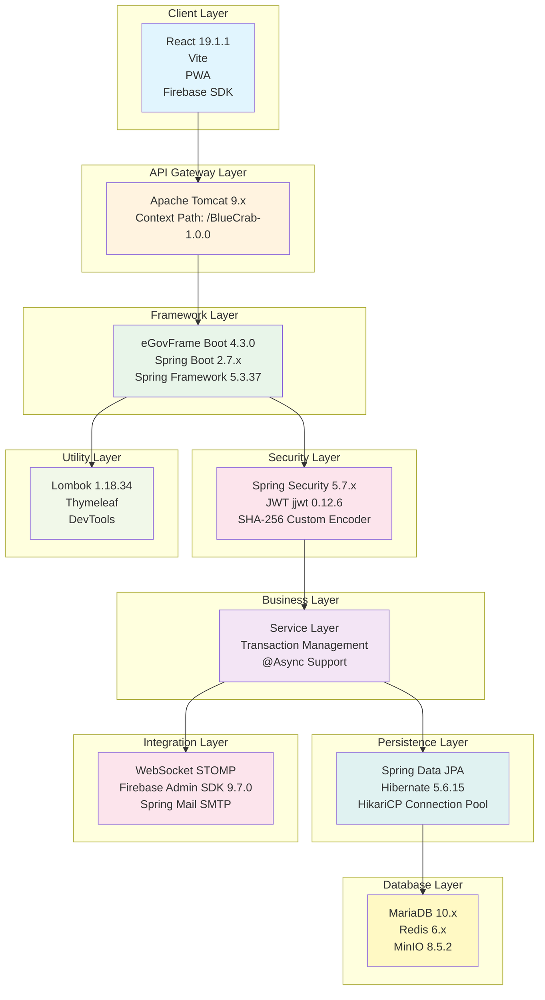

### 1.7 실제 인프라 구성 (Simple Version - PPT 추천!)

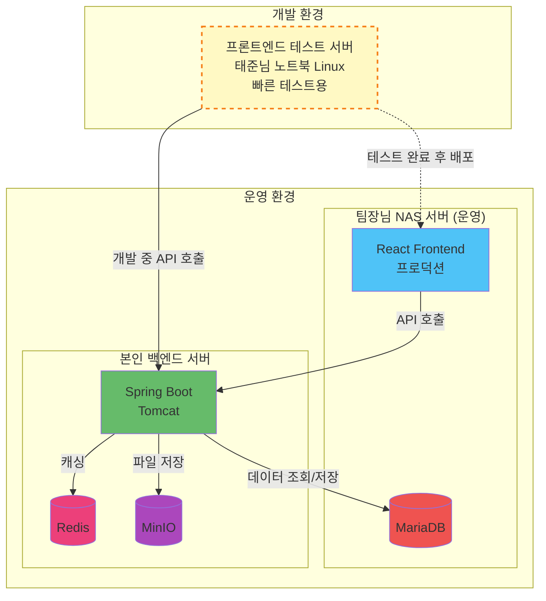

### 1.7-상세 실제 물리 서버 구성 (Detailed Version)

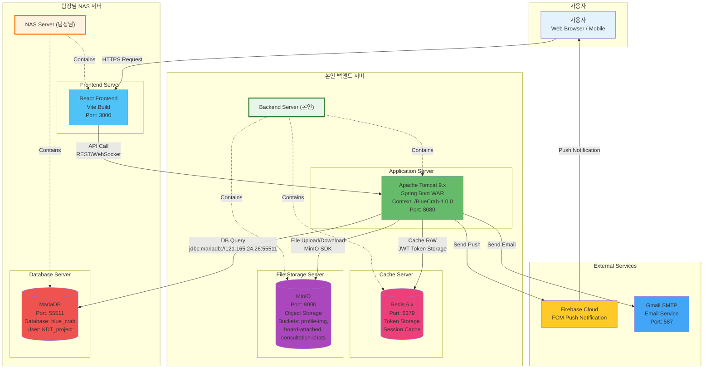

### 1.8 서버 간 통신 상세 (Server Communication Details)

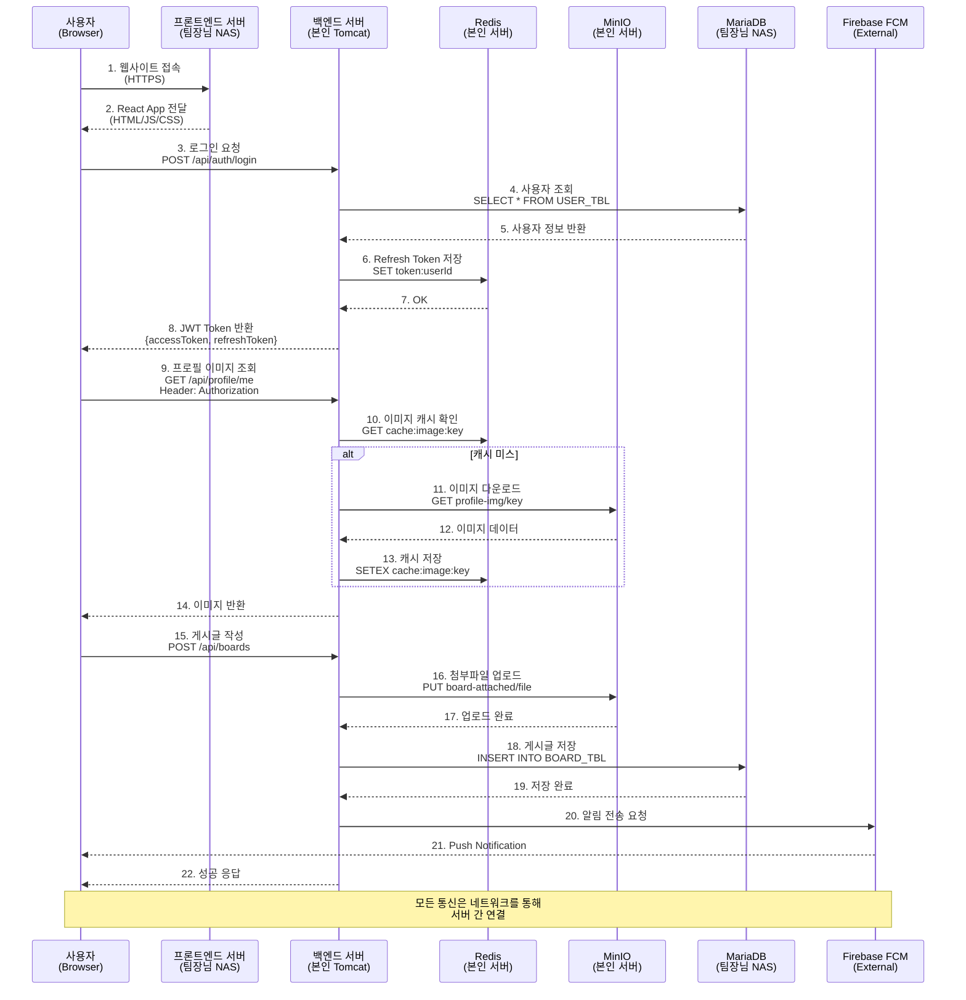

### 1.9 서버 구성 요약표

| 서버 구분 | 담당자 | 구성 요소 | 역할 | 접속 정보 |
|---------|--------|-----------|------|----------|
| **NAS 서버** | 팀장님 | React Frontend | 사용자 UI 제공 | Port: 3000 |
| **NAS 서버** | 팀장님 | MariaDB | 데이터 영속성 저장 | 121.165.24.26:55511 |
| **백엔드 서버** | 본인 | Tomcat + Spring Boot | 비즈니스 로직 처리 | Port: 8080 |
| **백엔드 서버** | 본인 | Redis | 토큰/캐시 저장소 | 127.0.0.1:6379 |
| **백엔드 서버** | 본인 | MinIO | 파일 오브젝트 스토리지 | localhost:9000 |
| **외부 서비스** | - | Firebase FCM | Push 알림 | Cloud Service |
| **외부 서비스** | - | Gmail SMTP | 이메일 발송 | smtp.gmail.com:587 |

### 1.10 데이터 흐름 다이어그램 (Data Flow)

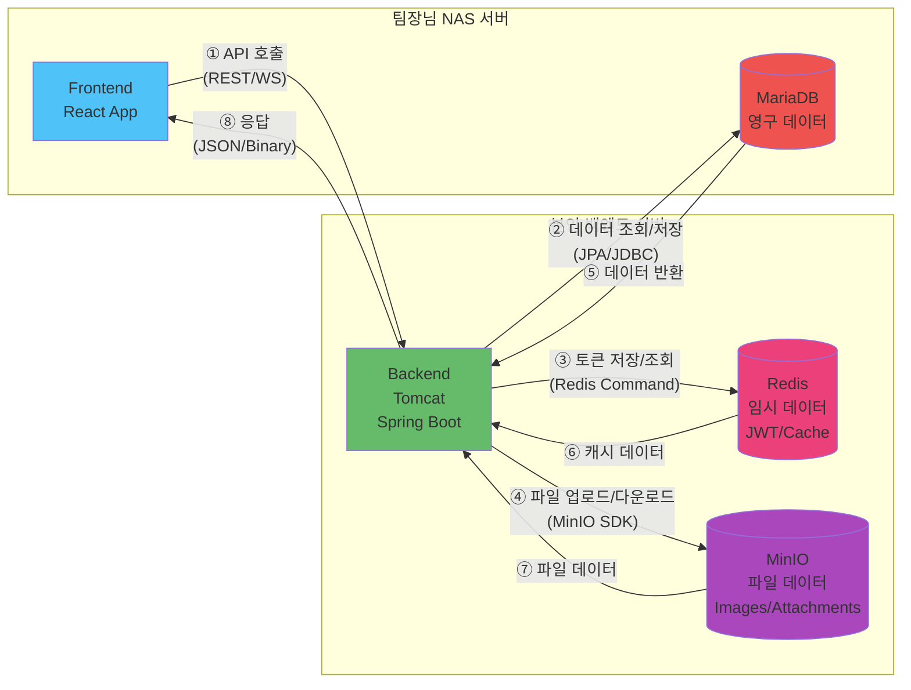

### 1.11 네트워크 토폴로지 (Network Topology)

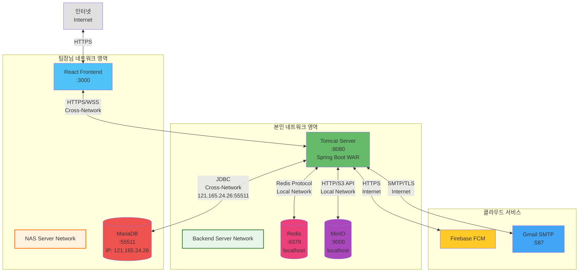

## 2. 다이어그램 사용 방법

### 2.1 Mermaid Live Editor로 PNG 변환

1. [Mermaid Live Editor](https://mermaid.live) 접속
2. 위 코드 복사 → 붙여넣기
3. 우측 "Actions" → "Download PNG" 또는 "Download SVG"
4. PPT에 이미지 삽입

### 2.2 VSCode에서 직접 렌더링

1. VSCode Extension 설치: `Markdown Preview Mermaid Support`
2. 이 파일을 VSCode에서 열기
3. `Ctrl+Shift+V` (Preview 모드)
4. 다이어그램 우클릭 → "Copy Image"
5. PPT에 붙여넣기

### 2.3 GitHub에서 확인

- 이 파일을 GitHub에 push하면 자동으로 렌더링됩니다

## 3. PPT 활용 가이드

### 슬라이드 1: 레이어드 아키텍처
- **다이어그램 1.1** 사용
- 4계층 구조 설명 (Presentation → Business → Persistence → Database)

### 슬라이드 2: 배포 아키텍처
- **다이어그램 1.2** 사용
- Client Tier → Web Tier → Application Tier → Data Tier 흐름
- 외부 서비스 연동 (Firebase, Gmail) 강조

### 슬라이드 3: 도메인 패키지 구조
- **다이어그램 1.3** 사용
- Lecture, Board, Facility 도메인 모듈화 설명
- Controller-Service-Repository-Entity 패턴

### 슬라이드 4: 통신 아키텍처
- **다이어그램 1.4** 사용
- REST API, WebSocket 통신
- 보안 필터 체인 (CORS → JWT → Authorization)

### 슬라이드 5: 서비스 의존성
- **다이어그램 1.5** 사용
- 서비스 간 호출 관계
- 순환 참조 (AssignmentService ↔ GradeManagementService)

### 슬라이드 6: 기술 스택
- **다이어그램 1.6** 사용
- 각 레이어별 사용 기술 명시
- eGovFrame → Spring Boot → JPA → MariaDB 흐름

---

**작성일**: 2025년 10월 30일
**버전**: 1.0.0
**다이어그램 도구**: Mermaid
