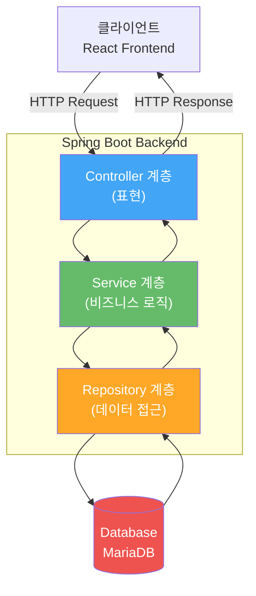
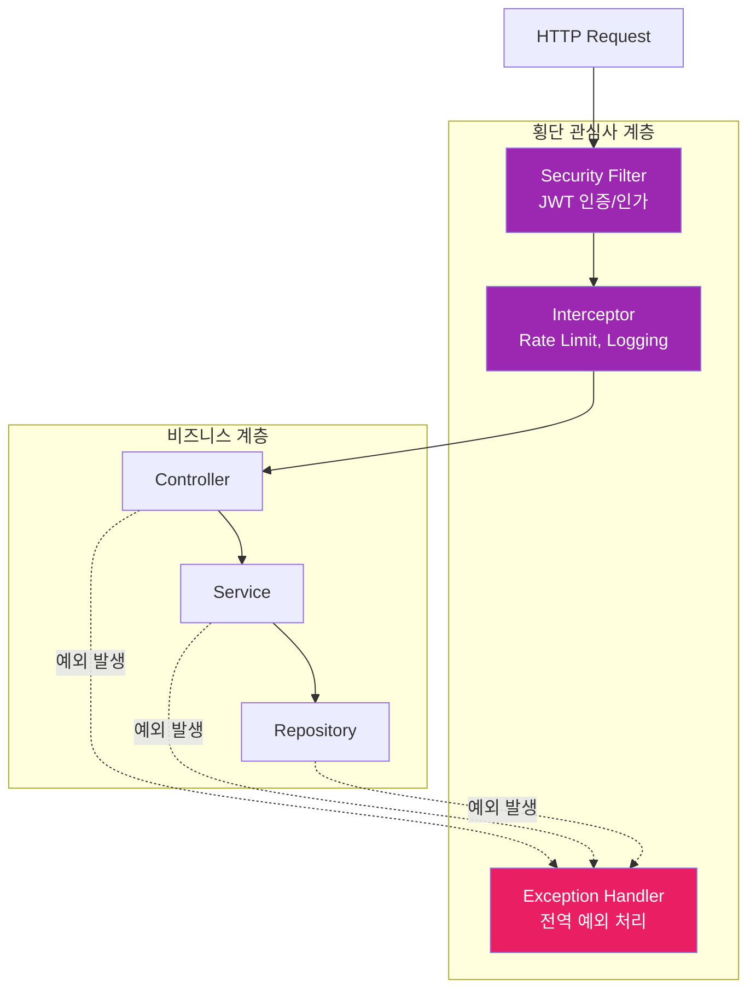

# Blue Crab LMS 백엔드 레이어 아키텍처

## 1. 4-Layer 아키텍처 개요

```mermaid
graph TB
    subgraph "Presentation Layer (표현 계층)"
        Controller[Controller<br/>@RestController<br/>HTTP 요청/응답 처리]
        DTO[DTO<br/>Data Transfer Object<br/>API 데이터 전송]
    end

    subgraph "Business Layer (비즈니스 계층)"
        Service[Service<br/>@Service<br/>비즈니스 로직]
        Event[Event<br/>이벤트 처리]
        Listener[Listener<br/>이벤트 리스너]
    end

    subgraph "Persistence Layer (영속 계층)"
        Repository[Repository<br/>@Repository<br/>데이터 접근]
        Entity[Entity<br/>@Entity<br/>JPA 엔티티]
    end

    subgraph "Database Layer (데이터베이스 계층)"
        DB[(MariaDB<br/>영구 저장소)]
        Cache[(Redis<br/>캐시)]
        Storage[(MinIO<br/>파일 저장소)]
    end

    Controller -->|요청 위임| Service
    Controller <-->|데이터 변환| DTO
    Service -->|데이터 조회/저장| Repository
    Service -->|이벤트 발행| Event
    Event -->|처리| Listener
    Repository <-->|매핑| Entity
    Repository -->|JDBC| DB
    Service -->|캐싱| Cache
    Service -->|파일 저장| Storage

    style Controller fill:#42A5F5,color:#fff
    style Service fill:#66BB6A,color:#fff
    style Repository fill:#FFA726,color:#fff
    style DB fill:#EF5350,color:#fff
```

---

## 2. 간단 버전 (PPT용 추천)



---

## 3. 도메인별 패키지 구조

```mermaid
graph LR
    subgraph "BlueCrab Backend"
        subgraph "Lecture Domain"
            LC[LectureController]
            LS[LectureService]
            LR[LectureRepository]
            LE[Lecture Entity]
        end

        subgraph "Board Domain"
            BC[BoardController]
            BS[BoardService]
            BR[BoardRepository]
            BE[Board Entity]
        end

        subgraph "User Domain"
            UC[UserController]
            US[UserService]
            UR[UserRepository]
            UE[User Entity]
        end

        subgraph "Facility Domain"
            FC[FacilityController]
            FS[FacilityService]
            FR[FacilityRepository]
            FE[Facility Entity]
        end
    end

    LC --> LS --> LR --> LE
    BC --> BS --> BR --> BE
    UC --> US --> UR --> UE
    FC --> FS --> FR --> FE

    style LC fill:#42A5F5,color:#fff
    style BC fill:#42A5F5,color:#fff
    style UC fill:#42A5F5,color:#fff
    style FC fill:#42A5F5,color:#fff

    style LS fill:#66BB6A,color:#fff
    style BS fill:#66BB6A,color:#fff
    style US fill:#66BB6A,color:#fff
    style FS fill:#66BB6A,color:#fff
```



---

## 4. 계층별 상세 설명

### 4.1 Presentation Layer (표현 계층)

**역할:** HTTP 요청/응답 처리, 데이터 검증, 인증/인가

**주요 컴포넌트:**
- **Controller**: REST API 엔드포인트 정의
  - `AuthController`: 로그인, 회원가입, 토큰 갱신
  - `LectureController`: 강의 조회, 등록, 수정, 삭제
  - `BoardController`: 게시판 CRUD
  - `FacilityController`: 시설 예약 관리
  - `UserController`: 사용자 정보 관리
  - `ChatController`: 실시간 채팅 (WebSocket)

- **DTO**: 계층 간 데이터 전송
  - Request DTO: 클라이언트 요청 데이터
  - Response DTO: 클라이언트 응답 데이터
  - 도메인별 DTO: `LectureDTO`, `BoardDTO`, `UserDTO`

**패키지 구조:**
```
controller/
├── AuthController.java
├── UserController.java
├── Board/
│   ├── BoardController.java
│   └── Attachment/
│       └── AttachmentController.java
├── Lecture/
│   ├── LectureController.java
│   ├── Attendance/
│   └── Transcript/
└── ...

dto/
├── Board/
├── Lecture/
├── Consultation/
└── notification/
```

---

### 4.2 Business Layer (비즈니스 계층)

**역할:** 핵심 비즈니스 로직, 트랜잭션 처리, 이벤트 발행

**주요 컴포넌트:**
- **Service**: 비즈니스 로직 구현
  - `AuthService`: 인증/인가 로직, JWT 발급
  - `LectureService`: 강의 등록, 수강신청 로직
  - `BoardService`: 게시판 비즈니스 로직
  - `FacilityReservationService`: 예약 가능 여부 검증
  - `EmailService`: 이메일 발송
  - `FirebasePushService`: 푸시 알림
  - `MinIOService`: 파일 업로드/다운로드
  - `RedisService`: 캐시 관리

- **Event & Listener**: 이벤트 기반 처리
  - 이벤트 발행: 비동기 처리가 필요한 작업
  - 리스너: 이벤트 수신 후 처리

**패키지 구조:**
```
service/
├── AuthService.java
├── UserTblService.java
├── EmailService.java
├── RedisService.java
├── MinIOService.java
├── Board/
│   ├── BoardService.java
│   └── Attachment/
├── Lecture/
│   ├── LectureService.java
│   ├── Attendance/
│   └── Transcript/
└── notification/

event/
└── Lecture/

listener/
└── Lecture/
```

---

### 4.3 Persistence Layer (영속 계층)

**역할:** 데이터베이스 접근, CRUD 연산, 쿼리 실행

**주요 컴포넌트:**
- **Repository**: Spring Data JPA 인터페이스
  - JPA 기본 메서드: `save()`, `findById()`, `findAll()`, `delete()`
  - 커스텀 쿼리: `@Query`, JPQL, Native SQL
  - 쿼리 메서드: `findByUsername()`, `findByLectureId()`

- **Entity**: 데이터베이스 테이블 매핑
  - `@Entity`: JPA 엔티티 선언
  - `@Table`: 테이블 이름 지정
  - `@Id`, `@GeneratedValue`: 기본키 설정
  - `@ManyToOne`, `@OneToMany`: 연관관계 매핑

**패키지 구조:**
```
repository/
├── UserRepository.java
├── Board/
│   ├── BoardRepository.java
│   └── Attachment/
├── Lecture/
│   ├── LectureRepository.java
│   ├── EnrollmentRepository.java
│   ├── AttendanceRepository.java
│   └── TranscriptRepository.java
└── projection/

entity/
├── UserTbl.java
├── Board/
│   ├── Board.java
│   ├── BoardComment.java
│   └── Attachment/
└── Lecture/
    ├── Lecture.java
    ├── Enrollment.java
    ├── Attendance.java
    └── Transcript.java
```

---

### 4.4 Database Layer (데이터베이스 계층)

**역할:** 물리적 데이터 저장, 캐싱, 파일 저장

**주요 컴포넌트:**
- **MariaDB**: 주 데이터베이스
  - 사용자, 강의, 게시판, 시설 예약 등 모든 영구 데이터 저장
  - JDBC 연결: HikariCP 커넥션 풀

- **Redis**: 인메모리 캐시
  - JWT Refresh Token 저장
  - 이메일 인증 토큰 임시 저장
  - 세션 관리
  - 블랙리스트 토큰 관리

- **MinIO**: S3 호환 오브젝트 스토리지
  - 프로필 이미지
  - 게시판 첨부파일
  - 강의 자료 파일

---

## 5. 횡단 관심사 (Cross-Cutting Concerns)



**주요 컴포넌트:**
- **Security**: JWT 필터, Spring Security 설정
- **Interceptor**: Rate Limiting, 로깅
- **Exception Handler**: `@ControllerAdvice`로 전역 예외 처리
- **Config**: 설정 클래스 (AsyncConfig, AppConfig, DataLoader)
- **Util**: 공통 유틸리티 클래스

**패키지:**
```
security/          # JWT 필터, Spring Security 설정
interceptor/       # Rate Limit, 로깅 인터셉터
exception/         # 커스텀 예외 클래스
config/            # Spring 설정 클래스
util/              # 공통 유틸리티
annotation/        # 커스텀 애노테이션 (@RateLimit)
```

---

## 6. 주요 도메인별 구성

### 6.1 Lecture (강의 관리)
- **Controller**: `LectureController`, `AttendanceController`, `TranscriptController`
- **Service**: `LectureService`, `AttendanceService`, `TranscriptService`
- **Repository**: `LectureRepository`, `EnrollmentRepository`, `AttendanceRepository`
- **Entity**: `Lecture`, `Enrollment`, `Attendance`, `Transcript`

### 6.2 Board (게시판)
- **Controller**: `BoardController`, `AttachmentController`
- **Service**: `BoardService`, `AttachmentService`
- **Repository**: `BoardRepository`, `BoardCommentRepository`, `AttachmentRepository`
- **Entity**: `Board`, `BoardComment`, `Attachment`

### 6.3 Facility (시설 관리)
- **Controller**: `FacilityController`, `FacilityReservationController`
- **Service**: `FacilityService`, `FacilityReservationService`
- **Repository**: `FacilityRepository`, `ReservationRepository`
- **Entity**: `Facility`, `FacilityReservation`

### 6.4 Auth (인증/인가)
- **Controller**: `AuthController`, `PasswordResetController`, `FindIdController`
- **Service**: `AuthService`, `EmailVerificationService`, `PasswordResetService`
- **Repository**: `UserRepository`, `RefreshTokenRepository`
- **Entity**: `UserTbl`, `RefreshToken`

---

## 7. PPT 발표 스크립트

### 슬라이드 1: 4-Layer 아키텍처 개요
**제목:** "Blue Crab LMS 백엔드 아키텍처"

**설명:**
"저희 백엔드는 **4-Layer 아키텍처**로 설계되어 있습니다.

각 계층은 명확한 책임을 가지고 있어서, **유지보수가 쉽고 확장 가능**합니다.

- **Presentation Layer**: HTTP 요청/응답 처리
- **Business Layer**: 핵심 비즈니스 로직
- **Persistence Layer**: 데이터베이스 접근
- **Database Layer**: 물리적 데이터 저장

이러한 계층 분리 덕분에, 한 계층의 변경이 다른 계층에 영향을 주지 않습니다."

---

### 슬라이드 2: 도메인 기반 패키지 구조
**제목:** "도메인 중심 설계 (Domain-Driven Design)"

**설명:**
"저희는 **기능별 수직 분할** 방식을 채택했습니다.

Controller/Service/Repository를 기술별로 나누지 않고, **Lecture, Board, Facility 같은 도메인별로 묶었습니다.**

이렇게 하면:
- 관련 코드가 한 곳에 모여있어 찾기 쉽고
- 특정 기능 개발/수정 시 해당 도메인만 집중하면 되고
- 팀원 간 도메인별 분업이 가능합니다

예를 들어, 강의 관련 기능을 수정할 때는 `Lecture` 폴더만 보면 됩니다."

---

### 슬라이드 3: 횡단 관심사
**제목:** "보안과 공통 기능 처리"

**설명:**
"모든 요청은 **Security Filter**를 거쳐서 JWT 인증을 수행하고,

**Interceptor**에서 Rate Limiting으로 과도한 요청을 차단합니다.

예외가 발생하면 **전역 Exception Handler**가 일관된 형식으로 에러 응답을 생성합니다.

이런 횡단 관심사는 **AOP(Aspect-Oriented Programming)** 개념을 활용해서,
각 비즈니스 로직에서는 보안이나 로깅 코드를 작성하지 않아도 됩니다."

---

### 슬라이드 4: 데이터베이스 계층 분리
**제목:** "다중 저장소 전략"

**설명:**
"저희는 용도에 맞게 **3가지 저장소**를 사용합니다:

- **MariaDB**: 영구 데이터 (사용자, 강의, 게시판)
- **Redis**: 임시 데이터와 캐싱 (토큰, 세션)
- **MinIO**: 대용량 파일 (프로필 이미지, 첨부파일)

이렇게 분리하면:
- 데이터베이스 부하 감소 (Redis 캐싱)
- 파일 저장소 독립 관리 (MinIO)
- 각 저장소를 최적화된 용도로 활용 가능합니다."

---

## 8. 아키텍처 설계 원칙

### 8.1 관심사의 분리 (Separation of Concerns)
- 각 계층은 자신의 책임에만 집중
- Controller는 HTTP만, Service는 비즈니스만, Repository는 DB만

### 8.2 의존성 역전 원칙 (Dependency Inversion)
- 상위 계층(Service)이 하위 계층(Repository) 인터페이스에 의존
- 구현체 변경이 쉬움 (예: JPA → MyBatis 교체 가능)

### 8.3 단일 책임 원칙 (Single Responsibility)
- 각 클래스는 하나의 책임만 가짐
- `LectureService`는 강의 로직만, `BoardService`는 게시판 로직만

### 8.4 열림-닫힘 원칙 (Open-Closed)
- 확장에는 열려있고, 수정에는 닫혀있음
- 새로운 도메인 추가 시 기존 코드 수정 최소화

---

## 9. 기술 스택 요약

| 계층 | 기술 | 역할 |
|------|------|------|
| Presentation | Spring MVC, @RestController | REST API |
| Business | @Service, @Transactional | 비즈니스 로직 |
| Persistence | Spring Data JPA, Hibernate | ORM |
| Database | MariaDB, Redis, MinIO | 데이터 저장 |
| Security | Spring Security, JWT | 인증/인가 |
| Cross-Cutting | AOP, Interceptor, Filter | 횡단 관심사 |

---

## 10. 다이어그램 선택 가이드

**PPT 발표용:**
- **2번 다이어그램 (간단 버전)** 추천
- 4개 계층만 보여주고 요청/응답 흐름 강조
- 시각적으로 깔끔하고 이해하기 쉬움

**상세 설명용:**
- **1번 다이어그램 (4-Layer 개요)** 사용
- DTO, Event, Listener까지 모두 표시
- 기술 면접이나 상세 문서에 적합

**도메인 구조 설명용:**
- **3번 다이어그램 (도메인별 패키지)** 사용
- 실제 코드 구조 설명 시 활용
- DDD 개념 설명에 유용

**보안 아키텍처 설명용:**
- **5번 다이어그램 (횡단 관심사)** 사용
- Security Filter, Interceptor, Exception Handler 흐름
- 보안 메커니즘 설명에 적합
