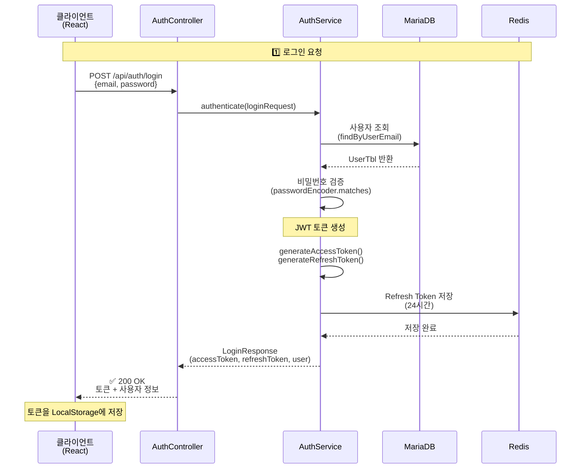
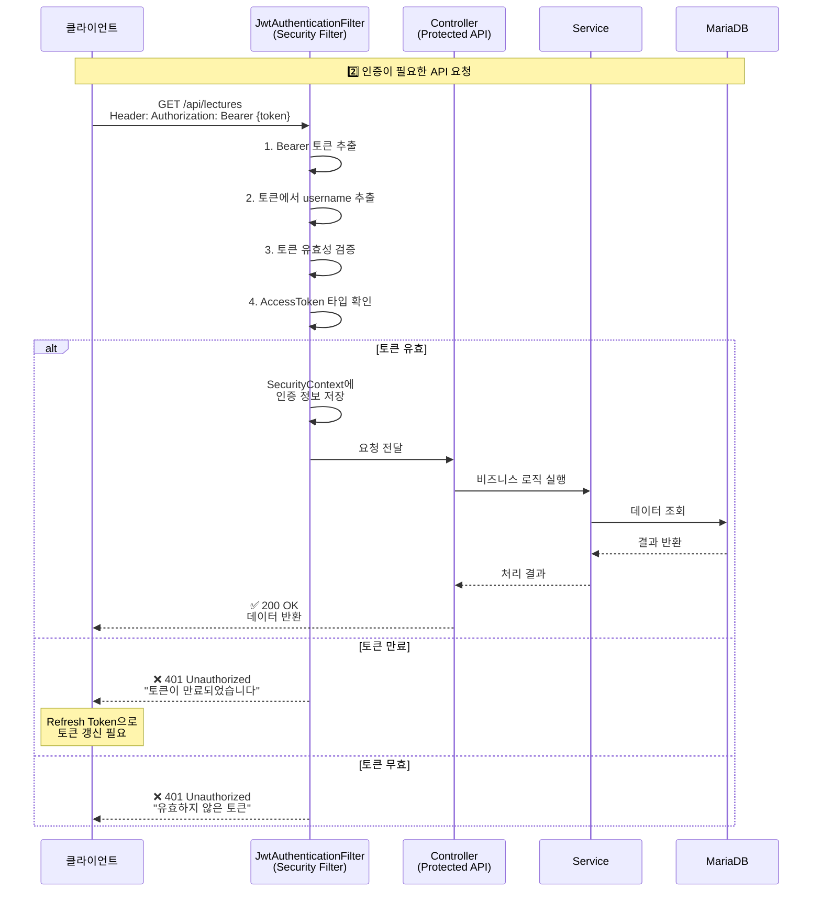
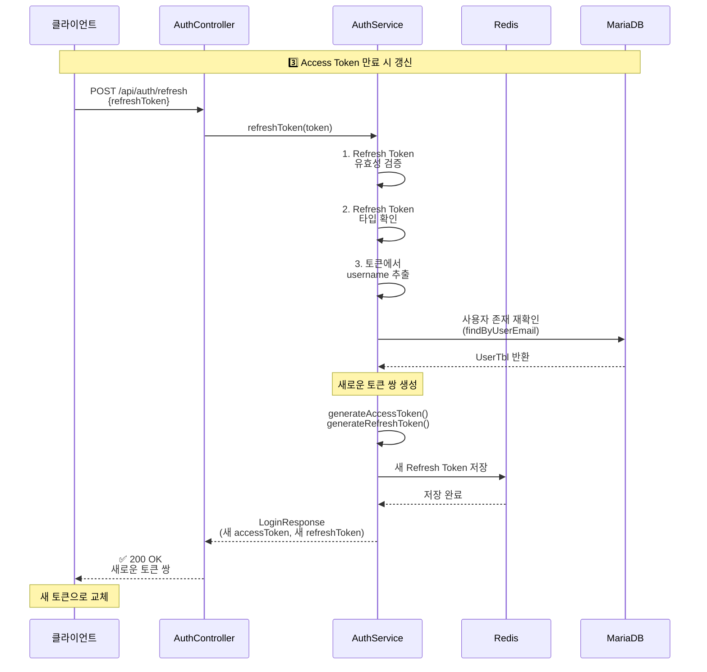
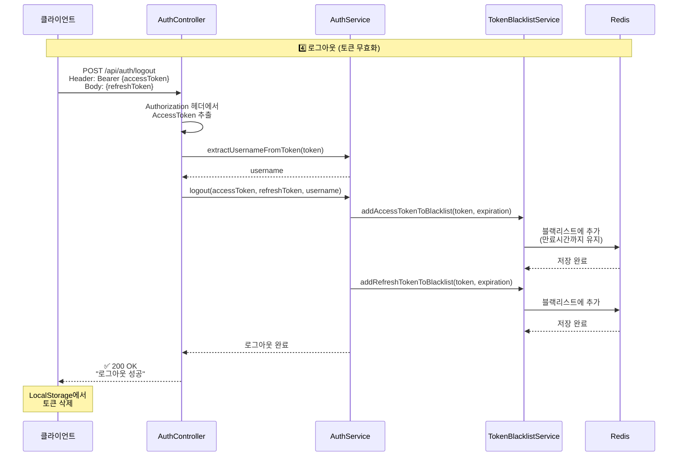
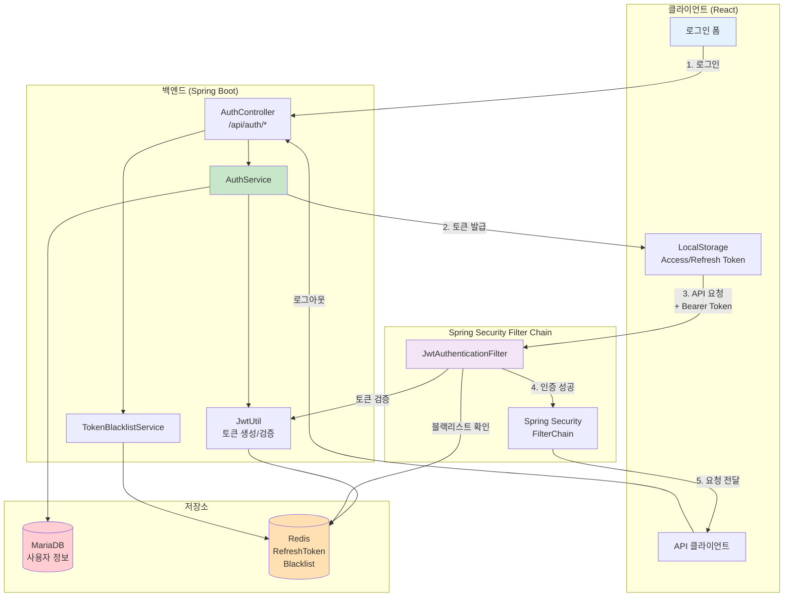
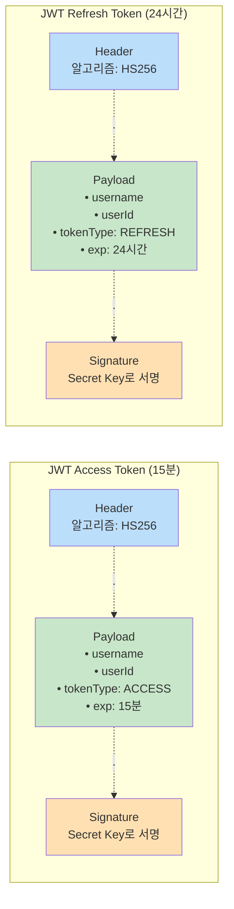

# Blue Crab LMS JWT 인증 플로우

## 1. 로그인 인증 플로우 (간단 버전 - PPT 추천)

---

## 2. 인증된 API 호출 플로우

---

## 3. Refresh Token으로 토큰 갱신 플로우

---

## 4. 로그아웃 플로우

---

## 5. 전체 JWT 인증 아키텍처

---

## 6. JWT 토큰 구조

---

## 7. 주요 컴포넌트 설명

### 7.1 JwtAuthenticationFilter (Security Filter)

**역할:** 모든 HTTP 요청을 가로채서 JWT 토큰 검증

**처리 과정:**
1. Authorization 헤더에서 `Bearer {token}` 추출
2. JWT 토큰에서 username 추출
3. 토큰 유효성 검증 (`jwtUtil.validateToken`)
4. Access Token 타입 확인 (`jwtUtil.isAccessToken`)
5. SecurityContext에 인증 정보 저장
6. 다음 필터로 요청 전달

**예외 처리:**
- 토큰 만료: `ExpiredJwtException` → 401 응답
- 토큰 무효: SecurityContext 설정 안함 → 401 응답

**파일:** `JwtAuthenticationFilter.java:37-93`

---

### 7.2 AuthController

**역할:** 인증 관련 REST API 엔드포인트 제공

**주요 엔드포인트:**
- `POST /api/auth/login` - 로그인 (이메일 + 비밀번호)
- `POST /api/auth/refresh` - 토큰 갱신 (Refresh Token)
- `POST /api/auth/logout` - 로그아웃 (Access + Refresh Token 무효화)
- `GET /api/auth/validate` - 토큰 유효성 검증

**응답 형식:** `ApiResponse<T>` (success, message, data, timestamp)

**파일:** `AuthController.java:32-327`

---

### 7.3 AuthService

**역할:** 인증 비즈니스 로직 구현

**주요 메서드:**
1. `authenticate(LoginRequest)` - 로그인 처리
   - 사용자 조회 (DB)
   - 비밀번호 검증 (해싱 비교)
   - JWT 토큰 쌍 생성
   - Refresh Token을 Redis에 저장

2. `refreshToken(String)` - 토큰 갱신
   - Refresh Token 검증
   - 사용자 존재 재확인
   - 새로운 토큰 쌍 생성

3. `logout(accessToken, refreshToken, username)` - 로그아웃
   - Access Token 블랙리스트 추가
   - Refresh Token 블랙리스트 추가
   - Redis에 만료시간까지 저장

**파일:** `AuthService.java:62-341`

---

### 7.4 JwtUtil

**역할:** JWT 토큰 생성 및 검증 유틸리티

**주요 기능:**
- `generateAccessToken(username, userId)` - Access Token 생성 (15분)
- `generateRefreshToken(username, userId)` - Refresh Token 생성 (24시간)
- `validateToken(token, username)` - 토큰 유효성 검증
- `extractUsername(token)` - 토큰에서 username 추출
- `extractUserId(token)` - 토큰에서 userId 추출
- `isAccessToken(token)` - Access Token 타입 확인
- `isRefreshToken(token)` - Refresh Token 타입 확인

**설정:** `application.properties`에서 Secret Key, 만료시간 설정

---

### 7.5 TokenBlacklistService

**역할:** 로그아웃한 토큰을 블랙리스트에 추가하여 무효화

**주요 메서드:**
- `addAccessTokenToBlacklist(token, expiration)` - Access Token 무효화
- `addRefreshTokenToBlacklist(token, expiration)` - Refresh Token 무효화

**저장소:** Redis (토큰 만료시간까지만 유지)

---

## 8. 보안 메커니즘

### 8.1 토큰 기반 인증의 장점
- **Stateless**: 서버에서 세션 관리 불필요
- **확장성**: 여러 서버에서 동일한 토큰으로 인증 가능
- **모바일 친화적**: 쿠키 없이 토큰만으로 인증

### 8.2 이중 토큰 전략 (Access + Refresh)
- **Access Token (15분)**: API 호출에 사용, 짧은 만료시간으로 보안 강화
- **Refresh Token (24시간)**: Access Token 갱신용, 긴 만료시간으로 UX 개선

### 8.3 토큰 블랙리스트
- 로그아웃 시 토큰을 Redis 블랙리스트에 추가
- JWT는 기본적으로 무효화 불가능하지만, 블랙리스트로 해결
- 만료시간까지만 Redis에 보관하여 메모리 효율성 유지

### 8.4 비밀번호 해싱
- 평문 비밀번호 저장 금지
- `PasswordEncoder` (SHA-256 또는 BCrypt) 사용
- 로그인 시 `passwordEncoder.matches()로 검증

### 8.5 보안 로깅
- 모든 인증 시도 로깅 (성공/실패)
- IP 주소, User-Agent 기록
- 실패 이유는 로그에만 기록, 클라이언트에는 일반 메시지

---

## 9. PPT 발표 스크립트

### 슬라이드 1: JWT 인증 개요
**제목:** "JWT 기반 인증 시스템"

**설명:**
"저희 시스템은 **JWT(JSON Web Token) 기반**으로 인증을 처리합니다.

사용자가 로그인하면 **Access Token과 Refresh Token** 두 개를 발급받고,

Access Token은 15분으로 짧게, Refresh Token은 24시간으로 길게 설정했습니다.

이렇게 하면 **보안은 강화**되고, **사용자 경험은 개선**됩니다."

---

### 슬라이드 2: 로그인 플로우
**제목:** "로그인 인증 과정"

**설명:**
"로그인 과정을 단계별로 보면,

1. 클라이언트가 이메일과 비밀번호를 POST로 전송하고
2. 서버에서 DB 조회 후 비밀번호를 해싱해서 검증합니다
3. 검증이 성공하면 JWT 토큰 쌍을 생성하고
4. Refresh Token은 Redis에 저장해서 나중에 갱신할 때 사용합니다

토큰은 클라이언트의 LocalStorage에 저장됩니다."

---

### 슬라이드 3: 인증된 API 호출
**제목:** "API 요청 시 인증 검증"

**설명:**
"이제 사용자가 강의 목록을 조회한다고 하면,

모든 요청은 **JwtAuthenticationFilter**를 거치게 됩니다.

필터에서 Authorization 헤더를 읽어서 토큰을 추출하고,

토큰이 유효하면 SecurityContext에 인증 정보를 저장해서 Controller로 전달합니다.

만약 토큰이 만료됐다면 401 에러를 바로 반환하고, 클라이언트는 Refresh Token으로 갱신합니다."

---

### 슬라이드 4: 토큰 갱신
**제목:** "Refresh Token으로 토큰 갱신"

**설명:**
"Access Token이 만료되면, 매번 로그인할 필요 없이 Refresh Token으로 갱신합니다.

Refresh Token을 `/api/auth/refresh`로 보내면,

서버에서 토큰을 검증하고, 사용자 존재 여부를 재확인한 뒤,

**새로운 Access Token과 Refresh Token 쌍**을 발급합니다.

이렇게 하면 24시간 동안은 자동으로 로그인 상태가 유지됩니다."

---

### 슬라이드 5: 로그아웃과 보안
**제목:** "안전한 로그아웃 처리"

**설명:**
"JWT는 기본적으로 서버에서 무효화할 수 없는데,

저희는 **토큰 블랙리스트** 방식으로 해결했습니다.

로그아웃하면 Access Token과 Refresh Token을 모두 Redis 블랙리스트에 추가하고,

이후 해당 토큰으로 요청이 오면 필터에서 차단합니다.

블랙리스트는 토큰 만료시간까지만 Redis에 보관해서 메모리도 효율적으로 관리됩니다."

---

## 10. 기술 스택 요약

| 구성 요소 | 기술 | 역할 |
|----------|------|------|
| 토큰 형식 | JWT (HS256) | 인증 토큰 |
| 토큰 라이브러리 | jjwt 0.12.6 | JWT 생성/검증 |
| 보안 프레임워크 | Spring Security | Filter Chain |
| 비밀번호 해싱 | SHA-256 / BCrypt | 비밀번호 보호 |
| 토큰 저장소 | Redis | Refresh Token, Blacklist |
| 만료시간 | Access 15분, Refresh 24시간 | 보안 + UX |

---

## 11. 다이어그램 선택 가이드

**PPT 발표용:**
- **1번 다이어그램 (로그인 플로우)** - 간결하고 핵심만
- **2번 다이어그램 (인증 API 호출)** - 필터 동작 방식
- **5번 다이어그램 (전체 아키텍처)** - 큰 그림 보여주기

**상세 설명용:**
- **3번 (토큰 갱신)** - Refresh Token 메커니즘
- **4번 (로그아웃)** - 블랙리스트 방식 설명
- **6번 (토큰 구조)** - JWT 내부 구조

**기술 면접용:**
- 모든 다이어그램 + 코드 레퍼런스
- 보안 메커니즘 상세 설명
