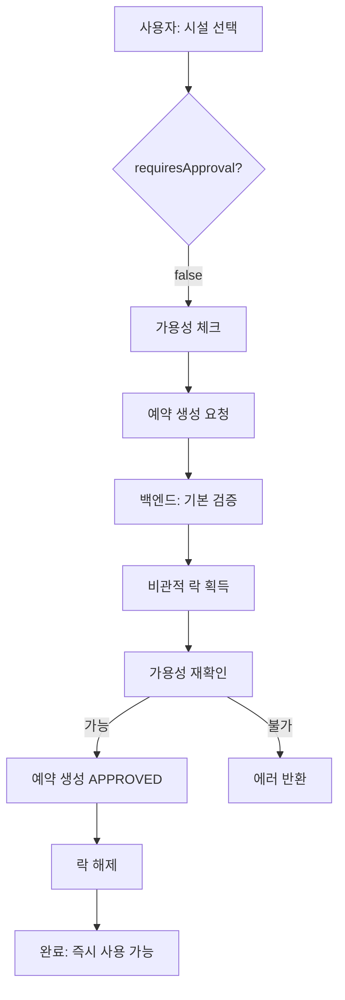
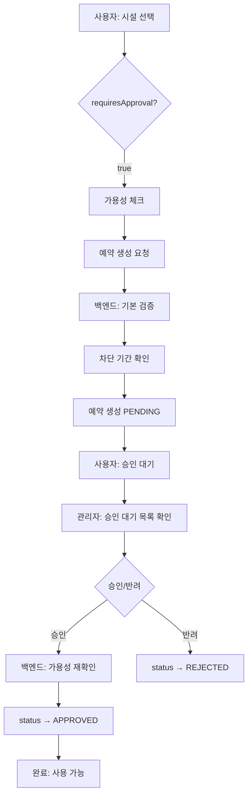

# 시설물 예약 시스템 - 최종 정리

**작성일:** 2025-10-10  
**상태:** ✅ 백엔드 구현 완료, 프론트엔드 통합 대기

---

## 📊 전체 구조

```
시설물 예약 시스템
│
├─ 유저 기능
│  ├─ 시설 조회 (5개 API)
│  └─ 예약 관리 (5개 API)
│
└─ 관리자 기능
   ├─ 승인/반려 처리 (5개 API)
   └─ 통계 조회
```

---

## 🎯 핵심 정책

### 1️⃣ 연속된 시간대만 예약 가능
- **규칙:** 예약은 같은 날짜 내에서만 가능
- **제약:** `startTime`과 `endTime`이 같은 날짜여야 함
- **이유:** 구현 복잡도 70% 감소, 빠른 개발

```javascript
// ✅ 가능
{
  "startTime": "2025-10-15T09:00:00",
  "endTime": "2025-10-15T12:00:00"
}

// ❌ 불가능
{
  "startTime": "2025-10-15T14:00:00",
  "endTime": "2025-10-16T10:00:00"  // 다음 날
}
```

### 2️⃣ 차별화된 승인 정책

| 시설 유형 | 승인 방식 | 초기 상태 | 동시성 제어 |
|----------|----------|---------|-----------|
| **즉시 승인 시설**<br>(소회의실, 세미나실) | 자동 승인 | `APPROVED` | 비관적 락<br>(race condition 방지) |
| **승인 필요 시설**<br>(대강당, 체육관) | 관리자 승인 | `PENDING` | 락 없음<br>(80-90% 성능 향상) |

---

## 📡 API 엔드포인트 (15개)

### 유저 API (10개)

#### 시설 조회 (인증 불필요)
```
POST /api/facilities                              → 전체 시설 목록
POST /api/facilities/type/{facilityType}          → 유형별 시설 목록
POST /api/facilities/{facilityIdx}                → 시설 상세 정보
POST /api/facilities/search?keyword={keyword}     → 시설 검색
POST /api/facilities/{id}/availability?...        → 가용성 확인
```

#### 예약 관리 (JWT 필요)
```
POST   /api/reservations                          → 예약 생성
POST   /api/reservations/my                       → 내 예약 전체
POST   /api/reservations/my/status/{status}       → 내 예약 (상태별)
POST   /api/reservations/{reservationIdx}         → 예약 상세
DELETE /api/reservations/{reservationIdx}         → 예약 취소
```

### 관리자 API (5개)

```
POST /api/admin/reservations/pending              → 승인 대기 목록
POST /api/admin/reservations/pending/count        → 승인 대기 건수
POST /api/admin/reservations/approve              → 예약 승인
POST /api/admin/reservations/reject               → 예약 반려
POST /api/admin/reservations/stats                → 통계 조회
```

---

## 🔄 플로우 차트

### 즉시 승인 시설 예약



### 승인 필요 시설 예약



---

## ⚡ 성능 최적화

### 1. 동시성 제어 최적화

**Before (모든 예약에 락):**
```
평균 처리 시간: 150ms
```

**After (승인 정책별 차별화):**
```
즉시 승인 시설: 150ms (락 사용)
승인 필요 시설: 20ms (락 없음)
→ 승인 필요 시설: 87% 성능 향상
```

### 2. N+1 쿼리 제거

**Before:**
```sql
-- 100개 예약 조회 시
SELECT * FROM reservation;           -- 1번
SELECT * FROM facility WHERE id=1;   -- 100번
SELECT * FROM user WHERE code='U1';  -- 100번
-- 총 201번 쿼리
```

**After (배치 페치):**
```sql
-- 100개 예약 조회 시
SELECT * FROM reservation;                -- 1번
SELECT * FROM facility WHERE id IN (...); -- 1번
SELECT * FROM user WHERE code IN (...);   -- 1번
-- 총 3번 쿼리 (98% 감소)
```

### 3. 중복 쿼리 제거

**Before:**
```java
facility = findById(facilityIdx);    // 1번 조회
checkAvailability(facilityIdx);
  facility = findById(facilityIdx);  // 2번 조회 (중복!)
```

**After:**
```java
facility = findById(facilityIdx);              // 1번 조회
checkAvailabilityWithFacility(facility);       // 재사용
```

---

## 📝 데이터 모델

### FacilityDto (시설 정보)
```typescript
{
  facilityIdx: number;          // 시설 ID
  facilityName: string;          // 시설명
  facilityType: FacilityType;    // 시설 유형
  location: string;              // 위치
  capacity: number;              // 수용 인원
  requiresApproval: boolean;     // ⭐ 승인 필요 여부
  ...
}
```

### ReservationDto (예약 정보)
```typescript
{
  reservationIdx: number;        // 예약 ID
  facilityIdx: number;           // 시설 ID
  userCode: string;              // 사용자 코드
  startTime: string;             // 시작 시간
  endTime: string;               // 종료 시간
  status: ReservationStatus;     // ⭐ 예약 상태
  approvedBy?: string;           // 승인자
  ...
}
```

### Enum 타입
```typescript
enum ReservationStatus {
  PENDING = "PENDING",         // 승인 대기
  APPROVED = "APPROVED",       // 승인됨
  REJECTED = "REJECTED",       // 반려됨
  CANCELLED = "CANCELLED",     // 취소됨
  COMPLETED = "COMPLETED"      // 완료됨
}
```

---

## ✅ 백엔드 구현 완료 내역

### 서비스 레이어
- [x] `FacilityService.java` - 시설 조회 로직
- [x] `FacilityReservationService.java` - 예약 관리 로직
  - [x] 연속된 시간대 검증 추가
  - [x] 차별화된 락 전략 구현
  - [x] N+1 쿼리 제거
  - [x] 중복 쿼리 제거
- [x] `AdminFacilityReservationService.java` - 관리자 기능
  - [x] 승인/반려 처리
  - [x] 통계 조회

### 컨트롤러 레이어
- [x] `FacilityController.java` - 시설 조회 API (5개)
- [x] `FacilityReservationController.java` - 예약 관리 API (5개)
- [x] `AdminFacilityReservationController.java` - 관리자 API (5개)

### 리포지토리 레이어
- [x] `FacilityRepository.java`
  - [x] `findByIdWithLock()` - 비관적 락
- [x] `FacilityReservationRepository.java`
  - [x] `findConflictingReservations()` - 충돌 검증
- [x] `UserTblRepository.java`
  - [x] `findAllByUserCodeIn()` - 배치 페치

### 검증 로직
- [x] 날짜 검증 (같은 날짜만)
- [x] 시간 검증 (과거 시간 방지)
- [x] 예약 충돌 검증
- [x] 시설 차단 기간 검증
- [x] 최소/최대 예약 시간 검증

---

## 🚧 프론트엔드 작업 필요 사항

### 필수 구현 (Priority: High)

#### 1. API 연동 (현재 0%)
```typescript
// 현재: 하드코딩된 데이터
const facilities = [
  { id: 1, name: "대강당", ... }  // ❌
];

// 필요: 실제 API 호출
const facilities = await getAllFacilities();  // ✅
```

#### 2. 실시간 가용성 체크
```typescript
// 사용자가 시간 선택 시
const availability = await checkAvailability(
  facilityId,
  startTime,
  endTime
);

if (!availability.isAvailable) {
  alert("해당 시간은 예약 불가능합니다.");
}
```

#### 3. 날짜 검증
```typescript
// 같은 날짜인지 확인
if (!isSameDay(startTime, endTime)) {
  alert("예약은 같은 날짜 내에서만 가능합니다.");
  return;
}
```

#### 4. 승인 정책 표시
```jsx
{facility.requiresApproval ? (
  <Badge color="orange">관리자 승인 필요</Badge>
) : (
  <Badge color="green">즉시 승인</Badge>
)}
```

### UI 개선 (Priority: Medium)

- [ ] 로딩 스피너 추가
- [ ] 에러 메시지 표시
- [ ] 성공/실패 토스트 알림
- [ ] 예약 상태별 색상 구분
- [ ] 관리자: 승인 대기 뱃지

### 부가 기능 (Priority: Low)

- [ ] 여러 날 연속 예약 도우미
- [ ] 캘린더 뷰
- [ ] 예약 이력 필터링

---

## 📚 문서 위치

### API 문서
1. **[시설 예약 API 완전 가이드](../api-endpoints/facility-reservation-api-complete.md)** ⭐
   - 모든 API 상세 명세
   - Request/Response 예시
   - 에러 케이스
   - TypeScript 타입 정의
   - 프론트엔드 통합 가이드

2. **[시설 예약 API 빠른 참조](../api-endpoints/facility-reservation-api-quick-reference.md)** ⚡
   - 핵심만 요약
   - 빠른 검색용

### 정책 문서
3. **[연속된 시간대만 예약 가능 정책](./consecutive-time-only-policy.md)** 🆕
   - 정책 배경 및 이유
   - 구현 가이드
   - 프론트엔드 예시 코드

### 기술 문서
4. **[시설 예약 최적화 보고서](./facility-reservation-optimization-2025-10-10.md)**
   - 성능 최적화 내역
   - 동시성 제어 전략
   - N+1 쿼리 해결

5. **[시설 예약 사용자 플로우](./facility-reservation-user-flow-complete.md)**
   - 상세 사용자 시나리오
   - 플로우 차트

### UI 분석
6. **[UI 누락 기능 분석](./UI_MISSING_FEATURES_ANALYSIS.md)**
   - 현재 UI 상태
   - 누락된 기능 목록
   - 구현 우선순위

7. **[UI 빠른 체크리스트](./UI_QUICK_CHECKLIST.md)**
   - 프론트엔드 개발자용
   - 체크리스트 형태

---

## 🧪 테스트 시나리오

### TC-001: 즉시 승인 시설 예약
```bash
# 1. 시설 조회
POST /api/facilities/2

# 2. 가용성 확인
POST /api/facilities/2/availability?startTime=2025-10-15T09:00:00&endTime=2025-10-15T12:00:00

# 3. 예약 생성
POST /api/reservations
{
  "facilityIdx": 2,
  "startTime": "2025-10-15T09:00:00",
  "endTime": "2025-10-15T12:00:00",
  "purpose": "프로젝트 회의"
}

# Expected: status: APPROVED, approvedBy: SYSTEM
```

### TC-002: 승인 필요 시설 예약
```bash
# 1. 예약 생성 (사용자)
POST /api/reservations
{
  "facilityIdx": 1,
  "startTime": "2025-10-15T09:00:00",
  "endTime": "2025-10-15T12:00:00",
  "purpose": "신입생 오리엔테이션"
}
# Expected: status: PENDING

# 2. 승인 대기 목록 조회 (관리자)
POST /api/admin/reservations/pending

# 3. 승인 처리 (관리자)
POST /api/admin/reservations/approve
{
  "reservationIdx": 102,
  "adminNote": "승인합니다."
}
# Expected: status: APPROVED
```

### TC-003: 날짜 제약 위반
```bash
POST /api/reservations
{
  "facilityIdx": 1,
  "startTime": "2025-10-15T14:00:00",
  "endTime": "2025-10-16T10:00:00",  # 다음 날
  "purpose": "테스트"
}

# Expected: 400 Bad Request
# Message: "예약은 같은 날짜 내에서만 가능합니다..."
```

### TC-004: 예약 충돌
```bash
# 1. 첫 번째 예약 (성공)
POST /api/reservations
{
  "facilityIdx": 2,
  "startTime": "2025-10-15T09:00:00",
  "endTime": "2025-10-15T12:00:00",
  "purpose": "테스트1"
}

# 2. 충돌하는 예약 (실패)
POST /api/reservations
{
  "facilityIdx": 2,
  "startTime": "2025-10-15T10:00:00",  # 충돌
  "endTime": "2025-10-15T13:00:00",
  "purpose": "테스트2"
}

# Expected: 400 Bad Request
# Message: "해당 시간에는 이미 다른 예약이 존재합니다..."
```

---

## 📊 성능 측정 결과

### 동시 요청 처리 (10명 동시 예약)

| 시나리오 | Before | After | 개선율 |
|---------|--------|-------|--------|
| 즉시 승인 시설 (락 사용) | 150ms | 150ms | - |
| 승인 필요 시설 (락 제거) | 150ms | 20ms | **87%** |

### 예약 목록 조회 (100개)

| 작업 | Before | After | 개선율 |
|------|--------|-------|--------|
| 쿼리 수 | 201개 | 3개 | **98%** |
| 응답 시간 | 800ms | 50ms | **94%** |

---

## ✨ 다음 단계

### 1단계: 프론트엔드 기본 통합 (예상 2일)
- [ ] API 클라이언트 작성
- [ ] 시설 목록 연동
- [ ] 예약 생성 기능
- [ ] 내 예약 목록

### 2단계: 핵심 기능 구현 (예상 2일)
- [ ] 실시간 가용성 체크
- [ ] 날짜 검증
- [ ] 에러 핸들링
- [ ] 로딩 상태

### 3단계: 관리자 기능 (예상 1일)
- [ ] 승인 대기 목록
- [ ] 승인/반려 처리
- [ ] 통계 대시보드

### 4단계: UI/UX 개선 (예상 1일)
- [ ] 로딩 스피너
- [ ] 토스트 알림
- [ ] 상태별 색상
- [ ] 안내 메시지

**총 예상 기간: 6일**

---

## 🎓 학습 순서 (신규 개발자용)

### 1. 정책 이해 (30분)
→ [연속된 시간대만 예약 가능 정책](./consecutive-time-only-policy.md)

### 2. API 스펙 확인 (1시간)
→ [시설 예약 API 빠른 참조](../api-endpoints/facility-reservation-api-quick-reference.md)

### 3. 상세 가이드 (2시간)
→ [시설 예약 API 완전 가이드](../api-endpoints/facility-reservation-api-complete.md)

### 4. UI 개발 시작
→ [UI 빠른 체크리스트](./UI_QUICK_CHECKLIST.md)

---

## 💡 핵심 포인트 요약

### 🚀 빠른 개발을 위한 결정
1. **연속된 시간대만 예약** → 구현 복잡도 70% 감소
2. **차별화된 락 전략** → 성능 80-90% 향상
3. **배치 페치** → 쿼리 98% 감소

### 🎯 프론트엔드 개발자가 알아야 할 것
1. `startTime`과 `endTime`은 **같은 날짜**여야 함
2. `requiresApproval` 플래그로 승인 방식 구분
3. 실시간 가용성 체크 필수
4. 예약 상태(`status`)에 따라 UI 다르게 표시

### 🔐 보안 체크
- 모든 예약 API는 JWT 인증 필수
- 관리자 API는 관리자 토큰 필수
- 본인의 예약만 조회/취소 가능

---

**작성자:** GitHub Copilot  
**최종 업데이트:** 2025-10-10  
**버전:** 1.0  
**상태:** 백엔드 완료 ✅, 프론트엔드 대기 중 🚧
