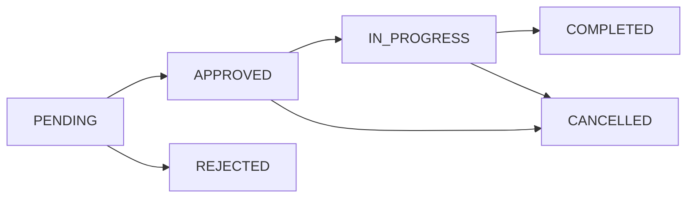

# 상담 기능 API 가이드 (간소화 버전)

> **최종 업데이트**: 2025-10-28
> **대상**: 프론트엔드 개발자
> **목적**: 간소화된 7개 API로 상담 기능을 쉽고 빠르게 구현하기

---

## 목차
1. [개요](#1-개요)
2. [빠른 시작](#2-빠른-시작)
3. [핵심 개념](#3-핵심-개념)
4. [API 레퍼런스](#4-api-레퍼런스)
5. [실시간 채팅](#5-실시간-채팅)
6. [프론트엔드 구현 가이드](#6-프론트엔드-구현-가이드)
7. [사용 시나리오](#7-사용-시나리오)
8. [에러 처리](#8-에러-처리)
9. [구현 체크리스트](#9-구현-체크리스트)
10. [FAQ](#10-faq)

---

## 1. 개요

### 1.1 시스템 소개

학생과 교수 간 **실시간 온라인 상담**을 제공하는 시스템입니다.

**참여자 역할**
- **학생**: 상담 신청, 채팅 참여, 상담 취소
- **교수**: 상담 승인/반려, 채팅 참여, 상담 시작/종료
- **관리자**: 모든 상담 조회 및 관리

**핵심 기능**
- 상담 요청 및 승인/반려 워크플로우
- 실시간 채팅 (WebSocket)
- 상담 이력 관리 및 로그 다운로드
- 읽음 처리 및 알림

### 1.2 API 엔드포인트 (7개)

| # | Method | Path | 설명 |
|---|--------|------|------|
| 1 | `POST` | `/api/consultation/list` | 목록 조회 (모든 목록 통합) |
| 2 | `POST` | `/api/consultation/detail` | 상세 조회 |
| 3 | `POST` | `/api/consultation/create` | 상담 생성 |
| 4 | `POST` | `/api/consultation/status` | 상태 변경 (승인/반려/취소/시작/종료) |
| 5 | `POST` | `/api/consultation/read` | 읽음 처리 |
| 6 | `GET` | `/api/consultation/unread-count` | 읽지 않은 수 |
| 7 | `WebSocket` | `/ws/consultation/chat` | 실시간 채팅 |

**간소화 효과**: 기존 15개 → 7개 (53% 감소)

### 1.3 핵심 특징

✅ **단순함**: 7개 API만 기억하면 됨
✅ **일관성**: 모든 API가 POST 방식 (unread-count 제외)
✅ **통합성**: 비슷한 기능은 하나로 묶음 (list, status)
✅ **명확성**: 각 API가 하나의 명확한 목적

---

## 2. 빠른 시작

### 2.1 환경 설정

```bash
# 필수 라이브러리 설치
npm install @stomp/stompjs sockjs-client

# 날짜 처리 (이미 설치됨)
npm install date-fns
```

### 2.2 Base URL 및 인증

```javascript
// src/config/api.js
export const BASE_URL = 'https://bluecrab.chickenkiller.com/BlueCrab-1.0.0';
export const API_URL = `${BASE_URL}/api`;
export const WS_URL = `${BASE_URL}/ws/consultation/chat`;
```

**인증 헤더**
```javascript
import { readAccessToken } from '../utils/readAccessToken';

const headers = {
  'Content-Type': 'application/json',
  'Authorization': `Bearer ${readAccessToken()}`
};
```

### 2.3 첫 API 호출

```javascript
// 상담 목록 조회 예시
async function getMyConsultations() {
  const token = readAccessToken();

  const response = await fetch(`${API_URL}/consultation/list`, {
    method: 'POST',
    headers: {
      'Content-Type': 'application/json',
      'Authorization': `Bearer ${token}`
    },
    body: JSON.stringify({
      viewType: 'SENT',  // 내가 보낸 요청
      page: 0,
      size: 10
    })
  });

  if (!response.ok) {
    throw new Error(`API 오류: ${response.status}`);
  }

  return await response.json();
}
```

---

## 3. 핵심 개념

### 3.1 상태 관리

#### 상담 상태 (6개)

```
PENDING      → 요청 대기 (학생이 신청한 상태)
APPROVED     → 승인됨 (교수가 승인, 상담 예정)
REJECTED     → 반려됨 ⚫ 종료 상태
CANCELLED    → 취소됨 ⚫ 종료 상태
IN_PROGRESS  → 진행 중 (상담 진행 중)
COMPLETED    → 완료됨 ⚫ 종료 상태
```

#### 상태 전환 규칙



**상태 전환 표**

| 현재 상태 | 가능한 전환 | 권한 |
|-----------|-------------|------|
| `PENDING` | `APPROVED`, `REJECTED` | 교수 |
| `APPROVED` | `IN_PROGRESS`, `CANCELLED` | 학생/교수 |
| `IN_PROGRESS` | `COMPLETED`, `CANCELLED` | 학생/교수 |
| `REJECTED` | 없음 (종료) | - |
| `CANCELLED` | 없음 (종료) | - |
| `COMPLETED` | 없음 (종료) | - |

### 3.2 권한 체계

#### 역할 구분

```javascript
// UserContext에서 역할 판단
const isProfessor = user.data.user.userStudent === 1;
const isStudent = user.data.user.userStudent === 0;
```

#### 권한별 가능한 작업

| 작업 | 학생 | 교수 | 관리자 |
|------|------|------|--------|
| 상담 신청 | ✅ | ❌ | ✅ |
| 상담 승인/반려 | ❌ | ✅ (본인 것만) | ✅ |
| 상담 시작 | ✅ | ✅ | ✅ |
| 상담 종료 | ✅ | ✅ | ✅ |
| 상담 취소 (APPROVED) | ✅ (본인 것만) | ✅ | ✅ |
| 채팅 | ✅ | ✅ | ✅ |

### 3.3 DTO 구조

#### 공통 응답 포맷

```typescript
// 성공 응답
{
  "success": true,
  "data": { ... },
  "timestamp": "2025-10-28T10:00:00"
}

// 에러 응답
{
  "success": false,
  "message": "에러 메시지",
  "timestamp": "2025-10-28T10:00:00"
}

// 페이징 응답 (Spring Page)
{
  "content": [ ... ],      // 실제 데이터 배열
  "totalElements": 100,    // 전체 개수
  "totalPages": 10,        // 전체 페이지 수
  "size": 10,              // 페이지 크기
  "number": 0              // 현재 페이지 (0부터 시작)
}
```

#### 상담 상세 DTO

```typescript
interface ConsultationDTO {
  requestIdx: number;              // 상담 ID
  requesterUserCode: string;       // 신청자 학번/교번
  requesterName: string;           // 신청자 이름
  recipientUserCode: string;       // 수신자 학번/교번
  recipientName: string;           // 수신자 이름
  consultationType: string;        // 상담 유형
  title: string;                   // 제목
  content?: string;                // 내용
  desiredDate?: string;            // 희망 일시
  status: string;                  // 상태 (PENDING, APPROVED, ...)
  acceptMessage?: string;          // 승인 메시지
  rejectionReason?: string;        // 반려 사유
  cancelReason?: string;           // 취소 사유
  scheduledStartAt?: string;       // 예정 시작 시간
  startedAt?: string;              // 실제 시작 시간
  endedAt?: string;                // 종료 시간
  durationMinutes?: number;        // 소요 시간 (분)
  lastActivityAt?: string;         // 마지막 활동 시간
  hasUnreadMessages: boolean;      // 읽지 않은 메시지 여부
  createdAt: string;               // 생성 시간
}
```

#### 상담 유형

```typescript
enum ConsultationType {
  ACADEMIC = 'ACADEMIC',        // 학업 상담
  CAREER = 'CAREER',            // 진로 상담
  CAMPUS_LIFE = 'CAMPUS_LIFE',  // 학교생활 상담
  ETC = 'ETC'                   // 기타
}
```

---

## 4. API 레퍼런스

### 4.1 목록 조회

**Endpoint**: `POST /api/consultation/list`

목록 조회를 **하나의 API로 통합**했습니다. `viewType`으로 구분합니다.

#### Request

```typescript
interface ConsultationListRequest {
  viewType: 'SENT' | 'RECEIVED' | 'ACTIVE' | 'HISTORY';
  status?: string;        // 선택: 상태 필터 (PENDING, APPROVED, ...)
  startDate?: string;     // 선택: 기간 필터 시작 (yyyy-MM-dd)
  endDate?: string;       // 선택: 기간 필터 종료 (yyyy-MM-dd)
  page: number;           // 페이지 번호 (0부터 시작)
  size: number;           // 페이지 크기 (기본 10)
}
```

#### ViewType 설명

| ViewType | 설명 | 권한 | 용도 |
|----------|------|------|------|
| `SENT` | 내가 보낸 요청 | 학생 | 학생이 신청한 상담 목록 |
| `RECEIVED` | 받은 요청 | 교수 | 교수에게 온 상담 요청 목록 |
| `ACTIVE` | 진행 중 상담 | 공통 | 현재 진행 중인 상담 (`IN_PROGRESS`) |
| `HISTORY` | 상담 이력 | 공통 | 완료/취소된 상담 이력 |

#### Response

```typescript
{
  "content": ConsultationDTO[],
  "totalElements": number,
  "totalPages": number,
  "size": number,
  "number": number
}
```

#### 사용 예시

**1. 내가 보낸 요청 (학생)**
```javascript
POST /api/consultation/list
{
  "viewType": "SENT",
  "page": 0,
  "size": 10
}
```

**2. 받은 요청 - 대기 중만 (교수)**
```javascript
POST /api/consultation/list
{
  "viewType": "RECEIVED",
  "status": "PENDING",
  "page": 0,
  "size": 10
}
```

**3. 진행 중 상담 (공통)**
```javascript
POST /api/consultation/list
{
  "viewType": "ACTIVE",
  "page": 0,
  "size": 10
}
```

**4. 상담 이력 - 최근 3개월 (공통)**
```javascript
POST /api/consultation/list
{
  "viewType": "HISTORY",
  "startDate": "2024-08-01",
  "endDate": "2024-10-31",
  "page": 0,
  "size": 20
}
```

---

### 4.2 상세 조회

**Endpoint**: `POST /api/consultation/detail`

#### Request

```typescript
interface ConsultationDetailRequest {
  id: number;  // 상담 ID (requestIdx)
}
```

```javascript
POST /api/consultation/detail
{
  "id": 123
}
```

#### Response

```typescript
ConsultationDTO
```

#### 사용 시점
- 목록에서 상담 선택 시
- 채팅방 입장 전 상담 정보 로드
- 상태 변경 후 최신 정보 확인

---

### 4.3 상담 생성

**Endpoint**: `POST /api/consultation/create`

**권한**: 학생

#### Request

```typescript
interface ConsultationCreateRequest {
  professorId: number;              // 교수 ID
  consultationDate: string;         // 희망 일시 (ISO 8601: yyyy-MM-ddTHH:mm:ss)
  location: string;                 // 희망 장소
  description: string;              // 상담 내용
  category: ConsultationType;       // 상담 유형
}
```

```javascript
POST /api/consultation/create
{
  "professorId": 5,
  "consultationDate": "2024-03-20T14:00:00",
  "location": "상담실 A",
  "description": "진로 상담 요청드립니다",
  "category": "CAREER"
}
```

#### Response

```typescript
ConsultationDTO  // 생성된 상담 (status: PENDING)
```

#### 반려된 상담 다시 신청하기

반려된 상담을 다시 신청하려면:
1. 기존 상담 데이터를 가져와서
2. 폼에 자동으로 채워주고
3. 사용자가 수정한 후
4. `create` API를 **그냥 새로 호출**

```javascript
// 프론트엔드 예시
function handleResubmit(rejectedConsultation) {
  // 폼에 이전 데이터 자동 입력
  setFormData({
    professorId: rejectedConsultation.recipientUserCode,
    consultationDate: rejectedConsultation.desiredDate,
    location: rejectedConsultation.location || '',
    description: rejectedConsultation.content || '',
    category: rejectedConsultation.consultationType
  });

  // 모달 열기
  openCreateModal();

  // 사용자가 수정 후 제출하면 create API 호출
  // → 백엔드는 그냥 새 상담으로 생성
}
```

**중요**: 재신청 로직이 없습니다. 그냥 새로운 상담 생성입니다.

---

### 4.4 상태 변경

**Endpoint**: `POST /api/consultation/status`

상태 변경을 **하나의 API로 통합**했습니다.

#### Request

```typescript
interface ConsultationStatusRequest {
  id: number;           // 상담 ID
  status: string;       // 변경할 상태
  reason?: string;      // 사유 (REJECTED, CANCELLED 시 필수)
}
```

#### 상태별 사용 예시

**1. 승인 (교수)**
```javascript
POST /api/consultation/status
{
  "id": 123,
  "status": "APPROVED"
}
```

**2. 반려 (교수)**
```javascript
POST /api/consultation/status
{
  "id": 123,
  "status": "REJECTED",
  "reason": "해당 기간은 출장으로 상담이 어렵습니다"
}
```

**3. 취소 (학생 또는 교수)**
```javascript
POST /api/consultation/status
{
  "id": 123,
  "status": "CANCELLED",
  "reason": "일정이 변경되어 취소합니다"
}
```

**4. 상담 시작 (학생 또는 교수)**
```javascript
POST /api/consultation/status
{
  "id": 123,
  "status": "IN_PROGRESS"
}
```

**5. 상담 종료 (학생 또는 교수)**
```javascript
POST /api/consultation/status
{
  "id": 123,
  "status": "COMPLETED"
}
```

#### Response

```typescript
ConsultationDTO  // 변경된 상담
```

#### 권한 및 검증

| 상태 변경 | 권한 | 조건 |
|-----------|------|------|
| `PENDING` → `APPROVED` | 교수 | 본인에게 온 요청 |
| `PENDING` → `REJECTED` | 교수 | 본인에게 온 요청 + 사유 필수 |
| `APPROVED` → `IN_PROGRESS` | 학생/교수 | 참여자 |
| `APPROVED` → `CANCELLED` | 학생/교수 | 참여자 + 사유 필수 |
| `IN_PROGRESS` → `COMPLETED` | 학생/교수 | 참여자 |
| `IN_PROGRESS` → `CANCELLED` | 학생/교수 | 참여자 + 사유 필수 |

#### 에러 응답

```javascript
// 잘못된 상태 전환
{
  "success": false,
  "message": "상태 전환 불가: PENDING -> COMPLETED"
}

// 권한 없음
{
  "success": false,
  "message": "본인의 상담만 처리 가능합니다"
}

// 사유 누락
{
  "success": false,
  "message": "반려 사유는 필수입니다"
}
```

---

### 4.5 읽음 처리

**Endpoint**: `POST /api/consultation/read`

**권한**: 상담 참여자

#### Request

```typescript
interface ConsultationReadRequest {
  id: number;  // 상담 ID
}
```

```javascript
POST /api/consultation/read
{
  "id": 123
}
```

#### Response

```typescript
{
  "success": true,
  "readAt": "2025-10-28T10:05:00",
  "allMessagesRead": true,
  "lastActivityAt": "2025-10-28T10:03:00",
  "partnerUserCode": "202012345"
}
```

#### 사용 시점
- 채팅방 입장 시
- 채팅 메시지 로드 완료 후
- 상세 정보 패널 열람 시

---

### 4.6 읽지 않은 수

**Endpoint**: `GET /api/consultation/unread-count`

**권한**: 교수 (받은 요청 중 읽지 않은 수)

#### Request

쿼리 파라미터 없음

```javascript
GET /api/consultation/unread-count
```

#### Response

```typescript
{
  "recipientUserCode": "P001",
  "unreadCount": 3
}
```

#### 사용 시점
- 페이지 로드 시
- 주기적 폴링 (30초마다)
- 상단 알림 뱃지 표시

---

### 4.7 채팅 로그 다운로드

#### 진행 중 로그 다운로드

**Endpoint**: `POST /api/chat/history/download/{requestIdx}`

```javascript
async function downloadChatLog(requestIdx) {
  const token = readAccessToken();

  const response = await fetch(
    `${BASE_URL}/api/chat/history/download/${requestIdx}`,
    {
      method: 'POST',
      headers: { 'Authorization': `Bearer ${token}` }
    }
  );

  if (!response.ok) {
    throw new Error('다운로드 실패');
  }

  const blob = await response.blob();
  const url = URL.createObjectURL(blob);

  const link = document.createElement('a');
  link.href = url;
  link.download = `chat-log-${requestIdx}-${Date.now()}.txt`;
  document.body.appendChild(link);
  link.click();
  document.body.removeChild(link);

  URL.revokeObjectURL(url);
}
```

#### 완료 후 아카이브 다운로드

**Endpoint**: `GET /api/chat/archive/download/{requestIdx}`

```javascript
async function downloadArchivedLog(requestIdx) {
  const token = readAccessToken();

  const response = await fetch(
    `${BASE_URL}/api/chat/archive/download/${requestIdx}`,
    {
      method: 'GET',
      headers: { 'Authorization': `Bearer ${token}` }
    }
  );

  if (response.status === 404) {
    throw new Error('아카이브된 로그를 찾을 수 없습니다');
  }

  // 이하 동일
}
```

---

## 5. 실시간 채팅

### 5.1 WebSocket 연결

#### STOMP 클라이언트 설정

```javascript
// src/utils/chatClient.js
import { Client } from '@stomp/stompjs';
import SockJS from 'sockjs-client';
import { readAccessToken } from './readAccessToken';

const WS_URL = 'https://bluecrab.chickenkiller.com/BlueCrab-1.0.0/ws/chat';

export function createChatClient(onMessage, onReceipt, onError) {
  const token = readAccessToken();

  if (!token) {
    throw new Error('인증 토큰이 없습니다');
  }

  const client = new Client({
    webSocketFactory: () => new SockJS(`${WS_URL}?token=${token}`),
    connectHeaders: {
      Authorization: `Bearer ${token}`
    },
    debug: (str) => console.log('[STOMP]', str),
    reconnectDelay: 5000,
    heartbeatIncoming: 4000,
    heartbeatOutgoing: 4000
  });

  client.onConnect = () => {
    console.log('[STOMP] 연결 성공');

    // 메시지 구독
    client.subscribe('/user/queue/chat', (frame) => {
      const message = JSON.parse(frame.body);
      onMessage?.(message);
    });

    // 읽음 이벤트 구독
    client.subscribe('/user/queue/read-receipts', (frame) => {
      const receipt = JSON.parse(frame.body);
      onReceipt?.(receipt);
    });
  };

  client.onStompError = (frame) => {
    const error = frame.headers['message'] || 'STOMP 에러';
    console.error('[STOMP]', error);
    onError?.(error);
  };

  client.onWebSocketError = (evt) => {
    console.error('[STOMP] WebSocket 에러:', evt);
    onError?.('WebSocket 연결 실패');
  };

  client.activate();
  return client;
}
```

### 5.2 메시지 송수신

#### 메시지 전송

```javascript
export function sendChatMessage(client, requestIdx, content) {
  if (!client || !client.connected) {
    throw new Error('STOMP 클라이언트가 연결되지 않았습니다');
  }

  client.publish({
    destination: '/app/chat.send',
    body: JSON.stringify({ requestIdx, content })
  });
}
```

#### 메시지 수신

```typescript
interface ChatMessageDTO {
  requestIdx: number;
  sender: string;        // 발신자 학번/교번
  senderName: string;    // 발신자 이름
  content: string;       // 메시지 내용
  sentAt: string;        // 전송 시간 (yyyy-MM-dd HH:mm:ss)
}
```

#### 읽음 처리 전송

```javascript
export function sendReadReceipt(client, requestIdx) {
  if (!client || !client.connected) {
    console.warn('[STOMP] 읽음 처리 스킵 (미연결)');
    return;
  }

  client.publish({
    destination: '/app/chat.read',
    body: JSON.stringify({ requestIdx })
  });
}
```

#### 읽음 이벤트 수신

```typescript
interface ChatReadReceiptDTO {
  requestIdx: number;
  reader: string;           // 읽은 사람 학번/교번
  readerName: string;       // 읽은 사람 이름
  readAt: string;           // 읽은 시간
  lastActivityAt: string;   // 마지막 활동 시간
  allMessagesRead: boolean; // 모든 메시지 읽음 여부
}
```

### 5.3 연결 종료

```javascript
export function disconnectChatClient(client) {
  if (client && client.connected) {
    client.deactivate();
    console.log('[STOMP] 클라이언트 종료');
  }
}
```

---

## 6. 프론트엔드 구현 가이드

### 6.1 API 클라이언트 작성

```javascript
// src/api/consultationApi.js
import { readAccessToken } from '../utils/readAccessToken';

const BASE_URL = 'https://bluecrab.chickenkiller.com/BlueCrab-1.0.0/api';

// 공통 헤더 생성
function getHeaders() {
  const token = readAccessToken();
  return {
    'Content-Type': 'application/json',
    'Authorization': `Bearer ${token}`
  };
}

// 공통 에러 처리
async function handleResponse(response) {
  if (!response.ok) {
    const error = await response.json().catch(() => ({}));
    throw new Error(error.message || `HTTP ${response.status}`);
  }
  return response.json();
}

// 1. 목록 조회
export async function getConsultationList(params) {
  const response = await fetch(`${BASE_URL}/consultation/list`, {
    method: 'POST',
    headers: getHeaders(),
    body: JSON.stringify(params)
  });
  return handleResponse(response);
}

// 2. 상세 조회
export async function getConsultationDetail(id) {
  const response = await fetch(`${BASE_URL}/consultation/detail`, {
    method: 'POST',
    headers: getHeaders(),
    body: JSON.stringify({ id })
  });
  return handleResponse(response);
}

// 3. 상담 생성
export async function createConsultation(data) {
  const response = await fetch(`${BASE_URL}/consultation/create`, {
    method: 'POST',
    headers: getHeaders(),
    body: JSON.stringify(data)
  });
  return handleResponse(response);
}

// 4. 상태 변경
export async function changeConsultationStatus(id, status, reason) {
  const response = await fetch(`${BASE_URL}/consultation/status`, {
    method: 'POST',
    headers: getHeaders(),
    body: JSON.stringify({ id, status, reason })
  });
  return handleResponse(response);
}

// 5. 읽음 처리
export async function markAsRead(id) {
  const response = await fetch(`${BASE_URL}/consultation/read`, {
    method: 'POST',
    headers: getHeaders(),
    body: JSON.stringify({ id })
  });
  return handleResponse(response);
}

// 6. 읽지 않은 수
export async function getUnreadCount() {
  const token = readAccessToken();
  const response = await fetch(`${BASE_URL}/consultation/unread-count`, {
    method: 'GET',
    headers: { 'Authorization': `Bearer ${token}` }
  });
  return handleResponse(response);
}

// 채팅 메시지 조회 (REST)
export async function getChatMessages(requestIdx) {
  const token = readAccessToken();
  const response = await fetch(`${BASE_URL}/chat/messages/${requestIdx}`, {
    method: 'GET',
    headers: { 'Authorization': `Bearer ${token}` }
  });
  return handleResponse(response);
}
```

### 6.2 React 컴포넌트 예시

#### 목록 컴포넌트

```jsx
// src/components/ConsultationList.jsx
import { useState, useEffect } from 'react';
import { getConsultationList } from '../api/consultationApi';

function ConsultationList({ viewType, onSelect }) {
  const [consultations, setConsultations] = useState([]);
  const [page, setPage] = useState(0);
  const [totalPages, setTotalPages] = useState(0);
  const [loading, setLoading] = useState(false);

  useEffect(() => {
    loadConsultations();
  }, [viewType, page]);

  async function loadConsultations() {
    setLoading(true);
    try {
      const result = await getConsultationList({
        viewType,
        page,
        size: 10
      });
      setConsultations(result.content);
      setTotalPages(result.totalPages);
    } catch (error) {
      alert(`목록 조회 실패: ${error.message}`);
    } finally {
      setLoading(false);
    }
  }

  return (
    <div className="consultation-list">
      {loading ? (
        <div>로딩 중...</div>
      ) : (
        <>
          {consultations.map(consultation => (
            <div
              key={consultation.requestIdx}
              className="consultation-item"
              onClick={() => onSelect(consultation.requestIdx)}
            >
              <h3>{consultation.title}</h3>
              <p>{consultation.recipientName}</p>
              <span className={`status ${consultation.status}`}>
                {consultation.status}
              </span>
              {consultation.hasUnreadMessages && (
                <span className="badge">새 메시지</span>
              )}
            </div>
          ))}

          {/* 페이징 */}
          <div className="pagination">
            <button
              disabled={page === 0}
              onClick={() => setPage(page - 1)}
            >
              이전
            </button>
            <span>{page + 1} / {totalPages}</span>
            <button
              disabled={page >= totalPages - 1}
              onClick={() => setPage(page + 1)}
            >
              다음
            </button>
          </div>
        </>
      )}
    </div>
  );
}
```

#### 채팅 컴포넌트

```jsx
// src/components/ChatPanel.jsx
import { useState, useEffect, useRef } from 'react';
import { getChatMessages } from '../api/consultationApi';
import {
  createChatClient,
  sendChatMessage,
  sendReadReceipt,
  disconnectChatClient
} from '../utils/chatClient';

function ChatPanel({ requestIdx, consultation }) {
  const [client, setClient] = useState(null);
  const [messages, setMessages] = useState([]);
  const [inputText, setInputText] = useState('');
  const messagesEndRef = useRef(null);

  // STOMP 연결
  useEffect(() => {
    const stompClient = createChatClient(
      // onMessage
      (message) => {
        setMessages(prev => [...prev, message]);
        scrollToBottom();
      },
      // onReceipt
      (receipt) => {
        console.log('읽음 처리:', receipt);
      },
      // onError
      (error) => {
        alert(`채팅 오류: ${error}`);
      }
    );

    setClient(stompClient);

    return () => {
      disconnectChatClient(stompClient);
    };
  }, []);

  // 기존 메시지 로드
  useEffect(() => {
    if (!requestIdx) return;

    async function loadMessages() {
      try {
        const result = await getChatMessages(requestIdx);
        setMessages(result.data.messages);
        scrollToBottom();

        // 메시지 로드 후 읽음 처리
        if (client && client.connected) {
          sendReadReceipt(client, requestIdx);
        }
      } catch (error) {
        console.error('메시지 로드 실패:', error);
      }
    }

    loadMessages();
  }, [requestIdx, client]);

  // 메시지 전송
  function handleSend() {
    if (!inputText.trim() || !client) return;

    try {
      sendChatMessage(client, requestIdx, inputText);
      setInputText('');
    } catch (error) {
      alert(`전송 실패: ${error.message}`);
    }
  }

  function scrollToBottom() {
    messagesEndRef.current?.scrollIntoView({ behavior: 'smooth' });
  }

  // 입력창 활성화 조건
  const isInputEnabled = consultation?.status === 'IN_PROGRESS';

  return (
    <div className="chat-panel">
      <div className="messages">
        {messages.map((msg, idx) => (
          <div key={idx} className={`message ${msg.sender === myUserCode ? 'mine' : 'other'}`}>
            <div className="sender">{msg.senderName}</div>
            <div className="content">{msg.content}</div>
            <div className="time">{msg.sentAt}</div>
          </div>
        ))}
        <div ref={messagesEndRef} />
      </div>

      <div className="input-area">
        <input
          type="text"
          value={inputText}
          onChange={(e) => setInputText(e.target.value)}
          onKeyPress={(e) => e.key === 'Enter' && handleSend()}
          disabled={!isInputEnabled}
          placeholder={
            isInputEnabled
              ? '메시지를 입력하세요'
              : '상담을 시작해야 메시지를 보낼 수 있습니다'
          }
        />
        <button onClick={handleSend} disabled={!isInputEnabled}>
          전송
        </button>
      </div>
    </div>
  );
}
```

### 6.3 상태별 UI 표시

```jsx
// src/components/ConsultationActions.jsx
import { changeConsultationStatus } from '../api/consultationApi';

function ConsultationActions({ consultation, isProfessor, onUpdate }) {

  async function handleStatusChange(status, reason) {
    try {
      await changeConsultationStatus(consultation.requestIdx, status, reason);
      onUpdate(); // 목록 새로고침
      alert('상태가 변경되었습니다');
    } catch (error) {
      alert(`상태 변경 실패: ${error.message}`);
    }
  }

  function handleApprove() {
    handleStatusChange('APPROVED');
  }

  function handleReject() {
    const reason = prompt('반려 사유를 입력하세요:');
    if (reason) {
      handleStatusChange('REJECTED', reason);
    }
  }

  function handleCancel() {
    const reason = prompt('취소 사유를 입력하세요:');
    if (reason) {
      handleStatusChange('CANCELLED', reason);
    }
  }

  function handleStart() {
    if (confirm('상담을 시작하시겠습니까?')) {
      handleStatusChange('IN_PROGRESS');
    }
  }

  function handleComplete() {
    if (confirm('상담을 종료하시겠습니까?')) {
      handleStatusChange('COMPLETED');
    }
  }

  // 상태별 버튼 표시
  const { status } = consultation;

  return (
    <div className="consultation-actions">
      {/* 대기 중 - 교수 */}
      {status === 'PENDING' && isProfessor && (
        <>
          <button onClick={handleApprove}>승인</button>
          <button onClick={handleReject}>반려</button>
        </>
      )}

      {/* 대기 중 - 학생 */}
      {status === 'PENDING' && !isProfessor && (
        <button onClick={handleCancel}>취소</button>
      )}

      {/* 승인됨 */}
      {status === 'APPROVED' && (
        <>
          <button onClick={handleStart}>상담 시작</button>
          <button onClick={handleCancel}>취소</button>
        </>
      )}

      {/* 진행 중 */}
      {status === 'IN_PROGRESS' && (
        <button onClick={handleComplete}>상담 종료</button>
      )}

      {/* 완료됨 */}
      {status === 'COMPLETED' && (
        <button onClick={() => downloadChatLog(consultation.requestIdx)}>
          로그 다운로드
        </button>
      )}

      {/* 반려/취소됨 */}
      {(status === 'REJECTED' || status === 'CANCELLED') && (
        <div className="info">
          {status === 'REJECTED' ? '반려 사유' : '취소 사유'}:
          {consultation.rejectionReason || consultation.cancelReason}
        </div>
      )}
    </div>
  );
}
```

---

## 7. 사용 시나리오

### 7.1 학생 플로우

```
1. 상담 신청
   └─> POST /api/consultation/create

2. 목록에서 확인 (PENDING)
   └─> POST /api/consultation/list (viewType: SENT)

3. 교수 승인 대기

4. 승인 확인 (APPROVED)
   └─> 목록 새로고침 또는 알림

5. 상담 시작
   └─> POST /api/consultation/status (status: IN_PROGRESS)

6. 채팅
   └─> WebSocket으로 메시지 송수신

7. 상담 종료
   └─> POST /api/consultation/status (status: COMPLETED)
```

### 7.2 교수 플로우

```
1. 받은 요청 확인
   └─> POST /api/consultation/list (viewType: RECEIVED, status: PENDING)

2. 상담 승인 또는 반려
   └─> POST /api/consultation/status (status: APPROVED | REJECTED)

3. 학생이 시작할 때까지 대기

4. 채팅 참여
   └─> WebSocket 연결, 메시지 송수신

5. 상담 종료
   └─> POST /api/consultation/status (status: COMPLETED)
```

### 7.3 반려 후 재신청

```
1. 학생이 반려 확인
   └─> POST /api/consultation/list (viewType: SENT)
   └─> 반려 사유 확인 (consultation.rejectionReason)

2. "다시 신청하기" 버튼 클릭
   └─> 폼에 이전 데이터 자동 입력

3. 내용 수정 후 제출
   └─> POST /api/consultation/create (새 상담 생성)

4. 새 상담이 PENDING 상태로 생성됨
```

**중요**: 재신청 로직이 없습니다. 프론트엔드에서 폼에 데이터만 채워주고, 백엔드는 그냥 새로운 상담으로 생성합니다.

---

## 8. 에러 처리

### 8.1 HTTP 에러

```javascript
async function handleApiCall(apiFunction) {
  try {
    return await apiFunction();
  } catch (error) {
    if (error.message.includes('401')) {
      // 토큰 만료
      alert('로그인이 만료되었습니다. 다시 로그인해주세요.');
      // 로그인 페이지로 리다이렉트
      window.location.href = '/login';
    } else if (error.message.includes('403')) {
      // 권한 없음
      alert('권한이 없습니다.');
    } else if (error.message.includes('404')) {
      // 찾을 수 없음
      alert('요청한 정보를 찾을 수 없습니다.');
    } else {
      // 기타 에러
      alert(`오류가 발생했습니다: ${error.message}`);
    }
    throw error;
  }
}
```

### 8.2 STOMP 에러

```javascript
// chatClient.js의 에러 핸들러
client.onStompError = (frame) => {
  console.error('[STOMP] 에러:', frame);

  // 토큰 만료
  if (frame.headers['message']?.includes('Unauthorized')) {
    alert('인증이 만료되었습니다. 페이지를 새로고침해주세요.');
    return;
  }

  // 기타 STOMP 에러
  alert('채팅 연결에 문제가 발생했습니다.');
};

client.onWebSocketError = (evt) => {
  console.error('[STOMP] WebSocket 에러:', evt);
  alert('네트워크 연결을 확인해주세요.');
};
```

### 8.3 재연결 로직

STOMP 클라이언트는 자동 재연결을 지원합니다 (`reconnectDelay: 5000`).

추가로 수동 재연결이 필요하면:

```javascript
function reconnectChat(requestIdx) {
  // 기존 클라이언트 종료
  if (client) {
    disconnectChatClient(client);
  }

  // 새 클라이언트 생성
  const newClient = createChatClient(
    onMessage,
    onReceipt,
    onError
  );

  setClient(newClient);

  // 메시지 재로드
  loadMessages(requestIdx);
}
```

---

## 9. 구현 체크리스트

### 환경 설정
- [ ] STOMP 라이브러리 설치 (`@stomp/stompjs`, `sockjs-client`)
- [ ] API Base URL 설정
- [ ] 토큰 유틸 확인 (`readAccessToken`)

### API 계층
- [ ] `consultationApi.js` 작성
  - [ ] `getConsultationList()`
  - [ ] `getConsultationDetail()`
  - [ ] `createConsultation()`
  - [ ] `changeConsultationStatus()`
  - [ ] `markAsRead()`
  - [ ] `getUnreadCount()`
  - [ ] `getChatMessages()`
- [ ] `chatClient.js` 작성
  - [ ] `createChatClient()`
  - [ ] `sendChatMessage()`
  - [ ] `sendReadReceipt()`
  - [ ] `disconnectChatClient()`

### UI 컴포넌트
- [ ] 목록 컴포넌트 (`ConsultationList.jsx`)
  - [ ] 페이징 처리
  - [ ] 읽지 않은 뱃지 표시
  - [ ] 상태별 필터링
- [ ] 상세 컴포넌트 (`ConsultationDetail.jsx`)
  - [ ] 상담 정보 표시
  - [ ] 상태별 액션 버튼
  - [ ] 반려/취소 사유 표시
- [ ] 채팅 컴포넌트 (`ChatPanel.jsx`)
  - [ ] 메시지 리스트
  - [ ] 자동 스크롤
  - [ ] 메시지 전송
  - [ ] 입력창 활성화/비활성화
- [ ] 상담 신청 폼 (`CreateConsultationModal.jsx`)
  - [ ] 교수 선택
  - [ ] 날짜/시간 선택
  - [ ] 유형/내용 입력

### 상태 관리
- [ ] 전역 상태 관리 선택 (React Query or Context API)
- [ ] 로컬 상태 정의
  - [ ] 선택된 탭
  - [ ] 선택된 상담 ID
  - [ ] 메시지 리스트
  - [ ] STOMP 연결 상태

### 기능 테스트
- [ ] 상담 신청 → 승인 → 시작 → 채팅 → 종료 (전체 플로우)
- [ ] 상담 반려 → 재신청
- [ ] 상담 취소
- [ ] 읽음 처리 및 뱃지 업데이트
- [ ] 로그 다운로드
- [ ] WebSocket 재연결
- [ ] 에러 처리 (401, 403, 네트워크 끊김)

---

## 10. FAQ

### Q1. 메모 기능은 없나요?
**A**: 간소화 과정에서 제거되었습니다. 기존 백엔드에는 있지만 DTO에 포함되지 않아 사용성이 낮았습니다. 필요하면 별도로 추가 가능합니다.

### Q2. 반려된 상담을 재신청하려면?
**A**: 프론트엔드에서 폼에 이전 데이터를 자동으로 채워주고, 사용자가 수정 후 `create` API를 새로 호출하면 됩니다. 백엔드는 재신청 로직 없이 그냥 새 상담으로 생성합니다.

### Q3. 상담을 물리적으로 삭제할 수 있나요?
**A**: 일반 사용자는 삭제 불가능합니다. 취소(`CANCELLED`) 상태로 변경만 가능합니다. 관리자 전용 삭제 API가 필요하면 별도로 추가할 수 있습니다.

### Q4. list API에서 여러 viewType을 동시에 조회할 수 있나요?
**A**: 불가능합니다. 한 번에 하나의 `viewType`만 지정할 수 있습니다. 여러 종류가 필요하면 API를 여러 번 호출하세요.

### Q5. 상태를 여러 단계 건너뛸 수 있나요?
**A**: 불가능합니다. 상태 전환 규칙을 따라야 합니다. 예: `PENDING`에서 바로 `COMPLETED`로 갈 수 없습니다.

### Q6. 채팅 메시지가 손실되면 어떻게 하나요?
**A**: Redis에 36시간 보관됩니다. 상담 종료 시 MinIO에 아카이브됩니다. 네트워크 끊김 시 재연결 후 REST API로 기존 메시지를 다시 가져오세요.

### Q7. 교수가 여러 학생과 동시에 상담할 수 있나요?
**A**: 네, 가능합니다. 각 상담은 독립적인 WebSocket 연결을 사용하지 않고, 하나의 WebSocket에서 `requestIdx`로 구분됩니다.

### Q8. 모바일에서도 동작하나요?
**A**: 네, API는 동일하게 동작합니다. UI는 반응형으로 별도 구현이 필요합니다.

---

## 부록 A. 전체 응답 샘플

### 목록 조회 응답

```json
{
  "content": [
    {
      "requestIdx": 123,
      "requesterUserCode": "202012345",
      "requesterName": "홍길동",
      "recipientUserCode": "P001",
      "recipientName": "김교수",
      "consultationType": "CAREER",
      "title": "진로 상담 요청",
      "content": "진로 고민이 있습니다",
      "desiredDate": "2024-03-20 14:00:00",
      "status": "PENDING",
      "hasUnreadMessages": false,
      "createdAt": "2024-03-15 10:00:00"
    }
  ],
  "totalElements": 1,
  "totalPages": 1,
  "size": 10,
  "number": 0
}
```

### 상세 조회 응답

```json
{
  "requestIdx": 123,
  "requesterUserCode": "202012345",
  "requesterName": "홍길동",
  "recipientUserCode": "P001",
  "recipientName": "김교수",
  "consultationType": "CAREER",
  "title": "진로 상담 요청",
  "content": "진로 고민이 있습니다",
  "desiredDate": "2024-03-20 14:00:00",
  "status": "APPROVED",
  "acceptMessage": "3월 20일 2시에 연구실로 오세요",
  "rejectionReason": null,
  "cancelReason": null,
  "scheduledStartAt": null,
  "startedAt": null,
  "endedAt": null,
  "durationMinutes": null,
  "lastActivityAt": "2024-03-15 10:30:00",
  "hasUnreadMessages": false,
  "createdAt": "2024-03-15 10:00:00"
}
```

### 채팅 메시지 응답

```json
{
  "success": true,
  "data": {
    "messages": [
      {
        "requestIdx": 123,
        "sender": "202012345",
        "senderName": "홍길동",
        "content": "안녕하세요 교수님",
        "sentAt": "2024-03-20 14:05:00"
      },
      {
        "requestIdx": 123,
        "sender": "P001",
        "senderName": "김교수",
        "content": "네, 안녕하세요",
        "sentAt": "2024-03-20 14:05:30"
      }
    ]
  }
}
```

---

## 부록 B. 에러 코드 목록

| HTTP 상태 | 메시지 예시 | 원인 | 해결 방법 |
|-----------|-------------|------|-----------|
| 400 | "상태 전환 불가: PENDING -> COMPLETED" | 잘못된 상태 전환 | 상태 전환 규칙 확인 |
| 400 | "반려 사유는 필수입니다" | 필수 필드 누락 | reason 필드 추가 |
| 401 | "Unauthorized" | 토큰 없음/만료 | 재로그인 |
| 403 | "본인의 상담만 처리 가능합니다" | 권한 없음 | 권한 확인 |
| 404 | "상담을 찾을 수 없습니다" | 존재하지 않는 ID | ID 확인 |
| 500 | "서버 오류" | 서버 내부 오류 | 관리자 문의 |

---

## 부록 C. 변경 이력

| 버전 | 날짜 | 변경 내용 |
|------|------|-----------|
| 2.0 | 2025-10-28 | 간소화 버전 (15개 → 7개 API) |
| 1.0 | 2025-10-24 | 초기 버전 (15개 API) |

**주요 변경 사항 (v2.0)**
- 목록 API 4개 → 1개 통합 (`list`)
- 상태 변경 API 5개 → 1개 통합 (`status`)
- 메모 기능 제거
- 재신청 로직 제거 (새로 생성으로 대체)
- delete 엔드포인트 제거

---

**문서 끝**

> 💡 **피드백**: 이 문서에 대한 피드백은 개발팀에 문의해주세요.
> 📧 **문의**: backend@bluecrab.com
